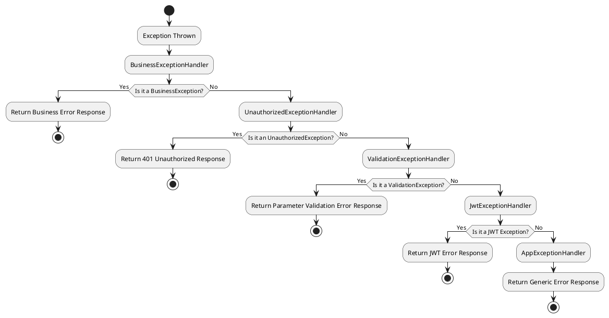

# Error Handling

## Table of Contents

- [Default Exception Handling Mechanism](#default-exception-handling-mechanism)
- [Exception Handling Flow](#exception-handling-flow)
- [Core Exception Handlers](#core-exception-handlers)
- [Business Exception Handling](#business-exception-handling)
- [Custom Exception Handlers](#custom-exception-handlers)
- [Debug Mode Features](#debug-mode-features)
- [Best Practices](#best-practices)
- [Frequently Asked Questions](#frequently-asked-questions)

## Default Exception Handling Mechanism

::: tip Prerequisite Knowledge
To understand MineAdmin's exception handling, you should first be familiar with [Hyperf's](https://hyperf.io) error handling mechanism.
This document does not cover basic explanations—please first understand the fundamental concepts of Hyperf's exception handling.
:::

MineAdmin implements a comprehensive exception handling mechanism based on the Hyperf framework. Multiple exception handlers are configured in `config/autoload/exceptions.php`, following the chain-of-responsibility pattern to handle different types of exceptions in sequence.

## Exception Handling Flow



## Core Exception Handlers

### Exception Handler Configuration

::: code-group

```php [exceptions.php]
<?php

declare(strict_types=1);
/**
 * This file is part of MineAdmin.
 *
 * @link     https://www.mineadmin.com
 * @document https://doc.mineadmin.com
 * @contact  root@imoi.cn
 * @license  https://github.com/mineadmin/MineAdmin/blob/master/LICENSE
 */
use App\Exception\Handler\AppExceptionHandler;
use App\Exception\Handler\BusinessExceptionHandler;
use App\Exception\Handler\JwtExceptionHandler;
use App\Exception\Handler\UnauthorizedExceptionHandler;
use App\Exception\Handler\ValidationExceptionHandler;
use Hyperf\ExceptionHandler\Listener\ErrorExceptionHandler;
use Hyperf\HttpServer\Exception\Handler\HttpExceptionHandler;

return [
    'handler' => [
        'http' => [
            // Handle business exceptions - highest priority
            BusinessExceptionHandler::class,
            // Handle unauthorized exceptions
            UnauthorizedExceptionHandler::class,
            // Handle validator exceptions
            ValidationExceptionHandler::class,
            // Handle JWT exceptions
            JwtExceptionHandler::class,
            // Handle application exceptions - fallback handler
            AppExceptionHandler::class,
        ],
    ],
];
```

:::

::: warning Important Notes
- The order of exception handlers is crucial; higher priority handlers should come first.
- `AppExceptionHandler` serves as the fallback handler and should always be placed last.
- Do not modify the handler order unless you fully understand the implications.
:::

### Base Exception Handler Class

All exception handlers inherit from `AbstractHandler`, providing unified processing logic:

::: code-group

```php [AbstractHandler.php]
<?php

declare(strict_types=1);
/**
 * This file is part of MineAdmin.
 *
 * @link     https://www.mineadmin.com
 * @document https://doc.mineadmin.com
 * @contact  root@imoi.cn
 * @license  https://github.com/mineadmin/MineAdmin/blob/master/LICENSE
 */

namespace App\Exception\Handler;

use App\Http\Common\Result;
use Hyperf\Codec\Json;
use Hyperf\Context\Context;
use Hyperf\Contract\ConfigInterface;
use Hyperf\Contract\StdoutLoggerInterface;
use Hyperf\ExceptionHandler\ExceptionHandler;
use Hyperf\ExceptionHandler\Formatter\FormatterInterface;
use Hyperf\HttpMessage\Stream\SwooleStream;
use Hyperf\Logger\LoggerFactory;
use Mine\Support\Logger\UuidRequestIdProcessor;
use Mine\Support\Traits\Debugging;
use Psr\Container\ContainerInterface;
use Swow\Psr7\Message\ResponsePlusInterface;

abstract class AbstractHandler extends ExceptionHandler
{
    use Debugging;

    public function __construct(
        private readonly ConfigInterface $config,
        private readonly ContainerInterface $container,
        private readonly LoggerFactory $loggerFactory
    ) {}

    /**
     * Subclasses must implement this method to define how to handle exceptions and return results.
     */
    abstract public function handleResponse(\Throwable $throwable): Result;

    /**
     * Main entry method for handling exceptions.
     */
    public function handle(\Throwable $throwable, ResponsePlusInterface $response)
    {
        // Report exception logs
        $this->report($throwable);
        
        return value(function (ResponsePlusInterface $responsePlus) use ($throwable) {
            // In debug mode, handle CORS and log detailed error information
            if ($this->isDebug()) {
                $responsePlus
                    ->setHeader('Access-Control-Allow-Origin', '*')
                    ->setHeader('Access-Control-Allow-Credentials', 'true')
                    ->setHeader('Access-Control-Allow-Methods', 'GET, POST, PATCH, PUT, DELETE, OPTIONS')
                    ->setHeader('Access-Control-Allow-Headers', 'DNT,Keep-Alive,User-Agent,Cache-Control,Content-Type,Authorization');
                
                // Store detailed exception information in context
                Context::set(self::class . '.throwable', [
                    'message' => $throwable->getMessage(),
                    'file' => $throwable->getFile(),
                    'line' => $throwable->getLine(),
                    'trace' => $throwable->getTrace(),
                ]);
            }
            return $responsePlus;
        }, $this->handlerRequestId(
            $this->handlerResult(
                $response,
                $this->handleResponse($throwable)
            )
        ));
    }

    /**
     * Report exception logs, including console output and file logging.
     */
    public function report(\Throwable $throwable)
    {
        // In debug mode, print formatted error messages to the console
        if ($this->isDebug()) {
            $this->container->get(StdoutLoggerInterface::class)->error(
                $this->container->get(FormatterInterface::class)->format($throwable)
            );
        }
        
        // Log exceptions to error log files
        $this->loggerFactory
            ->get('error')
            ->error($throwable->getMessage(), ['exception' => $throwable]);
    }

    /**
     * Wrap the result into the response body.
     */
    protected function handlerResult(ResponsePlusInterface $responsePlus, Result $result): ResponsePlusInterface
    {
        $responsePlus->setHeader('Content-Type', 'application/json; charset=utf-8');

        // Return detailed exception information in debug mode
        if ($this->isDebug()) {
            $result = $result->toArray();
            $result['throwable'] = Context::get(self::class . '.throwable');
            return $responsePlus
                ->setBody(new SwooleStream(Json::encode($result)));
        }

        return $responsePlus
            ->setBody(new SwooleStream(Json::encode($result)));
    }

    /**
     * Add a request ID header to the response for easier tracing.
     */
    private function handlerRequestId(ResponsePlusInterface $responsePlus): ResponsePlusInterface
    {
        return $responsePlus->setHeader('Request-Id', UuidRequestIdProcessor::getUuid());
    }
}
```

```php [AppExceptionHandler.php]
<?php

declare(strict_types=1);

namespace App\Exception\Handler;

use App\Http\Common\Result;
use App\Http\Common\ResultCode;

/**
 * The final exception handler for the application.
 * Serves as the fallback handler, catching all exceptions not handled by other handlers.
 */
final class AppExceptionHandler extends AbstractHandler
{
    /**
     * Handle exceptions and return a unified error response.
     */
    public function handleResponse(\Throwable $throwable): Result
    {
        // Prevent the exception from propagating further
        $this->stopPropagation();
        
        return new Result(
            ResultCode::FAIL,
            $throwable->getMessage() ?: 'System error, please try again later'
        );
    }
    
    /**
     * This handler processes all types of exceptions.
     */
    public function isValid(\Throwable $throwable): bool
    {
        return true;
    }
}
```

:::

## Result and ResultCode Core Classes

### Result Unified Response Class

The `Result` class is the standard format for all API responses in MineAdmin, implementing the `Arrayable` interface and supporting OpenAPI documentation annotations:

::: code-group

```php [Result.php]
<?php

declare(strict_types=1);

namespace App\Http\Common;

use Hyperf\Contract\Arrayable;
use Hyperf\Swagger\Annotation as OA;

/**
 * @template T
 */
#[OA\Schema(title: 'Api Response', description: 'Api Response')]
class Result implements Arrayable
{
    /**
     * @param T $data
     */
    public function __construct(
        #[OA\Property(ref: 'ResultCode', title: 'Response Code')]
        public ResultCode $code = ResultCode::SUCCESS,
        #[OA\Property(title: 'Response Message', type: 'string')]
        public ?string $message = null,
        #[OA\Property(title: 'Response Data', type: 'array')]
        public mixed $data = []
    ) {
        // If no message is provided, automatically fetch the default message from ResultCode
        if ($this->message === null) {
            $this->message = ResultCode::getMessage($this->code->value);
        }
    }

    public function toArray(): array
    {
        return [
            'code' => $this->code->value,
            'message' => $this->message,
            'data' => $this->data,
        ];
    }
}
```

:::

#### Usage Examples

::: code-group

```php [Success Response]
// Success response - using default success code
$result = new Result();

// Success response - with data
$result = new Result(data: ['id' => 1, 'name' => 'John Doe']);

// Success response - custom message
$result = new Result(message: 'Operation completed successfully');
```

```php [Failure Response]
// Failure response - using default failure code
$result = new Result(ResultCode::FAIL, 'Operation failed');

// Failure response - using specific status code
$result = new Result(ResultCode::UNAUTHORIZED, 'User not logged in');

// Failure response - with error data
$result = new Result(
    ResultCode::UNPROCESSABLE_ENTITY, 
    'Parameter validation failed',
    ['errors' => ['email' => ['Invalid email format']]]
);
```

:::

### ResultCode Status Code Enum

`ResultCode` is a PHP 8.1 enum-based status code definition, supporting internationalized messages via Hyperf's Constants feature:

::: code-group

```php [ResultCode.php]
<?php

declare(strict_types=1);

namespace App\Http\Common;

use Hyperf\Constants\Annotation\Constants;
use Hyperf\Constants\Annotation\Message;
use Hyperf\Constants\ConstantsTrait;
use Hyperf\Swagger\Annotation as OA;

#[Constants]
#[OA\Schema(title: 'ResultCode', type: 'integer', default: 200)]
enum ResultCode: int
{
    use ConstantsTrait;

    #[Message('result.success')]
    case SUCCESS = 200;

    #[Message('result.fail')]
    case FAIL = 500;

    #[Message('result.unauthorized')]
    case UNAUTHORIZED = 401;

    #[Message('result.forbidden')]
    case FORBIDDEN = 403;

    #[Message('result.not_found')]
    case NOT_FOUND = 404;

    #[Message('result.method_not_allowed')]
    case METHOD_NOT_ALLOWED = 405;

    #[Message('result.not_acceptable')]
    case NOT_ACCEPTABLE = 406;

    #[Message('result.conflict')]
    case UNPROCESSABLE_ENTITY = 422;

    #[Message('result.disabled')]
    case DISABLED = 423;
}
```

:::

#### Status Code Descriptions

| Constant Name | Value | HTTP Status Code | Description | Usage Scenarios |
|--------|------|-------------|------|----------|
| `SUCCESS` | 200 | 200 OK | Operation successful | Normal business processing success |
| `FAIL` | 500 | 500 Internal Server Error | System error | Generic system exceptions or business processing failures |
| `UNAUTHORIZED` | 401 | 401 Unauthorized | Unauthorized | User not logged in or invalid token |
| `FORBIDDEN` | 403 | 403 Forbidden | Access forbidden | User lacks permission to access resource |
| `NOT_FOUND` | 404 | 404 Not Found | Resource not found | Requested resource does not exist |
| `METHOD_NOT_ALLOWED` | 405 | 405 Method Not Allowed | Method not allowed | HTTP method not supported |
| `NOT_ACCEPTABLE` | 406 | 406 Not Acceptable | Not acceptable | Request content characteristics cannot be satisfied |
| `UNPROCESSABLE_ENTITY` | 422 | 422 Unprocessable Entity | Unprocessable entity | Parameter validation failed, business rule validation failed |
| `DISABLED` | 423 | 423 Locked | Resource locked | User or resource disabled |

#### Internationalization Support

`ResultCode` supports localized message text via Hyperf's multilingual mechanism:

::: code-group

```php [Language File - lang/zh_CN/result.php]
<?php

return [
    'success' => 'Operation successful',
    'fail' => 'Operation failed',
    'unauthorized' => 'User not authorized',
    'forbidden' => 'Access forbidden',
    'not_found' => 'Resource not found',
    'method_not_allowed' => 'Method not allowed',
    'not_acceptable' => 'Unacceptable request',
    'conflict' => 'Parameter validation failed',
    'disabled' => 'Resource disabled',
];
```

```php [Fetching Internationalized Messages]
// Get message via ResultCode
$message = ResultCode::getMessage(ResultCode::SUCCESS->value);
// Output: 'Operation successful'

// Result automatically fetches messages during construction
$result = new Result(ResultCode::NOT_FOUND);
// $result->message automatically becomes 'Resource not found'
```

:::

## Business Exception Handling

### BusinessException Class

It is recommended to use `BusinessException` for business-related exceptions instead of directly using `throw new Exception`:

::: code-group

```php [BusinessException.php]
<?php

declare(strict_types=1);
/**
 * This file is part of MineAdmin.
 *
 * @link     https://www.mineadmin.com
 * @document https://doc.mineadmin.com
 * @contact  root@imoi.cn
 * @license  https://github.com/mineadmin/MineAdmin/blob/master/LICENSE
 */

namespace App\Exception;

use App\Http\Common\Result;
use App\Http\Common\ResultCode;

/**
 * Business exception class
 * Used for throwing business logic-related exceptions
 */
class BusinessException extends \RuntimeException
{
    private Result $response;

    /**
     * @param ResultCode $code Result status code
     * @param string|null $message Error message
     * @param mixed $data Additional data
     */
    public function __construct(ResultCode $code = ResultCode::FAIL, ?string $message = null, mixed $data = [])
    {
        $this->response = new Result($code, $message, $data);
        parent::__construct($message ?? ResultCode::getMessage($code->value));
    }

    /**
     * Get the structured response object
     */
    public function getResponse(): Result
    {
        return $this->response;
    }
}
```

```php [BusinessExceptionHandler.php]
<?php

declare(strict_types=1);

namespace App\Exception\Handler;

use App\Exception\BusinessException;
use App\Http\Common\Result;

/**
 * Business exception handler
 * Specifically handles BusinessException type exceptions
 */
class BusinessExceptionHandler extends AbstractHandler
{
    /**
     * Handle business exceptions, directly returning the result contained in the exception
     */
    public function handleResponse(\Throwable $throwable): Result
    {
        $this->stopPropagation();
        
        if ($throwable instanceof BusinessException) {
            return $throwable->getResponse();
        }
        
        // Fallback handling
        return new Result(
            ResultCode::FAIL,
            $throwable->getMessage()
        );
    }
    
    /**
     * Only handles BusinessException type exceptions
     */
    public function isValid(\Throwable $throwable): bool
    {
        return $throwable instanceof BusinessException;
    }
}
```

:::

### Practical Usage Examples

::: code-group

```php [UserService.php]
<?php

declare(strict_types=1);

namespace App\Service;

use App\Exception\BusinessException;
use App\Http\Common\ResultCode;

class UserService
{
    /**
     * User login validation
     */
    public function login(string $username, string $password): array
    {
        // Check username format
        if (empty($username)) {
            throw new BusinessException(
                ResultCode::UNPROCESSABLE_ENTITY,
                trans('validation.required', ['attribute' => 'username'])
            );
        }
        
        // Find user
        $user = $this->findUserByUsername($username);
        if (!$user) {
            throw new BusinessException(
                ResultCode::NOT_FOUND,
                trans('auth.user_not_found')
            );
        }
        
        // Verify password
        if (!$this->verifyPassword($password, $user['password'])) {
            throw new BusinessException(
                ResultCode::UNAUTHORIZED,
                trans('auth.invalid_credentials')
            );
        }
        
        // Check user status
        if ($user['status'] !== 'active') {
            throw new BusinessException(
                ResultCode::DISABLED,
                trans('auth.user_disabled'),
                ['reason' => $user['disable_reason'] ?? 'Unknown reason']
            );
        }
        
        return $user;
    }

    /**
     * Update user profile
     */
    public function updateProfile(int $userId, array $