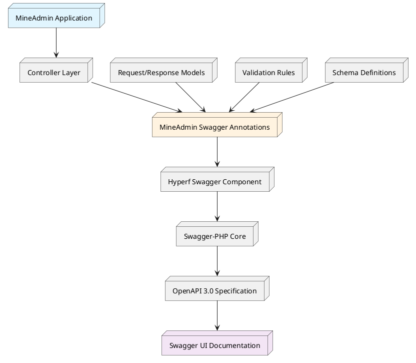
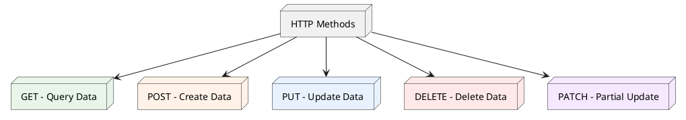
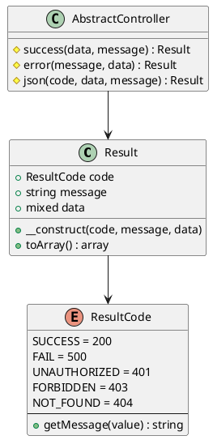
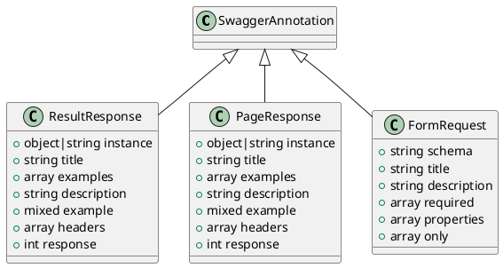

# Routing and API Documentation System

## Table of Contents

1. [Overview and Architecture](#_1-overview-and-architecture)
2. [Quick Start](#_2-quick-start)
3. [HTTP Specifications and Best Practices](#_3-http-specifications-and-best-practices)
4. [Response Structure System](#_4-response-structure-system)
5. [MineAdmin Custom Annotations](#_5-mineadmin-custom-annotations)
6. [Practical Application Examples](#_6-practical-application-examples)
10. [FAQs and Solutions](#_10-faqs-and-solutions)

---

## 1. Overview and Architecture

### 1.1 System Overview

MineAdmin comes with a built-in complete API documentation generation system based on the [Swagger/OpenAPI 3.0](https://swagger.io) specification, providing developers with powerful API documentation auto-generation and management capabilities.

**Access Method**: During local development, visit `http://localhost:9503/swagger` to view the complete API documentation.

### 1.2 Architecture Layers

::: tip Tech Stack Architecture

MineAdmin's API documentation system adopts a multi-layer architecture design:

- **[mineadmin/swagger](https://github.com/mineadmin/Swagger)** - MineAdmin-specific Swagger annotation encapsulation layer
- **[hyperf/swagger](https://github.com/hyperf/swagger)** - Hyperf framework's Swagger integration component
- **[zircote/swagger-php](https://github.com/zircote/swagger-php)** - PHP Swagger annotation processing core
- **[OpenAPI Specification](https://github.com/OAI/OpenAPI-Specification)** - Industry-standard API documentation specification

:::

### 1.3 System Architecture Diagram



### 1.4 Core Advantages

- **Automated Documentation Generation**: Auto-generates complete API documentation based on code annotations
- **Type Safety**: Strong type support ensures documentation matches actual code
- **Real-time Synchronization**: Documentation updates automatically with code changes
- **Interactive Testing**: Built-in Swagger UI supports direct API testing

---

## 2. Quick Start

### 2.1 Basic Configuration

Ensure your project has correctly installed the MineAdmin Swagger component:

```bash
composer require mineadmin/swagger
```

### 2.2 First API Interface

Create a simple API interface:

```php
<?php

namespace App\Http\Admin\Controller;

use App\Http\Common\Result;
use Mine\Swagger\Attributes\ResultResponse;
use Hyperf\Swagger\Annotation as OA;

#[OA\Tag(name: "User Management", description: "APIs related to users")]
class UserController extends AbstractController
{
    #[OA\Get(
        path: "/admin/user/info",
        summary: "Get user info",
        description: "Get detailed user information by user ID"
    )]
    #[ResultResponse(
        instance: new Result(data: ["id" => 1, "name" => "John Doe"]),
        title: "Success",
        description: "Successfully retrieved user info"
    )]
    public function getUserInfo(): Result
    {
        return $this->success([
            'id' => 1,
            'name' => 'John Doe',
            'email' => 'john@example.com'
        ]);
    }
}
```

### 2.3 Access Documentation

After starting the service, visit `http://localhost:9503/swagger` to view the generated documentation.

---

## 3. HTTP Specifications and Best Practices

### 3.1 RESTful API Design Principles

MineAdmin recommends following RESTful architecture style to ensure API interface consistency and predictability.

#### 3.1.1 HTTP Method Mapping



#### 3.1.2 Standard Route Design Pattern

Taking user management module as an example, showing standard RESTful API design:

| HTTP Method | Route Path | Description | Response Data |
|---------|----------|---------|----------|
| `GET` | `/admin/user/list` | Get user list (paginated) | User list data |
| `GET` | `/admin/user/{id}` | Get single user details | Single user data |
| `POST` | `/admin/user` | Create new user | Created user data |
| `PUT` | `/admin/user/{id}` | Full update user info | Updated user data |
| `PATCH` | `/admin/user/{id}` | Partial update user info | Updated user data |
| `DELETE` | `/admin/user/{id}` | Delete user | Deletion confirmation |

#### 3.1.3 Best Practice Recommendations

::: tip Design Principles

1. **Resource Naming**: Use nouns not verbs, plural form
   ```
   ✅ /admin/users
   ❌ /admin/getUsers
   ```

2. **Nested Resources**: Reflect hierarchical relationships
   ```
   ✅ /admin/users/{id}/roles
   ❌ /admin/user-roles?user_id={id}
   ```

3. **Status Code Semantics**: Correctly use HTTP status codes
   ```
   200 - Success
   201 - Resource created
   400 - Invalid parameters
   401 - Unauthorized
   403 - Forbidden
   404 - Not found
   500 - Server error
   ```

4. **Flexibility First**: Standards are foundation, business needs are core
   - Follow RESTful principles but not rigidly
   - Prioritize sustainable business iteration
   - Maintain team consistency

:::

### 3.2 URL Design Specifications

#### 3.2.1 Naming Conventions

```php
// Recommended naming
GET    /admin/users              // Get user list
GET    /admin/users/{id}         // Get specific user
POST   /admin/users              // Create user
PUT    /admin/users/{id}         // Update user
DELETE /admin/users/{id}         // Delete user

// Special operations
POST   /admin/users/{id}/enable  // Enable user
POST   /admin/users/{id}/disable // Disable user
GET    /admin/users/search       // Search users
```

#### 3.2.2 Parameter Passing Standards

```php
// Query params - for filtering, sorting, pagination
GET /admin/users?page=1&page_size=20&status=active&sort=created_at,desc

// Path params - for unique resource identification
GET /admin/users/123

// Request body - for complex data
POST /admin/users
Content-Type: application/json
{
    "username": "johndoe",
    "email": "john@example.com",
    "roles": [1, 2, 3]
}
```

---

## 4. Response Structure System

### 4.1 Unified Response Format

MineAdmin uses the unified response structure `\App\Http\Common\Result` to ensure all API interfaces return consistent formats.

### 4.2 Result Class Architecture



### 4.3 Core Implementation Code

#### 4.3.1 Result Response Class

::: code-group

```php [Result.php]
<?php

declare(strict_types=1);
/**
 * This file is part of MineAdmin.
 */

namespace App\Http\Common;

use Hyperf\Contract\Arrayable;
use Hyperf\Swagger\Annotation as OA;

/**
 * Unified API response structure
 * @template T
 */
#[OA\Schema(title: 'API Response Structure', description: 'Unified API response format')]
class Result implements Arrayable
{
    public function __construct(
        #[OA\Property(ref: 'ResultCode', title: 'Response code', description: 'Business code, different from HTTP status')]
        public ResultCode $code = ResultCode::SUCCESS,
        
        #[OA\Property(title: 'Response message', type: 'string', description: 'Response description')]
        public ?string $message = null,
        
        #[OA\Property(title: 'Response data', type: 'mixed', description: 'Actual business data')]
        public mixed $data = []
    ) {
        if ($this->message === null) {
            $this->message = ResultCode::getMessage($this->code->value);
        }
    }

    /**
     * Convert to array format
     */
    public function toArray(): array
    {
        return [
            'code' => $this->code->value,
            'message' => $this->message,
            'data' => $this->data,
        ];
    }
}
```

```php [AbstractController.php]
<?php

namespace App\Http\Common\Controller;

use App\Http\Common\Result;
use App\Http\Common\ResultCode;

/**
 * Base controller class
 * Provides unified response methods
 */
abstract class AbstractController
{
    /**
     * Success response
     */
    protected function success(mixed $data = [], ?string $message = null): Result
    {
        return new Result(ResultCode::SUCCESS, $message, $data);
    }

    /**
     * Error response
     */
    protected function error(?string $message = null, mixed $data = []): Result
    {
        return new Result(ResultCode::FAIL, $message, $data);
    }

    /**
     * Custom response
     */
    protected function json(ResultCode $code, mixed $data = [], ?string $message = null): Result
    {
        return new Result($code, $message, $data);
    }
    
    /**
     * Paginated response
     */
    protected function paginate(array $list, int $total, int $page = 1, int $pageSize = 10): Result
    {
        return $this->success([
            'list' => $list,
            'total' => $total,
            'page' => $page,
            'page_size' => $pageSize,
            'total_pages' => ceil($total / $pageSize)
        ]);
    }
}
```

```php [AdminController.php]
<?php

namespace App\Http\Admin\Controller;

use App\Http\Common\Controller\AbstractController as Base;
use Hyperf\Context\ApplicationContext;
use Hyperf\HttpServer\Contract\RequestInterface;

/**
 * Admin controller base class
 * Extends pagination functionality
 */
abstract class AbstractController extends Base
{
    /**
     * Get current page
     */
    protected function getCurrentPage(): int
    {
        return (int) $this->getRequest()->input('page', 1);
    }

    /**
     * Get page size
     */
    protected function getPageSize(int $default = 10, int $max = 100): int
    {
        $size = (int) $this->getRequest()->input('page_size', $default);
        return min($size, $max); // Limit max page size
    }

    /**
     * Get request instance
     */
    protected function getRequest(): RequestInterface
    {
        return ApplicationContext::getContainer()->get(RequestInterface::class);
    }
    
    /**
     * Get sort params
     */
    protected function getOrderBy(string $default = 'id'): array
    {
        $sort = $this->getRequest()->input('sort', $default);
        $order = $this->getRequest()->input('order', 'asc');
        
        return [$sort, in_array(strtolower($order), ['asc', 'desc']) ? $order : 'asc'];
    }
}
```

:::

### 4.4 ResultCode Enum Class

MineAdmin provides a complete business status code enum system for standardizing API response states.

#### 4.4.1 Core Implementation

```php
<?php

declare(strict_types=1);
/**
 * This file is part of MineAdmin.
 */

namespace App\Http\Common;

use Hyperf\Constants\Annotation\Constants;
use Hyperf\Constants\Annotation\Message;
use Hyperf\Constants\ConstantsTrait;
use Hyperf\Swagger\Annotation as OA;

/**
 * Business status code enum
 * Provides standardized API response codes
 */
#[Constants]
#[OA\Schema(title: 'ResultCode', type: 'integer', default: 200, description: 'Business status code')]
enum ResultCode: int
{
    use ConstantsTrait;

    // Success states
    #[Message('Operation successful')]
    case SUCCESS = 200;

    // General error states
    #[Message('Operation failed')]
    case FAIL = 500;

    #[Message('Unauthorized access')]
    case UNAUTHORIZED = 401;

    #[Message('Insufficient permissions')]
    case FORBIDDEN = 403;

    #[Message('Resource not found')]
    case NOT_FOUND = 404;

    #[Message('Method not allowed')]
    case METHOD_NOT_ALLOWED = 405;

    #[Message('Unacceptable request format')]
    case NOT_ACCEPTABLE = 406;

    #[Message('Request entity processing error')]
    case UNPROCESSABLE_ENTITY = 422;
    
    // Business related errors
    #[Message('Parameter validation failed')]
    case VALIDATION_ERROR = 10001;
    
    #[Message('Business logic error')]
    case BUSINESS_ERROR = 10002;
    
    #[Message('Database operation failed')]
    case DATABASE_ERROR = 10003;
    
    #[Message('External service call failed')]
    case EXTERNAL_SERVICE_ERROR = 10004;
}
```

#### 4.4.2 Response Format Examples

Different status codes correspond to different response formats:

```json
// Success response
{
    "code": 200,
    "message": "Operation successful",
    "data": {
        "id": 1,
        "username": "admin"
    }
}

// Error response
{
    "code": 10001,
    "message": "Parameter validation failed",
    "data": {
        "errors": {
            "username": ["Username cannot be empty"]
        }
    }
}

// Paginated response
{
    "code": 200,
    "message": "Operation successful",
    "data": {
        "list": [...],
        "total": 100,
        "page": 1,
        "page_size": 20,
        "total_pages": 5
    }
}
```

### 4.5 Usage Best Practices

#### 4.5.1 Usage in Controllers

```php
class UserController extends AbstractController
{
    public function index(): Result
    {
        try {
            $users = $this->userService->getList();
            return $this->success($users, 'Successfully retrieved user list');
        } catch (ValidationException $e) {
            return $this->json(ResultCode::VALIDATION_ERROR, [], $e->getMessage());
        } catch (\Exception $e) {
            return $this->error('System error, please try again later');
        }
    }
}
```

---

## 5. MineAdmin Custom Annotations

MineAdmin provides three core custom Swagger annotations to simplify API documentation writing and maintenance. All annotations are located under the `Mine\Swagger\Attributes\` namespace.

### 5.1 Annotation Architecture Overview



### 5.2 ResultResponse Annotation

Used to define single resource or operation response structures, automatically generating standard API response documentation.

#### 5.2.1 Constructor Signature

```php
ResultResponse::__construct(
    object|string $instance,           // Response data class instance or class name
    ?string $title = null,             // Response title
    ?array $examples = null,           // Multiple examples array
    ?string $description = null,       // Response description
    mixed $example = Generator::UNDEFINED, // Single example
    ?array $headers = null,            // Response headers
    ?int $response = 200               // HTTP status code
)
```

#### 5.2.2 Parameter Details

| Parameter | Type | Required | Description |
|-----|------|------|------|
| `$instance` | `object\|string` | ✅ | Response data class instance or name, supports auto