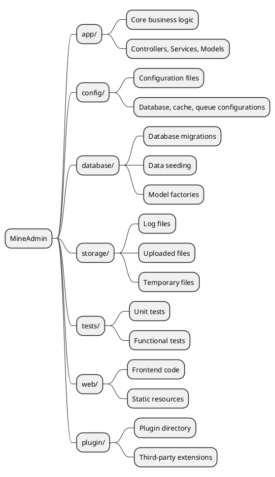
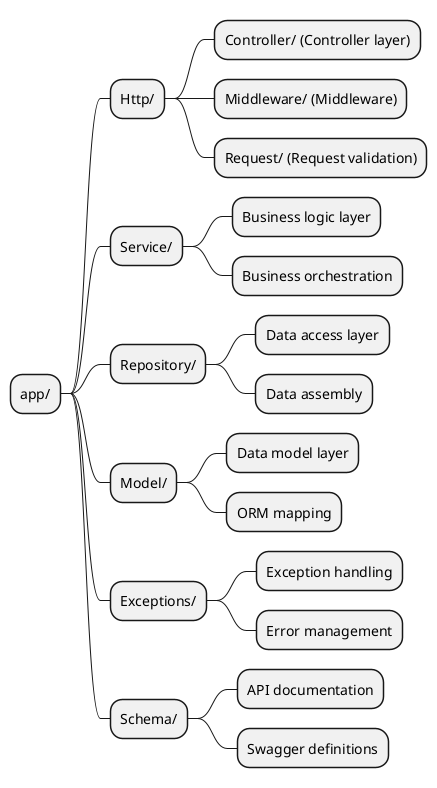
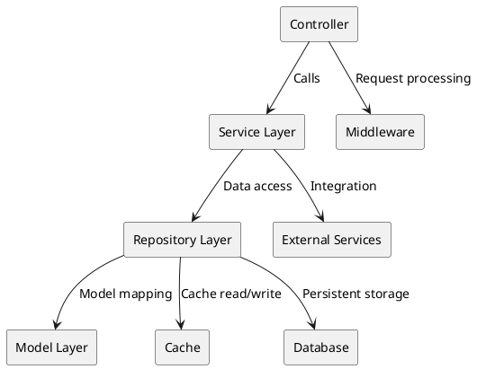

# Project Directory Structure

MineAdmin adopts a modern layered architecture design, providing a clear code organization structure and best practices. This document will detail the project's directory structure, design philosophy, and development standards.

## Overview

The project structure of MineAdmin draws inspiration from the design philosophy of the [Laravel](https://laravel.com/) framework while incorporating modern layered architecture patterns. If you are familiar with Laravel development, understanding MineAdmin's structure will be straightforward.

### Architectural Philosophy

MineAdmin follows these core design principles:

- **Layered Architecture**: Clear separation into Controller → Service → Repository → Model layers
- **Separation of Concerns**: Each directory has well-defined responsibility boundaries
- **Extensibility**: Supports plugin-based development and modular expansion
- **Standardization**: Adheres to PSR standards and best practices

## Root Directory Structure



### Detailed Directory Explanation

#### `/app` - Core Application Directory

Contains the core business logic of the application, including controllers, service layers, data layers, and other core components.

**Key Features:**
- Contains 99% of business logic code
- Follows MVC layered architecture
- Supports modular development

#### `/config` - Configuration Directory

Stores all application configuration files, providing flexible environment configuration management.

**Typical Configuration Files:**
- `database.php` - Database configuration
- `cache.php` - Cache configuration  
- `queue.php` - Queue configuration

#### `/database` - Database Directory

Manages all database-related files, including schema changes and test data.

**Directory Structure:**
```
database/
├── migrations/     # Database migration files
├── seeders/        # Data seeder files
```

#### `/storage` - Storage Directory

Stores files and data generated during application runtime.

**Directory Usage:**
- `uploads/` - User-uploaded files
- `swagger/` - API documentation files

#### `/tests` - Test Directory

Contains automated test suites to ensure code quality and functional correctness.

**Test Types:**
- **Unit Tests** - Test individual classes or methods
- **Functional Tests** - Test complete business processes
- **API Tests** - Test API endpoints

#### `/web` - Frontend Directory

Stores frontend application code and static resource files.

#### `/plugin` - Plugin Directory

Stores plugin packages downloaded from the plugin marketplace, supporting system functionality extensions.

## In-Depth Analysis of the App Directory

The `app` directory is the core of the entire application, designed with a strict layered architecture.



### Http Directory - Request Handling Layer

Responsible for processing all HTTP request entry points, including controllers, middleware, and request validation.

#### Directory Structure
```
Http/
├── Admin/              # Admin module
│   ├── Controller/     # Admin controllers
│   ├── Middleware/     # Admin middleware
│   ├── Request/        # Admin request validation classes
│   ├── Subscriber/     # Event subscribers
│   └── Vo/            # Value object classes
├── Api/                # API module
│   ├── Controller/     # API controllers
│   │   └── V1/        # API version control
│   ├── Middleware/     # API middleware
│   └── Request/        # API request validation classes
│       └── V1/        # Versioned API request classes
├── Common/             # Common module
│   ├── Controller/     # Common controllers
│   ├── Event/         # Event classes
│   ├── Middleware/     # Common middleware
│   ├── Request/        # Common request classes
│   ├── Result.php      # Response result class
│   ├── ResultCode.php  # Result status codes
│   └── Swagger/        # API documentation configuration
└── CurrentUser.php     # Current user context
```

#### Modular Architecture Explanation

**Admin Module** - Backend management features
- Includes permission management, user management, menu management, and other backend functions
- Uses a complete MVC structure with event subscribers and value objects

**Api Module** - External API interfaces  
- Supports version control (V1, V2, etc.)
- Independent authentication middleware and request validation
- RESTful API design standards

**Common Module** - Shared components
- Provides cross-module shared basic functionality
- Unified response format and status code management
- API documentation auto-generation configuration

### Service Directory - Business Logic Layer

The Service layer implements core business logic, responsible for business rule orchestration and execution.

#### Design Principles

1. **Single Responsibility** - Each Service class handles only one business domain
2. **Dependency Injection** - Dependencies are injected via constructors
3. **Transaction Management** - Ensures atomicity of business operations
4. **Exception Handling** - Unified exception handling mechanism

#### Service Layer Responsibilities

**Core Functions:**
- Business logic orchestration and execution
- Transaction management and data consistency
- Calls to Repository layer for data operations
- Business rule validation and processing

### Repository Directory - Data Access Layer

The Repository pattern provides an abstraction layer for data access, encapsulating data query and operation logic.

#### Design Features

- **Data Source Abstraction** - Easy switching between data sources (MySQL, Redis, ES, etc.)
- **Query Reuse** - Reuse of common query logic
- **Cache Integration** - Transparent cache layer integration
- **Performance Optimization** - Query optimization and batch operations

#### Repository Layer Characteristics

**Main Responsibilities:**
- Data access abstraction layer  
- Complex query logic encapsulation
- Cache strategy implementation
- Data source switching and optimization

### Model Directory - Data Model Layer

The Model layer is based on Hyperf's Eloquent ORM, providing object-relational mapping for database tables.

#### Model Features

- **Relationships** - Defines table relationships
- **Accessors/Mutators** - Data formatting
- **Event Listeners** - Model lifecycle events
- **Soft Deletes** - Logical delete support

#### Model Layer Characteristics

**Core Functions:**
- Data table mapping and relationship definition
- Attribute accessors and mutators
- Model events and observers
- Data type conversion and validation

### Exceptions Directory - Exception Handling

Unified exception handling mechanism providing friendly error messages and logging.

### Schema Directory - API Documentation

Contains Swagger/OpenAPI documentation definitions for API documentation generation.

::: danger Important Note
Schema classes are strictly prohibited from participating in business logic scheduling and are used solely for API documentation generation.
:::

## Development Best Practices

### Code Organization Standards

1. **Naming Conventions**
   - Class names use `PascalCase`
   - Method names use `camelCase`  
   - Constants use `UPPER_SNAKE_CASE`

2. **File Organization**
   - One class per file
   - Filename matches class name
   - Proper use of namespaces

3. **Dependency Injection**
   - Prefer constructor injection
   - Avoid static calls
   - Interface-oriented programming

### Architectural Pattern Recommendations



### Error Handling Strategies

1. **Exception Classification**
   - Business exceptions - Expected errors
   - System exceptions - Unexpected errors
   - Validation exceptions - Data format errors

2. **Logging**
   - Critical operation logging
   - Exception information logging
   - Performance monitoring logging

## Related Resources

### Reference Documentation

- [Laravel Official Documentation](https://laravel.com/docs/11.x)
- [Laravel Chinese Documentation](https://learnku.com/docs/laravel/10.x)
- [Hyperf Coroutine Framework](https://hyperf.wiki/3.1/#/en/)

::: warning ORM Differences Note
MineAdmin uses the coroutine version of Eloquent ORM maintained by [Hyperf](https://github.com/hyperf/hyperf), which has some differences from the official Laravel version. Please be aware of special usage patterns in coroutine environments during development.
:::