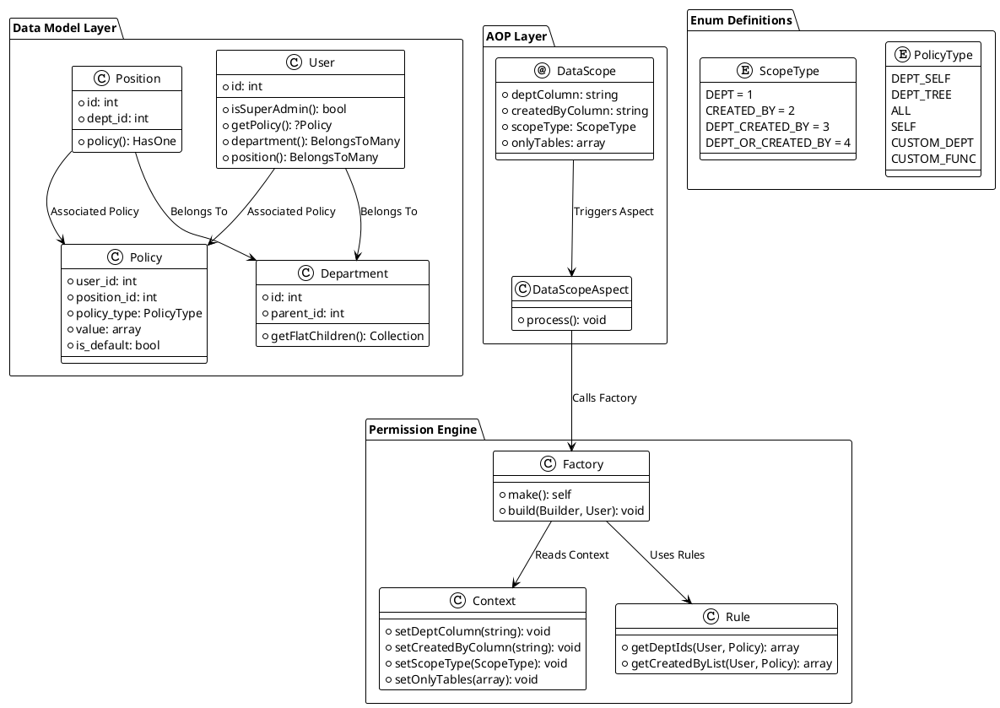
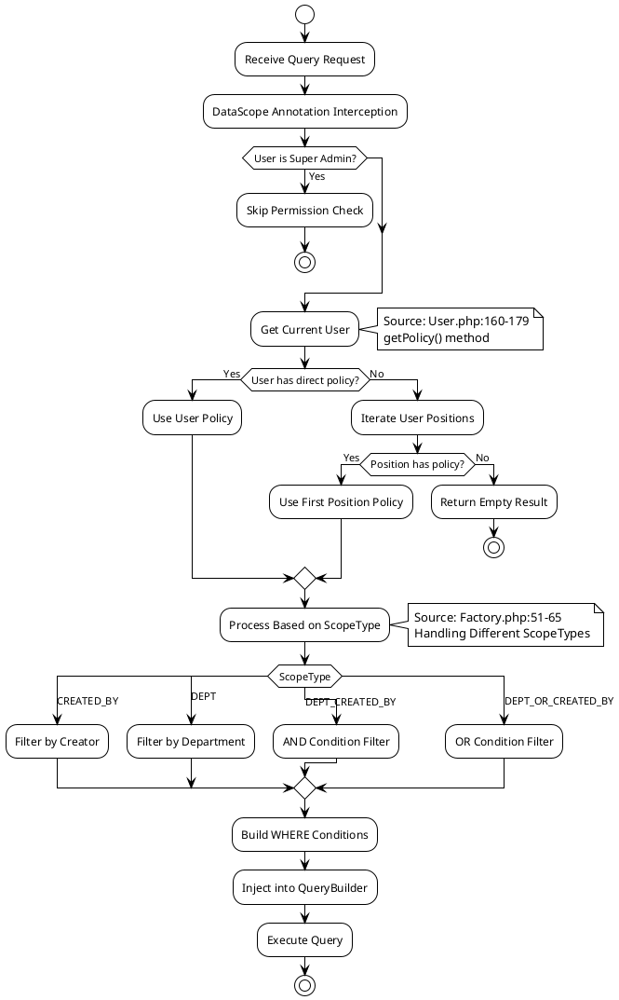
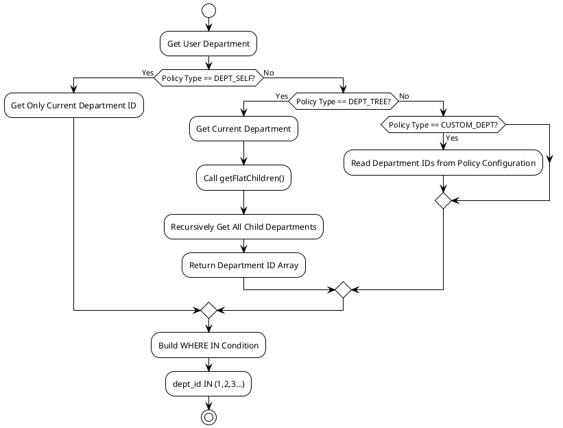
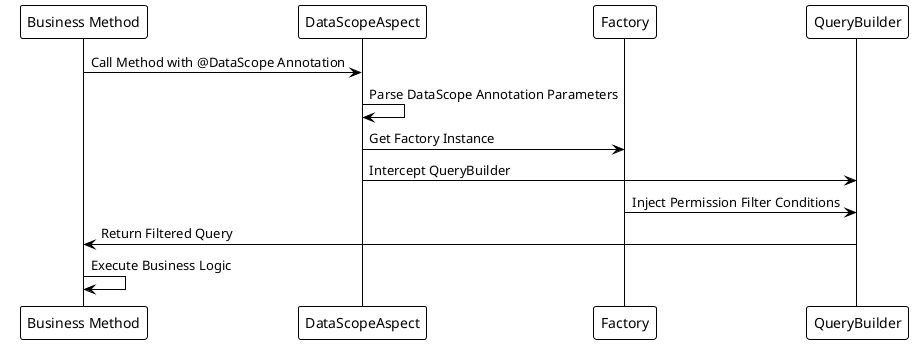

# System Architecture

## Data Permission System Architecture Design

The MineAdmin data permission system is designed based on AOP (Aspect-Oriented Programming), automatically injecting permission filtering conditions into data queries through annotations and aspect interception.

## Core Component Architecture Diagram



## Permission Resolution Flow



## Data Permission Execution Mechanism

### Factory Class

Core implementation of permission filtering:

```php
// /mineadmin/app/Library/DataPermission/Factory.php
class Factory
{
    public function build(Builder $builder, User $user): void 
    {
        // 1. Super admin bypass check
        if ($user->isSuperAdmin()) {
            return;
        }
        
        // 2. Get user policy
        if (($policy = $user->getPolicy()) === null) {
            return;
        }
        
        // 3. Get current ScopeType
        $scopeType = Context::getScopeType();
        
        // 4. Handle custom functions
        if ($policy->policy_type === PolicyType::CustomFunc) {
            $customFunc = $policy->value[0] ?? null;
            $this->rule->loadCustomFunc($customFunc, $builder, $user, $policy, $scopeType);
        }
        
        // 5. Handle different filtering logic based on ScopeType
        switch ($scopeType) {
            case ScopeType::CREATED_BY:
                $this->handleCreatedBy($user, $policy, $builder);
                break;
            case ScopeType::DEPT:
                $this->handleDept($user, $policy, $builder);
                break;
            case ScopeType::DEPT_CREATED_BY:
                $this->handleDeptCreatedBy($user, $policy, $builder);
                break;
            case ScopeType::DEPT_OR_CREATED_BY:
                $this->handleDeptOrCreatedBy($user, $policy, $builder);
                break;
        }
    }
}
```

### Specific Filter Implementations

Implementation of various filtering conditions:

```php
// /mineadmin/app/Library/DataPermission/Factory.php:67-102

// Creator filtering
private function handleCreatedBy(User $user, Policy $policy, Builder $builder): void
{
    $builder->when($this->rule->getCreatedByList($user, $policy), 
        static function (Builder $query, array $createdByList) {
            $query->whereIn(Context::getCreatedByColumn(), $createdByList);
        });
}

// Department filtering
private function handleDept(User $user, Policy $policy, Builder $builder): void
{
    $builder->when($this->rule->getDeptIds($user, $policy), 
        static function (Builder $query, array $deptList) {
            $query->whereIn(Context::getDeptColumn(), $deptList);
        });
}

// Department AND Creator filtering
private function handleDeptCreatedBy(User $user, Policy $policy, Builder $builder): void
{
    $builder->when($this->rule->getDeptIds($user, $policy), 
        static function (Builder $query, array $deptList) {
            $query->whereIn(Context::getDeptColumn(), $deptList);
        })->when($this->rule->getCreatedByList($user, $policy), 
        static function (Builder $query, array $createdByList) {
            $query->whereIn(Context::getCreatedByColumn(), $createdByList);
        });
}

// Department OR Creator filtering
private function handleDeptOrCreatedBy(User $user, Policy $policy, Builder $builder): void
{
    $createdByList = $this->rule->getCreatedByList($user, $policy);
    $deptList = $this->rule->getDeptIds($user, $policy);
    
    $builder->where(static function (Builder $query) use ($createdByList, $deptList) {
        if ($createdByList) {
            $query->whereIn(Context::getCreatedByColumn(), $createdByList);
        }
        if ($deptList) {
            $query->orWhereIn(Context::getDeptColumn(), $deptList);
        }
    });
}
```

## Context Management

### Context Storage Mechanism

```php
// /mineadmin/app/Library/DataPermission/Context.php
final class Context
{
    private const DEPT_COLUMN_KEY = 'data_permission_dept_column';
    private const CREATED_BY_COLUMN_KEY = 'data_permission_created_by_column';
    private const SCOPE_TYPE_KEY = 'data_permission_scope_type';
    private const ONLY_TABLES_KEY = 'data_permission_only_tables';

    public static function setDeptColumn(string $column = 'dept_id'): void
    {
        Ctx::set(self::DEPT_COLUMN_KEY, $column);
    }

    public static function getDeptColumn(): string
    {
        return Ctx::get(self::DEPT_COLUMN_KEY, 'dept_id');
    }
    
    // ... Other similar methods
}
```

## Department Hierarchy Processing

### Recursive Department Tree Algorithm

```php
// /mineadmin/app/Model/Permission/Department.php
public function getFlatChildren(): Collection
{
    $flat = collect();
    $this->load('children'); // Preload child departments
    
    $traverse = static function ($departments) use (&$traverse, $flat) {
        foreach ($departments as $department) {
            $flat->push($department);
            if ($department->children->isNotEmpty()) {
                $traverse($department->children); // Recursive processing
            }
        }
    };
    
    $traverse($this->children);
    return $flat->prepend($this); // Include self
}
```

### Department Permission Processing Flow



## AOP Aspect Mechanism

### DataScope Annotation Definition

```php
// /mineadmin/app/Library/DataPermission/Attribute/DataScope.php
#[\Attribute(\Attribute::TARGET_CLASS | \Attribute::TARGET_METHOD)]
class DataScope extends AbstractAnnotation
{
    public function __construct(
        private readonly string $deptColumn = 'dept_id',
        private readonly string $createdByColumn = 'created_by',
        private readonly ScopeType $scopeType = ScopeType::DEPT_CREATED_BY,
        private readonly ?array $onlyTables = null
    ) {}
}
```

### Aspect Interception Processing



## Custom Function Extension

### Custom Function Configuration

```php
// /mineadmin/config/autoload/department/custom.php
return [
    'testction' => function (Builder $builder, ScopeType $scopeType, Policy $policy, User $user) {
        // Only effective for specific users
        if ($user->id !== 2) {
            return;
        }
        
        $createdByColumn = Context::getCreatedByColumn();
        $deptColumn = Context::getDeptColumn();
        
        switch ($scopeType) {
            case ScopeType::CREATED_BY:
                $builder->where($createdByColumn, $user->id);
                break;
            case ScopeType::DEPT:
                $builder->whereIn($deptColumn, 
                    $user->department()->get()->pluck('id'));
                break;
            case ScopeType::DEPT_CREATED_BY:
                $builder->whereIn($deptColumn, 
                    $user->department()->get()->pluck('id'));
                $builder->where($createdByColumn, $user->id);
                break;
            case ScopeType::DEPT_OR_CREATED_BY:
                $builder->whereIn($deptColumn, 
                    $user->department()->get()->pluck('id'));
                $builder->orWhere($createdByColumn, $user->id);
                break;
        }
    }
];
```

## Practical Usage Example

### Usage in Service

```php
// /mineadmin/app/Service/Permission/UserService.php:94-98
class UserService
{
    #[DataScope(
        scopeType: ScopeType::CREATED_BY,
        onlyTables: ['user'],
        createdByColumn: 'id'
    )]
    public function page(array $params, int $page = 1, int $pageSize = 10): array
    {
        return parent::page($params, $page, $pageSize);
    }
}
```

This real-world usage example demonstrates how to apply data permission annotations in MineAdmin to control access to user lists.

Through this architectural design, MineAdmin implements declarative data permission control. Developers only need to add the `@DataScope` annotation to methods, and the system will automatically filter data based on the current user's permission policies.