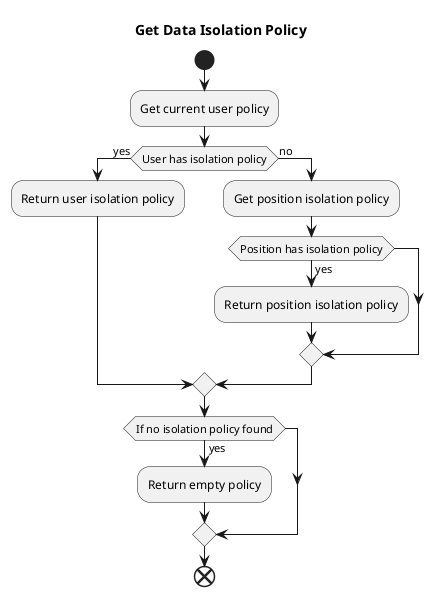

# Data Permission Configuration and Usage Examples

This article explains the configuration and usage methods of various strategies in data permission settings.

## Data Isolation Methods

Currently, data isolation only supports row-level isolation but offers multiple isolation strategies.

Mainly divided into isolation methods based on creator and department ownership:

* `Department` isolation uses the user's current department as the basis, automatically adding department filter conditions when querying data.
* `Creator` isolation uses the data creator as the basis, automatically adding creator filter conditions when querying data.

## Priority

Currently supports two methods: `setting isolation policies for specific users` and `assigning positions to users with position-based isolation policies`.  
If a user has both an isolation policy and position-based isolation policy set, the user-specific isolation policy takes precedence.



The logic code is:

```php
// /mineadmin/app/Model/Permission/User.php:160-179

public function getPolicy(): ?Policy
{
    /**
     * @var null|Policy $policy
     */
    $policy = $this->policy()->first();
    if (! empty($policy)) {
        return $policy;
    }

    $this->load('position');
    $positionList = $this->position;
    foreach ($positionList as $position) {
        $current = $position->policy()->first();
        if (! empty($current)) {
            return $current;
        }
    }
    return null;
}

```

## Examples

Using the current `user` table as the isolation table, assume the following data:

### Sample Data

Department table

---

| id | name | parent_id |
|----|------|-----------|
| 1  | Dept1  | 0         |
| 2  | Dept2  | 1         |
| 3  | Dept3  | 0         |

Dept1 is a top-level department with no parent.  
Dept2 is a sub-department of Dept1.  
Dept3 is a top-level department with no parent.

---

Position table

| id | name | dept_id |
|----|------|---------|
| 1  | Position1  | 1       |
| 2  | Position2  | 2       |
| 3  | Position3  | 3       |

Dept1 has Position1, Dept2 has Position2, Dept3 has Position3.

---

User table

| id | name  | dept_id | created_by | post_id |
|----|-------|---------|------------|---------|
| 1  | Super Admin | 0       | 0          | 0       |
| 2  | a1    | 1       | 1          | 1       |
| 3  | a2    | 2       | 1          | 1       |
| 4  | a3    | 1       | 2          | 2       |
| 5  | a4    | 2       | 2          | 0       |
| 6  | a5    | 0       | 4          | 0       |

In the user table, `dept_id` 0 indicates no department, `created_by` 0 indicates no creator.  
The super admin can view all data.

a1 and a3 belong to Dept1, a2 and a4 belong to Dept2.

a1 and a2 were created by the super admin, a3 and a4 were created by a1.

a1 and a2 hold Position1, a3 holds Position2, a4 has no position.

Below are examples illustrating query results under different policies.

### PolicyType::SELF `Query Only Self`

Assume current user is a1 (id 2) with "query only self" policy.

1. Isolation method: creator only. Adds condition `created_by = current user id`, querying users a3, a4.

```sql
SELECT * FROM user WHERE created_by in (4,5);
```

2. Isolation method: department only. Adds condition `dept_id = current user's department`, querying users a1, a3.

```sql
SELECT * FROM user WHERE dept_id in(1);
```

3. Isolation method: both creator and department. Adds conditions `created_by = current user id` AND `dept_id = current user's department`, querying user a3.

```sql
SELECT * FROM user WHERE created_by in(2) AND dept_id in(1);
```

4. Isolation method: department OR creator. Adds conditions `dept_id = current user's department` OR `created_by = current user id`, querying users a1, a3, a4.

```sql
SELECT * FROM user WHERE dept_id in(1) OR created_by in(2);
```

### PolicyType::DEPT_SELF `Query Only Current Department`

Assume current user is a1 (id 2) with "query only current department" policy.

1. Isolation method: creator only. Adds condition `created_by = all users in same department`, querying users a3, a4, a5.

```sql
SELECT * FROM user WHERE created_by in (2,4,5);
```

2. Isolation method: department only. Adds condition `dept_id = current department`, querying users a1, a3.

```sql
SELECT * FROM user WHERE dept_id in(1);
```

3. Isolation method: both creator and department. Adds conditions `created_by = all users in same department` AND `dept_id = current department`, querying user a3.

```sql
SELECT * FROM user WHERE created_by in(2,4,5) AND dept_id in(1);
```

4. Isolation method: department OR creator. Adds conditions `created_by = all users in same department` OR `dept_id = current department`, querying users a1, a3, a4, a5.

```sql
SELECT * FROM user WHERE created_by in(2,4,5) OR dept_id in(1);
```

### PolicyType::DEPT_TREE `Query Current Department and Sub-departments`

Assume current user is a1 (id 2) with "query current department and sub-departments" policy.

1. Isolation method: creator only. Adds condition `created_by = all users in current and child departments`, querying users a3, a4, a5.

```sql
SELECT * FROM user WHERE created_by in (2,4,5);
```

2. Isolation method: department only. Adds condition `dept_id = current and child departments`, querying users a1, a2, a3, a4.

```sql
SELECT * FROM user WHERE dept_id in(1,2);
```

3. Isolation method: both creator and department. Adds conditions `created_by = all users in current and child departments` AND `dept_id = current and child departments`, querying users a3, a4.

```sql
SELECT * FROM user WHERE created_by in(2,4,5) AND dept_id in(1,2);
```

4. Isolation method: department OR creator. Adds conditions `created_by = all users in current and child departments` OR `dept_id = current and child departments`, querying users a1, a2, a3, a4, a5.

```sql
SELECT * FROM user WHERE created_by in(2,4,5) OR dept_id in(1,2);
```

### PolicyType::ALL `Query All`
Assume current user is a1 (id 2) with "query all" policy. Removes all restrictions.

### PolicyType::CUSTOM_DEPT `Custom Department`

Assume current user is a1 (id 2) with policy allowing only Dept2 and Dept3 data.

1. Isolation method: creator only. Adds condition `created_by = all users in Dept2 and Dept3`, querying users a2, a4, a5.

```sql
SELECT * FROM user WHERE created_by in (2,4,5);
```

2. Isolation method: department only. Adds condition `dept_id = 2 and 3`, querying users a2, a4.

```sql
SELECT * FROM user WHERE dept_id in(2,3);
```

3. Isolation method: both creator and department. Adds conditions `created_by = all users in Dept2 and Dept3` AND `dept_id = 2 and 3`, querying users a2, a4.

```sql
SELECT * FROM user WHERE created_by in(2,4,5) AND dept_id in(2,3);
```

4. Isolation method: department OR creator. Adds conditions `created_by = all users in Dept2 and Dept3` OR `dept_id = 2 and 3`, querying users a2, a4, a5.

```sql
SELECT * FROM user WHERE created_by in(2,4,5) OR dept_id in(2,3);
```

### PolicyType::CUSTOM_FUNC `Custom Function`

Assume current user is a1 (id 2) with custom function `testction` policy.

In `/Users/zhuzhu/project/mineadmin/config/autoload/department/custom.php`, custom function `testction` is defined:

```php
// /mineadmin/config/autoload/department/custom.php
return [
    'testction' =>  function (Builder $builder, ScopeType $scopeType, Policy $policy, User $user) {
        // Only applies to user with id 2
        if ($user->id !== 2) {
            return;
        }
        // Get creator column name from context
        $createdByColumn = Context::getCreatedByColumn();
        // Get department column name from context
        $deptColumn = Context::getDeptColumn();
        switch ($scopeType){
            // Isolation type: creator
            case ScopeType::CREATED_BY:
                // Creator column equals current user
                $builder->where($createdByColumn, $user->id);
                break;
            case ScopeType::DEPT:
                // Department column equals current user's department
                $builder->whereIn($deptColumn, $user->department()->get()->pluck('id'));
                break;
            case ScopeType::DEPT_CREATED_BY:
                // Department column equals current user's department
                $builder->whereIn($deptColumn, $user->department()->get()->pluck('id'));
                // Creator equals current user
                $builder->where($createdByColumn, $user->id);
                break;
            case ScopeType::DEPT_OR_CREATED_BY:
                // Department column equals current user's department
                $builder->whereIn($deptColumn, $user->department()->get()->pluck('id'));
                // Creator equals current user
                $builder->orWhere($createdByColumn, $user->id);
                break;
        }
    }
];

```

When isolation takes effect, the current context's user, isolation method, and permission policy are passed to `testction` for processing, allowing developers to implement complex custom isolation logic.