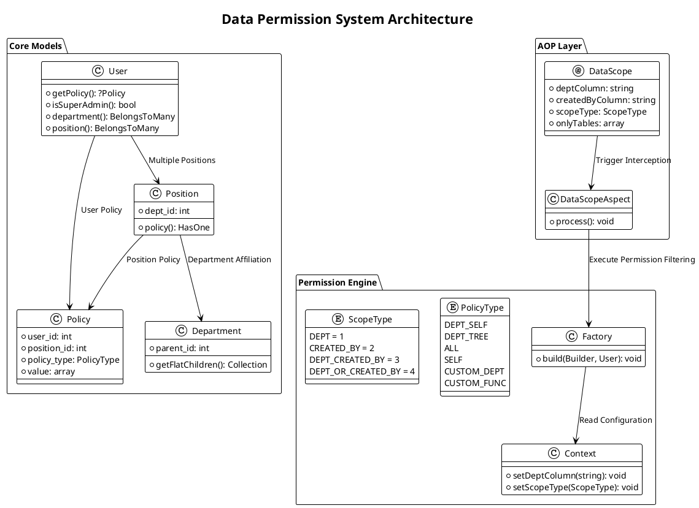
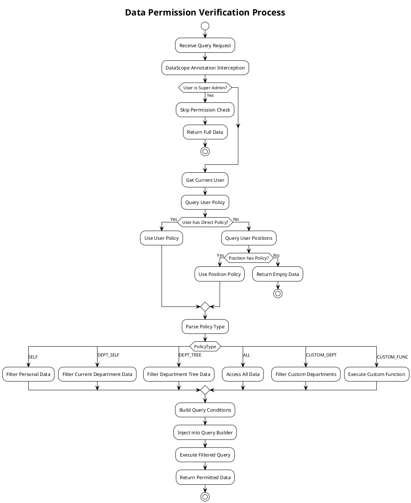
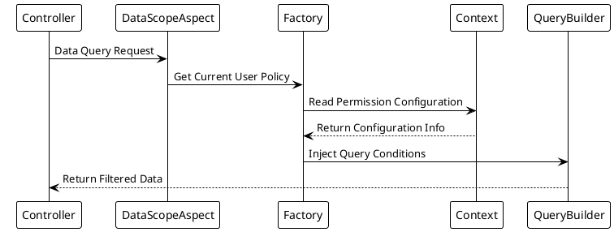

# Core Concepts

This feature implements hierarchical data management and permission control in the system, primarily including modules such as department management, position management, and data permissions.

Compared to the `master` branch, it adds department management and position management functional modules, implements multiple data isolation methods, and enhances the system's organizational structure and role definition capabilities.

## System Architecture Diagram



## Permission Verification Process



## Core Components

### Department Management

#### Functional Positioning

The basic unit of organizational structure, implementing hierarchical tree management.

#### Core Features

- Supports unlimited parent-child department structures
- Departments associate with positions and users
- Supports setting department leaders

#### Data Model

```php
// /mineadmin/app/Model/Permission/Department.php
class Department {
    int $id;
    string $name; 
    int $parent_id;
    HasMany $children; // Sub-departments
    BelongsToMany $users; // Department Users
    BelongsToMany $leaders; // Department Leaders
    
    // Recursively get all sub-departments
    public function getFlatChildren(): Collection
    {
        $flat = collect();
        $this->load('children');
        $traverse = static function ($departments) use (&$traverse, $flat) {
            foreach ($departments as $department) {
                $flat->push($department);
                if ($department->children->isNotEmpty()) {
                    $traverse($department->children);
                }
            }
        };
        $traverse($this->children);
        return $flat->prepend($this);
    }
}
```

---

### Position Management

#### Functional Positioning

Definition of functional roles within departments.

#### Core Features

- Must belong to a specific department
- Can set data permission policies
- Supports multi-position assignment for users

#### Data Model

```php
// /mineadmin/app/Model/Permission/Position.php
class Position {
    int $id;
    string $name;
    int $dept_id;
    
    public function policy(): HasOne
    {
        return $this->hasOne(Policy::class, 'position_id', 'id');
    }
}
```

## Data Permission System

### Policy Types

```php
// /mineadmin/app/Model/Enums/DataPermission/PolicyType.php
enum PolicyType: string
{
    case DeptSelf = 'DEPT_SELF';     // Current Department
    case DeptTree = 'DEPT_TREE';     // Current and Sub-departments
    case All = 'ALL';                // All Data
    case Self = 'SELF';              // Personal Data Only
    case CustomDept = 'CUSTOM_DEPT'; // Custom Departments
    case CustomFunc = 'CUSTOM_FUNC'; // Custom Function
}
```

| Policy Code | Type | Scope | Remarks |
|-------|----|-----|----|
| DEPT_SELF | Department | Current Department | Only current department data |
| DEPT_TREE | Department | Current and Sub-departments | Includes current and all sub-department data |
| ALL | Global | All Data | Includes all department and user data |
| SELF | Personal | Personal Data | Only current user data |
| CUSTOM_DEPT | Custom | Custom Departments | Allows selecting specific departments |
| CUSTOM_FUNC | Custom | Custom Function | Allows custom processing logic |

### Isolation Methods

```php
// /mineadmin/app/Library/DataPermission/ScopeType.php
enum ScopeType: int
{
    case DEPT = 1;                    // Filter by Department Only
    case CREATED_BY = 2;              // Filter by Creator Only
    case DEPT_CREATED_BY = 3;         // Filter by Department AND Creator
    case DEPT_OR_CREATED_BY = 4;      // Filter by Department OR Creator
}
```

### Implementation Mechanism

Data permissions are implemented through `position` or `user`-associated `data permission policies`. Each position or user can have one or more data permission policies, and the system filters and controls data access based on these policies.

#### Policy Model

```php
// /mineadmin/app/Model/DataPermission/Policy.php
class Policy {
    int $user_id; // User ID
    int $position_id; // Position ID 
    PolicyType $policy_type;
    bool $is_default;
    array $value; // Policy Value
}
```

#### Policy Resolution Priority

```php
// /mineadmin/app/Model/Permission/User.php:160-179
public function getPolicy(): ?Policy
{
    // 1. First check user-specific policy
    $policy = $this->policy()->first();
    if (! empty($policy)) {
        return $policy;
    }

    // 2. If no direct policy, check position policies
    $this->load('position');
    $positionList = $this->position;
    foreach ($positionList as $position) {
        $current = $position->policy()->first();
        if (! empty($current)) {
            return $current;
        }
    }
    return null;
}
```

#### Execution Flow



## Core APIs

### DataScope Annotation

```php
// /mineadmin/app/Library/DataPermission/Attribute/DataScope.php
#[\Attribute(\Attribute::TARGET_CLASS | \Attribute::TARGET_METHOD)]
class DataScope extends AbstractAnnotation
{
    public function __construct(
        private readonly string $deptColumn = 'dept_id',
        private readonly string $createdByColumn = 'created_by',
        private readonly ScopeType $scopeType = ScopeType::DEPT_CREATED_BY,
        private readonly ?array $onlyTables = null
    ) {}
}
```

### Context Management

```php
// /mineadmin/app/Library/DataPermission/Context.php
final class Context
{
    public static function setDeptColumn(string $column = 'dept_id'): void;
    public static function setCreatedByColumn(string $column = 'created_by'): void;
    public static function setScopeType(ScopeType $scopeType): void;
    public static function setOnlyTables(?array $tables): void;
    
    public static function getDeptColumn(): string;
    public static function getCreatedByColumn(): string;
    public static function getScopeType(): ScopeType;
    public static function getOnlyTables(): array;
}
```

### Factory Permission Factory

```php
// /mineadmin/app/Library/DataPermission/Factory.php
class Factory
{
    public static function make(): self;
    
    public function build(Builder $builder, User $user): void
    {
        if ($user->isSuperAdmin()) {
            return; // Skip permission check for super admin
        }
        
        if (($policy = $user->getPolicy()) === null) {
            return; // Skip if no policy
        }
        
        // Process different data permission logic based on ScopeType
        $scopeType = Context::getScopeType();
        // ... Permission processing logic
    }
}
```

## Security Features

### Super Admin Bypass

Super admins automatically bypass all data permission checks:

```php
// /mineadmin/app/Library/DataPermission/Factory.php:37-39
if ($user->isSuperAdmin()) {
    return; // Super admin skips all data permission checks
}
```

### Custom Function Support

The system supports defining custom permission functions via configuration files:

```php
// /mineadmin/config/autoload/department/custom.php
return [
    'testction' => function (Builder $builder, ScopeType $scopeType, Policy $policy, User $user) {
        // Custom permission logic
        if ($user->id !== 2) {
            return;
        }
        
        $createdByColumn = Context::getCreatedByColumn();
        $deptColumn = Context::getDeptColumn();
        
        switch ($scopeType) {
            case ScopeType::CREATED_BY:
                $builder->where($createdByColumn, $user->id);
                break;
            case ScopeType::DEPT:
                $builder->whereIn($deptColumn, $user->department()->get()->pluck('id'));
                break;
            // ... Other logic
        }
    }
];
```