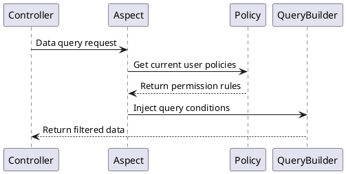

# Core Concepts  

This feature implements hierarchical data management and permission control in the system, primarily including modules such as department management, position management, and data permissions.  

Compared to the `master` branch, this version introduces new functional modules for department and position management, implements multiple data isolation methods, and enhances the system's organizational structure and role definition capabilities.  

## New Features  

### Department Management  

#### Functional Positioning  
The foundational unit of the organizational structure, enabling tree-like hierarchical management.  

#### Core Features  
- Supports unlimited parent-child department structures  
- Departments are associated with positions and users  
- Supports setting department leaders  

#### Data Model  
```php  
class Department {  
    int $id;  
    string $name;   
    int $parent_id;  
    HasMany $positions; // Associated positions  
    BelongsToMany $department_users; // Department users  
    BelongsToMany $leader; // Department leaders  
}  
```  

---  

### Position Management  

#### Functional Positioning  
Defines functional roles within departments.  

#### Core Features  
- Must belong to a specific department  
- Can configure data permission policies  
- Supports multi-position assignments for users  

#### Data Model  
```php  
class Position {  
    int $id;  
    string $name;  
    int $dept_id;  
    HasOne $policy; // Data permission policy  
}  
```  

## Data Permission System  

### Policy Types  

| Permission Code | Type | Scope | Remarks |  
|-------|----|-----|----|  
| DEPT_SELF | Department | Current department | Limited to current department data |  
| DEPT_TREE | Department | Current department and sub-departments | Includes current and all sub-department data |  
| ALL | Global | All data | Includes all department and user data |  
| SELF | Personal | Personal data | Limited to current user data |  
| CUSTOM_DEPT | Custom | Custom departments | Allows selecting specific departments |  
| CUSTOM_FUNC | Custom | Custom functions | Allows custom processing logic |  

### Implementation Mechanism  

Data permissions are implemented through `data permission policies` associated with `positions` or `users`. Each position or user can have one or more data permission policies, and the system filters and controls data access based on these policies.  

#### Policy Model  
```php  
class Policy {  
    int $user_id; // User ID  
    int $position_id; // Position ID   
    PolicyType $policy_type;  
    bool $is_default;  
    array $value; // Policy value  
}  
```  

#### Execution Flow  
