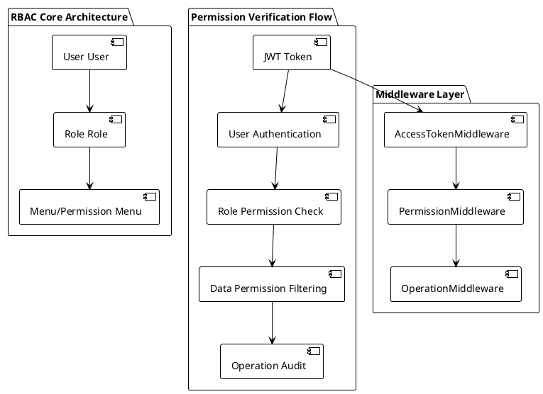
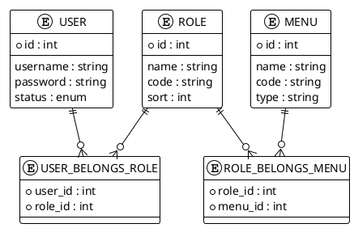

# User Authorization (RBAC)

## System Overview

MineAdmin employs a Role-Based Access Control (RBAC) system, integrating JWT authentication, multi-layer permission verification, and data-level permission control to provide comprehensive security for enterprise applications.

### Core Architecture



## Authentication System

### JWT Authentication Mechanism

Uses dual-token strategy for security:

```php
// Login authentication process
public function login(string $username, string $password): array
{
    $user = $this->repository->findByUnameType($username, Type::SYSTEM);
    
    // Password verification
    if (!$user->verifyPassword($password)) {
        throw new BusinessException(ResultCode::UNPROCESSABLE_ENTITY, trans('auth.password_error'));
    }
    
    // User status check
    if ($user->status->isDisable()) {
        throw new BusinessException(ResultCode::DISABLED);
    }
    
    // Generate Token
    $jwt = $this->getJwt();
    return [
        'access_token' => $jwt->builderAccessToken((string) $user->id)->toString(),
        'refresh_token' => $jwt->builderRefreshToken((string) $user->id)->toString(),
        'expire_at' => (int) $jwt->getConfig('ttl', 0),
    ];
}
```

### Password Security

System uses PHP's built-in secure hashing functions:

```php
// Password setting
public function setPasswordAttribute($value): void
{
    $this->attributes['password'] = password_hash((string) $value, \PASSWORD_DEFAULT);
}

// Password verification
public function verifyPassword(string $password): bool
{
    return password_verify($password, $this->password);
}
```

## Permission System

### Three-Tier Permission Model



### Permission Check Implementation

```php
// Permission check methods in User model
public function hasPermission(string $permission): bool
{
    return $this->roles()->whereRelation('menus', 'name', $permission)->exists();
}

public function getPermissions(): Collection
{
    return $this->roles()->with('menus')->orderBy('sort')->get()->pluck('menus')->flatten();
}

public function isSuperAdmin(): bool
{
    return $this->roles()->where('code', 'SuperAdmin')->exists();
}
```

### Permission Annotation Usage

Use `@Permission` annotation on controller methods for permission control:

```php
use Mine\Annotation\Permission;

class UserController
{
    #[Permission(code: 'permission:user:index')]
    public function pageList(): Result
    {
        // User list query
    }
    
    #[Permission(code: ['permission:user:save', 'permission:user:update'], operation: Permission::OPERATION_OR)]
    public function save(): Result
    {
        // User save or update
    }
    
    #[Permission(code: ['permission:user:delete', 'permission:role:admin'], operation: Permission::OPERATION_AND)]
    public function delete(): Result
    {
        // Requires both delete permission and admin role
    }
}
```

## Middleware System

### Three-Layer Middleware Protection

```php
#[Middleware(middleware: AccessTokenMiddleware::class, priority: 100)]
#[Middleware(middleware: PermissionMiddleware::class, priority: 99)]
#[Middleware(middleware: OperationMiddleware::class, priority: 98)]
class AdminController
{
    // Controller logic
}
```

#### 1. AccessTokenMiddleware

Validates access token:

```php
public function process(ServerRequestInterface $request, RequestHandlerInterface $handler): ResponseInterface
{
    $token = $this->getTokenFromRequest($request);
    
    try {
        $jwt = $this->getJwt();
        $token = $jwt->parseToken($token);
        
        // Check blacklist
        if ($jwt->isBlacklisted($token)) {
            throw new TokenValidException('Token has been blacklisted');
        }
        
        // Set current user
        $this->setCurrentUser($token);
        
    } catch (\Throwable $e) {
        throw new BusinessException(ResultCode::UNAUTHORIZED, $e->getMessage());
    }
    
    return $handler->handle($request);
}
```

#### 2. PermissionMiddleware

Executes permission verification logic:

```php
private function handlePermission(Permission $permission): void
{
    $operation = $permission->getOperation();
    $codes = $permission->getCode();
    
    foreach ($codes as $code) {
        $hasPermission = $this->currentUser->user()->hasPermission($code);
        
        if ($operation === Permission::OPERATION_AND && !$hasPermission) {
            throw new BusinessException(code: ResultCode::FORBIDDEN);
        }
        
        if ($operation === Permission::OPERATION_OR && $hasPermission) {
            return;
        }
    }
    
    if ($operation === Permission::OPERATION_OR) {
        throw new BusinessException(code: ResultCode::FORBIDDEN);
    }
}
```

#### 3. OperationMiddleware

Logs operations:

```php
public function process(ServerRequestInterface $request, RequestHandlerInterface $handler): ResponseInterface
{
    $response = $handler->handle($request);
    
    // Log operation
    $this->dispatcher->dispatch(new RequestOperationEvent(
        $this->user->id(),
        $operator->summary,
        $request->getUri()->getPath(),
        $request->getClientIps(),
        $request->getMethod(),
    ));
    
    return $response;
}
```

## API Reference

### CurrentUser Service

```php
use Mine\Support\CurrentUser;

class ExampleController
{
    public function __construct(private readonly CurrentUser $currentUser) {}
    
    public function getUserInfo(): array
    {
        $user = $this->currentUser->user();
        
        return [
            'id' => $user->id,
            'username' => $user->username,
            'roles' => $user->roles,
            'permissions' => $user->getPermissions(),
            'is_super_admin' => $user->isSuperAdmin(),
        ];
    }
    
    public function checkPermission(string $permission): bool
    {
        return $this->currentUser->user()->hasPermission($permission);
    }
}
```

### Permission Verification Methods

```php
// AND operation: Requires all permissions
#[Permission(code: ['user:read', 'user:write'], operation: Permission::OPERATION_AND)]

// OR operation: Requires any permission
#[Permission(code: ['user:read', 'admin:all'], operation: Permission::OPERATION_OR)]

// Single permission check
#[Permission(code: 'user:delete')]

// Programmatic permission check
if ($this->currentUser->user()->hasPermission('user:create')) {
    // Allow user creation
}
```

## Troubleshooting

### Common Issues

#### Permission Check Failure

**Problem**: User cannot access authorized resources

**Debug Steps**:
```php
// 1. Check user roles
$user = User::find($userId);
dd($user->roles);

// 2. Check role permissions
foreach ($user->roles as $role) {
    dd($role->menus);
}

// 3. Check permission code
$hasPermission = $user->hasPermission('permission:user:index');
dd($hasPermission);

// 4. Check SuperAdmin status
dd($user->isSuperAdmin());
```