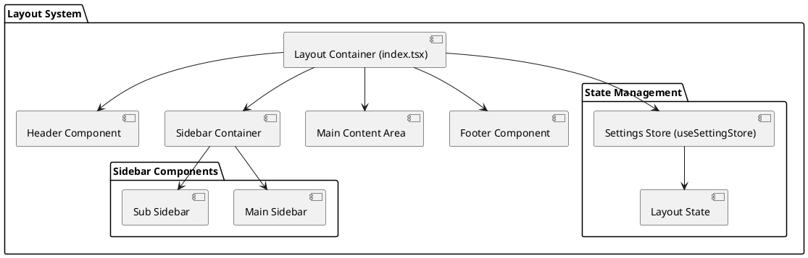

# Layout System

MineAdmin 3.0's layout system is a flexible and powerful frontend layout solution that supports multiple layout modes and dynamic switching. Compared to version 2.0, the new layout system adopts a unified architectural design, with all layout logic centralized in the `src/layouts/index.tsx` file, providing better maintainability and extensibility.

## Layout Architecture Overview



## Layout Modes

MineAdmin supports three main layout modes:

### 1. Classic Layout
- **Features**: Traditional left sidebar + main content area layout
- **Use Case**: Standard backend management interface
- **Component Structure**: Fixed left menu, right content area

### 2. Mixed Layout
- **Features**: Combination of top menu + left submenu
- **Use Case**: Complex applications requiring multi-level menu navigation
- **Component Structure**: Top main menu, left submenu for current category

### 3. Columns Layout
- **Features**: Multi-column menu layout
- **Use Case**: Large applications with numerous menu categories
- **Component Structure**: Left main menu column, middle submenu column, right content area

## Layout-Related APIs

### useSettingStore API Reference

| Method Name | Return Type | Description | Usage Example |
|-------------|-------------|-------------|---------------|
| `isMixedLayout()` | `boolean` | Check if current mode is mixed layout | `store.isMixedLayout()` |
| `isColumnsLayout()` | `boolean` | Check if current mode is columns layout | `store.isColumnsLayout()` |
| `isClassicLayout()` | `boolean` | Check if current mode is classic layout | `store.isClassicLayout()` |
| `getFixedAsideState()` | `boolean` | Get whether sub sidebar is fixed | `store.getFixedAsideState()` |
| `getMenuCollapseState()` | `boolean` | Get whether menu is collapsed | `store.getMenuCollapseState()` |
| `getMobileState()` | `boolean` | Check if current device is mobile | `store.getMobileState()` |

::: tip API Source Location
- **GitHub**: [useSettingStore.ts](https://github.com/mineadmin/MineAdmin/blob/master/web/src/store/modules/useSettingStore.ts)
- **Local Path**: `mineadmin/web/src/store/modules/useSettingStore.ts`
:::

### Usage Example

```typescript
// Using layout APIs in Vue components
import { useSettingStore } from '@/stores/modules/settingStore'

export default defineComponent({
  setup() {
    const settingStore = useSettingStore()
    
    // Check current layout mode
    const isClassic = computed(() => settingStore.isClassicLayout())
    const isMixed = computed(() => settingStore.isMixedLayout())
    const isColumns = computed(() => settingStore.isColumnsLayout())
    
    // Get menu state
    const isMenuCollapsed = computed(() => settingStore.getMenuCollapseState())
    const isAsideFixed = computed(() => settingStore.getFixedAsideState())
    
    // Responsive device detection
    const isMobile = computed(() => settingStore.getMobileState())
    
    return {
      isClassic,
      isMixed, 
      isColumns,
      isMenuCollapsed,
      isAsideFixed,
      isMobile
    }
  }
})
```

## Layout Switching Functionality

### Dynamic Layout Switching

```typescript
// Layout mode switching example
import { useSettingStore } from '@/stores/modules/settingStore'

const settingStore = useSettingStore()

// Switch to classic layout
const switchToClassic = () => {
  settingStore.updateSettings({
    layout: 'classic'
  })
}

// Switch to mixed layout
const switchToMixed = () => {
  settingStore.updateSettings({
    layout: 'mixed'
  })
}

// Switch to columns layout
const switchToColumns = () => {
  settingStore.updateSettings({
    layout: 'columns'
  })
}

// Toggle menu collapse state
const toggleMenuCollapse = () => {
  settingStore.toggleMenuCollapse()
}
```

## Global Style Configuration

### CSS Variable Definitions

::: tip Configuration File Location
- **GitHub**: [https://github.com/mineadmin/mineadmin/blob/master/web/src/assets/styles/global.scss](https://github.com/mineadmin/mineadmin/blob/master/web/src/assets/styles/global.scss)
- **Local Path**: `mineadmin/web/src/assets/styles/global.scss`
:::

```scss
/* Layout dimension variables */
:root {
  /* ========== Header Area ========== */
  --mine-g-header-height: 55px;
  --mine-g-toolbar-height: 55px;
  
  /* ========== Footer Area ========== */
  --mine-g-footer-height: 50px;
  
  /* ========== Sidebar Area ========== */
  --mine-g-main-aside-width: 80px;           /* Main sidebar width */
  --mine-g-sub-aside-width: 200px;           /* Expanded sub sidebar width */
  --mine-g-sub-aside-collapse-width: 65px;   /* Collapsed sub sidebar width */
  --mine-g-menu-retract-width: 15px;         /* Menu indent width */
  
  /* ========== Tab Bar ========== */
  --mine-g-tabbar-height: 40px;
  
  /* ========== Theme Colors ========== */
  --mine-g-box-shadow-color: rgb(0 0 0 / 18%);
  --el-color-primary: --ui-primery;
  
  /* ========== Responsive Breakpoints ========== */
  --mine-g-mobile-breakpoint: 768px;
  --mine-g-tablet-breakpoint: 1024px;
}
```

### Responsive Layout Configuration

```scss
/* Responsive layout styles */
@media screen and (max-width: 768px) {
  :root {
    --mine-g-main-aside-width: 0px;
    --mine-g-sub-aside-width: 100vw;
    --mine-g-header-height: 50px;
  }
}

@media screen and (min-width: 768px) and (max-width: 1024px) {
  :root {
    --mine-g-main-aside-width: 60px;
    --mine-g-sub-aside-width: 180px;
  }
}
```

## Advanced Configuration

### Custom Layout Styles

```scss
/* Custom layout configuration example */
.mine-layout {
  /* Custom header styles */
  &__header {
    background: var(--el-bg-color);
    border-bottom: 1px solid var(--el-border-color-light);
    height: var(--mine-g-header-height);
  }
  
  /* Custom sidebar styles */
  &__aside {
    width: var(--mine-g-main-aside-width);
    transition: width 0.3s ease;
    
    &--collapsed {
      width: var(--mine-g-sub-aside-collapse-width);
    }
  }
  
  /* Custom content area styles */
  &__main {
    margin-left: var(--mine-g-main-aside-width);
    transition: margin-left 0.3s ease;
    min-height: calc(100vh - var(--mine-g-header-height));
  }
}
```

### Layout State Persistence

```typescript
// Layout state persistence configuration
import { defineStore } from 'pinia'

export const useLayoutStore = defineStore('layout', {
  state: () => ({
    mode: 'classic' as 'classic' | 'mixed' | 'columns',
    isAsideCollapsed: false,
    isAsideFixed: true,
    isMobile: false
  }),
  
  persist: {
    key: 'mine-admin-layout',
    storage: localStorage,
    paths: ['mode', 'isAsideCollapsed', 'isAsideFixed']
  }
})
```

## Performance Optimization

### Lazy Loading of Layout Components

```typescript
// Async loading of layout components
import { defineAsyncComponent } from 'vue'

export const LayoutComponents = {
  Header: defineAsyncComponent(() => import('@/layouts/components/Header.vue')),
  Aside: defineAsyncComponent(() => import('@/layouts/components/Aside.vue')),
  Main: defineAsyncComponent(() => import('@/layouts/components/Main.vue')),
  Footer: defineAsyncComponent(() => import('@/layouts/components/Footer.vue'))
}
```

### Layout Switching Animation Optimization

```scss
/* Layout switching animation optimization */
.layout-transition {
  transition: all 0.3s cubic-bezier(0.4, 0, 0.2, 1);
  will-change: transform, width, margin;
}

/* Reduce unnecessary repaints */
.layout-aside {
  contain: layout style paint;
  transform: translateZ(0); /* Enable hardware acceleration */
}
```

## Common Issue Resolution

### 1. Mobile Layout Adaptation Issues

```typescript
// Mobile adaptation solution
import { useBreakpoints } from '@vueuse/core'

const breakpoints = useBreakpoints({
  mobile: 0,
  tablet: 768,
  desktop: 1024
})

const isMobile = breakpoints.smaller('tablet')
const isTablet = breakpoints.between('tablet', 'desktop')
const isDesktop = breakpoints.greater('desktop')
```

### 2. Layout Flickering Issues

```scss
/* Prevent layout flickering */
.mine-layout {
  opacity: 0;
  transition: opacity 0.2s ease;
  
  &.loaded {
    opacity: 1;
  }
}
```

### 3. Sidebar Scrolling Issues

```scss
/* Sidebar scrolling optimization */
.layout-aside {
  overflow-y: auto;
  scrollbar-width: thin;
  scrollbar-color: var(--el-border-color) transparent;
  
  &::-webkit-scrollbar {
    width: 6px;
  }
  
  &::-webkit-scrollbar-thumb {
    background: var(--el-border-color);
    border-radius: 3px;
  }
}
```

## Related Documentation

- [Common Stores](/en/front/high/store) - State management related documentation

::: tip Source Code Reference
Complete layout system source code can be found at:
- **GitHub**: [web/src/layouts](https://github.com/mineadmin/mineadmin/tree/master/web/src/layouts)
- **Local Path**: `mineadmin/web/src/layouts/`
:::