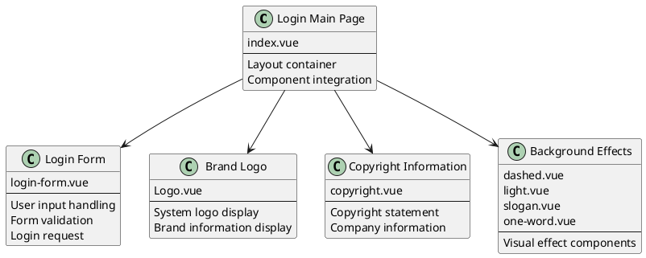
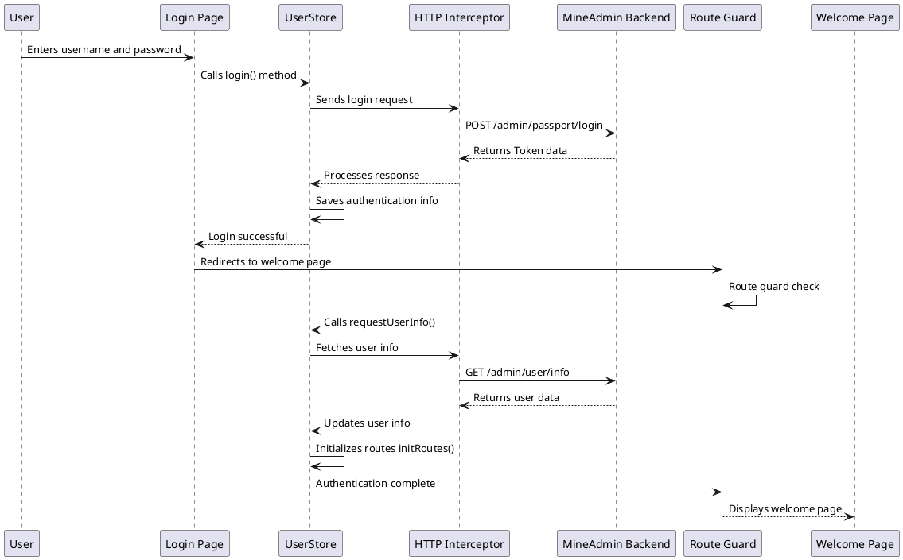
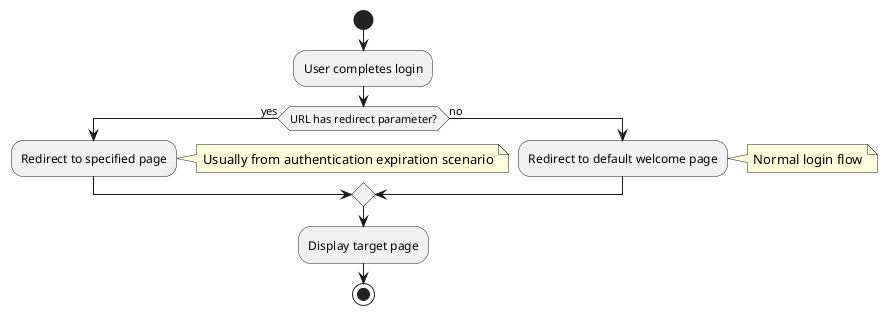

# Login and Welcome Page

:::tip Overview
This chapter details the login page architecture, login process flow, Token management mechanism, and welcome page configuration after successful login in MineAdmin 3.0. It includes component structure analysis, data flow process, route guard mechanism, and custom configuration methods.

**Important Note**: All code examples in this document are from the actual code of the MineAdmin open-source project. The source code is located in the [GitHub repository](https://github.com/mineadmin/mineadmin).
:::

## Login Page Architecture

### Page Component Structure

The main login page file is located at `src/modules/base/views/login/index.vue`, adopting a component-based design that splits login functionality into multiple independent sub-components to improve code maintainability and reusability.

**Source Code Location**:
- **GitHub Address**: [mineadmin/web/src/modules/base/views/login/index.vue](https://github.com/mineadmin/mineadmin/blob/master/web/src/modules/base/views/login/index.vue)
- **Local Path**: `src/modules/base/views/login/index.vue`



### Responsive Layout Design

The login page adopts responsive design to adapt to desktop and mobile devices:

```vue
<template>
  <div class="h-full min-w-[380px] w-full flex items-center justify-center overflow-hidden border-1 bg-blue-950 lg:justify-between lg:bg-white">
    <!-- Desktop left decoration area -->
    <div class="relative hidden h-full w-10/12 md:hidden lg:flex">
      <div class="gradient-rainbow" />
      <Dashed />
      <Light />
      <Slogan />
      <OneWord />
    </div>
    
    <!-- Login form area -->
    <div class="login-form-container">
      <Logo />
      <LoginForm />
      <CopyRight />
    </div>
    
    <!-- Mobile background effects -->
    <div class="min-[380px] relative left-0 top-0 z-4 h-full max-w-[1024px] w-full flex lg:hidden">
      <Dashed />
      <Light />
    </div>
  </div>
</template>
```

### Component Library Notes

::: warning Component Library Considerations
The form components on the login page are not built using the `Element Plus` component library but are based on MineAdmin's own foundational component library. These components are specifically designed for the system with the following characteristics:

- **Lightweight Design**: Contains only essential login functionality, reducing dependencies
- **Unified Style**: Consistent with the system's overall design language
- **High Customizability**: Flexible adjustments based on business needs

**Customization Recommendations**:
- Avoid directly modifying source code to prevent issues with future version upgrades
- Recommended to replace login components via the [Plugin System](/front/high/plugins.md)
- Default `login` route components can be overridden through route configuration
:::

## Login Process and Data Handling

### Login Process Overview

The login process adopts a modern frontend-backend separation architecture, using JWT Token for identity authentication, supporting automatic Token refresh and permission verification.



### Core Data Flow

::: info Development Tip
If you only need to modify the login page UI without involving login logic, you can skip the detailed process description in this section and proceed directly to the [Welcome Page Configuration](#default-welcome-page-configuration) section.
:::

#### 1. User Authentication

**File Location**: `src/store/modules/useUserStore.ts`

The `login()` method handles the user authentication process:

```typescript
// Core logic of login method
async login(loginParams: LoginParams) {
  try {
    // Send login request
    const response = await http.post('/admin/passport/login', loginParams)
    
    // Save authentication info to local storage
    const { access_token, refresh_token, expire_at } = response.data
    
    // Store in Pinia Store
    this.token = access_token
    this.refreshToken = refresh_token
    this.expireAt = expire_at
    
    // Store in browser cache
    cache.set('token', access_token)
    cache.set('refresh_token', refresh_token)
    cache.set('expire', useDayjs().unix() + expire_at, { exp: expire_at })
    
    return Promise.resolve(response)
  } catch (error) {
    return Promise.reject(error)
  }
}
```

#### 2. Route Guard Interception

After successful login, page redirection triggers the route guard, automatically fetching user information:

```typescript
// Simplified route guard logic
router.beforeEach(async (to, from, next) => {
  const userStore = useUserStore()
  
  if (to.path !== '/login' && !userStore.isLogin) {
    // Not logged in, redirect to login page
    next('/login')
  } else if (userStore.isLogin && !userStore.userInfo) {
    // Logged in but user info not fetched
    try {
      await userStore.requestUserInfo()
      next()
    } catch (error) {
      // Failed to fetch user info, clear login status
      await userStore.logout()
      next('/login')
    }
  } else {
    next()
  }
})
```

#### 3. User Information Fetching

**File Location**: `src/store/modules/useUserStore.ts`

The `requestUserInfo()` method fetches user basic data and permission information:

```typescript
async requestUserInfo() {
  try {
    // Parallel requests for user data, menu permissions, role info
    const [userInfo, menuList, roleList] = await Promise.all([
      http.get('/admin/user/info'),          // User basic info
      http.get('/admin/menu/index'),         // Menu permission data
      http.get('/admin/role/index')          // Role permission data
    ])
    
    // Update Store state
    this.userInfo = userInfo.data
    this.menuList = menuList.data
    this.roleList = roleList.data
    
    // Initialize route system
    const routeStore = useRouteStore()
    await routeStore.initRoutes()
    
    return Promise.resolve(userInfo)
  } catch (error) {
    return Promise.reject(error)
  }
}
```

#### 4. Dynamic Route Initialization

**File Location**: `src/store/modules/useRouteStore.ts`

The `initRoutes()` method dynamically generates routes based on user permissions:

```typescript
async initRoutes() {
  const userStore = useUserStore()
  const { menuList } = userStore
  
  // Generate route configuration based on menu data
  const routes = this.generateRoutes(menuList)
  
  // Dynamically add routes
  routes.forEach(route => {
    router.addRoute(route)
  })
  
  // Update route state
  this.isRoutesInitialized = true
}
```

### Token Management Mechanism

The system adopts a dual Token mechanism to ensure security and user experience:

- **Access Token**: Short-term validity (default 1 hour), used for API request authentication
- **Refresh Token**: Long-term validity (default 2 hours), used to refresh Access Token

For detailed Token refresh mechanism, refer to [Request and Interceptor](/front/advanced/request.md#token-refresh-mechanism) documentation.

## Welcome Page Configuration and Route Management

### Post-Login Redirection Logic

MineAdmin supports multiple post-login redirection strategies to ensure user experience continuity:



#### Redirection Rules Explanation

1. **Login with Redirect Parameter**
   ```
   /#/login?redirect=/admin/user/index
   ```
   After successful login, automatically redirects to the page specified by the `redirect` parameter. This typically occurs in:
   - User accesses a permission-required page without login
   - Token expires and automatically redirects to login page

2. **Default Login Redirection**
   ```
   /#/login
   ```
   Without the `redirect` parameter, after successful login, redirects to the system-configured default welcome page.

### Welcome Page Configuration Details

#### Default Configuration Structure

**Configuration File Location**: `src/provider/settings/index.ts`

MineAdmin's actual default welcome page configuration:

```typescript
// MineAdmin default welcome page configuration
welcomePage: {
  name: 'welcome',                    // Route name
  path: '/welcome',                   // Route path
  title: 'Welcome Page',              // Page title
  icon: 'icon-park-outline:jewelry',  // Menu icon
},
```

Note: In MineAdmin, the welcome page component path is automatically resolved through the route system, located at `src/modules/base/views/welcome/index.vue`.

#### Configuration Item Details

| Item | Type | Required | Default | Description |
|--------|------|------|---------|------|
| `name` | `string` | ✅ | `'welcome'` | Route name, must be globally unique |
| `path` | `string` | ✅ | `'/welcome'` | Access path, supports dynamic routes |
| `title` | `string` | ✅ | `'Welcome Page'` | Page title, displayed in browser tab and breadcrumb |
| `icon` | `string` | ❌ | `'icon-park-outline:jewelry'` | Icon identifier for menu display |
| `component` | `Function` | ❌ | Dynamic import component | Page component, supports async loading |

### Custom Welcome Page Configuration

::: tip Best Practice
To ensure configurations are not overwritten during system upgrades, strongly recommend custom configurations in `settings.config.ts` rather than directly modifying the `index.ts` file.
:::

#### Configuration Method

**Step 1**: Edit `src/provider/settings/settings.config.ts`

Note: This file already exists in the MineAdmin project, no need to create.

```typescript
import type { SystemSettings } from '#/global'

const globalConfigSettings: SystemSettings.all = {
  // Custom welcome page configuration
  welcomePage: {
    name: 'dashboard',                        // Change to dashboard
    path: '/dashboard',                      // Path changed to dashboard path
    title: 'Data Overview',                  // Custom title
    icon: 'mdi:view-dashboard-outline',      // Use dashboard icon
  },
  
  // Other system configurations...
  app: {
    // App-related configurations
  }
}

export default globalConfigSettings
```

**Step 2**: System automatically merges configurations

During system startup, configurations in `settings.config.ts` are automatically deeply merged with default configurations:

```typescript
// MineAdmin actual configuration merge logic
import { defaultsDeep } from 'lodash-es'
import globalConfigSettings from '@/provider/settings/settings.config.ts'

// Merge default config with user config
const systemSetting = defaultsDeep(globalConfigSettings, defaultGlobalConfigSettings)
```

### Advanced Configuration Examples

#### 1. Conditional Welcome Page

Set different welcome pages based on user roles or permissions:

```typescript
const globalConfigSettings: SystemSettings.all = {
  welcomePage: {
    name: 'adaptive-welcome',
    path: '/adaptive-welcome',
    title: 'Personalized Welcome Page',
    icon: 'mdi:account-star',
    // Use custom component for conditional logic
    component: () => import('@/views/custom/AdaptiveWelcome.vue')
  }
}
```

#### 2. Multi-language Support

Configure multi-language welcome pages with internationalization:

```typescript
const globalConfigSettings: SystemSettings.all = {
  welcomePage: {
    name: 'welcome',
    path: '/welcome',
    // Use internationalization keys
    title: 'menu.welcome', 
    icon: 'icon-park-outline:jewelry',
  }
}
```

#### 3. External Link Redirection

Configure post-login redirection to external systems:

```typescript
const globalConfigSettings: SystemSettings.all = {
  welcomePage: {
    name: 'external-system',
    path: 'https://external-dashboard.com',  // External link
    title: 'External System',
    icon: 'mdi:open-in-new',
    // Set as external link type
    meta: {
      isExternal: true,
      target: '_blank'
    }
  }
}
```

### Welcome Page Component Development

#### Basic Component Structure

```vue
<!-- src/views/custom/CustomWelcome.vue -->
<template>
  <div class="welcome-container">
    <div class="welcome-header">
      <h1>{{ $t('welcome.title') }}</h1>
      <p>{{ $t('welcome.subtitle') }}</p>
    </div>
    
    <div class="welcome-content">
      <!-- User info card -->
      <UserInfoCard :user="userInfo" />
      
      <!-- Quick actions -->
      <QuickActions :actions="quickActions" />
      
      <!-- Data statistics -->
      <DataStatistics :stats="systemStats" />
    </div>
  </div>
</template>

<script setup lang="ts">
import { ref, onMounted } from 'vue'
import { useUserStore } from '@/store/modules/useUserStore'
import UserInfoCard from '@/components/UserInfoCard.vue'
import QuickActions from '@/components/QuickActions.vue'
import DataStatistics from '@/components/DataStatistics.vue'

const userStore = useUserStore()
const userInfo = ref(userStore.userInfo)
const systemStats = ref({})
const quickActions = ref([
  { name: 'User Management', icon: 'mdi:account-group', path: '/admin/user' },
  { name: 'Role Permissions', icon: 'mdi:shield-account', path: '/admin/role' },
  { name: 'System Settings', icon: 'mdi:cog', path: '/admin/system' },
])

// MineAdmin welcome page doesn't require dynamic data loading
// All data is static, defined directly in the component

// MineAdmin welcome page uses static data, no API calls needed
// If dynamic data is required, add corresponding API calls
// Example: useHttp().get('/admin/user/info') for actual existing APIs
</script>

<style scoped>
.welcome-container {
  padding: 24px;
  max-width: 1200px;
  margin: 0 auto;
}

.welcome-header {
  text-align: center;
  margin-bottom: 32px;
}

.welcome-content {
  display: grid;
  grid-template-columns: repeat(auto-fit, minmax(300px, 1fr));
  gap: 24px;
}
</style>
```

## Security Considerations and Best Practices

### Authentication Security

1. **Token Secure Storage**
   - Access Token stored in memory to prevent XSS attacks
   - Refresh Token stored in HttpOnly Cookie
   - Sensitive information not stored in localStorage

2. **Route Permission Verification**
   ```typescript
   // Permission check in route guard
   router.beforeEach(async (to, from, next) => {
     const userStore = useUserStore()
     
     // Check if route requires authentication
     if (to.meta.requiresAuth && !userStore.isLogin) {
       next(`/login?redirect=${to.fullPath}`)
       return
     }
     
     // Check user permissions
     if (to.meta.permissions && !userStore.hasPermissions(to.meta.permissions)) {
       next('/403') // Insufficient permissions page
       return
     }
     
     next()
   })
   ```

### Performance Optimization

1. **Component Lazy Loading**
   
   MineAdmin uses modular route loading, components are automatically lazy-loaded:
   ```typescript
   // Dynamic component loading in MineAdmin
   const moduleViews = import.meta.glob('../../modules/**/views/**/**.{vue,jsx,tsx}')
   const pluginViews = import.meta.glob('../../plugins/*/**/views/**/**.{vue,jsx,tsx}')
   
   // Automatically resolve component paths
   if (moduleViews[`../../modules/${item.component}${suffix}`]) {
     component = moduleViews[`../../modules/${item.component}${suffix}`]
   }
   ```

2. **Data Preloading**
   
   MineAdmin handles user info loading in route guard:
   ```typescript
   // MineAdmin data preloading mechanism
   router.beforeEach(async (to, from, next) => {
     if (userStore.isLogin) {
       if (userStore.getUserInfo() === null) {
         // Preload user info, menu, and permission data
         await userStore.requestUserInfo()
         next({ path: to.fullPath, query: to.query })
       }
       else {
         next()
       }
     }
   })
   ```

## Common Issues and Solutions

### Q: Page doesn't redirect after successful login?

**Possible