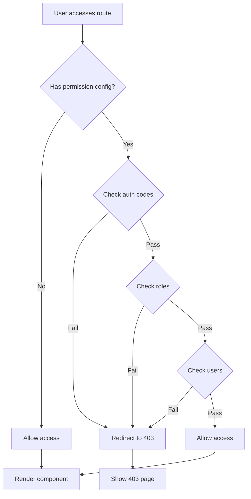

# MineAdmin Permission Control System  

## Overview  

MineAdmin provides a comprehensive frontend permission control system that implements fine-grained permission management. Permission control operates at two levels:  

:::tip Permission Architecture Overview  
- **Route-level permissions**: Controls page access based on backend-returned menu data  
- **Content-level permissions**: Controls the display/hiding of page content through helper functions, directives, and components  

The permission system is deeply integrated with the backend Hyperf framework, ensuring consistency in permission control between frontend and backend.  
:::  

### Permission Types  

MineAdmin supports three granular permission control types:  

| Permission Type | Judgment Basis | Application Scenario | Implementation Method |  
|---------|---------|---------|---------|  
| **Permission code** | Menu's `name` field | Functional module permission control | Functions, directives, components |  
| **Role permissions** | Role's `code` field | Responsibility-based permission control | Functions, directives |  
| **User permissions** | User's `username` field | Specific user permission control | Functions, directives |  

::: info Implementation Principle  
The permission system verifies access to specific functions by comparing the current user's permission codes, role codes, and user identifiers against backend-provided permission data. Permission data is stored in frontend state management for efficient permission validation.  
:::  

## Permission Helper Functions  

### Function Import and Basic Usage  

MineAdmin provides three core permission validation functions located in the `web/src/utils/permission/` directory:  

```javascript  
// Permission code validation  
import hasAuth from '@/utils/permission/hasAuth'  
// Role validation  
import hasRole from '@/utils/permission/hasRole'  
// User validation  
import hasUser from '@/utils/permission/hasUser'  
```  

::: tip Function Location  
**Source Path**:  
- GitHub: `https://github.com/mineadmin/mineadmin/tree/master/web/src/utils/permission/`  
- Local Dev: `/web/src/utils/permission/`  

These functions are globally registered and can be called directly in components.  
:::  

### Usage in Business Logic  

```vue  
<script setup>  
// Permission code validation - supports single code or array  
if (hasAuth('user:list') || hasAuth(['user:list', 'user:create'])) {  
  // User management permission granted  
  console.log('Has user management permission')  
}  

// Role validation - supports single role or array  
if (hasRole('SuperAdmin') || hasRole(['admin', 'manager'])) {  
  // Admin role granted  
  console.log('Has admin permission')  
}  

// User validation - supports single username or array  
if (hasUser('admin') || hasUser(['admin', 'root'])) {  
  // Specific user granted  
  console.log('Specific user validation passed')  
}  

// Composite permission check  
const canManageUsers = hasAuth(['user:list', 'user:create']) && hasRole('admin')  
if (canManageUsers) {  
  // Both permission and role requirements met  
}  
</script>  
```  

### Usage in Templates  

```vue  
<script setup>  
// Import permission functions  
import hasAuth from '@/utils/permission/hasAuth'  
import hasRole from '@/utils/permission/hasRole'  
import hasUser from '@/utils/permission/hasUser'  
</script>  

<template>  
  <div>  
    <!-- Permission code validation -->  
    <div v-if="hasAuth('user:list') || hasAuth(['user:list', 'user:create'])">  
      <el-button type="primary">User Management</el-button>  
    </div>  
    
    <!-- Role validation -->  
    <div v-if="hasRole('SuperAdmin') || hasRole(['admin', 'manager'])">  
      <el-button type="danger">System Settings</el-button>  
    </div>  

    <!-- User validation -->  
    <div v-if="hasUser('admin') || hasUser(['root', 'administrator'])">  
      <el-button type="warning">Advanced Features</el-button>  
    </div>  

    <!-- Composite validation -->  
    <div v-if="hasAuth('role:manage') && hasRole('admin')">  
      <el-button>Role Management</el-button>  
    </div>  
  </div>  
</template>  
```  

### Function Parameters  

All permission functions support the following parameter formats:  

```javascript  
// String format - single permission check  
hasAuth('user:list')  
hasRole('admin')  
hasUser('admin')  

// Array format - multiple permission check (OR logic)  
hasAuth(['user:list', 'user:create', 'user:edit'])  
hasRole(['admin', 'manager', 'supervisor'])  
hasUser(['admin', 'root', 'system'])  
```  

::: warning Notes  
- Array parameters use **OR logic** - returns `true` if any condition is met  
- For **AND logic**, combine multiple function calls: `hasAuth('a') && hasAuth('b')`  
- Recommended permission code naming: `module:operation` (e.g., `user:list`, `role:create`)  
:::  

### Route Permission Parameter  

Permission functions support an optional second parameter `checkRoute` to enable route permission validation:  

```javascript  
// Default false - only checks functional permissions  
hasAuth('user:list', false)  

// When true - also checks route permissions  
hasAuth('user:list', true)  
```  

## Permission Directives  

MineAdmin provides three permission directives to simplify template-level permission control. Directives are located in `web/src/directives/permission/`:  

::: tip Directive Source Location  
**GitHub Path**:  
- `https://github.com/mineadmin/mineadmin/tree/master/web/src/directives/permission/auth/`  
- `https://github.com/mineadmin/mineadmin/tree/master/web/src/directives/permission/role/`  
- `https://github.com/mineadmin/mineadmin/tree/master/web/src/directives/permission/user/`  

**Local Path**: `/web/src/directives/permission/`  
:::  

### Directive Usage  

```vue  
<template>  
  <div>  
    <!-- Permission code directive - supports string and array -->  
    <div v-auth="'user:list'">  
      Single permission control  
    </div>  
    <div v-auth="['user:list', 'user:create']">  
      Multiple permissions (OR logic)  
    </div>  
    
    <!-- Role directive -->  
    <div v-role="'admin'">  
      Single role control  
    </div>  
    <div v-role="['admin', 'manager']">  
      Multiple roles (OR logic)  
    </div>  

    <!-- User directive -->  
    <div v-user="'admin'">  
      Single user control  
    </div>  
    <div v-user="['admin', 'root']">  
      Multiple users (OR logic)  
    </div>  

    <!-- Practical examples -->  
    <el-button v-auth="'user:create'" type="primary">  
      Add User  
    </el-button>  
    
    <el-button v-role="'SuperAdmin'" type="danger">  
      Delete Data  
    </el-button>  
    
    <div v-auth="['log:operation', 'log:login']" class="log-panel">  
      Log View Panel  
    </div>  
  </div>  
</template>  
```  

### Directives vs Functions  

| Method | Advantages | Use Case | Example |  
|------|------|----------|------|  
| **Directives** | Concise, automatically controls element visibility | Simple permission control, static checks | `v-auth="'user:list'"` |  
| **Functions** | Flexible, supports complex logic | Business logic permission checks, dynamic validation | `v-if="hasAuth('a') && hasRole('b')"` |  

::: warning Directive Notes  
- Directives use **OR logic** - element shows if any condition is met  
- Directives directly control DOM visibility (elements are not rendered without permission)  
- Complex permission logic should use functions rather than directives  
:::  

## MaAuth Permission Component  

### Component Introduction  

The `MaAuth` component provides permission control for large content blocks. Compared to functions and directives, it's better suited for complex permission display logic.  

::: info Component Location  
**GitHub Path**: `https://github.com/mineadmin/mineadmin/tree/master/web/src/components/ma-auth/index.vue`  

**Local Path**: `/web/src/components/ma-auth/index.vue`  

Globally registered - can be used directly in any Vue component without manual import.  
:::  

### Basic Usage  

```vue  
<template>  
  <!-- Single permission control -->  
  <ma-auth :value="'user:list'">  
    <div class="user-management">  
      <h3>User Management Panel</h3>  
      <p>You have user list view permission</p>  
    </div>  
  </ma-auth>  

  <!-- Multiple permissions (OR logic) -->  
  <ma-auth :value="['user:list', 'user:create', 'user:edit']">  
    <div class="user-operations">  
      <el-button type="primary">Add User</el-button>  
      <el-button type="success">Edit User</el-button>  
      <el-button type="danger">Delete User</el-button>  
    </div>  
  </ma-auth>  
</template>  
```  

### No-Permission Customization  

The `#notAuth` slot allows customizing content when permissions are lacking:  

```vue  
<template>  
  <ma-auth :value="['admin:system', 'admin:config']">  
    <!-- Content with permission -->  
    <div class="admin-panel">  
      <h2>System Management</h2>  
      <el-form>  
        <el-form-item label="System Config">  
          <el-input placeholder="Configuration" />  
        </el-form-item>  
      </el-form>  
    </div>  
    
    <!-- No-permission content -->  
    <template #notAuth>  
      <el-alert  
        title="Insufficient Permissions"  
        description="Contact administrator for system management access"  
        type="warning"  
        :closable="false"  
        show-icon  
      />  
    </template>  
  </ma-auth>  
</template>  
```  

### Advanced Usage  

#### Nested Permission Control  

```vue  
<template>  
  <ma-auth :value="'module:access'">  
    <!-- Module-level permission -->  
    <div class="module-container">  
      <h2>Business Module</h2>  
      
      <!-- Feature-level permission -->  
      <ma-auth :value="'feature:read'">  
        <div class="read-section">  
          <p>Read-only Content</p>  
        </div>  
        <template #notAuth>  
          <p class="text-gray">No read permission</p>  
        </template>  
      </ma-auth>  

      <!-- Operation-level permission -->  
      <ma-auth :value="['feature:create', 'feature:edit']">  
        <div class="action-buttons">  
          <el-button>Create</el-button>  
          <el-button>Edit</el-button>  
        </div>  
        <template #notAuth>  
          <p class="text-muted">No operation permission</p>  
        </template>  
      </ma-auth>  
    </div>  
    
    <template #notAuth>  
      <el-empty description="No access to this module" />  
    </template>  
  </ma-auth>  
</template>  
```  

#### Integration with Other Components  

```vue  
<template>  
  <!-- Table action permission control -->  
  <el-table :data="tableData">  
    <el-table-column label="Name" prop="name" />  
    <el-table-column label="Actions">  
      <template #default="{ row }">  
        <ma-auth :value="'user:edit'">  
          <el-button size="small" @click="editUser(row)">Edit</el-button>  
          <template #notAuth>  
            <el-button size="small" disabled>No Permission</el-button>  
          </template>  
        </ma-auth>  
        
        <ma-auth :value="'user:delete'">  
          <el-button size="small" type="danger" @click="deleteUser(row)">  
            Delete  
          </el-button>  
        </ma-auth>  
      </template>  
    </el-table-column>  
  </el-table>  
</template>  
```  

### Component Props  

| Prop | Type | Default | Description |  
|------|------|--------|------|  
| `value` | `string \| string[]` | `[]` | Permission codes to validate (string or array) |  

### Component Slots  

| Slot | Description | Params |  
|--------|------|------|  
| `default` | Content shown with permission | - |  
| `notAuth` | Content shown without permission | - |  

### Component Comparison  

| Method | Use Case | Advantages | Disadvantages |  
|------|----------|------|------|  
| **MaAuth** | Large content blocks, permission hints | Slot customization, clean structure | Slightly verbose |  
| **Directives** | Simple elements | Concise | No permission hints |  
| **Functions** | Complex logic | Most flexible | Manual visibility control |  

## Route Permission Control  

### Static Route Permission Configuration  

MineAdmin supports route-level permission control through `meta` property configuration.  

::: tip Route Permission Mechanism  
**Scope**: Only applies to component-based routes (not page elements)  

**Check Timing**: Validates during route navigation  

**Failed Validation**: Shows 403 page  

**Source Location**: `/web/src/router/` - Route configuration and permission guard logic  
:::  

### Route Permission Syntax  

Configure permissions in route `meta`:  

```javascript  
// Example route configuration  
const routes = [  
  {  
    path: '/user',  
    name: 'User',  
    component: () => import('@/views/user/index.vue'),  
    meta: {  
      // Permission codes - requires user management permissions  
      auth: ['user:list', 'user:manage'],  
      
      // Roles - requires admin or super admin  
      role: ['admin', 'SuperAdmin'],  
      
      // Users - specific users only  
      user: ['admin', 'root']  
    }  
  },  
  {  
    path: '/system',  
    name: 'System',  
    component: () => import('@/views/system/index.vue'),  
    meta: {  
      // Only permission codes  
      auth: ['system:config']  
    }  
  },  
  {  
    path: '/public',  
    name: 'Public',  
    component: () => import('@/views/public/index.vue'),  
    meta: {  
      // Empty array = no restrictions  
      auth: []  
    }  
  }  
]  
```  

### Permission Parameters  

| Parameter | Type | Description | Logic |  
|------|------|------|----------|  
| `auth` | `string[]` | Permission codes (menu-based) | OR (any permission suffices) |  
| `role` | `string[]` | Role codes (user role-based) | OR (any role suffices) |  
| `user` | `string[]` | Usernames (specific users) | OR (any user suffices) |  

::: warning Configuration Notes  
- All parameters must be `string[]` (string arrays)  
- Multiple permission types on same route use **AND logic**  
- No parameters or empty array `[]` means no restrictions  
- Failed validation redirects to 403 page  
:::  

### Practical Examples  

#### User Management Module  

```javascript  
// User management routes  
const userRoutes = [  
  {  
    path: '/user',  
    name: 'UserManagement',  
    component: () => import('@/views/user/index.vue'),  
    meta: {  
      title: 'User Management',  
      auth: ['user:list'] // Requires user list permission  
    },  
    children: [  
      {  
        path: 'create',  
        name: 'UserCreate',  
        component: () => import('@/views/user/create.vue'),  
        meta: {  
          title: 'Add User',  
          auth: ['user:create'] // Requires user creation permission  
        }  
      }  
    ]  
  }  
]  
```  

#### System Management Module  

```javascript  
// System management - requires multiple permissions  
const systemRoutes = [  
  {  
    path: '/system',  
    name: 'SystemManagement',  
    component: () => import('@/views/system/index.vue'),  
    meta: {  
      title: 'System Management',  
      auth: ['system:config'], // Requires system config permission  
      role: ['SuperAdmin']     // AND super admin role  
    }  
  }  
]  
```  

#### Special Permissions  

```javascript  
// Dev tools - specific users only  
const devRoutes = [  
  {  
    path: '/dev-tools',  
    name: 'DevTools',  
    component: () => import('@/views/dev/index.vue'),  
    meta: {  
      title: 'Developer Tools',  
      user: ['admin', 'developer'], // Only admin/developer users  
      auth: ['dev:tools']          // AND dev tools permission  
    }  
  }  
]  
```  

### Permission Flow  



### Permission Guard Implementation  

Core logic in route configuration:  

```javascript  
// Simplified permission guard  
router.beforeEach((to, from, next) => {  
  const { auth, role, user } = to.meta || {}  
    
  // No restrictions  
  if (!auth?.length && !role?.length && !user?.length) {  
    return next()  
  }  
    
  // Check auth codes  
  if (auth?.length && !hasAuth(auth)) {  
    return next({ name: '403' })  
  }