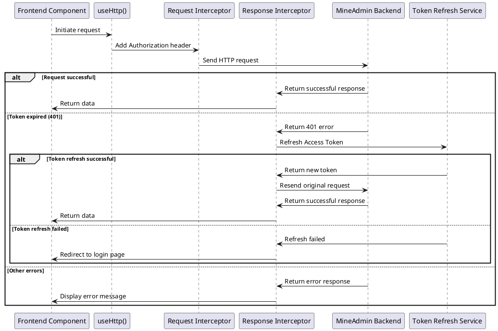
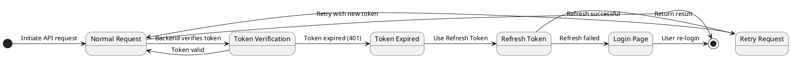

# Requests and Interceptors

MineAdmin uses [axios](https://github.com/axios/axios) as its request library, providing complete request interceptors and response handling mechanisms, supporting features like automatic token refresh, error handling, and loading state management.

## Overview

### Dual Request Architecture

The system provides two request handling methods to meet different usage scenarios:

1. **Internal Requests** - Specifically designed for MineAdmin backend API requests
   - Automatic JWT token authentication handling
   - Built-in error handling and user notifications
   - Supports automatic token refresh mechanism
   - Integrated loading state management

2. **External Requests** - For third-party APIs or other backend services
   - Supports custom baseURL and request configurations
   - Independently configurable interceptors and error handling
   - Flexible parameter passing methods

### Request Processing Flow



## Internal Requests (useHttp)

### Basic Usage

The `useHttp()` function can be used directly anywhere in the project without manual import:

```ts
// Get request instance
const http = useHttp()

// GET request - Get user list
const getUserList = async (params?: any) => {
  return await http.get('/admin/user/index', params)
}

// POST request - Create new user
const createUser = async (userData: any) => {
  return await http.post('/admin/user/save', userData)
}

// PUT request - Update user information
const updateUser = async (id: number, userData: any) => {
  return await http.put(`/admin/user/update/${id}`, userData)
}

// DELETE request - Delete user
const deleteUser = async (id: number) => {
  return await http.delete(`/admin/user/destroy/${id}`)
}
```

### Advanced Configuration

Supports passing additional axios configuration parameters:

```ts
const http = useHttp()

// Set request timeout
const result = await http.get('/admin/user/index', {}, {
  timeout: 10000, // 10-second timeout
  headers: {
    'X-Custom-Header': 'CustomValue'
  }
})

// File upload request
const uploadFile = async (file: File) => {
  const formData = new FormData()
  formData.append('file', file)
  
  return await http.post('/admin/upload/image', formData, {
    headers: {
      'Content-Type': 'multipart/form-data'
    },
    timeout: 60000 // Upload timeout set to 60 seconds
  })
}

// File download
const downloadFile = async (fileId: string) => {
  return await http.get(`/admin/file/download/${fileId}`, {}, {
    responseType: 'blob' // Binary data
  })
}
```

### Practical Usage Example

Complete usage example in a component:

```vue
<script setup lang="ts">
import { ref, onMounted } from 'vue'
import { ElMessage } from 'element-plus'

const http = useHttp()
const users = ref([])
const loading = ref(false)

// Get user list
const fetchUsers = async () => {
  try {
    loading.value = true
    const response = await http.get('/admin/user/index', {
      page: 1,
      size: 20
    })
    
    users.value = response.data.items
    ElMessage.success('User list loaded successfully')
  } catch (error) {
    ElMessage.error('Failed to load user list')
    console.error('Error getting user list:', error)
  } finally {
    loading.value = false
  }
}

// Delete user
const handleDeleteUser = async (userId: number) => {
  try {
    await http.delete(`/admin/user/destroy/${userId}`)
    ElMessage.success('User deleted successfully')
    fetchUsers() // Reload list
  } catch (error) {
    ElMessage.error('Failed to delete user')
  }
}

onMounted(() => {
  fetchUsers()
})
</script>
```

## Token Refresh Mechanism

### Automatic Refresh Principle

MineAdmin implements a seamless refresh mechanism based on dual tokens:

1. **Access Token** - Used for business API authentication, with short expiration time (default 1 hour)
2. **Refresh Token** - Used to refresh Access Token, with longer expiration time (default 2 hours)



### Concurrent Request Handling

When there are multiple concurrent requests, the system intelligently handles token refresh:

```ts
// Concurrent scenario example
const [users, roles, permissions] = await Promise.all([
  http.get('/admin/user/index'),
  http.get('/admin/role/index'), 
  http.get('/admin/permission/index')
])

// If token expires, only refresh once, other requests wait
// After refresh completes, all requests are resent with new token
```

For details on the refresh mechanism, refer to [Authentication Documentation](/backend/security/passport.md).

## External Requests

### Basic Usage

For third-party APIs or non-MineAdmin backend services:

```ts
import request from '@/utils/http'

const { createHttp } = request

// Create third-party API request instance
const thirdPartyHttp = createHttp('https://api.example.com', {
  headers: {
    'User-Agent': 'MineAdmin/1.0',
    'X-API-Key': 'your-api-key'
  },
  timeout: 15000
})

// Use third-party API
const getExternalData = async () => {
  try {
    const response = await thirdPartyHttp.get('/users')
    return response.data
  } catch (error) {
    console.error('Third-party API request failed:', error)
    throw error
  }
}
```

### Multiple External Services

Create multiple request instances for different external services:

```ts
// Map service API
const mapHttp = createHttp('https://api.map.com', {
  headers: { 'Authorization': 'Bearer map-token' }
})

// Payment service API  
const paymentHttp = createHttp('https://api.payment.com', {
  headers: { 'Authorization': 'Bearer payment-token' }
})

// SMS service API
const smsHttp = createHttp('https://api.sms.com', {
  headers: { 'X-API-Key': 'sms-api-key' }
})

// Usage example
const sendSms = async (phone: string, message: string) => {
  return await smsHttp.post('/send', { phone, message })
}
```

## Interceptor Details

### Response Interceptor Source Analysis

MineAdmin's response interceptor is located in `src/utils/http.ts`, mainly handling the following scenarios:

1. **Successful response handling**
2. **Automatic token refresh on expiration**  
3. **Error status code handling**
4. **File download response handling**

#### Core Interceptor Logic

```ts:line-numbers
http.interceptors.response.use(
  async (response: AxiosResponse): Promise<any> => {
    isLoading.value = false
    const userStore = useUserStore()
    await usePluginStore().callHooks('networkResponse', response)
    const config = response.config
    
    // Handle file download response
    if ((response.request.responseType === 'blob'
        || response.request.responseType === 'arraybuffer')
      && !/^application\/json/.test(response.headers['content-type'])
      && response.status === ResultCode.SUCCESS
    ) {
      return Promise.resolve(response.data)
    }

    // Handle successful response
    if (response?.data?.code === ResultCode.SUCCESS) {
      return Promise.resolve(response.data)
    }
    else {
      // Handle different error codes
      switch (response?.data?.code) {
        case ResultCode.UNAUTHORIZED: {
          // Token expiration handling logic
          const logout = useDebounceFn(
            async () => {
              Message.error('Login status expired, please login again', { zIndex: 9999 })
              await useUserStore().logout()
            },
            3000,
            { maxWait: 5000 },
          )
          
          // Check if token needs refreshing
          if (userStore.isLogin && !isRefreshToken.value) {
            isRefreshToken.value = true
            if (!cache.get('refresh_token')) {
              await logout()
              break
            }

            try {
              // Use Refresh Token to refresh Access Token
              const refreshTokenResponse = await createHttp(null, {
                headers: {
                  Authorization: `Bearer ${cache.get('refresh_token')}`,
                },
              }).post('/admin/passport/refresh')

              if (refreshTokenResponse.data.code !== 200) {
                await logout()
                break
              }
              else {
                // Update token and resend request
                const { data } = refreshTokenResponse.data
                userStore.token = data.access_token
                cache.set('token', data.access_token)
                cache.set('expire', useDayjs().unix() + data.expire_at, { exp: data.expire_at })
                cache.set('refresh_token', data.refresh_token)

                config.headers!.Authorization = `Bearer ${userStore.token}`
                requestList.value.map((cb: any) => cb())
                requestList.value = []
                return http(config) // Resend original request
              }
            }
            catch (e: any) {
              requestList.value.map((cb: any) => cb())
              await logout()
              break
            }
            finally {
              requestList.value = []
              isRefreshToken.value = false
            }
          }
          else {
            // If token is being refreshed, add request to queue
            return new Promise((resolve) => {
              requestList.value.push(() => {
                config.headers!.Authorization = `Bearer ${cache.get('token')}`
                resolve(http(config))
              })
            })
          }
        }
        case ResultCode.NOT_FOUND:
          Message.error('Server resource not found', { zIndex: 9999 })
          break
        case ResultCode.FORBIDDEN:
          Message.error('No permission to access this interface', { zIndex: 9999 })
          break
        case ResultCode.METHOD_NOT_ALLOWED:
          Message.error('Request method not allowed', { zIndex: 9999 })
          break
        case ResultCode.FAIL:
          Message.error('Internal server error', { zIndex: 9999 })
          break
        default:
          Message.error(response?.data?.message ?? 'Unknown error', { zIndex: 9999 })
          break
      }

      return Promise.reject(response.data ? response.data : null)
    }
  },
  // Network error handling
  async (error: any) => {
    isLoading.value = false
    const serverError = useDebounceFn(async () => {
      if (error && error.response && error.response.status === 500) {
        Message.error(error.message ?? 'Internal server error', { zIndex: 9999 })
      }
    }, 3000, { maxWait: 5000 })
    await serverError()
    return Promise.reject(error)
  },
)
```

### Status Code Handling Mechanism

The system uniformly handles different HTTP status codes and business error codes:

| Status Code | Description | Handling Method |
|-------------|-------------|-----------------|
| `200` (SUCCESS) | Request successful | Return data directly |
| `401` (UNAUTHORIZED) | Token expired or invalid | Auto refresh token or redirect to login |
| `403` (FORBIDDEN) | Insufficient permissions | Show permission error message |
| `404` (NOT_FOUND) | Resource not found | Show resource not found message |
| `405` (METHOD_NOT_ALLOWED) | Method not allowed | Show method error message |
| `500` (INTERNAL_ERROR) | Internal server error | Show server error message |

### Custom Interceptors

To add custom interceptors for external requests:

```ts
import request from '@/utils/http'

const { createHttp } = request

// Create request instance with custom interceptors
const customHttp = createHttp('https://api.custom.com')

// Add request interceptor
customHttp.interceptors.request.use(
  (config) => {
    // Pre-process requests
    config.headers['X-Timestamp'] = Date.now()
    console.log('Sending request:', config)
    return config
  },
  (error) => {
    console.error('Request error:', error)
    return Promise.reject(error)
  }
)

// Add response interceptor
customHttp.interceptors.response.use(
  (response) => {
    // Process response data
    console.log('Received response:', response)
    if (response.data.status === 'error') {
      throw new Error(response.data.message)
    }
    return response
  },
  (error) => {
    // Handle response errors
    console.error('Response error:', error)
    return Promise.reject(error)
  }
)
```

## Best Practices

### 1. Error Handling

Recommended to handle errors uniformly in components:

```ts
// composables/useApi.ts
export const useApi = () => {
  const http = useHttp()
  
  const handleError = (error: any, defaultMessage = 'Operation failed') => {
    const message = error?.message || error?.data?.message || defaultMessage
    ElMessage.error(message)
    console.error('API error:', error)
  }
  
  const safeRequest = async <T>(requestFn: () => Promise<T>, errorMessage?: string): Promise<T | null> => {
    try {
      return await requestFn()
    } catch (error) {
      handleError(error, errorMessage)
      return null
    }
  }
  
  return { http, handleError, safeRequest }
}
```

### 2. Type Definitions

Define clear types for API responses:

```ts
// types/api.ts
export interface ApiResponse<T = any> {
  code: number
  message: string
  data: T
}

export interface PaginatedResponse<T> {
  items: T[]
  total: number
  page: number
  size: number
}

export interface User {
  id: number
  username: string
  email: string
  status: number
}

// Usage example
const getUserList = async (): Promise<ApiResponse<PaginatedResponse<User>>> => {
  return await http.get('/admin/user/index')
}
```

### 3. Request Encapsulation

Encapsulate common API requests into reusable services:

```ts
// services/userService.ts
export class UserService {
  private http = useHttp()
  
  async getList(params: any) {
    return await this.http.get('/admin/user/index', params)
  }
  
  async create(user: Partial<User>) {
    return await this.http.post('/admin/user/save', user)
  }
  
  async update(id: number, user: Partial<User>) {
    return await this.http.put(`/admin/user/update/${id}`, user)
  }
  
  async delete(id: number) {
    return await this.http.delete(`/admin/user/destroy/${id}`)
  }
  
  async batchDelete(ids: number[]) {
    return await this.http.post('/admin/user/destroy', { ids })
  }
}

// Create service instance
export const userService = new UserService()
```

### 4. Loading State Management

Properly use loading states to enhance user experience:

```vue
<script setup lang="ts">
import { ref } from 'vue'

const loading = ref(false)
const data = ref([])

const fetchData = async () => {
  loading.value = true
  try {
    const response = await http.get('/admin/data')
    data.value = response.data
  } catch (error) {
    console.error('Data loading failed:', error)
  } finally {
    loading.value = false
  }
}
</script>

<template>
  <div v-loading="loading">
    <!-- Data display content -->
  </div>
</template>
```

## FAQ

### Q: How to handle concurrent requests during token refresh?

A: The system queues all token-required requests, waits for token refresh to complete, then resends all requests with the new token.

### Q: How to handle file upload progress?

A: Use axios's `onUploadProgress` configuration:

```ts
const uploadWithProgress = async (file: File, onProgress?: (progress: number) => void) => {
  const formData = new FormData()
  formData.append('file', file)
  
  return await http.post('/admin/upload', formData, {
    onUploadProgress: (progressEvent) => {
      if (progressEvent.total && onProgress) {
        const progress = Math.round((progressEvent.loaded / progressEvent.total) * 100)
        onProgress(progress)
      }
    }
  })
}
```

### Q: How to cancel ongoing requests?

A: Use axios's cancellation token:

```ts
import { ref, onUnmounted } from 'vue'

const controller = ref<AbortController>()

const fetchData = async () => {
  // Cancel previous request
  controller.value?.abort()
  
  // Create new controller
  controller.value = new AbortController()
  
  try {
    const response = await http.get('/admin/data', {}, {
      signal: controller.value.signal
    })
    return response
  } catch (error) {
    if (error