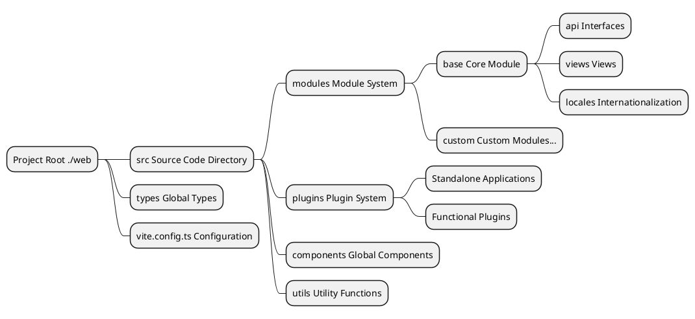
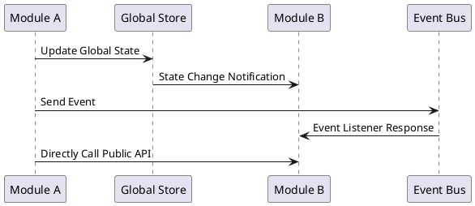
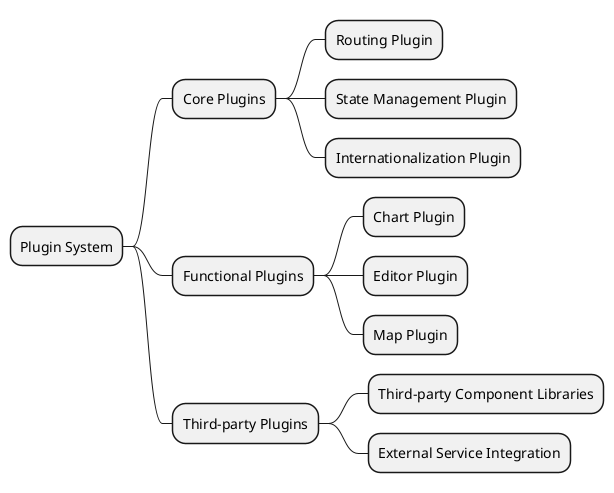
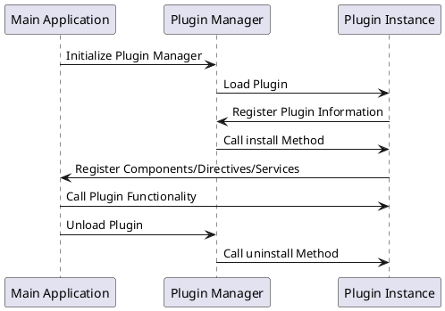
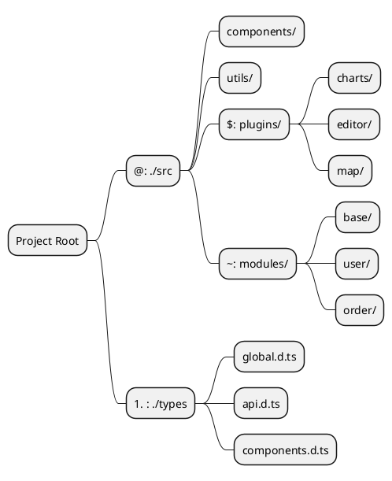
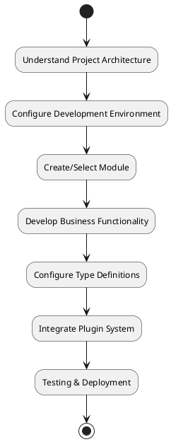

# Basic Concepts

The entire project has been refactored. We will now introduce some fundamental concepts to help you better understand the documentation. Please make sure to read this section carefully first.

::: tip
All explanations below pertain to the structure within `./web` under the project's root directory.
:::

## Overall Project Architecture

This project adopts a modern frontend development architecture, built with Vue 3 + TypeScript + Vite, implementing a modular and plugin-based development model.



## Global Type System

Since the new version is written in `TypeScript`, global type definitions are stored in the `./types` directory, where you can find relevant data type structures.

### Type File Organization

```
./types/
├── api.d.ts          # API-related type definitions
├── components.d.ts   # Component type definitions
├── global.d.ts       # Global type definitions
├── modules.d.ts      # Module type definitions
└── utils.d.ts        # Utility function type definitions
```

### Usage Example

Types can be quickly imported in the project using the `#` alias:

```typescript
// Import API types
import type { ApiResponse, UserInfo } from '#/api'

// Import global types
import type { MenuConfig, RouteConfig } from '#/global'

// Usage in components
interface ComponentProps {
  userInfo: UserInfo
  menuConfig: MenuConfig[]
}
```

### Type Definition Best Practices

- **Naming Convention**: Use PascalCase for interfaces and types
- **File Organization**: Organize type files by functional modules
- **Type Export**: Use `export type` for type definitions
- **Generic Support**: Use generics appropriately to improve type reusability

## Modular Architecture

The new version adopts a modular structure, with the directory located at `./src/modules`. Each module manages its own business `api`, `types`, `locales`, and `view files`, achieving complete isolation and independent management of business logic.

### Module Structure Design


### Standard Module Directory Structure

```
./src/modules/[Module Name]/
├── api/                 # API Interface Definitions
│   ├── user.ts         # User-related Interfaces
│   ├── menu.ts         # Menu-related Interfaces
│   └── index.ts        # Unified Interface Export
├── components/          # Module-specific Components
│   ├── UserForm.vue    # User Form Component
│   └── MenuTree.vue    # Menu Tree Component
├── locales/            # Module Internationalization Files
│   ├── zh_CN.yaml      # Chinese Language Pack
│   ├── en.yaml         # English Language Pack
│   └── index.ts        # Language Pack Export
├── views/              # View Pages
│   ├── user/           # User Management Pages
│   │   ├── index.vue   # User List Page
│   │   └── detail.vue  # User Detail Page
│   └── dashboard/      # Dashboard Pages
│       └── index.vue
└── index.ts           # Unified Module Export
```

### Module Development Process

1. **Create Module Directory**: Create a new module folder under `./src/modules/`
2. **Define Module Structure**: Create corresponding directories and files according to the standard structure
3. **Configure Routes**: Define route configurations within the module
4. **Develop Business Logic**: Write APIs, components, and views
5. **Add Internationalization**: Configure multilingual support
6. **Module Export**: Unified export of module content via index.ts

### Inter-Module Communication



### Module Usage Example

```typescript
// Using base module APIs in another module
import { userApi, menuApi } from '~/base/api'
import type { UserInfo } from '~/base/types'

// Using module functionality in components
export default defineComponent({
  async setup() {
    // Call user API
    const userList = await userApi.getUsers()
    
    // Call menu API
    const menuTree = await menuApi.getMenuTree()
    
    return {
      userList,
      menuTree
    }
  }
})
```

## Plugin System

The new frontend version introduces a `./src/plugins` directory specifically for standalone applications or plugins. The plugin system supports hot-plugging of functionalities, enhancing system extensibility and flexibility.

### Plugin Architecture Design



### Plugin Directory Structure

```
./src/plugins/
├── charts/              # Chart Plugin
│   ├── components/      # Plugin Components
│   ├── utils/          # Utility Functions
│   ├── types/          # Type Definitions
│   └── index.ts        # Plugin Entry
├── editor/             # Editor Plugin
│   ├── components/
│   ├── config/
│   └── index.ts
├── map/                # Map Plugin
└── shared/             # Shared Resources Among Plugins
    ├── utils/          # Shared Utilities
    ├── components/     # Shared Components
    └── types/          # Shared Types
```

### Plugin Lifecycle



### Plugin Development Standards

#### 1. Basic Plugin Structure

```typescript
// ./src/plugins/example/index.ts
import type { App } from 'vue'
import type { PluginOptions } from './types'

export interface ExamplePlugin {
  install(app: App, options?: PluginOptions): void
  uninstall?(app: App): void
}

export const examplePlugin: ExamplePlugin = {
  install(app: App, options?: PluginOptions) {
    // Register global components
    app.component('ExampleComponent', ExampleComponent)
    
    // Register global directives
    app.directive('example', exampleDirective)
    
    // Provide global methods
    app.config.globalProperties.$example = exampleMethod
    
    // Register plugin configuration
    app.provide('exampleConfig', options)
  },
  
  uninstall(app: App) {
    // Clean up resources
    delete app.config.globalProperties.$example
  }
}

export default examplePlugin
```

#### 2. Plugin Configuration File

```typescript
// ./src/plugins/example/config.ts
export interface PluginConfig {
  name: string
  version: string
  description: string
  dependencies?: string[]
  permissions?: string[]
}

export const pluginConfig: PluginConfig = {
  name: 'example-plugin',
  version: '1.0.0',
  description: 'Example Plugin',
  dependencies: ['vue', 'vue-router'],
  permissions: ['read:user', 'write:user']
}
```

### Plugin Usage Examples

#### 1. Registering a Plugin

```typescript
// main.ts
import { createApp } from 'vue'
import App from './App.vue'
import examplePlugin from '$/example'

const app = createApp(App)

// Register plugin
app.use(examplePlugin, {
  // Plugin configuration options
  theme: 'dark',
  locale: 'zh-CN'
})

app.mount('#app')
```

#### 2. Using Plugins in Components

```vue
<template>
  <div>
    <!-- Using globally registered plugin components -->
    <ExampleComponent :data="exampleData" />
    
    <!-- Using plugin directives -->
    <div v-example="directiveOptions">
      Plugin Directive Example
    </div>
  </div>
</template>

<script setup lang="ts">
import { getCurrentInstance } from 'vue'

const instance = getCurrentInstance()

// Using globally provided plugin methods
const result = instance?.proxy?.$example('param')

// Or getting plugin configuration via inject
const exampleConfig = inject('exampleConfig')
</script>
```

### Plugin Management Best Practices

- **Naming Convention**: Use kebab-case for plugin directory names
- **Version Management**: Clearly specify version information in plugin configurations
- **Dependency Declaration**: Clearly declare plugin dependencies
- **Resource Cleanup**: Implement uninstall methods for resource cleanup
- **Type Support**: Provide complete TypeScript type definitions for plugins
- **Documentation**: Include usage documentation and examples for each plugin

## Alias System

The `vite.config.ts` file defines a path alias system to simplify file import paths, improving development efficiency and code maintainability.

### Alias Configuration

```typescript
// vite.config.ts
export default defineConfig({
  resolve: {
    alias: {
      '@': path.resolve(__dirname, 'src'),
      '#': path.resolve(__dirname, 'types'),
      '$': path.resolve(__dirname, 'src/plugins'),
      '~': path.resolve(__dirname, 'src/modules'),
    },
  },
})
```

### Alias Mapping Table

| Alias | Directory Path | Description | Usage Scenarios |
|------|----------|----------|----------|
| `@` | `./src` | Source root directory | Importing components, utility functions, styles, etc. |
| `#` | `./types` | Global type definitions | Importing TypeScript type definitions |
| `$` | `./src/plugins` | Plugin directory | Importing files and components from plugins |
| `~` | `./src/modules` | Module directory | Importing APIs, components, views from modules |

### Alias Usage Examples

#### 1. Base Path Alias (@)

```typescript
// ❌ Using relative paths (not recommended)
import Utils from '../../../utils/common'
import Button from '../../../components/Button.vue'

// ✅ Using aliases (recommended)
import Utils from '@/utils/common'
import Button from '@/components/Button.vue'
```

#### 2. Type Definition Alias (#)

```typescript
// Import global types
import type { 
  ApiResponse, 
  UserInfo, 
  MenuConfig 
} from '#/global'

// Import API types
import type { LoginParams } from '#/api'

// Usage in interfaces
interface ComponentProps {
  userInfo: UserInfo
  menuList: MenuConfig[]
}
```

#### 3. Plugin Alias ($)

```typescript
// Import chart plugin
import ChartPlugin from '$/charts'
import { useChart } from '$/charts/hooks'

// Import editor plugin
import EditorPlugin from '$/editor'
import EditorComponent from '$/editor/components/RichEditor.vue'
```

#### 4. Module Alias (~)

```typescript
// Import base module APIs
import { userApi, menuApi } from '~/base/api'

// Import user module components
import UserForm from '~/user/components/UserForm.vue'
import UserList from '~/user/views/UserList.vue'

// Import module types
import type { UserModuleState } from '~/user/types'
```

### Alias System Architecture Diagram



### Alias Configuration Best Practices

#### 1. IDE Support Configuration

For better IDE intelligent prompts and path navigation, configure `tsconfig.json`:

```json
{
  "compilerOptions": {
    "baseUrl": ".",
    "paths": {
      "@/*": ["src/*"],
      "#/*": ["types/*"],
      "$/*": ["src/plugins/*"],
      "~/*": ["src/modules/*"]
    }
  }
}
```

#### 2. Usage Standards

- **Consistency**: Team-wide unified use of aliases, avoiding mixed use of relative paths
- **Readability**: Aliases should be semantically clear and easy to understand
- **Hierarchy Control**: Avoid overly deep path hierarchies, use aliases appropriately to simplify paths
- **Type Safety**: Ensure type safety in path references with TypeScript

#### 3. Common Usage Patterns

```typescript
// Comprehensive usage example in components
<script setup lang="ts">
// Global types
import type { UserInfo, ApiResponse } from '#/global'

// Global utilities
import { formatDate, validateForm } from '@/utils/common'

// Module APIs
import { userApi } from '~/base/api'

// Plugin functionality
import { useChart } from '$/charts/hooks'

// Global components
import MaButton from '@/components/MaButton.vue'

// Module components
import UserForm from '~/user/components/UserForm.vue'
</script>
```

### Alias System Advantages

1. **Simplified Paths**: Avoid complex relative path references
2. **Improved Maintainability**: No need to modify numerous reference paths when moving files
3. **Enhanced Readability**: Quickly identify file ownership through aliases
4. **Unified Standards**: Maintain consistent reference styles in team development
5. **IDE Friendly**: Better development experience with TypeScript and IDE support

## Summary

Through the introduction of these basic concepts, we've understood the core architectural design of the project:

### Architectural Features

- **Modular Design**: Business functionalities divided by modules for high cohesion and low coupling
- **Plugin Architecture**: Supports hot-plugging and extension of functionalities
- **Type Safety**: Complete type support based on TypeScript
- **Path Optimization**: Simplified file references through the alias system

### Development Process



### Next Steps

After mastering these basic concepts, it's recommended to proceed with in-depth learning in the following order:

1. **[Getting Started](/en/front/base/start)** - Environment setup and project launch
2. **[Configuration Guide](/en/front/base/configure)** - Detailed configuration options
3. **[Routing & Menus](/en/front/base/route-menu)** - Route and menu configuration
4. **[Module Development](/en/front/advanced/module)** - In-depth modular development
5. **[Plugin Development](/en/front/high/plugins)** - Detailed plugin system explanation

Through systematic learning and practice, you'll be able to efficiently conduct frontend development work based on this architecture.