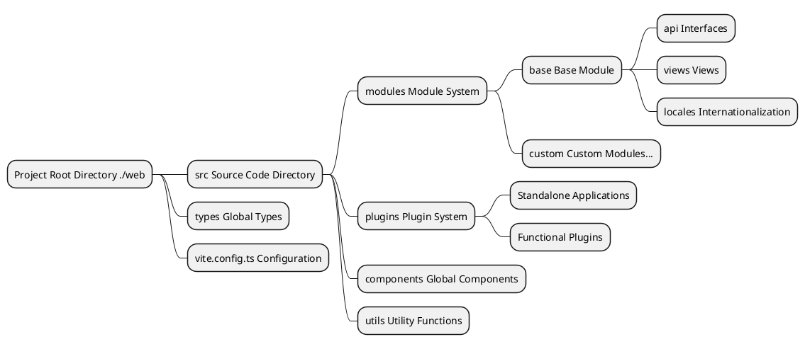
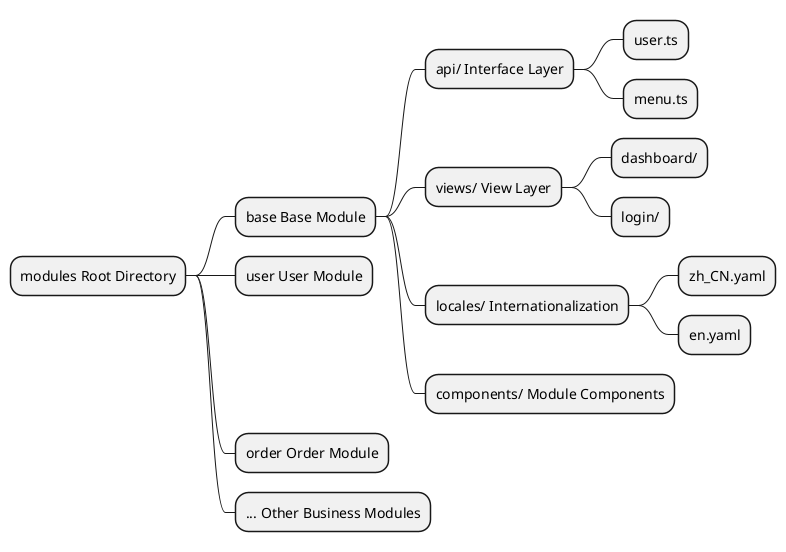
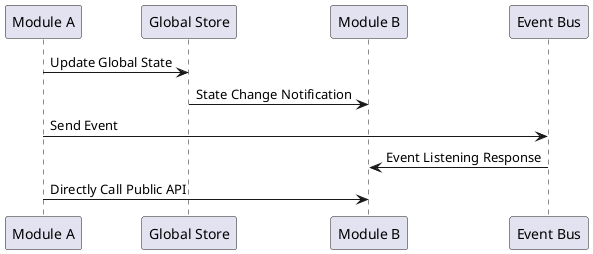
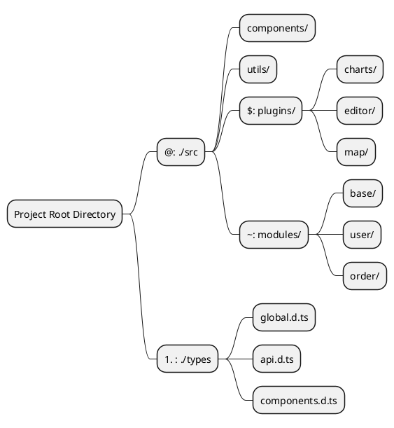
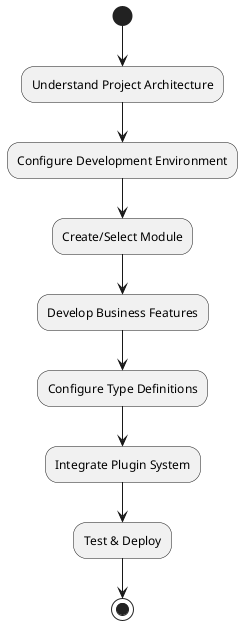

# Basic Concepts

The entire project has been refactored. We will now introduce some fundamental concepts to help you better understand the documentation. Please make sure to read this section carefully first.

::: tip
Everything discussed below pertains to the structure within `./web` under the project's root directory.
:::

## Overall Project Architecture

This project adopts a modern front-end development architecture, built on Vue 3 + TypeScript + Vite, implementing a modular and plugin-based development model.



## Global Type System

Since the new version is written in `TypeScript`, all global type definitions are stored in the `./types` directory, where you can find relevant data type structures.

### Type File Organization Structure

```
./types/
├── api.d.ts          # API-related type definitions
├── components.d.ts   # Component type definitions
├── global.d.ts       # Global type definitions
├── modules.d.ts      # Module type definitions
└── utils.d.ts        # Utility function type definitions
```

### Usage Example

In the project, types can be quickly imported using the alias `#`:

```typescript
// Import API types
import type { ApiResponse, UserInfo } from '#/api'

// Import global types
import type { MenuConfig, RouteConfig } from '#/global'

// Usage in components
interface ComponentProps {
  userInfo: UserInfo
  menuConfig: MenuConfig[]
}
```

### Type Definition Best Practices

- **Naming Convention**: Use PascalCase for interface and type names
- **File Organization**: Organize type files by functional modules
- **Type Export**: Use `export type` to export type definitions
- **Generic Support**: Use generics appropriately to improve type reusability

## Modular Architecture

The new version adopts a modular structure, with the directory located at `./src/modules`. Each module manages its own business `api`, `types`, `locales`, and `view files`, achieving complete isolation and independent management of business logic.

### Module Structure Design



### Standard Module Directory Structure

```
./src/modules/[Module Name]/
├── api/                 # API Interface Definitions
│   ├── user.ts         # User-related Interfaces
│   ├── menu.ts         # Menu-related Interfaces
│   └── index.ts        # Unified Interface Exports
├── components/          # Module-specific Components
│   ├── UserForm.vue    # User Form Component
│   └── MenuTree.vue    # Menu Tree Component
├── locales/            # Module Internationalization Files
│   ├── zh_CN.yaml      # Chinese Language Pack
│   ├── en.yaml         # English Language Pack
│   └── index.ts        # Language Pack Exports
├── views/              # View Pages
│   ├── user/           # User Management Pages
│   │   ├── index.vue   # User List Page
│   │   └── detail.vue  # User Detail Page
│   └── dashboard/      # Dashboard Pages
│       └── index.vue
└── index.ts           # Unified Module Exports
```

### Module Development Process

1. **Create Module Directory**: Create a new module folder under `./src/modules/`
2. **Define Module Structure**: Create corresponding directories and files according to the standard structure
3. **Configure Routes**: Define route configurations within the module
4. **Develop Business Logic**: Write APIs, components, and views
5. **Add Internationalization**: Configure multi-language support
6. **Module Export**: Export module contents uniformly via index.ts

### Inter-Module Communication



### Module Usage Example

```typescript
// Using base module APIs in other modules
import { userApi, menuApi } from '~/base/api'
import type { UserInfo } from '~/base/types'

// Using module functionality in components
export default defineComponent({
  async setup() {
    // Call user API
    const userList = await userApi.getUsers()
    
    // Call menu API
    const menuTree = await menuApi.getMenuTree()
    
    return {
      userList,
      menuTree
    }
  }
})
```

## Alias System

Path aliases are defined in the `vite.config.ts` file to simplify file import paths, improving development efficiency and code maintainability.

### Alias Configuration

```typescript
// vite.config.ts
export default defineConfig({
  resolve: {
    alias: {
      '@': path.resolve(__dirname, 'src'),
      '#': path.resolve(__dirname, 'types'),
      '$': path.resolve(__dirname, 'src/plugins'),
      '~': path.resolve(__dirname, 'src/modules'),
    },
  },
})
```

### Alias Mapping Table

| Alias | Directory Path | Description | Usage Scenarios |
|------|----------|----------|----------|
| `@` | `./src` | Source Root Directory | Importing components, utility functions, styles, etc. |
| `#` | `./types` | Global Type Definitions | Importing TypeScript type definitions |
| `$` | `./src/plugins` | Plugin Directory | Importing files and components within plugins |
| `~` | `./src/modules` | Module Directory | Importing module APIs, components, views |

### Alias Usage Examples

#### 1. Base Path Alias (@)

```typescript
// ❌ Using relative paths (not recommended)
import Utils from '../../../utils/common'
import Button from '../../../components/Button.vue'

// ✅ Using aliases (recommended)
import Utils from '@/utils/common'
import Button from '@/components/Button.vue'
```

#### 2. Type Definition Alias (#)

```typescript
// Import global types
import type { 
  ApiResponse, 
  UserInfo, 
  MenuConfig 
} from '#/global'

// Import API types
import type { LoginParams } from '#/api'

// Usage in interfaces
interface ComponentProps {
  userInfo: UserInfo
  menuList: MenuConfig[]
}
```

#### 3. Plugin Alias ($)

```typescript
// Import chart plugin
import ChartPlugin from '$/charts'
import { useChart } from '$/charts/hooks'

// Import editor plugin
import EditorPlugin from '$/editor'
import EditorComponent from '$/editor/components/RichEditor.vue'
```

#### 4. Module Alias (~)

```typescript
// Import base module APIs
import { userApi, menuApi } from '~/base/api'

// Import user module components
import UserForm from '~/user/components/UserForm.vue'
import UserList from '~/user/views/UserList.vue'

// Import module types
import type { UserModuleState } from '~/user/types'
```

### Alias System Architecture Diagram



### Alias Configuration Best Practices

#### 1. IDE Support Configuration

To enable better IDE intellisense and path navigation, configure `tsconfig.json`:

```json
{
  "compilerOptions": {
    "baseUrl": ".",
    "paths": {
      "@/*": ["src/*"],
      "#/*": ["types/*"],
      "$/*": ["src/plugins/*"],
      "~/*": ["src/modules/*"]
    }
  }
}
```

#### 2. Usage Standards

- **Consistency**: Use aliases uniformly within the team, avoid mixing with relative paths
- **Readability**: Aliases should be semantically clear and easy to understand
- **Hierarchy Control**: Avoid deep path hierarchies, use aliases appropriately to simplify paths
- **Type Safety**: Ensure type safety in path references with TypeScript

#### 3. Common Usage Patterns

```typescript
// Comprehensive usage example in components
<script setup lang="ts">
// Global types
import type { UserInfo, ApiResponse } from '#/global'

// Global utilities
import { formatDate, validateForm } from '@/utils/common'

// Module APIs
import { userApi } from '~/base/api'

// Plugin functionality
import { useChart } from '$/charts/hooks'

// Global components
import MaButton from '@/components/MaButton.vue'

// Module components
import UserForm from '~/user/components/UserForm.vue'
</script>
```

### Alias System Advantages

1. **Simplified Paths**: Avoid complex relative path references
2. **Improved Maintainability**: No need to modify numerous import paths when moving files
3. **Enhanced Readability**: Quickly identify file ownership through aliases
4. **Unified Standards**: Maintain consistent reference styles in team development
5. **IDE Friendly**: Better development experience with TypeScript and IDE support

## Summary

Through the introduction of these basic concepts, we have understood the core architectural design of the project:

### Architectural Features

- **Modular Design**: Business functions are divided by modules, achieving high cohesion and low coupling
- **Plugin Architecture**: Supports hot-plugging and extension of features
- **Type Safety**: Provides complete type support based on TypeScript
- **Path Optimization**: Simplifies file references through the alias system

### Development Process



### Next Steps

After mastering these basic concepts, it is recommended to study in the following order:

1. **[Getting Started](/front/base/start)** - Environment setup and project launch
2. **[Configuration Guide](/front/base/configure)** - Detailed configuration options
3. **[Routing & Menu](/front/base/route-menu)** - Route and menu configuration
4. **[Module Development](/front/advanced/module)** - In-depth modular development
5. **[Plugin Development](/front/high/plugins)** - Detailed plugin system explanation

Through systematic learning and practice, you will be able to efficiently develop front-end applications based on this architecture.