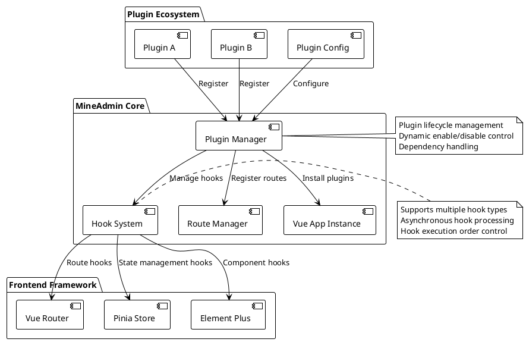
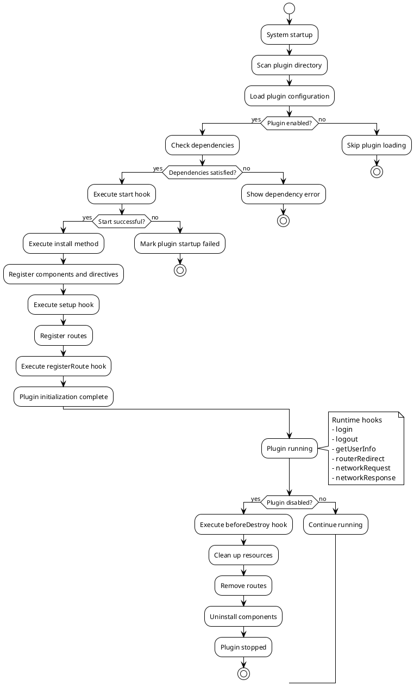

# Plugin System

::: tip Plugin System Overview
The `3.0` frontend provides core-level support for the plugin system. Compared to `2.0` which wasn't designed with plugin functionality in mind, where modifying system interfaces or behaviors required source code changes—leading to upgrade difficulties and increasing divergence from official code—the later addition of an app store feature allowed forced plugin support. However, plugins still had to modify source code, and initialization points couldn't be extended by plugins, requiring modifications to `main.js`.

**Now all these issues are resolved. The frontend plugin system provides robust support, allowing seamless integration of interface replacements, feature additions, third-party components, or custom components into the system. It also offers various `hooks` that can even influence and alter frontend operations.**
:::

## Plugin System Architecture Overview

The plugin system is designed based on modern frontend architecture, providing complete lifecycle management and extension capabilities:



### Core Features

- **Zero-intrusion design**: Plugin development requires no core code modifications
- **Dynamic loading**: Supports dynamic enabling and disabling of plugins
- **Lifecycle management**: Complete plugin lifecycle hooks
- **Type safety**: Full TypeScript type definitions
- **Performance optimization**: Supports lazy loading and on-demand loading
- **Error isolation**: Plugin errors don't affect main application operation

## Plugin Data Type Introduction

::: info Type Definition File
Type definitions are located in `types/global.d.ts`
:::

:::details Click to view complete type definitions
```ts
declare namespace Plugin {
  /**
   * Basic plugin information
   */
  interface Info {
    /** Plugin name in format: author-namespace/plugin-name */
    name: string
    /** Plugin version following semantic versioning */
    version: string
    /** Plugin author */
    author: string
    /** Plugin description */
    description: string
    /** Plugin startup order - higher values start earlier, default 0 */
    order?: number
    /** Plugin dependency list */
    dependencies?: string[]
    /** Plugin keywords for search */
    keywords?: string[]
    /** Plugin homepage URL */
    homepage?: string
    /** Plugin license */
    license?: string
    /** Minimum system version requirement */
    minSystemVersion?: string
  }

  /**
   * Plugin configuration
   */
  interface Config {
    /** Basic plugin information */
    info: Info
    /** Whether plugin is enabled */
    enable: boolean
    /** Plugin development mode for debugging */
    devMode?: boolean
    /** Plugin custom settings */
    settings?: Record<string, any>
  }

  /**
   * Plugin view route definitions
   */
  interface Views extends Route.RouteRecordRaw {
    /** Route meta information extensions */
    meta?: {
      /** Page title */
      title?: string
      /** Internationalization key */
      i18n?: string
      /** Page icon */
      icon?: string
      /** Whether authentication is required */
      requireAuth?: boolean
      /** Required permissions list */
      permissions?: string[]
      /** Whether to cache page */
      keepAlive?: boolean
      /** Whether page is hidden */
      hidden?: boolean
      /** Menu order */
      order?: number
    }
  }

  /**
   * Hook function type definitions
   */
  interface HookHandlers {
    /** Plugin startup hook - can be used for initialization validation */
    start?: (config: Config) => Promise<boolean | void> | boolean | void
    /** System initialization complete hook - can access Vue context */
    setup?: () => Promise<void> | void
    /** Route registration hook - can modify route configuration */
    registerRoute?: (router: Router, routesRaw: Route.RouteRecordRaw[] | Views[] | MineRoute.routeRecord[]) => Promise<void> | void
    /** User login hook */
    login?: (formInfo: LoginFormData) => Promise<void> | void
    /** User logout hook */
    logout?: () => Promise<void> | void
    /** Get user info hook */
    getUserInfo?: (userInfo: UserInfo) => Promise<void> | void
    /** Route redirect hook (external links invalid) */
    routerRedirect?: (context: { from: RouteLocationNormalized, to: RouteLocationNormalized }, router: Router) => Promise<void> | void
    /** Network request interception hook */
    networkRequest?: <T = any>(request: AxiosRequestConfig) => Promise<AxiosRequestConfig> | AxiosRequestConfig
    /** Network response interception hook */
    networkResponse?: <T = any>(response: AxiosResponse<T>) => Promise<AxiosResponse<T>> | AxiosResponse<T>
    /** Error handling hook */
    error?: (error: Error, context?: string) => Promise<void> | void
    /** Page load complete hook */
    mounted?: () => Promise<void> | void
    /** Page destroy hook */
    beforeDestroy?: () => Promise<void> | void
  }

  /**
   * Main plugin configuration interface
   */
  interface PluginConfig {
    /** Plugin install function - registers components, directives etc. */
    install: (app: App<Element>) => Promise<void> | void
    /** Plugin configuration information */
    config: Config
    /** Plugin route definitions */
    views?: Views[]
    /** Plugin hook functions */
    hooks?: HookHandlers
    /** Plugin custom properties */
    [key: string]: any
  }

  /**
   * Plugin storage state
   */
  interface PluginStore {
    /** List of installed plugins */
    plugins: Map<string, PluginConfig>
    /** Plugin enabled status */
    enabledPlugins: Set<string>
    /** Plugin loading status */
    loadingPlugins: Set<string>
    /** Plugin error information */
    pluginErrors: Map<string, Error>
  }

  /**
   * Plugin manager interface
   */
  interface PluginManager {
    /** Register plugin */
    register(name: string, plugin: PluginConfig): Promise<boolean>
    /** Uninstall plugin */
    unregister(name: string): Promise<boolean>
    /** Enable plugin */
    enable(name: string): Promise<boolean>
    /** Disable plugin */
    disable(name: string): Promise<boolean>
    /** Get plugin information */
    getPlugin(name: string): PluginConfig | null
    /** Get all plugins */
    getAllPlugins(): Map<string, PluginConfig>
    /** Check plugin dependencies */
    checkDependencies(name: string): Promise<boolean>
  }
}

/**
 * Login form data type
 */
interface LoginFormData {
  username: string
  password: string
  captcha?: string
  remember?: boolean
}

/**
 * User information type
 */
interface UserInfo {
  id: number
  username: string
  nickname: string
  email: string
  avatar: string
  roles: string[]
  permissions: string[]
  [key: string]: any
}
```
:::

## Creating Plugins

### Directory Structure and Naming Conventions

All plugins are placed in the `src/plugins` directory, with the alias `$` pointing to this directory. The plugin structure mirrors the backend, consisting of `developer-namespace/plugin-name` as the plugin directory. The left side of the slash is the **author namespace** which can be set on the [MineAdmin official website](https://www.mineadmin.com), while the right side is the **plugin name**, which must be unique within that author namespace.

#### Standard Plugin Directory Structure

```bash
src/plugins/
├── mine-admin/          # Official plugin namespace
│   ├── app-store/       # App Store plugin
│   ├── basic-ui/        # Basic UI library plugin
│   └── demo/            # Official demo plugin
├── author-name/         # Third-party developer namespace
│   └── plugin-name/     # Specific plugin directory
│       ├── index.ts     # Plugin entry file (required)
│       ├── config.ts    # Plugin config file (optional)
│       ├── package.json # Plugin package info (recommended)
│       ├── README.md    # Plugin documentation (recommended)
│       ├── views/       # Page components directory
│       │   ├── index.vue
│       │   └── components/
│       ├── components/  # Reusable components
│       ├── composables/ # Composable functions
│       ├── utils/       # Utility functions
│       ├── assets/      # Static assets
│       ├── locales/     # Internationalization files
│       │   ├── zh.json
│       │   ├── en.json
│       │   └── ja.json
│       ├── types/       # TypeScript type definitions
│       └── tests/       # Test files
```

#### Naming Convention Suggestions

- **Plugin name**: Use lowercase letters and hyphens, e.g., `file-manager`, `data-export`
- **Author namespace**: Use lowercase letters and hyphens, avoid special characters
- **File naming**: Follow kebab-case convention
- **Component names**: Use PascalCase, e.g., `FileUploader.vue`

::: tip Best Practices
- Locally developed plugins can also be recognized by the system but cannot be uploaded to the MineAdmin app market
- Adding a `package.json` is recommended for dependency and version management
- Using TypeScript provides better type hints and error checking
- Follow Vue 3 Composition API best practices
:::

::: warning Important Notes
- Plugin names must be unique within the same author namespace
- Avoid using system reserved words as plugin names
- Avoid renaming plugin directories after creation
:::

### Plugin Lifecycle



## Plugin Development Guide

### Basic Plugin Example

Let's understand the complete plugin development process through a comprehensive file management plugin:

#### 1. Create Plugin Entry File `index.ts`

```ts
// src/plugins/zhang-san/file-manager/index.ts
import type { App } from 'vue'
import type { Router, RouteRecordRaw } from 'vue-router'
import type { Plugin } from '#/global'
import { ElMessage, ElNotification } from 'element-plus'

// Import plugin components
import FileManagerComponent from './components/FileManager.vue'
import FileUploader from './components/FileUploader.vue'

// Import utility functions
import { formatFileSize, validateFileType } from './utils/fileUtils'

// Plugin configuration
const pluginConfig: Plugin.PluginConfig = {
  // Plugin install method - register global components, directives, etc.
  async install(app: App) {
    try {
      // Register global components
      app.component('FileManager', FileManagerComponent)
      app.component('FileUploader', FileUploader)
      
      // Register global directive
      app.directive('file-drop', {
        mounted(el, binding) {
          el.addEventListener('dragover', (e: DragEvent) => {
            e.preventDefault()
            e.stopPropagation()
          })
          
          el.addEventListener('drop', async (e: DragEvent) => {
            e.preventDefault()
            e.stopPropagation()
            const files = Array.from(e.dataTransfer?.files || [])
            await binding.value(files)
          })
        }
      })
      
      // Add global properties
      app.config.globalProperties.$fileUtils = {
        formatSize: formatFileSize,
        validateType: validateFileType
      }
      
      console.log('File manager plugin installed successfully')
    } catch (error) {
      console.error('File manager plugin installation failed:', error)
      throw error
    }
  },

  // Basic plugin configuration
  config: {
    enable: import.meta.env.NODE_ENV !== 'production', // Disabled in production
    devMode: import.meta.env.DEV,
    info: {
      name: 'zhang-san/file-manager',
      version: '2.1.0',
      author: 'Zhang San',
      description: 'Enterprise file management plugin with upload, download, preview, permission control features',
      keywords: ['File management', 'File upload', 'Permission control'],
      homepage: 'https://github.com/zhang-san/file-manager',
      license: 'MIT',
      minSystemVersion: '3.0.0',
      dependencies: ['mine-admin/basic-ui'],
      order: 10 // Higher priority
    },
    settings: {
      maxFileSize: 50 * 1024 * 1024, // 50MB
      allowedTypes: ['image/*', 'application/pdf', '.docx', '.xlsx'],
      uploadChunkSize: 1024 * 1024, // 1MB
      enablePreview: true,
      enableVersionControl: false
    }
  },

  // Plugin hook functions
  hooks: {
    // Plugin startup validation
    async start(config) {
      console.log('File manager plugin starting...', config.info.name)
      
      // Check required permissions
      const hasPermission = await checkFilePermissions()
      if (!hasPermission) {
        ElMessage.error('File manager plugin requires file operation permissions')
        return false // Prevent plugin startup
      }
      
      // Initialize plugin settings
      await initializeSettings(config.settings)
      return true
    },

    // Executed after system initialization
    async setup() {
      // Initialize file storage
      await initFileStorage()
      
      // Register file type mappings
      registerFileTypes()
      
      // Listen to system events
      window.addEventListener('beforeunload', handleBeforeUnload)
    },

    // Route registration hook
    async registerRoute(router: Router, routesRaw) {
      // Dynamically add file management related routes
      const adminRoutes = routesRaw.find(route => route.path === '/admin')
      if (adminRoutes && adminRoutes.children) {
        adminRoutes.children.push({
          path: 'files',
          name: 'FileManagement',
          component: () => import('./views/FileManagement.vue'),
          meta: {
            title: 'File Management',
            icon: 'FolderOpened',
            requireAuth: true,
            permissions: ['file:read'],
            keepAlive: true
          }
        })
      }
      
      console.log('File management routes registered')
    },

    // After user login hook
    async login(formInfo) {
      console.log('User logged in, initializing file permissions')
      await refreshFilePermissions(formInfo.username)
    },

    // User logout hook
    async logout() {
      console.log('User logged out, cleaning file cache')
      await clearFileCache()
    },

    // After getting user info hook
    async getUserInfo(userInfo) {
      // Set file permissions based on user roles
      await setFilePermissions(userInfo.roles, userInfo.permissions)
    },

    // Network request interception
    async networkRequest(config) {
      // Add special handling for file upload requests
      if (config.url?.includes('/upload')) {
        config.timeout = 300000 // 5-minute timeout
        config.headers = {
          ...config.headers,
          'X-File-Plugin': 'zhang-san/file-manager'
        }
      }
      return config
    },

    // Network response interception
    async networkResponse(response) {
      // Handle file download responses
      if (response.headers['content-type']?.includes('application/octet-stream')) {
        const contentDisposition = response.headers['content-disposition']
        if (contentDisposition) {
          const filename = extractFilename(contentDisposition)
          response.metadata = { filename }
        }
      }
      return response
    },

    // Error handling
    async error(error, context) {
      if (context === 'file-upload') {
        ElNotification.error({
          title: 'File upload failed',
          message: error.message,
          duration: 5000
        })
      }
    },

    // Cleanup before plugin destruction
    async beforeDestroy() {
      console.log('File manager plugin about to be destroyed, cleaning resources...')
      
      // Cancel ongoing upload tasks
      await cancelAllUploads()
      
      // Clean up event listeners
      window.removeEventListener('beforeunload', handleBeforeUnload)
      
      // Clean up temporary files
      await cleanupTempFiles()
    }
  },

  // Plugin route definitions
  views: [
    {
      name: 'zhangsan:filemanager:index',
      path: '/plugins/file-manager',
      component: () => import('./views/FileManagerIndex.vue'),
      meta: {
        title: 'File Manager',
        i18n: 'plugin.fileManager.title',
        icon: 'FolderOpened',
        requireAuth: true,
        permissions: ['file:read'],
        keepAlive: true,
        hidden: false
      }
    },
    {
      name: 'zhangsan:filemanager:upload',
      path: '/plugins/file-manager/upload',
      component: () => import('./views/FileUpload.vue'),
      meta: {
        title: 'File Upload',
        i18n: 'plugin.fileManager.upload',
        icon: 'Upload',
        requireAuth: true,
        permissions: ['file:create'],
        keepAlive: false
      }
    }
  ]
}

// Helper functions
async function checkFilePermissions(): Promise<boolean> {
 