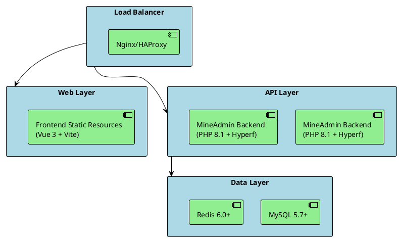

# Deployment

This document explains how to deploy MineAdmin's frontend and backend applications across various environments, including best practices for development, testing, and production environments.

## Deployment Architecture Overview

MineAdmin adopts a frontend-backend separation architecture based on the following technology stack:
- **Backend**: PHP 8.1+ + Hyperf framework + Swoole extension
- **Frontend**: Vue 3 + TypeScript + Vite
- **Database**: MySQL 5.7+ / PostgreSQL (optional)
- **Cache**: Redis 6.0+
- **Containerization**: Docker + Docker Compose



## Environment Preparation

### PHP Extension Requirements

Based on the configuration in [`mineadmin/Dockerfile`](https://github.com/mineadmin/MineAdmin/blob/master/Dockerfile):

**Required Extensions:**
- cURL >= 7.68
- Fileinfo 
- OpenSSL >= 1.1
- PDO
- Redis >= 5.3
- JSON
- Tokenizer
- SimpleXML
- XMLWriter

**Optional Extensions:**
- PDO_MYSQL (MySQL support)
- PDO_PGSQL (PostgreSQL support)  
- Swoole >= 5.1 (high-performance mode)
- Swow >= 1.5 
- XlsWriter (Excel file support)

**PHP Configuration Optimization:**
```ini
# /etc/php/8.1/php.ini or corresponding version path
upload_max_filesize = 128M
post_max_size = 128M
memory_limit = 1G
max_execution_time = 300
max_input_vars = 3000
date.timezone = Asia/Shanghai
```

## Backend Deployment

### 1. Environment Configuration

#### Create Environment Configuration File

Copy and configure the environment file, referencing [`mineadmin/.env.example`](https://github.com/mineadmin/MineAdmin/blob/master/.env.example):

```shell
cp .env.example .env
```

**Development Environment Configuration (.env)**:
```bash
APP_NAME=MineAdmin
APP_ENV=dev
APP_DEBUG=true
APP_URL=http://127.0.0.1:9501

# Database Configuration
DB_DRIVER=mysql
DB_HOST=127.0.0.1
DB_PORT=3306
DB_DATABASE=mineadmin
DB_USERNAME=root
DB_PASSWORD=your_password
DB_CHARSET=utf8mb4
DB_COLLATION=utf8mb4_unicode_ci
DB_PREFIX=

# Redis Configuration
REDIS_HOST=127.0.0.1
REDIS_AUTH=
REDIS_PORT=6379
REDIS_DB=0

# JWT Secret Key (generate a new key)
JWT_SECRET=your_jwt_secret_key_here
```

**Production Environment Configuration**:
```bash
APP_NAME=MineAdmin
APP_ENV=prod
APP_DEBUG=false
APP_URL=https://your-domain.com

# Database Configuration (use internal IP)
DB_DRIVER=mysql
DB_HOST=10.0.0.10
DB_PORT=3306
DB_DATABASE=mineadmin
DB_USERNAME=mineadmin
DB_PASSWORD=strong_password_here
DB_CHARSET=utf8mb4
DB_COLLATION=utf8mb4_unicode_ci
DB_PREFIX=

# Redis Configuration (use internal IP, enable password)
REDIS_HOST=10.0.0.11
REDIS_AUTH=redis_password_here
REDIS_PORT=6379
REDIS_DB=0

# JWT Secret Key (64-character strong key)
JWT_SECRET=generated_64_character_jwt_secret_key_here
```

#### Generate JWT Secret Key

```shell
# Generate a secure JWT secret key
php -r "echo base64_encode(random_bytes(64)) . PHP_EOL;"
```

### 2. Database Initialization

#### Database Migration

Execute database migrations based on the migration files in [`mineadmin/databases/migrations/`](https://github.com/mineadmin/MineAdmin/tree/master/databases/migrations):

```shell
# Run database migrations
php bin/hyperf.php migrate

# Check migration status
php bin/hyperf.php migrate:status
```

**Main Data Tables Include**:
- `user` - User table
- `menu` - Menu table  
- `role` - Role table
- `rules` - Permission rules table
- `attachment` - Attachment table
- `user_login_log` - User login logs
- `user_operation_log` - User operation logs

#### Data Seeding (Optional)

```shell
# Execute data seeding
php bin/hyperf.php db:seed
```

### 3. Direct Server Deployment

#### Using Supervisord for Process Management

Create Supervisor configuration file `/etc/supervisor/conf.d/mineadmin.conf`:

```ini
[program:mineadmin]
command=php /var/www/mineadmin/bin/hyperf.php start
directory=/var/www/mineadmin
autostart=true
autorestart=true
startretries=3
user=www-data
redirect_stderr=true
stdout_logfile=/var/log/mineadmin.log
stdout_logfile_maxbytes=50MB
stdout_logfile_backups=10
```

Start the service:
```shell
# Reload configuration
sudo supervisorctl reread
sudo supervisorctl update

# Start MineAdmin
sudo supervisorctl start mineadmin

# Check status
sudo supervisorctl status mineadmin
```

#### Using Systemd Service Management

Create system service file `/etc/systemd/system/mineadmin.service`:

```ini
[Unit]
Description=MineAdmin Hyperf Service
After=network.target mysql.service redis.service

[Service]
Type=forking
User=www-data
Group=www-data
WorkingDirectory=/var/www/mineadmin
ExecStart=/usr/bin/php /var/www/mineadmin/bin/hyperf.php start -d
ExecStop=/bin/kill -TERM $MAINPID
ExecReload=/bin/kill -USR1 $MAINPID
Restart=always
RestartSec=5
StandardOutput=journal
StandardError=journal
SyslogIdentifier=mineadmin

[Install]
WantedBy=multi-user.target
```

Manage the service:
```shell
# Enable and start the service
sudo systemctl enable mineadmin
sudo systemctl start mineadmin

# Check service status
sudo systemctl status mineadmin

# View logs
sudo journalctl -u mineadmin -f
```

### 4. Containerized Deployment (Recommended)

#### Single Container Deployment

Based on the [`Dockerfile`](https://github.com/mineadmin/MineAdmin/blob/master/Dockerfile) in the project root:

```shell
# Build the image
docker build -t mineadmin:latest .

# Run the container (development environment)
docker run -d \
  --name mineadmin \
  -p 9501:9501 \
  -p 9503:9503 \
  -v $(pwd)/.env:/opt/www/.env \
  -v $(pwd)/storage:/opt/www/storage \
  mineadmin:latest

# Check container status
docker ps -a
docker logs mineadmin
```

#### Docker Compose Deployment (Complete Environment)

Use the provided [`docker-compose.yml`](https://github.com/mineadmin/MineAdmin/blob/master/docker-compose.yml) configuration:

**Development Environment docker-compose.yml**:
```yaml
name: mineadmin-dev

volumes:
  mine_redis_data:
  mine_mysql_data:
  mine_uploads:

networks:
  mineadmin:
    driver: bridge

services:
  redis:
    image: redis:7.2-alpine
    container_name: mineadmin-redis
    ports:
      - "6379:6379"
    volumes:
      - mine_redis_data:/data
    command: redis-server --appendonly yes --requirepass ${REDIS_PASSWORD:-}
    environment:
      - TZ=Asia/Shanghai
    networks:
      - mineadmin
    healthcheck:
      test: ["CMD", "redis-cli", "ping"]
      interval: 10s
      timeout: 5s
      retries: 3
    deploy:
      resources:
        limits:
          memory: 512M

  mysql:
    image: mysql:8.0
    container_name: mineadmin-mysql
    volumes:
      - mine_mysql_data:/var/lib/mysql
      - ./docker/mysql/conf.d:/etc/mysql/conf.d
    ports:
      - "3306:3306"
    environment:
      MYSQL_ROOT_PASSWORD: ${DB_PASSWORD:-root}
      MYSQL_DATABASE: ${DB_DATABASE:-mineadmin}
      MYSQL_USER: ${DB_USERNAME:-mineadmin}
      MYSQL_PASSWORD: ${DB_PASSWORD:-root}
      MYSQL_CHARACTER_SET_SERVER: utf8mb4
      MYSQL_COLLATION_SERVER: utf8mb4_unicode_ci
      TZ: Asia/Shanghai
    networks:
      - mineadmin
    healthcheck:
      test: ["CMD", "mysqladmin", "ping", "-h", "localhost"]
      interval: 10s
      timeout: 5s
      retries: 5
    deploy:
      resources:
        limits:
          memory: 1G

  app:
    build:
      context: .
      dockerfile: Dockerfile
      args:
        - timezone=Asia/Shanghai
    container_name: mineadmin-app
    volumes:
      - ./:/opt/www
      - mine_uploads:/opt/www/storage/uploads
    ports:
      - "9501:9501"
      - "9503:9503"
    environment:
      - TZ=Asia/Shanghai
      - APP_ENV=dev
    depends_on:
      mysql:
        condition: service_healthy
      redis:
        condition: service_healthy
    networks:
      - mineadmin
    healthcheck:
      test: ["CMD", "curl", "-f", "http://localhost:9501/"]
      interval: 30s
      timeout: 10s
      retries: 3
```

**Production Environment Deployment**:
```shell
# Create production environment configuration
cp .env.example .env.prod

# Start services
docker-compose --env-file .env.prod up -d

# Check service status
docker-compose ps

# View logs
docker-compose logs -f app
```

#### Kubernetes Deployment

**ConfigMap Configuration**:
```yaml
apiVersion: v1
kind: ConfigMap
metadata:
  name: mineadmin-config
  namespace: mineadmin
data:
  .env: |
    APP_NAME=MineAdmin
    APP_ENV=prod
    APP_DEBUG=false
    APP_URL=https://admin.yourdomain.com
    
    DB_DRIVER=mysql
    DB_HOST=mysql-service
    DB_PORT=3306
    DB_DATABASE=mineadmin
    DB_USERNAME=mineadmin
    DB_PASSWORD=your_secure_password
    DB_CHARSET=utf8mb4
    DB_COLLATION=utf8mb4_unicode_ci
    DB_PREFIX=
    
    REDIS_HOST=redis-service
    REDIS_AUTH=your_redis_password
    REDIS_PORT=6379
    REDIS_DB=0
    
    JWT_SECRET=your_64_character_jwt_secret
```

**Deployment Configuration**:
```yaml
apiVersion: apps/v1
kind: Deployment
metadata:
  name: mineadmin-deployment
  namespace: mineadmin
spec:
  replicas: 3
  selector:
    matchLabels:
      app: mineadmin
  template:
    metadata:
      labels:
        app: mineadmin
    spec:
      containers:
      - name: mineadmin
        image: mineadmin:latest
        ports:
        - containerPort: 9501
        - containerPort: 9503
        env:
        - name: APP_ENV
          value: "prod"
        - name: TZ
          value: "Asia/Shanghai"
        volumeMounts:
        - name: config-volume
          mountPath: /opt/www/.env
          subPath: .env
        - name: storage-volume
          mountPath: /opt/www/storage
        resources:
          requests:
            memory: "256Mi"
            cpu: "250m"
          limits:
            memory: "1Gi"
            cpu: "500m"
        livenessProbe:
          httpGet:
            path: /
            port: 9501
          initialDelaySeconds: 30
          periodSeconds: 10
        readinessProbe:
          httpGet:
            path: /
            port: 9501
          initialDelaySeconds: 10
          periodSeconds: 5
      volumes:
      - name: config-volume
        configMap:
          name: mineadmin-config
      - name: storage-volume
        persistentVolumeClaim:
          claimName: mineadmin-storage-pvc
```

**Service Configuration**:
```yaml
apiVersion: v1
kind: Service
metadata:
  name: mineadmin-service
  namespace: mineadmin
spec:
  selector:
    app: mineadmin
  ports:
    - name: http
      protocol: TCP
      port: 80
      targetPort: 9501
  type: ClusterIP
```

**Ingress Configuration**:
```yaml
apiVersion: networking.k8s.io/v1
kind: Ingress
metadata:
  name: mineadmin-ingress
  namespace: mineadmin
  annotations:
    nginx.ingress.kubernetes.io/rewrite-target: /
    nginx.ingress.kubernetes.io/ssl-redirect: "true"
    nginx.ingress.kubernetes.io/proxy-body-size: "128m"
    cert-manager.io/cluster-issuer: "letsencrypt-prod"
spec:
  tls:
  - hosts:
    - admin.yourdomain.com
    secretName: mineadmin-tls
  rules:
  - host: admin.yourdomain.com
    http:
      paths:
      - path: /
        pathType: Prefix
        backend:
          service:
            name: mineadmin-service
            port:
              number: 80
```

### 5. Reverse Proxy and Load Balancing

<el-alert type="warning">It is never recommended to expose the application directly to the public internet; always use a reverse proxy for traffic forwarding.</el-alert>

Based on the server configuration in [`mineadmin/config/autoload/server.php`](https://github.com/mineadmin/MineAdmin/blob/master/config/autoload/server.php), the application listens on port 9501 by default.

#### Nginx Reverse Proxy

**Production Environment Nginx Configuration** (`/etc/nginx/sites-available/mineadmin`):

```nginx
# Upstream server configuration (load balancing)
upstream mineadmin_backend {
    # Weighted round-robin
    server 127.0.0.1:9501 weight=1 max_fails=3 fail_timeout=30s;
    server 127.0.0.1:9502 weight=1 max_fails=3 fail_timeout=30s backup;
    
    # Session persistence
    ip_hash;
    
    # Health check (requires nginx_upstream_check_module)
    # check interval=3000 rise=2 fall=5 timeout=1000 type=http;
}

# HTTPS redirection
server {
    listen 80;
    server_name admin.yourdomain.com;
    return 301 https://$server_name$request_uri;
}

# Main configuration
server {
    listen 443 ssl http2;
    server_name admin.yourdomain.com;
    
    # SSL configuration
    ssl_certificate /etc/ssl/certs/mineadmin.crt;
    ssl_certificate_key /etc/ssl/private/mineadmin.key;
    ssl_protocols TLSv1.2 TLSv1.3;
    ssl_ciphers HIGH:!aNULL:!MD5;
    ssl_prefer_server_ciphers on;
    ssl_session_cache shared:SSL:10m;
    ssl_session_timeout 5m;
    
    # Security headers
    add_header X-Frame-Options "SAMEORIGIN" always;
    add_header X-XSS-Protection "1; mode=block" always;
    add_header X-Content-Type-Options "nosniff" always;
    add_header Referrer-Policy "no-referrer-when-downgrade" always;
    add_header Content-Security-Policy "default-src 'self' http: https: data: blob: 'unsafe-inline'" always;
    add_header Strict-Transport-Security "max-age=31536000; includeSubDomains" always;
    
    # Log configuration
    access_log /var/log/nginx/mineadmin.access.log;
    error_log /var/log/nginx/mineadmin.error.log warn;
    
    # Client configuration
    client_max_body_size 128M;
    client_body_timeout 60s;
    client_header_timeout 60s;
    
    # Gzip compression
    gzip on;
    gzip_vary on;
    gzip_min_length 1024;
    gzip_types text/plain text/css text/xml text/javascript application/javascript application/xml+rss application/json;
    
    # Static resource caching
    location ~* \.(js|css|png|jpg|jpeg|gif|ico|svg|woff|woff2|ttf|eot)$ {
        expires 1y;
        add_header Cache-Control "public, immutable";
        access_log off;
    }
    
    # API proxy
    location / {
        proxy_pass http://mineadmin_backend;
        proxy_http_version 1.1;
        proxy_set_header Upgrade $http_upgrade;
