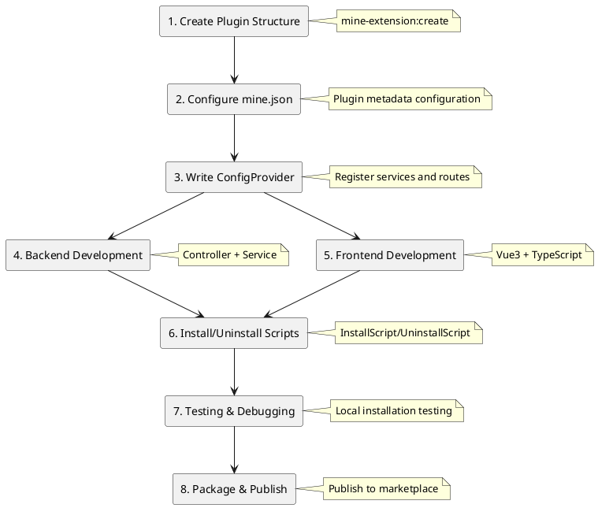

# Plugin Development Guide

This guide is based on actual MineAdmin official plugin code, detailing the complete plugin development process.

## Development Process Overview



## Plugin Structure Standards

Based on actual code from `app-store` and `code-generator` plugins, MineAdmin plugins have two typical structures:

### Simple Plugin Structure (Suitable for backend-only or simple features)

```
plugin/mine-admin/plugin-name/
├── mine.json                      # Plugin config file
├── install.lock                   # Installation marker (auto-generated)
└── src/
    ├── ConfigProvider.php         # Configuration provider
    ├── Controller/                # Controllers
    │   └── IndexController.php
    └── Service/                  # Service layer
        └── Service.php
```

### Complete Plugin Structure (Suitable for complex business logic)

```
plugin/mine-admin/plugin-name/
├── mine.json                      # Plugin config file
├── install.lock                   # Installation marker (auto-generated)
├── README.md                      # Plugin documentation
├── src/                          # Backend code
│   ├── ConfigProvider.php        # Configuration provider
│   ├── InstallScript.php         # Installation script
│   ├── UninstallScript.php       # Uninstallation script
│   ├── Http/
│   │   ├── Controller/           # Controllers
│   │   ├── Request/              # Request validation
│   │   └── Vo/                   # Value objects
│   ├── Model/                    # Data models
│   ├── Repository/               # Repository layer
│   └── Service/                  # Service layer
├── web/                          # Frontend code
│   ├── index.ts                  # Plugin entry
│   ├── api/                      # API interfaces
│   ├── views/                    # Vue components
│   └── locales/                  # Language packs
├── Database/                     # Database
│   ├── Migrations/               # Migration files
│   └── Seeder/                   # Seed data
├── languages/                    # Backend language packs
│   └── zh_CN/
└── publish/                      # Published resources
    └── template/                 # Template files
```

## Backend Development

### 1. ConfigProvider Configuration Provider

Based on actual implementation from app-store plugin:

```php
<?php
declare(strict_types=1);

namespace Plugin\MineAdmin\AppStore;

class ConfigProvider
{
    public function __invoke(): array
    {
        return [
            // Annotation scanning configuration - required
            'annotations' => [
                'scan' => [
                    'paths' => [
                        __DIR__,
                    ],
                ],
            ],
            // Dependency injection (optional)
            'dependencies' => [
                // Interface::class => Implementation::class
            ],
            // Commands (optional)
            'commands' => [
                // Command::class
            ],
            // Middleware (optional)
            'middlewares' => [
                'http' => [
                    // Middleware::class
                ],
            ],
            // Event listeners (optional)
            'listeners' => [
                // Listener::class
            ],
        ];
    }
}
```

### 2. Controller Development

Reference app-store's IndexController implementation:

```php
<?php
declare(strict_types=1);

namespace Plugin\MineAdmin\AppStore\Controller;

use Hyperf\Di\Annotation\Inject;
use Hyperf\HttpServer\Annotation\Controller;
use Hyperf\HttpServer\Annotation\GetMapping;
use Hyperf\HttpServer\Annotation\PostMapping;
use Mine\Annotation\Auth;
use Mine\Annotation\Permission;
use Mine\Annotation\RemoteState;
use Plugin\MineAdmin\AppStore\Service\Service;
use Psr\Http\Message\ResponseInterface;

#[Controller(prefix: "admin/plugin/store")]
#[Auth]
class IndexController extends AbstractController
{
    #[Inject]
    protected Service $service;

    /**
     * Remote plugin list
     */
    #[GetMapping("index")]
    #[Permission("plugin:store:index")]
    public function index(): ResponseInterface
    {
        return $this->success(
            $this->service->getAppList($this->request->all())
        );
    }

    /**
     * Download plugin
     */
    #[PostMapping("download")]
    #[Permission("plugin:store:download")]
    public function download(): ResponseInterface
    {
        $params = $this->request->all();
        $this->service->download($params);
        return $this->success();
    }

    /**
     * Install plugin
     */
    #[PostMapping("install")]
    #[Permission("plugin:store:install")]
    public function install(): ResponseInterface
    {
        $params = $this->request->all();
        $this->service->install($params);
        return $this->success();
    }

    /**
     * Uninstall plugin
     */
    #[PostMapping("unInstall")]
    #[Permission("plugin:store:uninstall")]
    public function unInstall(): ResponseInterface
    {
        $params = $this->request->all();
        $this->service->unInstall($params);
        return $this->success();
    }

    /**
     * Local plugin installation list
     */
    #[GetMapping("getInstallList")]
    #[RemoteState]
    public function getInstallList(): ResponseInterface
    {
        return $this->success(
            $this->service->getLocalAppInstallList()
        );
    }

    /**
     * Local upload installation
     */
    #[PostMapping("uploadInstall")]
    #[Permission("plugin:store:uploadInstall")]
    public function uploadInstall(): ResponseInterface
    {
        return $this->success(
            $this->service->uploadLocalApp($this->request->all())
        );
    }
}
```

**Key Annotation Explanations**:
- `#[Controller]`: Defines controller route prefix
- `#[Auth]`: Requires login authentication
- `#[Permission]`: Permission verification
- `#[GetMapping]`/`#[PostMapping]`: Defines route methods
- `#[Inject]`: Dependency injection
- `#[RemoteState]`: Remote state management

### 3. Service Layer Development

Based on app-store's Service implementation pattern:

```php
<?php
declare(strict_types=1);

namespace Plugin\MineAdmin\AppStore\Service;

use App\Service\MineAppStoreService;
use Hyperf\Di\Annotation\Inject;
use Mine\AppStore\Plugin;
use Mine\Exception\MineException;

class Service
{
    #[Inject]
    protected MineAppStoreService $service;

    /**
     * Get application list
     */
    public function getAppList(array $params): array
    {
        return $this->service->getAppList($params);
    }

    /**
     * Download application
     */
    public function download(array $params): void
    {
        $app = $this->service->getAppInfo($params['identifier']);
        
        if (empty($app['download_url'])) {
            throw new MineException('This application cannot be downloaded', 500);
        }
        
        if (Plugin::hasLocalInstalled($params['identifier'])) {
            throw new MineException('Application already exists locally. To re-download, please delete the local application first', 500);
        }
        
        $this->service->download($params);
    }

    /**
     * Install application
     */
    public function install(array $params): void
    {
        $pluginName = $params['name'];
        
        if (!Plugin::hasLocal($pluginName)) {
            throw new MineException('Plugin does not exist', 500);
        }
        
        if (Plugin::hasLocalInstalled($pluginName)) {
            throw new MineException('Plugin already installed', 500);
        }
        
        Plugin::forceRefreshJsonPath($pluginName);
        Plugin::install($pluginName);
    }

    /**
     * Uninstall application
     */
    public function unInstall(array $params): void
    {
        $pluginName = $params['name'];
        
        if (!Plugin::hasLocalInstalled($pluginName)) {
            throw new MineException('Plugin not installed', 500);
        }
        
        Plugin::uninstall($pluginName);
    }

    /**
     * Get locally installed plugin list
     */
    public function getLocalAppInstallList(): array
    {
        $list = [];
        $plugins = Plugin::getLocalPlugins();
        
        foreach ($plugins as $name => $info) {
            $app = ['identifier' => $name];
            $app['name'] = $info['name'] ?? 'Unknown';
            $app['status'] = $info['status'] ?? false;
            $app['version'] = $info['version'] ?? '0.0.0';
            $app['description'] = $info['description'] ?? 'No description';
            $app['created_at'] = $info['created_at'] ?? '';
            $list[] = $app;
        }
        
        return $list;
    }

    /**
     * Local upload installation
     */
    public function uploadLocalApp(array $params): void
    {
        if (empty($params['path'])) {
            throw new MineException('Please upload the plugin package', 500);
        }
        
        // Extract and verify plugin package
        $zipFile = new \ZipArchive();
        $result = $zipFile->open($params['path']);
        
        if ($result !== true) {
            throw new MineException('Plugin package extraction failed', 500);
        }
        
        // Get plugin info and install
        $mineJson = $zipFile->getFromName('mine.json');
        if (!$mineJson) {
            throw new MineException('Invalid plugin package format, missing mine.json', 500);
        }
        
        $config = json_decode($mineJson, true);
        $pluginName = $config['name'] ?? null;
        
        if (!$pluginName) {
            throw new MineException('Plugin package configuration error', 500);
        }
        
        // Extract to plugin directory
        $targetPath = Plugin::getPluginPath($pluginName);
        $zipFile->extractTo($targetPath);
        $zipFile->close();
        
        // Refresh cache and install
        Plugin::forceRefreshJsonPath($pluginName);
        Plugin::install($pluginName);
    }
}
```

### 4. Model Layer (If database needed)

Reference code-generator plugin's model implementation:

```php
<?php
declare(strict_types=1);

namespace Plugin\MineAdmin\CodeGenerator\Model;

use Mine\MineModel;

class SettingGenerateColumns extends MineModel
{
    protected ?string $table = 'setting_generate_columns';
    
    protected array $fillable = [
        'id', 'table_id', 'column_name', 'column_comment',
        'column_type', 'default_value', 'is_nullable',
        'is_pk', 'is_list', 'is_query', 'is_required',
        'is_sort', 'is_edit', 'is_readonly', 'query_type',
        'view_type', 'dict_type', 'extra', 'sort',
        'created_by', 'updated_by', 'created_at', 'updated_at'
    ];
    
    protected array $casts = [
        'is_pk' => 'boolean',
        'is_list' => 'boolean', 
        'is_query' => 'boolean',
        'is_required' => 'boolean',
        'is_sort' => 'boolean',
        'is_edit' => 'boolean',
        'is_readonly' => 'boolean',
    ];
}
```

## Frontend Development

### 1. Plugin Entry File (index.ts)

Based on app-store's frontend implementation:

```typescript
import type { App } from 'vue'
import type { Plugin } from '#/global'

const pluginConfig: Plugin.PluginConfig = {
  install(app: App) {
    // Vue plugin installation hook
    console.log('app-store plugin install')
  },
  config: {
    enable: true,
    info: {
      name: 'app-store',
      version: '1.0.0',
      author: 'MineAdmin Team',
      description: 'MineAdmin Marketplace Visualization Plugin'
    }
  },
  views: [
    {
      name: 'plugin:store',
      path: '/plugin/store',
      meta: {
        title: 'app_store.app_store',
        i18n: true,
        icon: 'material-symbols:app-shortcut',
        type: 'M',
        hidden: false,
        componentPath: '/plugin/mine-admin/app-store/views/index.vue',
        componentName: 'plugin:mine-admin:app-store:index',
      },
      component: () => import('./views/index.vue'),
    }
  ],
}

export default pluginConfig
```

### 2. API Interface Encapsulation

```typescript
// api/app-store.ts
import { request } from '@/utils/request'

// Get remote plugin list
export const getAppList = (params: any) => {
  return request.get('/admin/plugin/store/index', { params })
}

// Download plugin
export const downloadApp = (data: any) => {
  return request.post('/admin/plugin/store/download', data)
}

// Install plugin
export const installApp = (data: any) => {
  return request.post('/admin/plugin/store/install', data)
}

// Uninstall plugin
export const uninstallApp = (data: any) => {
  return request.post('/admin/plugin/store/unInstall', data)
}

// Get locally installed plugins
export const getInstalledList = () => {
  return request.get('/admin/plugin/store/getInstallList')
}

// Upload local plugin installation
export const uploadInstall = (data: any) => {
  return request.post('/admin/plugin/store/uploadInstall', data)
}
```

### 3. Vue Component Development

```vue
<!-- views/index.vue -->
<template>
  <div class="app-store-container">
    <el-tabs v-model="activeTab">
      <el-tab-pane label="Marketplace" name="market">
        <AppMarket />
      </el-tab-pane>
      <el-tab-pane label="Installed" name="installed">
        <InstalledApps />
      </el-tab-pane>
      <el-tab-pane label="Local Upload" name="upload">
        <LocalUpload />
      </el-tab-pane>
    </el-tabs>
  </div>
</template>

<script setup lang="ts">
import { ref } from 'vue'
import AppMarket from './components/AppMarket.vue'
import InstalledApps from './components/InstalledApps.vue'
import LocalUpload from './components/LocalUpload.vue'

const activeTab = ref('market')
</script>
```

### 4. Internationalization Support

```typescript
// locales/zh_CN.ts
export default {
  app_store: {
    app_store: 'Marketplace',
    app_list: 'Application List',
    installed: 'Installed',
    install: 'Install',
    uninstall: 'Uninstall',
    download: 'Download',
    upload: 'Upload',
    local_upload: 'Local Upload',
    upload_tips: 'Please select plugin package file (.zip format)',
  }
}
```

## Installation and Uninstallation Scripts

### InstallScript.php

Based on actual implementation from code-generator plugin:

```php
<?php
declare(strict_types=1);

namespace Plugin\MineAdmin\CodeGenerator;

use Hyperf\Command\Concerns\InteractsWithIO;
use Hyperf\Context\ApplicationContext;
use Hyperf\Contract\ApplicationInterface;
use Mine\Helper\Filesystem;
use Symfony\Component\Console\Input\ArrayInput;
use Symfony\Component\Console\Output\ConsoleOutput;
use Symfony\Component\Console\Output\NullOutput;

class InstallScript
{
    use InteractsWithIO;

    public function __invoke()
    {
        // Set output
        $this->output = new ConsoleOutput();
        
        try {
            $this->info('========================================');
            $this->info('MineAdmin Code Generator Plugin');
            $this->info('========================================');
            $this->info('Starting plugin installation...');
            
            // 1. Copy template files
            $this->copyTemplates();
            
            // 2. Copy language packs
            $this->copyLanguages();
            
            // 3. Publish dependency resources
            $this->publishVendor();
            
            // 4. Run database migrations
            $this->runMigrations();
            
            $this->info('Plugin installed successfully!');
            $this->info('========================================');
            
        } catch (\Throwable $e) {
            $this->error('Plugin installation failed: ' . $e->getMessage());
            throw $e;
        }
    }
    
    /**
     * Copy template files
     */
    protected function copyTemplates(): void
    {
        $source = dirname(__DIR__) . '/publish/template';
        $target = BASE_PATH . '/runtime/generate/template';
        
        if (!is_dir($target)) {
            mkdir($target, 0755, true);
        }
        
        Filesystem::copy($source, $target, false);
        $this->info('Template files copied successfully');
    }
    
    /**
     * Copy language packs
     */
    protected function copyLanguages(): void
    {
        $source = dirname(__DIR__) . '/languages';
        $target = BASE_PATH . '/storage/languages';
        
        Filesystem::copy($source, $target, false);
        $this->info('Language packs copied successfully');
    }
    
    /**
     * Publish dependency resources
     */
    protected function publishVendor(): void
    {
        $app = ApplicationContext::getContainer()->get(ApplicationInterface::class);
        $app->setAutoExit(false);
        
        $input = new ArrayInput([
            'command' => 'vendor:publish',
            'package' => 'hyperf/translation',
       