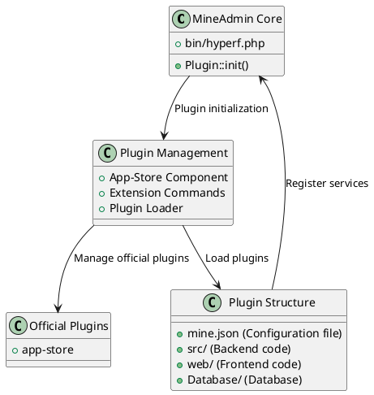

# MineAdmin Plugin System

The MineAdmin plugin system provides powerful extensibility, allowing developers to create reusable functional modules to achieve system modularity and scalability.

## Plugin System Architecture

MineAdmin's plugin system is based on the Hyperf framework's ConfigProvider mechanism, offering complete plugin lifecycle management and automated deployment capabilities.



## Core Components

### 1. Plugin Loader
- **File**: `bin/hyperf.php` ([GitHub](https://github.com/mineadmin/mineadmin/blob/master/bin/hyperf.php))
- **Principle**: Automatically loads all installed plugins during application startup via `Plugin::init()`
- **Implementation**: Scans all plugins in the `plugin/` directory and registers their ConfigProvider

### 2. App-Store Component
- **Repository**: [mineadmin/appstore](https://github.com/mineadmin/appstore)
- **Functionality**: Provides plugin download, installation, uninstallation, update, and other management features
- **Configuration**: Registers services and configurations via `ConfigProvider`

### 3. Plugin Configuration System
- **Core File**: `mine.json`
- **Principle**: Defines plugin metadata, dependencies, installation scripts, and other information
- **Loading**: Parses and registers into the system during plugin installation

## Official Plugins

MineAdmin provides the following official plugins by default:

| Plugin Name | Description | Repository |
|------------|-------------|------------|
| app-store | Application marketplace management plugin, providing plugin download, installation, uninstallation, update, and other management features | [GitHub](https://github.com/mineadmin/appstore) |

> Note: Other plugins such as code generators, scheduled task managers, etc., can be obtained from the application marketplace or developed independently.

## Plugin Types

MineAdmin supports three types of plugins:

### Mixed (Hybrid Plugins)
Plugins containing both frontend and backend complete functionalities, providing full business modules.

### Backend (Backend Plugins)
Plugins containing only backend logic, primarily providing API services and business logic.

### Frontend (Frontend Plugins)
Plugins containing only frontend interfaces, primarily providing user interface components.

## Getting Started

### Environment Setup

Developing MineAdmin plugins requires:

1. **Familiarity with the tech stack**: MineAdmin and Hyperf framework
2. **Obtaining AccessToken**:
   - Log in to [MineAdmin Official Website](https://www.mineadmin.com/login)
   - Go to Personal Center → [Settings Page](https://www.mineadmin.com/member/setting)
   - Obtain AccessToken

3. **Configuring Environment Variables**:
```ini
# .env file
MINE_ACCESS_TOKEN=YourAccessToken
```

::: Warning
Please keep your AccessToken secure to avoid leakage!
:::

### Developer Authentication

- **Local Development**: No authentication required; free to develop and distribute
- **Marketplace Release**: Requires developer authentication; contact the MineAdmin team to obtain permissions

## Related Documentation

- [Quick Start Guide](./guide.md) - Create your first plugin
- [Development Guide](./develop.md) - Detailed development process
- [Plugin Structure](./structure.md) - Directory structure specifications
- [Lifecycle Management](./lifecycle.md) - Installation and uninstallation process
- [API Reference](./api.md) - Interface documentation
- [Example Code](./examples.md) - Practical cases