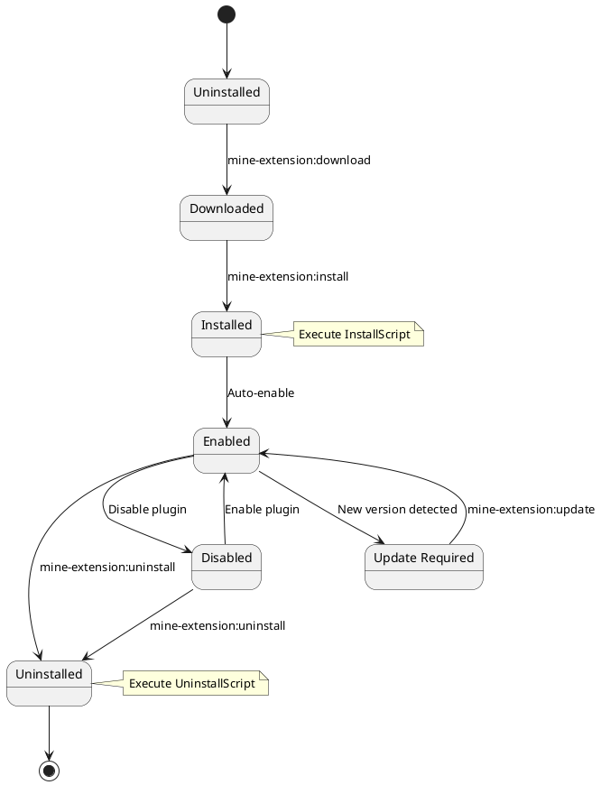
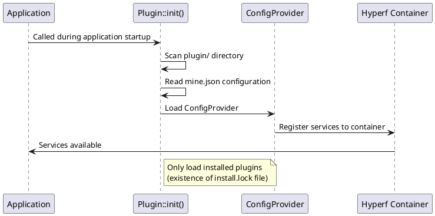
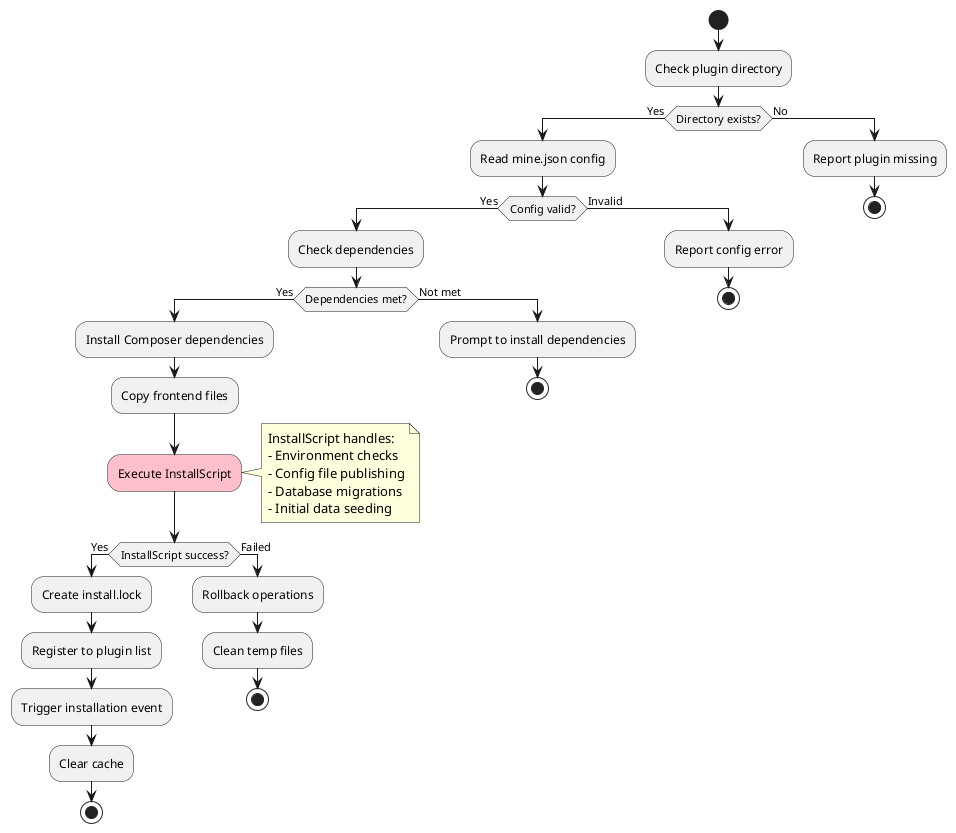
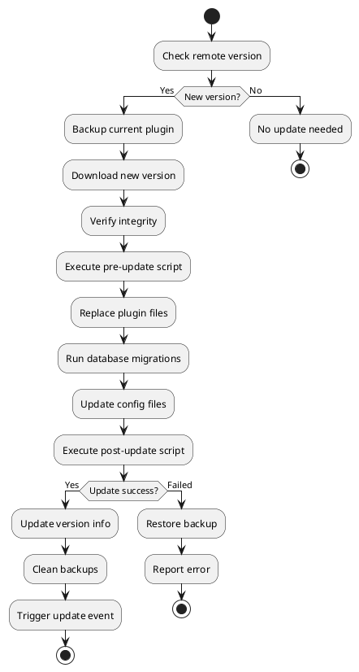
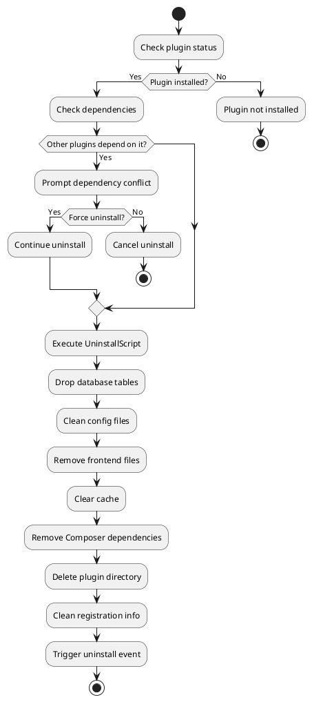

# Plugin Lifecycle Management

Detailed explanation of MineAdmin plugin lifecycle management, including the complete processes of installation, enabling, disabling, updating, and uninstallation.

## Lifecycle Overview

The lifecycle of MineAdmin plugins includes the following stages:



## Plugin Discovery and Loading

### 1. Plugin Discovery Mechanism

**Core Implementation**: `Plugin::init()` method called in `bin/hyperf.php` ([GitHub](https://github.com/mineadmin/mineadmin/blob/master/bin/hyperf.php))



### 2. Loading Process Details

1. **Scan Plugin Directory**: Traverse all subdirectories under `plugin/`
2. **Check Installation Status**: Verify existence of `install.lock` file
3. **Read Configuration**: Parse `mine.json` configuration file
4. **Load ConfigProvider**: Register plugin services to Hyperf container
5. **Register Routes**: Automatically register controller routes
6. **Load Middleware**: Register plugin middleware
7. **Register Event Listeners**: Load event listeners

## Download Phase

### Command Usage

```bash
# Download specified plugin
php bin/hyperf.php mine-extension:download --name plugin-name

# View downloadable plugin list
php bin/hyperf.php mine-extension:list
```

### Download Process

1. **Verify AccessToken**: Check `MINE_ACCESS_TOKEN` environment variable
2. **Request Remote Repository**: Fetch plugin info from MineAdmin official repository
3. **Download Plugin Package**: Download zip package to local temp directory
4. **Extract Files**: Unzip to `plugin/vendor/plugin-name/` directory
5. **Verify Integrity**: Check if `mine.json` exists with correct format

### Implementation Principle

**Core Service**: App-Store component ([GitHub](https://github.com/mineadmin/appstore)) provides download functionality

```php
// Pseudo-code example
class DownloadService 
{
    public function download(string $pluginName): bool
    {
        // 1. Verify access token
        $this->validateAccessToken();
        
        // 2. Get plugin info
        $pluginInfo = $this->getPluginInfo($pluginName);
        
        // 3. Download package
        $packagePath = $this->downloadPackage($pluginInfo['download_url']);
        
        // 4. Extract to target directory
        $this->extractPackage($packagePath, $this->getPluginPath($pluginName));
        
        return true;
    }
}
```

## Installation Phase

### Command Usage

```bash
# Install plugin
php bin/hyperf.php mine-extension:install vendor/plugin-name --yes

# Force reinstall
php bin/hyperf.php mine-extension:install vendor/plugin-name --force
```

### Installation Process Details

> ⚠️ **Important**: Configuration file publishing, environment checks, and database migrations should be handled in `InstallScript`, not relying on ConfigProvider's publish functionality.



### 1. Pre-installation Checks

```php
// Pre-installation check logic
class InstallChecker
{
    public function check(string $pluginPath): array
    {
        $errors = [];
        
        // Check plugin directory
        if (!is_dir($pluginPath)) {
            $errors[] = 'Plugin directory not found';
        }
        
        // Check mine.json
        $configPath = $pluginPath . '/mine.json';
        if (!file_exists($configPath)) {
            $errors[] = 'mine.json config file not found';
        }
        
        // Check dependencies
        $config = json_decode(file_get_contents($configPath), true);
        foreach ($config['require'] ?? [] as $dependency => $version) {
            if (!$this->isDependencyMet($dependency, $version)) {
                $errors[] = "Dependency {$dependency} version {$version} not satisfied";
            }
        }
        
        return $errors;
    }
}
```

### 2. Composer Dependency Installation

The installation process handles plugin Composer dependencies:

```json
// Composer config in mine.json
{
  "composer": {
    "require": {
      "hyperf/async-queue": "^3.0",
      "symfony/console": "^6.0"
    },
    "psr-4": {
      "Plugin\\Vendor\\PluginName\\": "src"
    }
  }
}
```

The system automatically executes:
```bash
composer require hyperf/async-queue:^3.0 symfony/console:^6.0
```

### 3. InstallScript Handling ⭐

> **Best Practice**: Database migrations, config publishing, and environment checks should be handled in `InstallScript`:

```php
// Handle all installation logic in InstallScript
class InstallScript
{
    public function handle(): bool
    {
        // 1. Environment check
        if (!$this->checkEnvironment()) {
            echo "Environment requirements not met\n";
            return false;
        }
        
        // 2. Publish config files (not using ConfigProvider publish)
        $this->publishConfig();
        
        // 3. Run database migrations
        if (!$this->runMigrations()) {
            echo "Database migration failed\n";
            return false;
        }
        
        // 4. Initialize data
        $this->seedData();
        
        return true;
    }
    
    private function publishConfig(): void
    {
        $source = __DIR__ . '/../publish/config/plugin.php';
        $target = BASE_PATH . '/config/autoload/plugin.php';
        
        if (!file_exists($target)) {
            copy($source, $target);
            echo "Config file published\n";
        }
    }
    
    private function runMigrations(): bool
    {
        $migrationPath = __DIR__ . '/../Database/Migrations';
        
        if (is_dir($migrationPath)) {
            // Use Hyperf migration command
            $container = \Hyperf\Context\ApplicationContext::getContainer();
            $application = $container->get(\Hyperf\Contract\ApplicationInterface::class);
            
            $input = new \Symfony\Component\Console\Input\ArrayInput([
                'command' => 'migrate',
                '--path' => $migrationPath,
            ]);
            
            $output = new \Symfony\Component\Console\Output\BufferedOutput();
            $exitCode = $application->run($input, $output);
            
            return $exitCode === 0;
        }
        
        return true;
    }
}
```

### 4. Frontend File Copying

Copy files from `web/` directory to frontend project:

```
plugin/vendor/plugin-name/web/    →    Frontend project directory
├── views/example.vue             →    src/views/plugin/vendor/plugin-name/example.vue
├── components/ExampleComp.vue    →    src/components/plugin/vendor/plugin-name/ExampleComp.vue
└── api/example.js                →    src/api/plugin/vendor/plugin-name/example.js
```

### 5. Config File Publishing ⚠️

> **Note**: The `publish` functionality in ConfigProvider is unreliable in plugin system, handle manually in InstallScript:

```php
// Not recommended: publish in ConfigProvider may not work
'publish' => [
    // This approach may not execute in plugins
]

// Recommended: Manual publishing in InstallScript
protected function publishConfig(): void
{
    $configs = [
        [
            'source' => __DIR__ . '/../publish/config/plugin.php',
            'target' => BASE_PATH . '/config/autoload/plugin.php',
        ],
        [
            'source' => __DIR__ . '/../publish/config/routes.php',
            'target' => BASE_PATH . '/config/routes/plugin.php',
        ],
    ];
    
    foreach ($configs as $config) {
        if (!file_exists($config['target'])) {
            copy($config['source'], $config['target']);
            echo "Config file published: {$config['target']}\n";
        }
    }
}
```

### 6. Create Installation Lock File

After successful installation, create `install.lock` to mark installation status:

```
plugin/vendor/plugin-name/install.lock
```

File contains installation info:
```json
{
  "installed_at": "2024-01-01 12:00:00",
  "version": "1.0.0",
  "installer": "admin",
  "checksum": "abc123..."
}
```

## Enable/Disable Management

### Plugin State Control

MineAdmin supports temporarily disabling plugins without uninstalling:

```bash
# Disable plugin
php bin/hyperf.php mine-extension:disable vendor/plugin-name

# Enable plugin  
php bin/hyperf.php mine-extension:enable vendor/plugin-name

# Check plugin status
php bin/hyperf.php mine-extension:status vendor/plugin-name
```

### State Management Mechanism

State information stored in `install.lock` file:

```json
{
  "installed_at": "2024-01-01 12:00:00",
  "version": "1.0.0",
  "status": "enabled",  // enabled | disabled
  "disabled_at": null,
  "disabled_reason": null
}
```

## Update Phase

### Update Check

```bash
# Check for plugin updates
php bin/hyperf.php mine-extension:check-updates

# Update specific plugin
php bin/hyperf.php mine-extension:update vendor/plugin-name

# Update all plugins
php bin/hyperf.php mine-extension:update-all
```

### Update Process



### Version Compatibility Handling

Version compatibility checked during update:

```php
class UpdateManager
{
    public function checkCompatibility(string $currentVersion, string $newVersion): bool
    {
        // Check major version compatibility
        $current = $this->parseVersion($currentVersion);
        $new = $this->parseVersion($newVersion);
        
        // Breaking changes possible with major version change
        if ($current['major'] !== $new['major']) {
            return $this->checkBreakingChanges($currentVersion, $newVersion);
        }
        
        return true;
    }
}
```

## Uninstallation Phase

### Command Usage

```bash
# Uninstall plugin
php bin/hyperf.php mine-extension:uninstall vendor/plugin-name --yes

# Force uninstall (ignore errors)
php bin/hyperf.php mine-extension:uninstall vendor/plugin-name --force
```

### Uninstallation Process



### Uninstall Script Execution

```php
// UninstallScript example
class UninstallScript
{
    public function handle(): bool
    {
        try {
            // 1. Clean database
            $this->cleanDatabase();
            
            // 2. Clean config files
            $this->cleanConfigFiles();
            
            // 3. Clean cache data
            $this->cleanCache();
            
            // 4. Clean log files
            $this->cleanLogs();
            
            // 5. Execute custom cleanup
            $this->customCleanup();
            
            return true;
        } catch (\Exception $e) {
            logger()->error('Plugin uninstall failed: ' . $e->getMessage());
            return false;
        }
    }
    
    private function cleanDatabase(): void
    {
        // Drop plugin-related tables
        DB::statement('DROP TABLE IF EXISTS plugin_example');
        
        // Clean config data
        DB::table('system_config')->where('key', 'like', 'plugin.example.%')->delete();
    }
}
```

## Error Handling and Rollback

### Installation Error Rollback

Automatic rollback if errors occur during installation:

```php
class InstallRollback
{
    public function rollback(string $pluginPath, array $operations): void
    {
        foreach (array_reverse($operations) as $operation) {
            try {
                switch ($operation['type']) {
                    case 'database':
                        $this->rollbackDatabase($operation['data']);
                        break;
                    case 'files':
                        $this->rollbackFiles($operation['data']);
                        break;
                    case 'config':
                        $this->rollbackConfig($operation['data']);
                        break;
                }
            } catch (\Exception $e) {
                logger()->error('Rollback failed: ' . $e->getMessage());
            }
        }
    }
}
```

### Dependency Conflict Resolution

Handling strategies for plugin dependency conflicts:

```php
class DependencyResolver
{
    public function resolveConflicts(array $conflicts): array
    {
        $solutions = [];
        
        foreach ($conflicts as $conflict) {
            $solution = match($conflict['type']) {
                'version_conflict' => $this->resolveVersionConflict($conflict),
                'circular_dependency' => $this->resolveCircularDependency($conflict),
                'missing_dependency' => $this->resolveMissingDependency($conflict),
                default => null
            };
            
            if ($solution) {
                $solutions[] = $solution;
            }
        }
        
        return $solutions;
    }
}
```

## Event System

Various plugin lifecycle stages trigger corresponding events:

### Event List

```php
// Plugin lifecycle events
class PluginEvents
{
    const BEFORE_INSTALL = 'plugin.before_install';
    const AFTER_INSTALL = 'plugin.after_install';
    const BEFORE_UNINSTALL = 'plugin.before_uninstall';
    const AFTER_UNINSTALL = 'plugin.after_uninstall';
    const BEFORE_UPDATE = 'plugin.before_update';
    const AFTER_UPDATE = 'plugin.after_update';
    const ENABLED = 'plugin.enabled';
    const DISABLED = 'plugin.disabled';
}
```

### Event Listener Example

```php
use Hyperf\Event\Annotation\Listener;
use Hyperf\Event\Contract\ListenerInterface;

#[Listener]
class PluginInstallListener implements ListenerInterface
{
    public function listen(): array
    {
        return [
            PluginEvents::AFTER_INSTALL,
        ];
    }

    public function process(object $event): void
    {
        // Post-installation logic
        logger()->info('Plugin installed', [
            'plugin' => $event->getPluginName(),
            'version' => $event->getVersion()
        ]);
        
        // Clear cache
        $this->clearCache($event->getPluginName());
        
        // Send notification
        $this->sendNotification($event);
    }
}
```

## Status Queries

### View Plugin Status

```bash
# View all local plugin statuses
php bin/hyperf.php mine-extension:local-list

# View available remote plugins
php bin/hyperf.php mine-extension:list

# View specific plugin details
php bin/hyperf.php mine-extension:info vendor/plugin-name
```

### Status Information Structure

```json
{
  "name": "vendor/plugin-name",
  "version": "