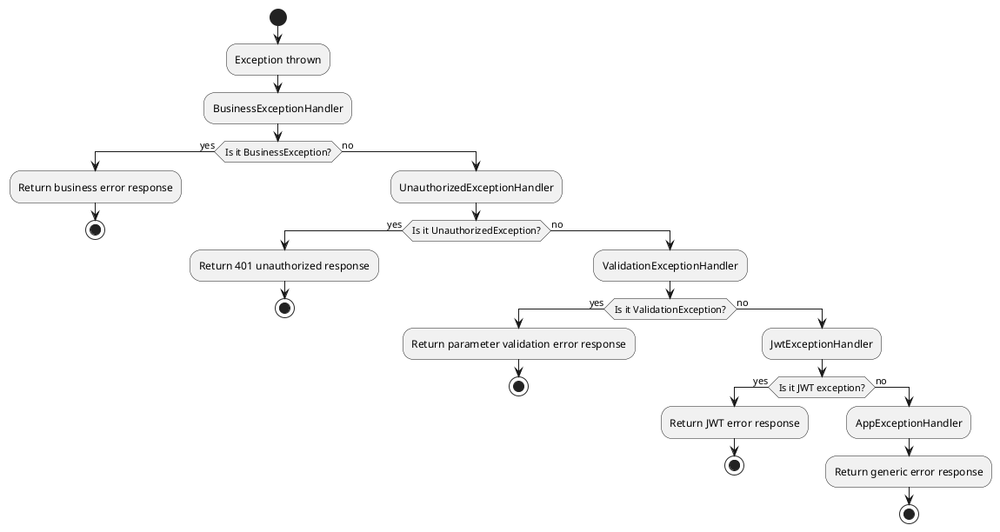

# Error Handling

## Table of Contents

- [Default Exception Handling Mechanism](#default-exception-handling-mechanism)
- [Exception Handling Flow](#exception-handling-flow)
- [Core Exception Handlers](#core-exception-handlers)
- [Business Exception Handling](#business-exception-handling)
- [Custom Exception Handler](#custom-exception-handler)
- [Debug Mode Features](#debug-mode-features)
- [Best Practices](#best-practices)
- [Common Issues](#common-issues)

## Default Exception Handling Mechanism

::: tip Prerequisite Knowledge
To understand MineAdmin's exception handling, you first need a certain understanding of [Hyperf](https://hyperf.io) error handling.
This article does not cover basic explanations; please first understand the basic concepts of Hyperf exception handling.
:::

MineAdmin implements a comprehensive exception handling mechanism based on the Hyperf framework. Multiple exception handlers are configured in `config/autoload/exceptions.php`, processing different types of exceptions sequentially using the Chain of Responsibility pattern.

## Exception Handling Flow



## Core Exception Handlers

### Exception Handler Configuration

::: code-group

```php [exceptions.php]
<?php

declare(strict_types=1);
/**
 * This file is part of MineAdmin.
 *
 * @link     https://www.mineadmin.com
 * @document https://doc.mineadmin.com
 * @contact  root@imoi.cn
 * @license  https://github.com/mineadmin/MineAdmin/blob/master/LICENSE
 */
use App\Exception\Handler\AppExceptionHandler;
use App\Exception\Handler\BusinessExceptionHandler;
use App\Exception\Handler\JwtExceptionHandler;
use App\Exception\Handler\UnauthorizedExceptionHandler;
use App\Exception\Handler\ValidationExceptionHandler;
use Hyperf\ExceptionHandler\Listener\ErrorExceptionHandler;
use Hyperf\HttpServer\Exception\Handler\HttpExceptionHandler;

return [
    'handler' => [
        'http' => [
            // Handles business exceptions - highest priority
            BusinessExceptionHandler::class,
            // Handles unauthorized exceptions
            UnauthorizedExceptionHandler::class,
            // Handles validator exceptions
            ValidationExceptionHandler::class,
            // Handles JWT exceptions
            JwtExceptionHandler::class,
            // Handles application exceptions - final fallback
            AppExceptionHandler::class,
        ],
    ],
];
```

:::

::: warning Important Notes
- The order of exception handlers is important; the earlier the handler, the higher the priority
- `AppExceptionHandler` as the fallback handler should always be placed last
- Do not modify the order of handlers unless you fully understand the implications
:::

### Base Exception Handler Class

All exception handlers inherit from `AbstractHandler`, providing unified processing logic:

::: code-group

```php [AbstractHandler.php]
<?php

declare(strict_types=1);
/**
 * This file is part of MineAdmin.
 *
 * @link     https://www.mineadmin.com
 * @document https://doc.mineadmin.com
 * @contact  root@imoi.cn
 * @license  https://github.com/mineadmin/MineAdmin/blob/master/LICENSE
 */

namespace App\Exception\Handler;

use App\Http\Common\Result;
use Hyperf\Codec\Json;
use Hyperf\Context\Context;
use Hyperf\Contract\ConfigInterface;
use Hyperf\Contract\StdoutLoggerInterface;
use Hyperf\ExceptionHandler\ExceptionHandler;
use Hyperf\ExceptionHandler\Formatter\FormatterInterface;
use Hyperf\HttpMessage\Stream\SwooleStream;
use Hyperf\Logger\LoggerFactory;
use Mine\Support\Logger\UuidRequestIdProcessor;
use Mine\Support\Traits\Debugging;
use Psr\Container\ContainerInterface;
use Swow\Psr7\Message\ResponsePlusInterface;

abstract class AbstractHandler extends ExceptionHandler
{
    use Debugging;

    public function __construct(
        private readonly ConfigInterface $config,
        private readonly ContainerInterface $container,
        private readonly LoggerFactory $loggerFactory
    ) {}

    /**
     * Subclasses must implement this method to define how to handle exceptions and return results
     */
    abstract public function handleResponse(\Throwable $throwable): Result;

    /**
     * Main entry point for handling exceptions
     */
    public function handle(\Throwable $throwable, ResponsePlusInterface $response)
    {
        // Report exception log
        $this->report($throwable);
        
        return value(function (ResponsePlusInterface $responsePlus) use ($throwable) {
            // In debug mode, automatically handle CORS and record detailed error information
            if ($this->isDebug()) {
                $responsePlus
                    ->setHeader('Access-Control-Allow-Origin', '*')
                    ->setHeader('Access-Control-Allow-Credentials', 'true')
                    ->setHeader('Access-Control-Allow-Methods', 'GET, POST, PATCH, PUT, DELETE, OPTIONS')
                    ->setHeader('Access-Control-Allow-Headers', 'DNT,Keep-Alive,User-Agent,Cache-Control,Content-Type,Authorization');
                
                // Record detailed exception information in context
                Context::set(self::class . '.throwable', [
                    'message' => $throwable->getMessage(),
                    'file' => $throwable->getFile(),
                    'line' => $throwable->getLine(),
                    'trace' => $throwable->getTrace(),
                ]);
            }
            return $responsePlus;
        }, $this->handlerRequestId(
            $this->handlerResult(
                $response,
                $this->handleResponse($throwable)
            )
        ));
    }

    /**
     * Report exception log, including console output and file recording
     */
    public function report(\Throwable $throwable)
    {
        // In debug mode, print formatted error information in the console
        if ($this->isDebug()) {
            $this->container->get(StdoutLoggerInterface::class)->error(
                $this->container->get(FormatterInterface::class)->format($throwable)
            );
        }
        
        // Record exception in error log file
        $this->loggerFactory
            ->get('error')
            ->error($throwable->getMessage(), ['exception' => $throwable]);
    }

    /**
     * Wrap result in response body
     */
    protected function handlerResult(ResponsePlusInterface $responsePlus, Result $result): ResponsePlusInterface
    {
        $responsePlus->setHeader('Content-Type', 'application/json; charset=utf-8');

        // In debug mode, return detailed exception information
        if ($this->isDebug()) {
            $result = $result->toArray();
            $result['throwable'] = Context::get(self::class . '.throwable');
            return $responsePlus
                ->setBody(new SwooleStream(Json::encode($result)));
        }

        return $responsePlus
            ->setBody(new SwooleStream(Json::encode($result)));
    }

    /**
     * Add request ID header to response for issue tracking
     */
    private function handlerRequestId(ResponsePlusInterface $responsePlus): ResponsePlusInterface
    {
        return $responsePlus->setHeader('Request-Id', UuidRequestIdProcessor::getUuid());
    }
}
```

```php [AppExceptionHandler.php]
<?php

declare(strict_types=1);

namespace App\Exception\Handler;

use App\Http\Common\Result;
use App\Http\Common\ResultCode;

/**
 * Application final exception handler
 * Acts as a fallback handler, catching all exceptions not handled by other handlers
 */
final class AppExceptionHandler extends AbstractHandler
{
    /**
     * Handle exception and return a unified error response
     */
    public function handleResponse(\Throwable $throwable): Result
    {
        // Stop exception propagation
        $this->stopPropagation();
        
        return new Result(
            ResultCode::FAIL,
            $throwable->getMessage() ?: 'System exception, please try again later'
        );
    }
    
    /**
     * This handler processes all types of exceptions
     */
    public function isValid(\Throwable $throwable): bool
    {
        return true;
    }
}
```

:::

## Result and ResultCode Core Classes

### Result Unified Response Class

The `Result` class is the standard format for all API responses in MineAdmin. It implements the `Arrayable` interface and supports OpenAPI documentation annotations:

::: code-group

```php [Result.php]
<?php

declare(strict_types=1);

namespace App\Http\Common;

use Hyperf\Contract\Arrayable;
use Hyperf\Swagger\Annotation as OA;

/**
 * @template T
 */
#[OA\Schema(title: 'Api Response', description: 'Api Response')]
class Result implements Arrayable
{
    /**
     * @param T $data
     */
    public function __construct(
        #[OA\Property(ref: 'ResultCode', title: 'Response Code')]
        public ResultCode $code = ResultCode::SUCCESS,
        #[OA\Property(title: 'Response Message', type: 'string')]
        public ?string $message = null,
        #[OA\Property(title: 'Response Data', type: 'array')]
        public mixed $data = []
    ) {
        // If no message is provided, automatically get default message from ResultCode
        if ($this->message === null) {
            $this->message = ResultCode::getMessage($this->code->value);
        }
    }

    public function toArray(): array
    {
        return [
            'code' => $this->code->value,
            'message' => $this->message,
            'data' => $this->data,
        ];
    }
}
```

:::

#### Usage Examples

::: code-group

```php [Success Response]
// Success response - using default success code
$result = new Result();

// Success response - with data
$result = new Result(data: ['id' => 1, 'name' => 'Zhang San']);

// Success response - custom message
$result = new Result(message: 'Operation completed successfully');
```

```php [Failure Response]
// Failure response - using default failure code
$result = new Result(ResultCode::FAIL, 'Operation failed');

// Failure response - using specific status code
$result = new Result(ResultCode::UNAUTHORIZED, 'User not logged in');

// Failure response - with error data
$result = new Result(
    ResultCode::UNPROCESSABLE_ENTITY, 
    'Parameter validation failed',
    ['errors' => ['email' => ['Invalid email format']]]
);
```

:::

### ResultCode Status Code Enum

`ResultCode` is a PHP 8.1 enum-based status code definition, using Hyperf's Constants feature to support internationalized messages:

::: code-group

```php [ResultCode.php]
<?php

declare(strict_types=1);

namespace App\Http\Common;

use Hyperf\Constants\Annotation\Constants;
use Hyperf\Constants\Annotation\Message;
use Hyperf\Constants\ConstantsTrait;
use Hyperf\Swagger\Annotation as OA;

#[Constants]
#[OA\Schema(title: 'ResultCode', type: 'integer', default: 200)]
enum ResultCode: int
{
    use ConstantsTrait;

    #[Message('result.success')]
    case SUCCESS = 200;

    #[Message('result.fail')]
    case FAIL = 500;

    #[Message('result.unauthorized')]
    case UNAUTHORIZED = 401;

    #[Message('result.forbidden')]
    case FORBIDDEN = 403;

    #[Message('result.not_found')]
    case NOT_FOUND = 404;

    #[Message('result.method_not_allowed')]
    case METHOD_NOT_ALLOWED = 405;

    #[Message('result.not_acceptable')]
    case NOT_ACCEPTABLE = 406;

    #[Message('result.conflict')]
    case UNPROCESSABLE_ENTITY = 422;

    #[Message('result.disabled')]
    case DISABLED = 423;
}
```

:::

#### Status Code Description

| Constant Name | Value | HTTP Status Code | Description | Usage Scenario |
|--------|------|-------------|------|----------|
| `SUCCESS` | 200 | 200 OK | Operation successful | Normal business processing success |
| `FAIL` | 500 | 500 Internal Server Error | System error | Generic system exception or business processing failure |
| `UNAUTHORIZED` | 401 | 401 Unauthorized | Unauthorized | User not logged in or invalid token |
| `FORBIDDEN` | 403 | 403 Forbidden | Access denied | User lacks permission to access resource |
| `NOT_FOUND` | 404 | 404 Not Found | Resource not found | Requested resource does not exist |
| `METHOD_NOT_ALLOWED` | 405 | 405 Method Not Allowed | Method not allowed | HTTP method is not supported |
| `NOT_ACCEPTABLE` | 406 | 406 Not Acceptable | Not acceptable | Requested content characteristics cannot be fulfilled |
| `UNPROCESSABLE_ENTITY` | 422 | 422 Unprocessable Entity | Unprocessable entity | Parameter validation failed, business rule validation failed |
| `DISABLED` | 423 | 423 Locked | Resource locked | User or resource is disabled |

#### Internationalization Support

`ResultCode` supports obtaining corresponding message text through Hyperf's multi-language mechanism:

::: code-group

```php [Language file - lang/zh_CN/result.php]
<?php

return [
    'success' => 'Operation successful',
    'fail' => 'Operation failed',
    'unauthorized' => 'User unauthorized',
    'forbidden' => 'Access denied',
    'not_found' => 'Resource not found',
    'method_not_allowed' => 'Method not allowed',
    'not_acceptable' => 'Unacceptable request',
    'conflict' => 'Parameter validation failed',
    'disabled' => 'Resource disabled',
];
```

```php [Get internationalized message]
// Get message via ResultCode
$message = ResultCode::getMessage(ResultCode::SUCCESS->value);
// Output: 'Operation successful'

// Automatically get message when constructing Result
$result = new Result(ResultCode::NOT_FOUND);
// $result->message is automatically 'Resource not found'
```

:::

## Business Exception Handling

### BusinessException Class

It is recommended to use `BusinessException` to throw business-related exceptions instead of directly using `throw new Exception`:

::: code-group

```php [BusinessException.php]
<?php

declare(strict_types=1);
/**
 * This file is part of MineAdmin.
 *
 * @link     https://www.mineadmin.com
 * @document https://doc.mineadmin.com
 * @contact  root@imoi.cn
 * @license  https://github.com/mineadmin/MineAdmin/blob/master/LICENSE
 */

namespace App\Exception;

use App\Http\Common\Result;
use App\Http\Common\ResultCode;

/**
 * Business exception class
 * Used to throw exceptions related to business logic
 */
class BusinessException extends \RuntimeException
{
    private Result $response;

    /**
     * @param ResultCode $code Result status code
     * @param string|null $message Error message
     * @param mixed $data Additional data
     */
    public function __construct(ResultCode $code = ResultCode::FAIL, ?string $message = null, mixed $data = [])
    {
        $this->response = new Result($code, $message, $data);
        parent::__construct($message ?? ResultCode::getMessage($code->value));
    }

    /**
     * Get structured response object
     */
    public function getResponse(): Result
    {
        return $this->response;
    }
}
```

```php [BusinessExceptionHandler.php]
<?php

declare(strict_types=1);

namespace App\Exception\Handler;

use App\Exception\BusinessException;
use App\Http\Common\Result;

/**
 * Business exception handler
 * Specifically handles exceptions of type BusinessException
 */
class BusinessExceptionHandler extends AbstractHandler
{
    /**
     * Handle business exception, directly return the result contained in the exception
     */
    public function handleResponse(\Throwable $throwable): Result
    {
        $this->stopPropagation();
        
        if ($throwable instanceof BusinessException) {
            return $throwable->getResponse();
        }
        
        // Fallback handling
        return new Result(
            ResultCode::FAIL,
            $throwable->getMessage()
        );
    }
    
    /**
     * Only handles exceptions of type BusinessException
     */
    public function isValid(\Throwable $throwable): bool
    {
        return $throwable instanceof BusinessException;
    }
}
```

:::

### Practical Usage Example

::: code-group

```php [UserService.php]
<?php

declare(strict_types=1);

namespace App\Service;

use App\Exception\BusinessException;
use App\Http\Common\ResultCode;

class UserService
{
    /**
     * User login verification
     */
    public function login(string $username, string $password): array
    {
        // Check username format
        if (empty($username)) {
            throw new BusinessException(
                ResultCode::UNPROCESSABLE_ENTITY,
                trans('validation.required', ['attribute' => 'username'])
            );
        }
        
        // Find user
        $user = $this->findUserByUsername($username);
        if (!$user) {
            throw new BusinessException(
                ResultCode::NOT_FOUND,
                trans('auth.user_not_found')
            );
        }
        
        // Verify password
        if (!$this->verifyPassword($password, $user['password'])) {
            throw new BusinessException(
                ResultCode::UNAUTHORIZED,
                trans('auth.invalid_credentials')
            );
        }
        
        // Check user status
        if ($user['status'] !== 'active') {
            throw new BusinessException(
                ResultCode::DISABLED,
                trans('auth.user_disabled'),
                ['reason' => $user['disable_reason'] ?? 'Unknown reason']
            );
        }
        
        return $user;
    }

    /**
     * Update user profile
     */
    public function updateProfile(int $userId, array $data): bool
    {
        $user = $this->findUserById($userId);
        if (!$user) {
            throw new BusinessException(
                ResultCode::NOT_FOUND,
                'User does not exist'
            );
        }

        // Check if email is already in use
        if (isset($data['email']) && $this->isEmailExists($data['email'], $userId)) {
            throw new BusinessException(
                ResultCode::UNPROCESSABLE_ENTITY,
                'Email is already in use by another user'
            );
        }

        return $this->updateUser($userId, $data);
    }
}
```

```php [UserController.php]
<?php

declare(strict_types=1);

namespace App\Controller;

use App\Service\UserService;
use App\Http\Common\Result;
use App\Http\Common\ResultCode;

class UserController extends AbstractController
{
    public function __construct(
        private readonly UserService $userService
    ) {}
    
    /**
     * User login
     * 
     * Business exceptions will be automatically caught by BusinessExceptionHandler and converted to appropriate responses
     */
    public function login(): Result
    {
        $username = $this->request->input('username');
        $password = $this->request->input('password');
        
        // If UserService throws BusinessException,
        // it will be automatically caught and return the appropriate error response
        $user = $this->userService->login($username, $password);
        
        // Token generation and other subsequent logic...
        $token = $this->generateToken($user);
        
        return $this->success([
            'token' => $token,
            'user' => $user
        ]);
    }

    /**
     * Update user profile
     */
    public function updateProfile(): Result
    {
        $userId = $this->getUserId();
        $data = $this->request->all();
        
        $this->userService->updateProfile($userId, $data);
        
        return $this->success(message: 'Profile updated successfully');
    }
}
```

:::

## Custom Exception Handler

When you need to handle specific types of exceptions, you can create a custom exception handler.

### Create Custom Exception Class

::: code-group

```php [PaymentException.php]
<?php

declare(strict_types=1);

namespace App\Exception;

use App\Http\Common\ResultCode;

/**
 * Payment-related exception
 */
class PaymentException extends \RuntimeException
{
    public function __construct(
        private readonly string $paymentMethod,
        private readonly string $transactionId,
        string $message = 'Payment processing failed',
        int $code = 0,
        ?\Throwable $previous = null
    ) {
        parent::__construct($message, $code, $previous);
    }

    public function getPaymentMethod(): string
    {
        return $this->paymentMethod;
    }

    public function getTransactionId(): string
    {
        return $this->transactionId;
    }
}
```

:::

### Create Custom Exception Handler

::: code-group

```php [PaymentExceptionHandler.php]
<?php

declare(strict_types=1);

namespace App\Exception\Handler;

use App\Exception\PaymentException;
use App\Http\Common\Result;
use App\Http\Common\ResultCode;

/**
 * Payment exception handler
 */
class PaymentExceptionHandler extends AbstractHandler
{
    public function handleResponse(\Throwable $throwable): Result
    {
        $this->stopPropagation();
        
        if ($throwable instanceof PaymentException) {
            // Record detailed information about the payment exception
            $this->loggerFactory
                ->get('payment')
                ->error('Payment exception', [
                    'payment_method' => $throwable->getPaymentMethod(),
                    'transaction_id' => $throwable->getTransactionId(),
                    'message' => $throwable->getMessage(),
                    'trace' => $throwable->getTraceAsString(),
                ]);
            
            return new Result(
                ResultCode::FAIL,
                'Payment processing failed, please try again later or contact customer service',
                [
                    'transaction_id' => $throwable->getTransactionId(),
                    'support_contact' => config('payment.support_contact'),
                ]
            );
        }
        
        return new Result(
            ResultCode::FAIL,
            $throwable->getMessage()
        );
    }
    
    public function isValid(\Throwable $throwable): bool
    {
        return $throwable instanceof PaymentException;
    }
}
```

:::

### Register Custom Exception Handler

Register your custom handler in `config/autoload/exceptions.php`:

::: code-group

```php [exceptions.php]
<?php

return [
    'handler' => [
        'http' => [
            // Business exception handler
            BusinessExceptionHandler::class,
            // Custom payment exception handler
            PaymentExceptionHandler::class,
            // Other handlers...
            UnauthorizedExceptionHandler::class,
            ValidationExceptionHandler::class,
            JwtExceptionHandler::class,
            AppExceptionHandler::class,
        ],
    ],
];
```

:::

### Using Custom Exception

::: code-group

```php [PaymentService.php]
<?php

declare(strict_types=1);

namespace App\Service;

use App\Exception\PaymentException;

class PaymentService
{
    public function processPayment(string $method, float $amount, string $transactionId): bool
    {
        try {
            // Call third-party payment interface
            $result = $this->callPaymentGateway($method, $amount, $transactionId);
            
            if (!$result['success']) {
                throw new PaymentException(
                    paymentMethod: $method,
                    transactionId: $transactionId,
                    message: "Payment failed: {$result['error_msg']}"
                );
            }
            
            return true;
        } catch (\Throwable $e) {
            // Wrap all payment-related exceptions as PaymentException
            throw new PaymentException(
                paymentMethod: $method,
                transactionId: $transactionId,
                message: "Payment processing exception: {$e->getMessage()}",
                previous: $e
            );
        }
    }
}
```

:::

## Debug Mode Features

### Enable Debug Mode

Set in the `.env` file:

```env
APP_DEBUG=true
```

### Debug Mode Features

When `APP_DEBUG=true`, the exception handler provides the following additional features:

1. **Detailed exception information**: The response includes the exception file, line number, and call stack
2. **Console output**: Exception information is output to the command line console
3. **CORS headers**: Automatically add cross-origin request headers for frontend debugging
4. **Request-Id**: Each response includes a unique request ID for log tracking

### Debug Response Format

Response example in debug mode:

::: code-group

```json [Debug Mode Response]
{
  "code": 500,
  "message": "User does not exist",
  "data": null,
  "throwable": {
    "message": "User does not exist",
    "file": "/app/Service/UserService.php",
    "line": 45,
    "trace": [
      {
        "file": "/app/Controller/UserController.php",
        "line": 23,
        "function": "findUser",
        "class": "App\\Service\\UserService",
        "type": "->"
      }
    ]
  }
}
```

```json [Production Mode Response]
{
  "code": 500,
  "message": "User does not exist",
  "data": null
}
```

:::

::: warning Security Reminder
In the production environment, be sure to disable debug mode (`APP_DEBUG=false`) to avoid leaking sensitive system information.
:::

## Best Practices

### 1. Hierarchical Exception Handling

```php
// Recommended: Use semantic exception types
throw new BusinessException(ResultCode::NOT_FOUND, trans('user.not_found'));

// Not recommended: Directly throw generic exceptions
throw new \Exception('User does not exist');
```

### 2. Use ResultCode Appropriately

```php
// Recommended: Use semantic result codes
throw new BusinessException(
    ResultCode::UNPROCESSABLE_ENTITY,
    trans('validation.email_format')
);

// Not recommended: Use generic failure codes
throw new BusinessException(
    ResultCode::FAIL,
    'Invalid email format'
);
```

### 3. Internationalize Exception Messages

```php
// Recommended: Use multi-language support
throw new BusinessException(
    ResultCode::NOT_FOUND,
    trans('auth.user_not_found')
);

// Acceptable: Use fixed text in specific situations
throw new BusinessException(
    ResultCode::FAIL,
    'System under maintenance, please try again later'
);
```

### 4. Log Detailed Context Information

```php
public function processOrder(int $orderId): bool
{
    try {
        // Business logic...
        return true;
    } catch (\Throwable $e) {
        // Record detailed context information
        logger('order')->error('Order processing failed', [
            'order_id' => $orderId,
            'user_id' => $this->getCurrentUserId(),
            'error' => $e->getMessage(),
            'trace' => $e->getTraceAsString(),
        ]);
        
        throw new BusinessException(
            ResultCode::FAIL,
            'Order processing failed, please try again later'
        );
    }
}
```

## Common Issues

### Q1: Exception not being caught correctly?

**Possible Causes:**
- The `isValid` method of the exception handler returns `false`
- The exception handler is not registered correctly
- The order of exception handlers is incorrect

**Solutions:**
1. Check the logic of the `isValid` method in the exception handler
2. Confirm that the exception handler is registered in `exceptions.php`
3. Adjust the order of exception handlers, ensuring more specific handlers come first

### Q2: Debug information leaked in production?

**Solutions:**
- Ensure the `.env` file in the production environment has `APP_DEBUG=false`
- Use environment variables or configuration management tools to ensure configuration isolation between environments

### Q3: Exception handler execution order is confusing?

**Solutions:**
- In `exceptions.php`, place more specific exception handlers first
- Ensure `AppExceptionHandler` is always last as the fallback handler

### Q4: Same exception logged multiple times by different handlers?

**Solutions:**
- Call `$this->stopPropagation()` in the specific exception handler to prevent the exception from continuing to propagate
- Only perform logging in the final handler

### Q5: How to handle exceptions in asynchronous tasks?

**Solutions:**
```php
// Use try-catch to wrap business logic in asynchronous tasks
use Hyperf\AsyncQueue\Job;

class SendEmailJob extends Job
{
    public function handle()
    {
        try {
            // Business logic for sending emails
            $this->sendEmail();
        } catch (BusinessException $e) {
            // Log business exception
            logger('job')->warning('Email sending business exception', [
                'job_id' => $this->getJobId(),
                'message' => $e->getMessage(),
            ]);
        } catch (\Throwable $e) {
            // Log system exception and rethrow for queue system to handle retries
            logger('job')->error('Email sending system exception', [
                'job_id' => $this->getJobId(),
                'error' => $e->getMessage(),
                'trace' => $e->getTraceAsString(),
            ]);
            throw $e;
        }
    }
}
```

Through the above exception handling mechanism, MineAdmin provides a complete, scalable error handling capability, helping developers build stable and reliable application systems.