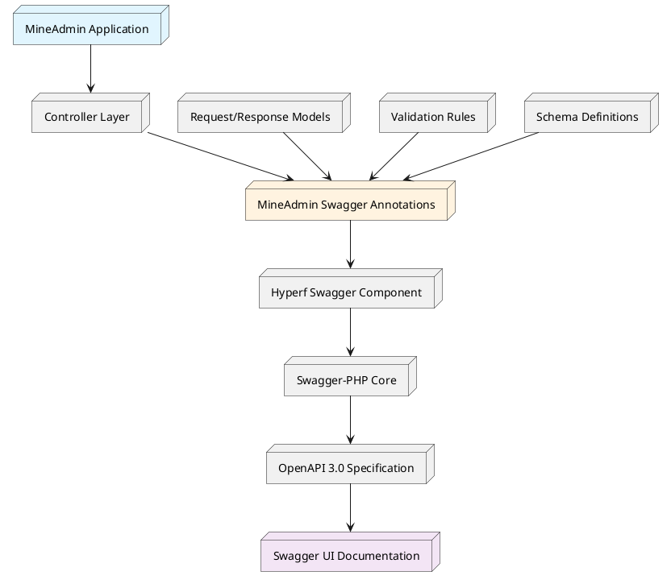
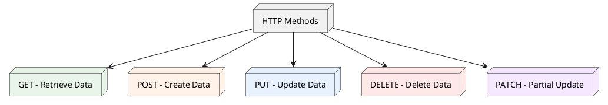
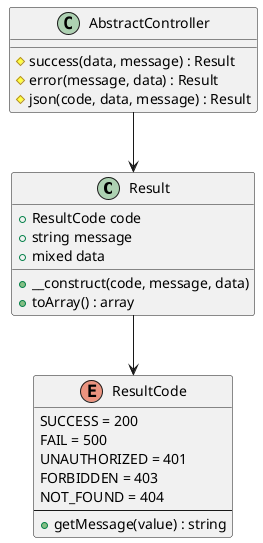
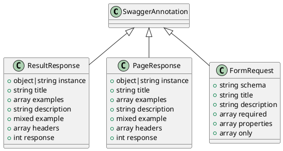
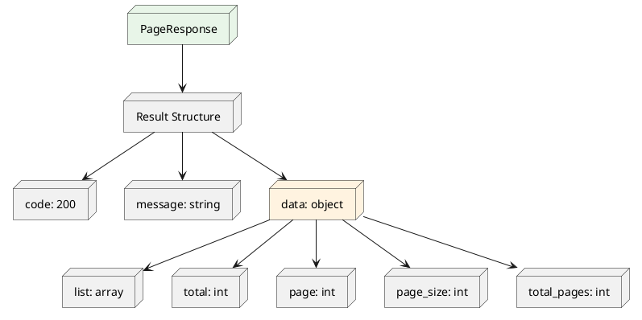

# Route & API Documentation System

## Table of Contents

1. [Overview & Architecture](#_1-overview-architecture)
2. [Quick Start](#_2-quick-start)
3. [HTTP Standards & Best Practices](#_3-http-standards-best-practices)
4. [Response Structure System](#_4-response-structure-system)
5. [MineAdmin Custom Annotations](#_5-mineadmin-custom-annotations)
6. [Practical Examples](#_6-practical-examples)
10. [FAQ & Solutions](#_10-faq-solutions)

---

## 1. Overview & Architecture

### 1.1 System Overview

MineAdmin includes a complete API documentation generation system based on the [Swagger/OpenAPI 3.0](https://swagger.io) specification, providing developers with powerful automatic API documentation generation and management capabilities.

**Access**: When developing locally, visit `http://localhost:9503/swagger` to view the complete API documentation.

### 1.2 Architecture Layers

::: tip Technology Stack Architecture

MineAdmin's API documentation system uses a multi-layer architecture design:

- **[mineadmin/swagger](https://github.com/mineadmin/Swagger)** - Dedicated Swagger annotation wrapper for MineAdmin
- **[hyperf/swagger](https://github.com/hyperf/swagger)** - Swagger integration component for the Hyperf framework
- **[zircote/swagger-php](https://github.com/zircote/swagger-php)** - Core PHP Swagger annotation processing
- **[OpenAPI Specification](https://github.com/OAI/OpenAPI-Specification)** - Industry-standard API documentation specification

:::

### 1.3 System Architecture Diagram



### 1.4 Core Advantages

- **Automated Documentation Generation**: Automatically generate complete API documentation based on code annotations.
- **Type Safety**: Strong typing support ensures consistency between documentation and actual code.
- **Real-time Synchronization**: Documentation updates automatically when code changes.
- **Interactive Testing**: Built-in Swagger UI supports direct API testing.
---

## 2. Quick Start

### 2.1 Basic Configuration

Ensure your project has MineAdmin's Swagger component correctly installed:

```bash
composer require mineadmin/swagger
```

### 2.2 First API Endpoint

Create a simple API endpoint:

```php
<?php

namespace App\Http\Admin\Controller;

use App\Http\Common\Result;
use Mine\Swagger\Attributes\ResultResponse;
use Hyperf\Swagger\Annotation as OA;

#[OA\Tag(name: "User Management", description: "User-related API endpoints")]
class UserController extends AbstractController
{
    #[OA\Get(
        path: "/admin/user/info",
        summary: "Get User Information",
        description: "Get detailed user information by user ID"
    )]
    #[ResultResponse(
        instance: new Result(data: ["id" => 1, "name" => "John Doe"]),
        title: "Successfully Fetched",
        description: "Successfully fetched user information"
    )]
    public function getUserInfo(): Result
    {
        return $this->success([
            'id' => 1,
            'name' => 'John Doe',
            'email' => 'john.doe@example.com'
        ]);
    }
}
```

### 2.3 Accessing the Documentation

After starting the server, visit `http://localhost:9503/swagger` to view the generated documentation.

---

## 3. HTTP Standards & Best Practices

### 3.1 RESTful API Design Principles

MineAdmin recommends following the RESTful architectural style to ensure consistency and predictability of API endpoints.

#### 3.1.1 HTTP Method Mapping



#### 3.1.2 Standard Route Design Patterns

Using the user management module as an example, demonstrating standard RESTful API design:

| HTTP Method | Route Path | Description | Response Data |
|---------|----------|---------|----------|
| `GET` | `/admin/user/list` | Get user list (paginated) | User list data |
| `GET` | `/admin/user/{id}` | Get single user details | Single user data |
| `POST` | `/admin/user` | Create new user | Created user data |
| `PUT` | `/admin/user/{id}` | Fully update user information | Updated user data |
| `PATCH` | `/admin/user/{id}` | Partially update user information | Updated user data |
| `DELETE` | `/admin/user/{id}` | Delete user | Deletion confirmation |

#### 3.1.3 Best Practice Recommendations

::: tip Design Principles

1. **Resource Naming**: Use nouns instead of verbs, prefer plural forms.
   ```
   ✅ /admin/users
   ❌ /admin/getUsers
   ```

2. **Nested Resources**: Reflect hierarchical relationships between resources.
   ```
   ✅ /admin/users/{id}/roles
   ❌ /admin/user-roles?user_id={id}
   ```

3. **Status Code Semantics**: Correctly use HTTP status codes.
   ```
   200 - Request successful
   201 - Resource created successfully
   400 - Request parameter error
   401 - Unauthorized access
   403 - Insufficient permissions
   404 - Resource not found
   500 - Internal server error
   ```

4. **Flexibility First**: Standards are foundational, but business requirements are key.
   - Follow RESTful principles but don't be constrained by strict norms.
   - Prioritize sustainable business iteration.
   - Maintain consistency within the team.

:::

### 3.2 URL Design Specification

#### 3.2.1 Naming Conventions

```php
// Recommended naming conventions
GET    /admin/users              // Get user list
GET    /admin/users/{id}         // Get specified user
POST   /admin/users              // Create user
PUT    /admin/users/{id}         // Update user
DELETE /admin/users/{id}         // Delete user

// Naming for special operations
POST   /admin/users/{id}/enable  // Enable user
POST   /admin/users/{id}/disable // Disable user
GET    /admin/users/search       // Search users
```

#### 3.2.2 Parameter Passing Conventions

```php
// Query parameters - for filtering, sorting, pagination
GET /admin/users?page=1&page_size=20&status=active&sort=created_at,desc

// Path parameters - for uniquely identifying resources
GET /admin/users/123

// Request body parameters - for complex data transfer
POST /admin/users
Content-Type: application/json
{
    "username": "zhangsan",
    "email": "zhangsan@example.com",
    "roles": [1, 2, 3]
}
```

---

## 4. Response Structure System

### 4.1 Unified Response Format

MineAdmin uses a unified response structure `\App\Http\Common\Result` to ensure consistency in the return format of all API endpoints.

### 4.2 Result Class Architecture



### 4.3 Core Implementation Code

#### 4.3.1 Result Response Class

::: code-group

```php [Result.php]
<?php

declare(strict_types=1);
/**
 * This file is part of MineAdmin.
 */

namespace App\Http\Common;

use Hyperf\Contract\Arrayable;
use Hyperf\Swagger\Annotation as OA;

/**
 * Unified API response structure
 * @template T
 */
#[OA\Schema(title: 'API Response Structure', description: 'Unified API response format')]
class Result implements Arrayable
{
    public function __construct(
        #[OA\Property(ref: 'ResultCode', title: 'Response Status Code', description: 'Business status code, different from HTTP status code')]
        public ResultCode $code = ResultCode::SUCCESS,
        
        #[OA\Property(title: 'Response Message', type: 'string', description: 'Response description information')]
        public ?string $message = null,
        
        #[OA\Property(title: 'Response Data', type: 'mixed', description: 'Actual business data')]
        public mixed $data = []
    ) {
        if ($this->message === null) {
            $this->message = ResultCode::getMessage($this->code->value);
        }
    }

    /**
     * Convert to array format.
     */
    public function toArray(): array
    {
        return [
            'code' => $this->code->value,
            'message' => $this->message,
            'data' => $this->data,
        ];
    }
}
```

```php [AbstractController.php]
<?php

namespace App\Http\Common\Controller;

use App\Http\Common\Result;
use App\Http\Common\ResultCode;

/**
 * Base controller class.
 * Provides unified response methods.
 */
abstract class AbstractController
{
    /**
     * Successful response.
     */
    protected function success(mixed $data = [], ?string $message = null): Result
    {
        return new Result(ResultCode::SUCCESS, $message, $data);
    }

    /**
     * Error response.
     */
    protected function error(?string $message = null, mixed $data = []): Result
    {
        return new Result(ResultCode::FAIL, $message, $data);
    }

    /**
     * Custom response.
     */
    protected function json(ResultCode $code, mixed $data = [], ?string $message = null): Result
    {
        return new Result($code, $message, $data);
    }
    
    /**
     * Paginated response.
     */
    protected function paginate(array $list, int $total, int $page = 1, int $pageSize = 10): Result
    {
        return $this->success([
            'list' => $list,
            'total' => $total,
            'page' => $page,
            'page_size' => $pageSize,
            'total_pages' => ceil($total / $pageSize)
        ]);
    }
}
```

```php [AdminController.php]
<?php

namespace App\Http\Admin\Controller;

use App\Http\Common\Controller\AbstractController as Base;
use Hyperf\Context\ApplicationContext;
use Hyperf\HttpServer\Contract\RequestInterface;

/**
 * Admin backend base controller.
 * Extends pagination handling functionality.
 */
abstract class AbstractController extends Base
{
    /**
     * Get the current page number.
     */
    protected function getCurrentPage(): int
    {
        return (int) $this->getRequest()->input('page', 1);
    }

    /**
     * Get the page size.
     */
    protected function getPageSize(int $default = 10, int $max = 100): int
    {
        $size = (int) $this->getRequest()->input('page_size', $default);
        return min($size, $max); // Limit maximum page size
    }

    /**
     * Get the request instance.
     */
    protected function getRequest(): RequestInterface
    {
        return ApplicationContext::getContainer()->get(RequestInterface::class);
    }
    
    /**
     * Get ordering parameters.
     */
    protected function getOrderBy(string $default = 'id'): array
    {
        $sort = $this->getRequest()->input('sort', $default);
        $order = $this->getRequest()->input('order', 'asc');
        
        return [$sort, in_array(strtolower($order), ['asc', 'desc']) ? $order : 'asc'];
    }
}
```

:::

### 4.4 ResultCode Enum Class

MineAdmin provides a complete set of business status code enums for standardizing API response status information.

#### 4.4.1 Core Implementation

```php
<?php

declare(strict_types=1);
/**
 * This file is part of MineAdmin.
 */

namespace App\Http\Common;

use Hyperf\Constants\Annotation\Constants;
use Hyperf\Constants\Annotation\Message;
use Hyperf\Constants\ConstantsTrait;
use Hyperf\Swagger\Annotation as OA;

/**
 * Business Status Code Enum.
 * Provides standardized API response status codes.
 */
#[Constants]
#[OA\Schema(title: 'ResultCode', type: 'integer', default: 200, description: 'Business status code')]
enum ResultCode: int
{
    use ConstantsTrait;

    // Success status
    #[Message('Operation successful')]
    case SUCCESS = 200;

    // General error status
    #[Message('Operation failed')]
    case FAIL = 500;

    #[Message('Unauthorized access')]
    case UNAUTHORIZED = 401;

    #[Message('Insufficient permissions')]
    case FORBIDDEN = 403;

    #[Message('Resource not found')]
    case NOT_FOUND = 404;

    #[Message('Method not allowed')]
    case METHOD_NOT_ALLOWED = 405;

    #[Message('Not acceptable')]
    case NOT_ACCEPTABLE = 406;

    #[Message('Unprocessable entity')]
    case UNPROCESSABLE_ENTITY = 422;
    
    // Business-related errors
    #[Message('Parameter validation failed')]
    case VALIDATION_ERROR = 10001;
    
    #[Message('Business logic error')]
    case BUSINESS_ERROR = 10002;
    
    #[Message('Database operation failed')]
    case DATABASE_ERROR = 10003;
    
    #[Message('External service call failed')]
    case EXTERNAL_SERVICE_ERROR = 10004;
}
```

#### 4.4.2 Response Format Examples

Response formats for different status codes:

```json
// Successful response
{
    "code": 200,
    "message": "Operation successful",
    "data": {
        "id": 1,
        "username": "admin"
    }
}

// Error response
{
    "code": 10001,
    "message": "Parameter validation failed",
    "data": {
        "errors": {
            "username": ["Username cannot be empty"]
        }
    }
}

// Paginated response
{
    "code": 200,
    "message": "Operation successful",
    "data": {
        "list": [...],
        "total": 100,
        "page": 1,
        "page_size": 20,
        "total_pages": 5
    }
}
```

### 4.5 Usage Best Practices

#### 4.5.1 Usage in Controllers

```php
class UserController extends AbstractController
{
    public function index(): Result
    {
        try {
            $users = $this->userService->getList();
            return $this->success($users, 'User list retrieved successfully');
        } catch (ValidationException $e) {
            return $this->json(ResultCode::VALIDATION_ERROR, [], $e->getMessage());
        } catch (\Exception $e) {
            return $this->error('System error, please try again later');
        }
    }
}
```

---

## 5. MineAdmin Custom Annotations

MineAdmin provides three core custom Swagger annotations to simplify the writing and maintenance of API documentation. All annotations are located under the `Mine\Swagger\Attributes\` namespace.

### 5.1 Annotation Architecture Overview



### 5.2 ResultResponse Annotation

Used to define the response structure for a single resource or operation, automatically generating standard API response documentation.

#### 5.2.1 Constructor Signature

```php
ResultResponse::__construct(
    object|string $instance,           // The class instance or class name of the response data
    ?string $title = null,             // Response title
    ?array $examples = null,           // Array of multiple examples
    ?string $description = null,       // Response description
    mixed $example = Generator::UNDEFINED, // Single example
    ?array $headers = null,            // Response header information
    ?int $response = 200               // HTTP status code
)
```

#### 5.2.2 Parameter Details

| Parameter | Type | Required | Description |
|-----------|------|----------|-------------|
| `$instance` | `object\|string` | ✅ | The class instance or class name of the response data, supports automatic annotation parsing |
| `$title` | `string` | ❌ | Response title, used for documentation display |
| `$examples` | `array` | ❌ | Multiple response examples, in key-value form |
| `$description` | `string` | ❌ | Detailed response description |
| `$example` | `mixed` | ❌ | Single response example, JSON string or object |
| `$headers` | `array` | ❌ | Custom response header information |
| `$response` | `int` | ❌ | HTTP status code, default 200 |

#### 5.2.3 Practical Example

Complete example based on a user login endpoint:

::: code-group

```php [Login Controller]
<?php

namespace App\Http\Admin\Controller;

use App\Http\Common\Result;
use App\Http\Admin\Request\PassportLoginRequest;
use App\Schema\PassportLoginVo;
use Mine\Swagger\Attributes\ResultResponse;
use Hyperf\Swagger\Annotation as OA;

class PassportController extends AbstractController
{
    #[OA\Post(
        path: '/admin/passport/login',
        summary: 'User Login',
        description: 'Administrator user login endpoint',
        tags: ['Authentication Management']
    )]
    #[ResultResponse(
        instance: new Result(data: new PassportLoginVo()),
        title: 'Login Successful',
        description: 'Token information returned after successful user login',
        example: '{"code":200,"message":"Login successful","data":{"access_token":"eyJ0eXAiOiJKV1QiLCJhbGciOiJIUzI1NiJ9...","refresh_token":"eyJ0eXAiOiJKV1QiLCJhbGciOiJIUzI1NiJ9...","expire_at":7200}}'
    )]
    public function login(PassportLoginRequest $request): Result
    {
        $credentials = $request->validated();
        $tokenData = $this->authService->login($credentials);
        
        return $this->success($tokenData, 'Login successful');
    }
}
```

```php [Response Data Model]
<?php

namespace App\Schema;

use Hyperf\Swagger\Annotation as OA;

/**
 * Login successful response data model.
 */
#[OA\Schema(
    title: 'Login Response Data',
    description: 'Token information returned after successful user login',
    type: 'object'
)]
final class PassportLoginVo
{
    #[OA\Property(
        property: 'access_token',
        description: 'Access token for API request authentication',
        type: 'string',
        example: 'eyJ0eXAiOiJKV1QiLCJhbGciOiJIUzI1NiJ9.eyJpYXQiOjE3MjIwOTQwNTY...'
    )]
    public string $access_token;

    #[OA\Property(
        property: 'refresh_token',
        description: 'Refresh token for obtaining a new access token',
        type: 'string',
        example: 'eyJ0eXAiOiJKV1QiLCJhbGciOiJIUzI1NiJ9.eyJpYXQiOjE3MjIwOTQwNTY...'
    )]
    public string $refresh_token;

    #[OA\Property(
        property: 'expire_at',
        description: 'Token expiration time, in seconds',
        type: 'integer',
        example: 7200
    )]
    public int $expire_at;

    #[OA\Property(
        property: 'user_info',
        description: 'Basic user information',
        type: 'object',
        properties: [
            'id' => ['type' => 'integer', 'description' => 'User ID'],
            'username' => ['type' => 'string', 'description' => 'Username'],
            'nickname' => ['type' => 'string', 'description' => 'Nickname'],
        ]
    )]
    public array $user_info;
}
```

:::

#### 5.2.4 Best Practices

::: warning Important Notes

1. **instance Parameter**: It is recommended to use a concrete class instance rather than a class name to ensure the annotation is parsed correctly.
2. **Example Data**: Provide realistic and complete example data to facilitate frontend developer understanding.
3. **Description**: Detail the business meaning and usage scenarios of the response.
4. **Status Code**: Set the appropriate HTTP status code based on the actual business scenario.

:::

### 5.3 PageResponse Annotation

A response structure annotation specifically for paginated data, automatically generating standard response documentation containing pagination information.

#### 5.3.1 Constructor Signature

The constructor for `PageResponse` is identical to `ResultResponse`, but semantically dedicated to paginated responses.

```php
PageResponse::__construct(
    object|string $instance,           // The class instance or class name of the paginated data item
    ?string $title = null,             // Response title
    ?array $examples = null,           // Array of multiple examples
    ?string $description = null,       // Response description
    mixed $example = Generator::UNDEFINED, // Single example
    ?array $headers = null,            // Response header information
    ?int $response = 200               // HTTP status code
)
```

#### 5.3.2 Paginated Response Structure



### 5.4 FormRequest Annotation

A structured documentation annotation specifically for request parameters, automatically generating request parameter documentation based on existing Schema classes.

#### 5.4.1 Constructor Signature

```php
FormRequest::__construct(
    ?string $schema = null,        // The schema class name to parse
    ?string $title = null,         // Form title
    ?string $description = null,   // Form description
    ?array $required = null,       // Array of required fields
    ?array $properties = null,     // Additional property definitions
    array $only = []               // Display only specified fields
)
```

#### 5.4.2 Parameter Details

| Parameter | Type | Required | Description |
|-----------|------|----------|-------------|
| `$schema` | `string` | ❌ | Base Schema class name for field parsing |
| `$title` | `string` | ❌ | Request form title |
| `$description` | `string` | ❌ | Detailed request form description |
| `$required` | `array` | ❌ | List of required fields |
| `$properties` | `array` | ❌ | Additional field property definitions |
| `$only` | `array` | ❌ | Display only specified fields, used for field filtering |

---

## 6. Practical Examples

### 6.1 Complete CRUD Endpoint Example

Using article management as an example, demonstrating a complete CRUD endpoint implementation:

```php
<?php

namespace App\Http\Admin\Controller;

use App\Http\Common\Result;
use App\Http\Admin\Request\ArticleRequest;
use App\Schema\ArticleSchema;
use Mine\Swagger\Attributes\{ResultResponse, PageResponse, FormRequest};
use Hyperf\Swagger\Annotation as OA;

#[OA\Tag(name: "Article Management", description: "CRUD operations for articles")]
class ArticleController extends AbstractController
{
    /**
     * Get article list.
     */
    #[OA\Get(
        path: "/admin/articles",
        summary: "Get Article List",
        description: "Paginated article list, supports search and filtering"
    )]
    #[PageResponse(instance: ArticleSchema::class, title: "Article List")]
    public function index(): Result
    {
        $filters = $this->getRequest()->all();
        $page = $this->getCurrentPage();
        $pageSize = $this->getPageSize();
        
        $result = $this->articleService->paginate($filters, $page, $pageSize);
        return $this->paginate($result['list'], $result['total'], $page, $pageSize);
    }

    /**
     * Get single article.
     */
    #[OA\Get(
        path: "/admin/articles/{id}",
        summary: "Get Article Details",
        description: "Get detailed information for a single article by ID"
    )]
    #[OA\Parameter(name: "id", description: "Article ID", in: "path", required: true, schema: new OA\Schema(type: "integer"))]
    #[ResultResponse(instance: new Result(data: new ArticleSchema()), title: "Article Details")]
    public function show(int $id): Result
    {
        $article = $this->articleService->findById($id);
        return $this->success($article);
    }

    /**
     * Create article.
     */
    #[OA\Post(
        path: "/admin/articles",
        summary: "Create Article",
        description: "Create a new article"
    )]
    #[OA\RequestBody(content: new OA\JsonContent(ref: ArticleRequest::class))]
    #[ResultResponse(instance: new Result(data: new ArticleSchema()), title: "Creation Successful", response: 201)]
    public function store(ArticleRequest $request): Result
    {
        $data = $request->validated();
        $article = $this->articleService->create($data);
        return $this->success($article, 'Article created successfully');
    }

    /**
     * Update article.
     */
    #[OA\Put(
        path: "/admin/articles/{id}",
        summary: "Update Article",
        description: "Update information for a specified article"
    )]
    #[OA\Parameter(name: "id", description: "Article ID", in: "path", required: true, schema: new OA\Schema(type: "integer"))]
    #[OA\RequestBody(content: new OA\JsonContent(ref: ArticleRequest::class))]
    #[ResultResponse(instance: new Result(data: new ArticleSchema()), title: "Update Successful")]
    public function update(int $id, ArticleRequest $request): Result
    {
        $data = $request->validated();
        $article = $this->articleService->update($id, $data);
        return $this->success($article, 'Article updated successfully');
    }

    /**
     * Delete article.
     */
    #[OA\Delete(
        path: "/admin/articles/{id}",
        summary: "Delete Article",
        description: "Delete the specified article"
    )]
    #[OA\Parameter(name: "id", description: "Article ID", in: "path", required: true, schema: new OA\Schema(type: "integer"))]
    #[ResultResponse(instance: new Result(), title: "Deletion Successful")]
    public function destroy(int $id): Result
    {
        $this->articleService->delete($id);
        return $this->success([], 'Article deleted successfully');
    }
}
```

### 6.2 Request Validation Class Example

```php
<?php

namespace App\Http\Admin\Request;

use App\Schema\ArticleSchema;
use Hyperf\Validation\Request\FormRequest;
use Mine\Swagger\Attributes\FormRequest as FormRequestAnnotation;

#[FormRequestAnnotation(
    schema: ArticleSchema::class,
    title: "Article Request Parameters",
    description: "Request parameters when creating or updating an article",
    required: ['title', 'content', 'status'],
    only: ['title', 'content', 'excerpt', 'status', 'category_id', 'tags']
)]
class ArticleRequest extends FormRequest
{
    public function authorize(): bool
    {
        return true;
    }

    public function rules(): array
    {
        return [
            'title' => 'required|string|max:200',
            'content' => 'required|string',
            'excerpt' => 'nullable|string|max:500',
            'status' => 'required|integer|in:0,1',
            'category_id' => 'nullable|integer|exists:categories,id',
            'tags' => 'nullable|array',
            'tags.*' => 'integer|exists:tags,id',
        ];
    }

    public function attributes(): array
    {
        return [
            'title' => 'Article Title',
            'content' => 'Article Content',
            'excerpt' => 'Article Excerpt',
            'status' => 'Publish Status',
            'category_id' => 'Category ID',
            'tags' => 'Tag List',
        ];
    }
}
```

### 6.3 Data Model Schema Example

```php
<?php

namespace App\Schema;

use Hyperf\Swagger\Annotation as OA;

#[OA\Schema(title: "Article Information", description: "Detailed article information structure")]
class ArticleSchema
{
    #[OA\Property(property: "id", title: "Article ID", type: "integer")]
    public int $id;

    #[OA\Property(property: "title", title: "Article Title", type: "string", example: "This is a test article")]
    public string $title;

    #[OA\Property(property: "content", title: "Article Content", type: "string")]
    public string $content;

    #[OA\Property(property: "excerpt", title: "Article Excerpt", type: "string")]
    public ?string $excerpt;

    #[OA\Property(property: "status", title: "Publish Status", type: "integer", description: "0-Draft, 1-Published")]
    public int $status;

    #[OA\Property(property: "category", title: "Article Category", type: "object", 
        properties: [
            "id" => ["type" => "integer", "description" => "Category ID"],
            "name" => ["type" => "string", "description" => "Category Name"]
        ]
    )]
    public ?array $category;

    #[OA\Property(property: "tags", title: "Article Tags", type: "array", 
        items: new OA\Items(type: "object", 
            properties: [
                "id" => ["type" => "integer", "description" => "Tag ID"],
                "name" => ["type" => "string", "description" => "Tag Name"]
            ]
        )
    )]
    public array $tags;

    #[OA\Property(property: "created_at", title: "Creation Time", type: "string", format: "date-time")]
    public string $created_at;

    #[OA\Property(property: "updated_at", title: "Update Time", type: "string", format: "date-time")]
    public string $updated_at;
}
```

---

## 7. Performance Optimization & Best Practices

### 7.1 Selective Scanning

```php
// config/autoload/swagger.php
// Only scan necessary directories, avoid full project scans
    'scan' => [
        'paths' => [
            Finder::create()
                ->in([BASE_PATH . '/app/Http', BASE_PATH . '/app/Schema'])
                ->name('*.php')
                ->getIterator()
        ],
    ],
```

### 7.2 Code Organization Best Practices

#### 7.2.1 Suggested Directory Structure

```
app/
├── Http/
│   ├── Admin/
│   │   ├── Controller/          # Admin backend controllers
│   │   └── Request/            # Request validation classes
│   └── Common/
│       ├── Result.php          # Unified response structure
│       └── ResultCode.php      # Status code enum
├── Schema/                     # Swagger Schema definitions
│   ├── UserSchema.php
│   └── ArticleSchema.php
└── Service/                    # Business logic layer
    ├── UserService.php
    └── ArticleService.php
```

---

## 8. Error Handling & Debugging

### 8.1 Common Error Types

#### 8.1.1 Annotation Parsing Errors

```php
// ❌ Incorrect example - Annotation syntax error
#[ResultResponse(
    instance: UserSchema,  // Missing ::class
    title = 'User Information'      // Used = instead of :
)]

// ✅ Correct example
#[ResultResponse(
    instance: UserSchema::class,
    title: 'User Information'
)]
```

#### 8.1.2 Circular Reference Issues

```php
// ❌ May cause circular references
class UserSchema
{
    #[OA\Property(ref: 'GroupSchema')]
    public GroupSchema $group;
}

class GroupSchema
{
    #[OA\Property(type: 'array', items: new OA\Items(ref: 'UserSchema'))]
    public array $users;
}

// ✅ Use lazy loading to avoid circular references
class UserSchema
{
    #[OA\Property(ref: '#/components/schemas/GroupSchema')]
    public array $group;
}
```

### 8.2 Debugging Tips

#### 8.2.1 Enable Detailed Error Logging

```php
// config/autoload/logger.php
return [
    'swagger' => [
        'handler' => [
            'class' => Monolog\Handler\StreamHandler::class,
            'constructor' => [
                'stream' => BASE_PATH . '/runtime/logs/swagger.log',
                'level' => Monolog\Logger::DEBUG,
            ],
        ],
        'formatter' => [
            'class' => Monolog\Formatter\LineFormatter::class,
        ],
    ],
];
```

#### 8.2.2 Documentation-Related Commands

```shell
# Regenerate Swagger documentation
php bin/hyperf.php gen:swagger
# Generate Swagger Schema based on specified model
php bin/hyperf.php gen:swagger-schema
```

---

## 10. FAQ & Solutions

### 10.1 Annotation-Related Issues

#### 10.1.1 Annotations Not Taking Effect

**Problem Description**: Annotations were added but do not appear in the Swagger documentation.

**Possible Causes**:
1. Incorrect annotation syntax
2. Class not being scanned
3. Cache issues

**Solutions**:

```php
// 1