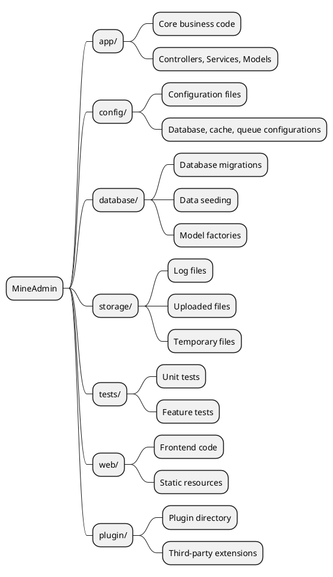
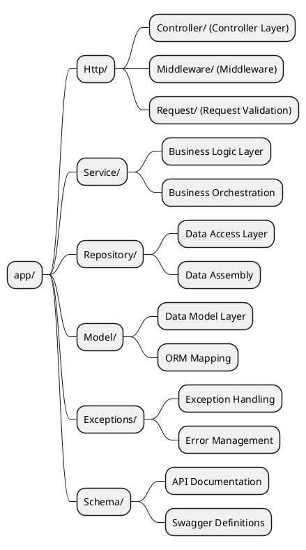
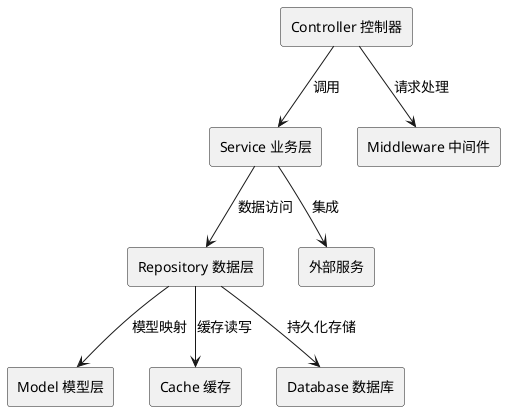

# Project Directory Structure

MineAdmin adopts a modern layered architecture design, providing a clear code organization structure and best practices. This document will detail the project's directory structure, design philosophy, and development specifications.

## Overview

MineAdmin's project structure references the design philosophy of the [Laravel](https://laravel.com/) framework, while also incorporating modern layered architecture patterns. If you are familiar with Laravel development, understanding MineAdmin's structure will be very easy.

### Architecture Philosophy

MineAdmin adopts the following core design principles:

- **Layered Architecture**: Clear layering of Controller → Service → Repository → Model
- **Separation of Concerns**: Each directory has clear responsibility boundaries
- **Extensibility**: Supports plugin development and modular extensions
- **Standardization**: Follows PSR specifications and best practices

## Project Root Directory Structure



### Detailed Directory Descriptions

#### `/app` - Application Core Directory

The core business logic of the application, containing controllers, service layer, data layer, and other core components.

**Main Features:**
- Contains 99% of the business code
- Follows MVC layered architecture
- Supports modular development

#### `/config` - Configuration Directory

Stores all application configuration files, providing flexible environment configuration management.

**Typical Configuration Files:**
- `database.php` - Database configuration
- `cache.php` - Cache configuration
- `queue.php` - Queue configuration

#### `/database` - Database Directory

Manages all files related to the database, including structural changes and test data.

**Directory Structure:**
```
database/
├── migrations/     # Database migration files
├── seeders/        # Data seeding files
```

#### `/storage` - Storage Directory

Stores files and data generated during application runtime.

**Directory Purposes:**
- `uploads/` - User uploaded files
- `swagger/` - API documentation files

#### `/tests` - Test Directory

Contains automated test suites to ensure code quality and functional correctness.

**Test Types:**
- **Unit Tests** - Test individual classes or methods
- **Feature Tests** - Test complete business processes
- **API Tests** - Test API interfaces

#### `/web` - Frontend Directory

Stores frontend application code and static resource files.

#### `/plugin` - Plugin Directory

Stores plugin packages downloaded from the plugin marketplace, supporting system function extensions.

## App Directory Deep Dive

The `app` directory is the core of the entire application, employing a strict layered architecture design.



### Http Directory - Request Handling Layer

The entry layer responsible for handling all HTTP requests, containing controllers, middleware, and request validation.

#### Directory Structure
```
Http/
├── Admin/              # Backend Management Module
│   ├── Controller/     # Backend Controllers
│   ├── Middleware/     # Backend Middleware
│   ├── Request/        # Backend Request Validation Classes
│   ├── Subscriber/     # Event Subscribers
│   └── Vo/            # Value Object Classes
├── Api/                # API Interface Module
│   ├── Controller/     # API Controllers
│   │   └── V1/        # API Versioning
│   ├── Middleware/     # API Middleware
│   └── Request/        # API Request Validation Classes
│       └── V1/        # API Version Request Classes
├── Common/             # Common Module
│   ├── Controller/     # Common Controllers
│   ├── Event/         # Event Classes
│   ├── Middleware/     # Common Middleware
│   ├── Request/        # Common Request Classes
│   ├── Result.php      # Response Result Class
│   ├── ResultCode.php  # Result Status Codes
│   └── Swagger/        # API Documentation Configuration
└── CurrentUser.php     # Current User Context
```

#### Modular Architecture Description

**Admin Module** - Backend Management Functions
- Includes backend functions like permission management, user management, menu management
- Adopts a complete MVC structure, including event subscribers and value objects

**Api Module** - External API Interfaces
- Supports versioning (V1, V2, etc.)
- Independent authentication middleware and request validation
- RESTful API design specifications

**Common Module** - Common Components
- Provides shared basic functionalities across modules
- Unified response format and status code management
- API documentation auto-generation configuration

### Service Directory - Business Logic Layer

The Service layer is where core business logic is implemented, responsible for the orchestration and execution of business rules.

#### Design Principles

1. **Single Responsibility** - Each Service class handles only one business domain
2. **Dependency Injection** - Dependencies are injected via constructors
3. **Transaction Management** - Ensures atomicity of business operations
4. **Exception Handling** - Unified exception handling mechanism

#### Service Layer Responsibilities

**Core Functions:**
- Business logic orchestration and execution
- Transaction management and data consistency
- Calling the Repository layer for data operations
- Business rule validation and processing

### Repository Directory - Data Access Layer

The Repository pattern provides an abstraction layer for data access, encapsulating data query and manipulation logic.

#### Design Features

- **Data Source Abstraction** - Allows easy switching of data sources (MySQL, Redis, ES, etc.)
- **Query Reusability** - Reuse common query logic
- **Cache Integration** - Transparent cache layer integration
- **Performance Optimization** - Query optimization and batch operations

#### Repository Layer Features

**Main Responsibilities:**
- Data access abstraction layer
- Encapsulation of complex query logic
- Implementation of caching strategies
- Data source switching and optimization

### Model Directory - Data Model Layer

The Model layer is based on Hyperf's Eloquent ORM, providing object-relational mapping for database tables.

#### Model Features

- **Relationships** - Define relationships between tables
- **Accessors/Mutators** - Data formatting
- **Event Listening** - Model lifecycle events
- **Soft Deletes** - Support for logical deletion

#### Model Layer Features

**Core Functions:**
- Data table mapping and relationship definition
- Attribute accessors and mutators
- Model events and observers
- Data type conversion and validation

### Exceptions Directory - Exception Handling

A unified exception handling mechanism providing user-friendly error messages and logging.

### Schema Directory - API Documentation

Contains Swagger/OpenAPI document definitions for API documentation generation.

::: danger Important Reminder
Schema classes are strictly prohibited from participating in business logic scheduling; they are only used for API documentation generation.
:::

## Development Best Practices

### Code Organization Standards

1. **Naming Conventions**
   - Class names use `PascalCase`
   - Method names use `camelCase`
   - Constants use `UPPER_SNAKE_CASE`

2. **File Organization**
   - One class per file
   - File name matches class name
   - Use namespaces appropriately

3. **Dependency Injection**
   - Prefer constructor injection
   - Avoid static calls
   - Program to interfaces

### Architecture Pattern Suggestions



### Error Handling Strategy

1. **Exception Classification**
   - Business Exceptions - Expected errors
   - System Exceptions - Unexpected errors
   - Validation Exceptions - Data format errors

2. **Logging**
   - Record key operations
   - Log exception information
   - Performance monitoring records

## Related Resources

### Reference Documentation

- [Laravel Official Documentation](https://laravel.com/docs/11.x)
- [Laravel Chinese Documentation](https://learnku.com/docs/laravel/10.x)
- [Hyperf Coroutine Framework](https://hyperf.wiki/3.1/#/en/)

::: warning ORM Differences
MineAdmin uses the coroutine version of Eloquent ORM maintained by [Hyperf](https://github.com/hyperf/hyperf). There are some differences in usage compared to the official Laravel version. Please pay attention to special usage patterns in the coroutine environment during development.
:::