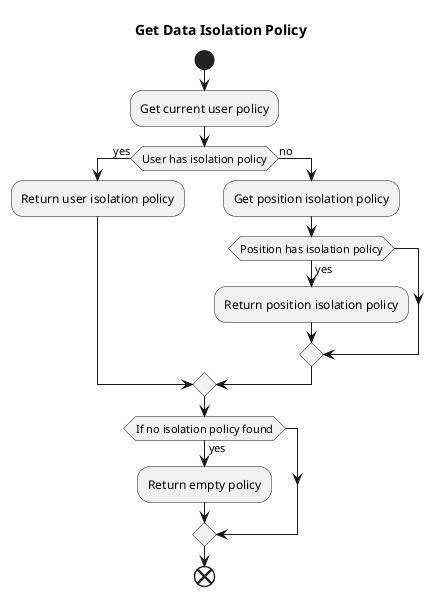

# Data Permission Configuration and Usage Examples

This article explains the configuration and usage of various strategies in data permission configuration.

## Data Isolation Methods

Data isolation currently only supports row-level isolation but supports multiple isolation strategies.

It is mainly divided into isolation methods based on the creator and the department.

* `Department` isolation is based on the user's current department. When querying data, department filter conditions will be automatically added.
* `Creator` isolation is based on the data creator. When querying data, the creator filter condition will be automatically added.

## Priority

Currently supports two methods: setting isolation policies for specific users, and assigning positions to users and setting isolation policies for positions.
If a user has both a personal isolation policy and a position isolation policy, the personal isolation policy takes precedence.



The logical code is:

```php
// /mineadmin/app/Model/Permission/User.php:160-179

public function getPolicy(): ?Policy
{
    /**
     * @var null|Policy $policy
     */
    $policy = $this->policy()->first();
    if (! empty($policy)) {
        return $policy;
    }

    $this->load('position');
    $positionList = $this->position;
    foreach ($positionList as $position) {
        $current = $position->policy()->first();
        if (! empty($current)) {
            return $current;
        }
    }
    return null;
}

```

## Examples

Using the `user` table as the isolation table, assume the following data:

### Example Data

Department Table

---

| id | name | parent_id |
|----|------|-----------|
| 1  | Dept1  | 0         |
| 2  | Dept2  | 1         |
| 3  | Dept3  | 0         |

Dept 1 is a top-level department with no parent department.
Dept 2 is a child department of Dept 1.
Dept 3 is a top-level department with no parent department.

---

Position Table

| id | name | dept_id |
|----|------|---------|
| 1  | Pos1  | 1       |
| 2  | Pos2  | 2       |
| 3  | Pos3  | 3       |

Dept 1 has Pos 1, Dept 2 has Pos 2, Dept 3 has Pos 3.

---

User Table

| id | name | dept_id | created_by | post_id |
|----|------|---------|------------|---------|
| 1  | SuperAdmin | 0       | 0          | 0       |
| 2  | a1    | 1       | 1          | 1       |
| 3  | a2    | 2       | 1          | 1       |
| 4  | a3    | 1       | 2          | 2       |
| 5  | a4    | 2       | 2          | 0       |
| 6  | a5    | 0       | 4          | 0       |

In the user table, users with `dept_id` 0 indicate no department, users with `created_by` 0 indicate no creator.
The super admin can see all data.

a1, a3 belong to Dept 1, a2, a4 belong to Dept 2.

a1, a2 were created by the super admin, a3, a4 were created by a1.

a1, a2 hold Pos 1, a3 holds Pos 2, a4 has no position.

Below are some examples explaining the query results under different policies.

### PolicyType::SELF `Query Only Self`

Assume the current user is a1 with id 2, configured with the "query only self" policy.

1. **Isolation based only on creator.** The query condition will be `creator equals current user id`, meaning it will query users a3 and a4.

```sql
SELECT * FROM user WHERE created_by in (4,5);
```

2. **Isolation based only on department.** The query condition will be `department equals current user's department`, meaning it will query users a1 and a3.

```sql
SELECT * FROM user WHERE dept_id in(1);
```

3. **Isolation based on creator AND department.** The query condition will be `creator equals current user id` AND `department equals current user's department`, meaning it will query user a3.

```sql
SELECT * FROM user WHERE created_by in(2) AND dept_id in(1);
```
4. **Isolation based on department OR creator.** The query condition will be `creator equals current user id` OR `department equals current user's department`, meaning it will query users a1, a3, a4.

```sql
SELECT * FROM user WHERE dept_id in(1) OR created_by in(2);
```

### PolicyType::DEPT_SELF `Query Only Current Department`

Assume the current user is a1 with id 2, configured with the "query only current department" policy.

1. **Isolation based only on creator.** The query condition will be `creator is any user id within the same department as the current user`, meaning it will query users a3, a4, a5.

```sql

SELECT * FROM user WHERE created_by in (2,4,5);

```

2. **Isolation based only on department.** The query condition will be `department equals current user's department`, meaning it will query users a1, a3.

```sql

SELECT * FROM user WHERE dept_id in(1);
```

3. **Isolation based on creator AND department.** The query condition will be `creator is any user id within the same department as the current user` AND `department equals current user's department`, meaning it will query user a3.

```sql
SELECT * FROM user WHERE created_by in(2,4,5) AND dept_id in(1);
```

4. **Isolation based on department OR creator.** The query condition will be `creator is any user id within the same department as the current user` OR `department equals current user's department`, meaning it will query users a1, a3, a4, a5.

```sql
SELECT * FROM user WHERE created_by in(2,4,5) OR dept_id in(1);
```

### PolicyType::DEPT_TREE `Query Current Department and Sub-departments`

Assume the current user is a1 with id 2, configured with the "query current department and sub-departments" policy.

1. **Isolation based only on creator.** The query condition will be `creator is any user id within the current department and sub-departments`, meaning it will query users a3, a4, a5.

```sql
SELECT * FROM user WHERE created_by in (2,4,5);
```

2. **Isolation based only on department.** The query condition will be `department equals current department and sub-departments`, meaning it will query users a1, a2, a3, a4.

```sql

SELECT * FROM user WHERE dept_id in(1,2);
```

3. **Isolation based on creator AND department.** The query condition will be `creator is any user id within the current department and sub-departments` AND `department equals current department and sub-departments`, meaning it will query users a3, a4.

```sql
SELECT * FROM user WHERE created_by in(2,4,5) AND dept_id in(1,2);
```

4. **Isolation based on department OR creator.** The query condition will be `creator is any user id within the current department and sub-departments` OR `department equals current department and sub-departments`, meaning it will query users a1, a2, a3, a4, a5.

```sql
SELECT * FROM user WHERE created_by in(2,4,5) OR dept_id in(1,2);
```

### PolicyType::ALL `Query All`
Assume the current user is a1 with id 2, configured with the "query all" policy. All restrictions will be removed.

### PolicyType::CUSTOM_DEPT `Custom Departments`

Assume the current user is a1 with id 2, configured to only view data for departments 2 and 3.

1. **Isolation based only on creator.** The query condition will be `creator's department is 2 or 3`, meaning it will query users a2, a4, a5.

```sql
SELECT * FROM user WHERE created_by in (2,4,5);
```

2. **Isolation based only on department.** The query condition will be `department is 2 or 3`, meaning it will query users a2, a4.

```sql
SELECT * FROM user WHERE dept_id in(2,3);
```

3. **Isolation based on creator AND department.** The query condition will be `creator's department is 2 or 3` AND `department is 2 or 3`, meaning it will query users a2, a4.

```sql
SELECT * FROM user WHERE created_by in(2,4,5) AND dept_id in(2,3);
```

4. **Isolation based on department OR creator.** The query condition will be `creator's department is 2 or 3` OR `department is 2 or 3`, meaning it will query users a2, a4, a5.

```sql
SELECT * FROM user WHERE created_by in(2,4,5) OR dept_id in(2,3);
```

### PolicyType::CUSTOM_FUNC `Custom Functions`

Assume the current user is a1 with id 2, configured with a custom function `testction` policy.

The custom function `testction` is defined in `/Users/zhuzhu/project/mineadmin/config/autoload/department/custom.php`:

```php
// /mineadmin/config/autoload/department/custom.php
return [
    'testction' =>  function (Builder $builder, ScopeType $scopeType, Policy $policy, User $user) {
        // Only effective for the user with id 2
        if ($user->id !== 2) {
            return;
        }
        // Get the creator column name from the current context
        $createdByColumn = Context::getCreatedByColumn();
        // Get the department column name from the current context
        $deptColumn = Context::getDeptColumn();
        switch ($scopeType){
            // Isolation type based on creator
            case ScopeType::CREATED_BY:
                // Creator field equals the current user
                $builder->where($createdByColumn, $user->id);
                break;
            case ScopeType::DEPT:
                // Department field equals the current user's department
                $builder->whereIn($deptColumn, $user->department()->get()->pluck('id'));
                break;
            case ScopeType::DEPT_CREATED_BY:
                // Department field equals the current user's department
                $builder->whereIn($deptColumn, $user->department()->get()->pluck('id'));
                // Creator field equals the current user
                $builder->where($createdByColumn, $user->id);
                break;
            case ScopeType::DEPT_OR_CREATED_BY:
                // Department field equals the current user's department
                $builder->whereIn($deptColumn, $user->department()->get()->pluck('id'));
                // Creator field equals the current user
                $builder->orWhere($createdByColumn, $user->id);
                break;
        }
    }
];

```

When the isolation takes effect, the current context's user, isolation method, and permission policy will be passed into the custom function `testction` for processing.
This allows developers to define complex custom isolation logic.