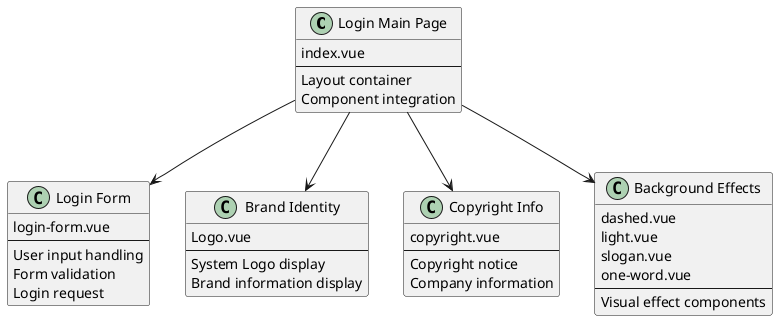
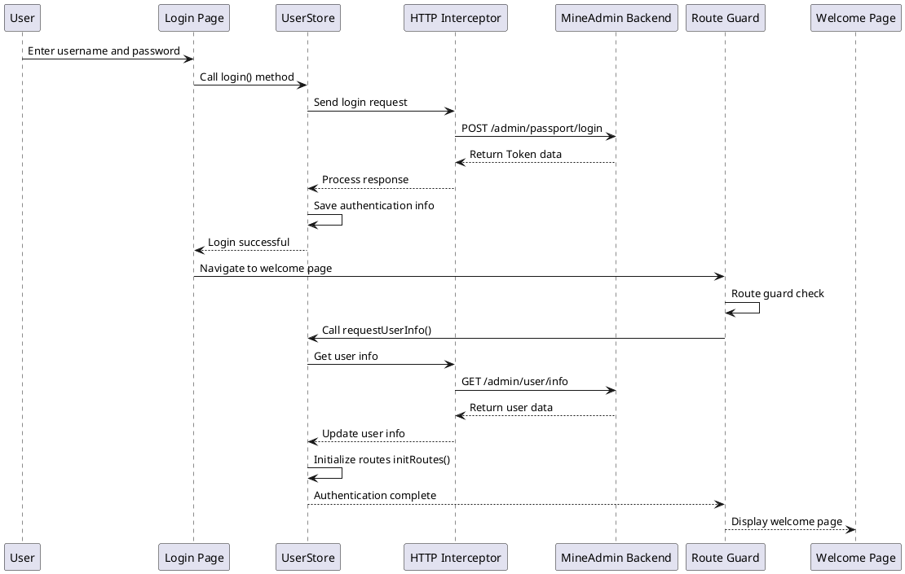
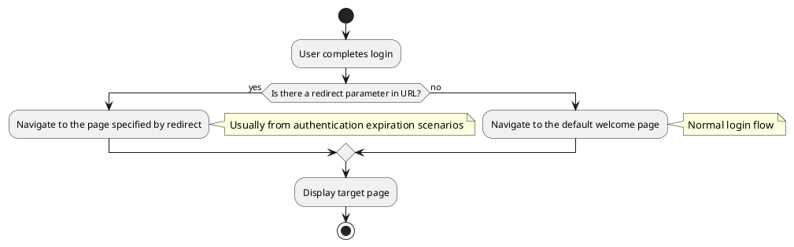

# Login and Welcome Page

:::tip Overview
This chapter provides a detailed introduction to the login page architecture of MineAdmin 3.0, the login process handling, Token management mechanism, and the welcome page configuration after successful login. Content includes component structure analysis, data flow process, route guard mechanism, and custom configuration methods.

**Important Note**: All code examples in this document are from the actual code of the MineAdmin open-source project. The source code is located in the [GitHub repository](https://github.com/mineadmin/mineadmin).
:::

## Login Page Architecture

### Page Component Structure

The login page main file is located at `src/modules/base/views/login/index.vue`, adopting a component-based design that splits the login functionality into multiple independent sub-components, improving code maintainability and reusability.

**Source Code Location**:
- **GitHub Address**: [mineadmin/web/src/modules/base/views/login/index.vue](https://github.com/mineadmin/mineadmin/blob/master/web/src/modules/base/views/login/index.vue)
- **Local Path**: `src/modules/base/views/login/index.vue`



### Responsive Layout Design

The login page adopts a responsive design, adapting to desktop and mobile devices:

```vue
<template>
  <div class="h-full min-w-[380px] w-full flex items-center justify-center overflow-hidden border-1 bg-blue-950 lg:justify-between lg:bg-white">
    <!-- Desktop left decoration area -->
    <div class="relative hidden h-full w-10/12 md:hidden lg:flex">
      <div class="gradient-rainbow" />
      <Dashed />
      <Light />
      <Slogan />
      <OneWord />
    </div>
    
    <!-- Login form area -->
    <div class="login-form-container">
      <Logo />
      <LoginForm />
      <CopyRight />
    </div>
    
    <!-- Mobile background effects -->
    <div class="min-[380px] relative left-0 top-0 z-4 h-full max-w-[1024px] w-full flex lg:hidden">
      <Dashed />
      <Light />
    </div>
  </div>
</template>
```

### Component Library Description

::: warning Component Library Notes
The form components on the login page do not use the `Element Plus` component library. Instead, they are built based on MineAdmin's own basic component library. These components are designed specifically for the system and have the following characteristics:

- **Lightweight Design**: Contains only necessary login functions, reducing dependencies
- **Unified Style**: Consistent with the design language of the entire system
- **High Customizability**: Can be flexibly adjusted according to business needs

**Customization Suggestions**:
- Directly modifying the source code is not recommended to avoid affecting future version upgrades
- It is recommended to replace the login component through the [plugin system](/v3/front/high/plugins.md)
- The default `login` route component can be overridden via route configuration
:::

## Login Process and Data Handling

### Login Process Overview

The login process adopts a modern front-end and back-end separation architecture, based on JWT Token for identity authentication, supporting automatic Token refresh and permission verification.



### Core Data Flow

::: info Development Tip
If you only need to modify the login page UI without involving login logic, you can skip the detailed process description in this section and go directly to the [Welcome Page Configuration](#default-welcome-page-configuration) section.
:::

#### 1. User Login Authentication

**File Location**: `src/store/modules/useUserStore.ts`

The `login()` method handles the user authentication process:

```typescript
// Login method core logic
async login(loginParams: LoginParams) {
  try {
    // Send login request
    const response = await http.post('/admin/passport/login', loginParams)
    
    // Save authentication info to local storage
    const { access_token, refresh_token, expire_at } = response.data
    
    // Store in Pinia Store
    this.token = access_token
    this.refreshToken = refresh_token
    this.expireAt = expire_at
    
    // Store in browser cache
    cache.set('token', access_token)
    cache.set('refresh_token', refresh_token)
    cache.set('expire', useDayjs().unix() + expire_at, { exp: expire_at })
    
    return Promise.resolve(response)
  } catch (error) {
    return Promise.reject(error)
  }
}
```

#### 2. Route Guard Interception

After successful login, the page navigation triggers the route guard, which automatically executes user info retrieval:

```typescript
// Route guard logic (simplified)
router.beforeEach(async (to, from, next) => {
  const userStore = useUserStore()
  
  if (to.path !== '/login' && !userStore.isLogin) {
    // Not logged in, redirect to login page
    next('/login')
  } else if (userStore.isLogin && !userStore.userInfo) {
    // Logged in but user info not retrieved
    try {
      await userStore.requestUserInfo()
      next()
    } catch (error) {
      // Failed to get user info, clear login status
      await userStore.logout()
      next('/login')
    }
  } else {
    next()
  }
})
```

#### 3. User Info Retrieval

**File Location**: `src/store/modules/useUserStore.ts`

The `requestUserInfo()` method retrieves user basic data and permission info:

```typescript
async requestUserInfo() {
  try {
    // Parallel requests for user data, menu permissions, role info
    const [userInfo, menuList, roleList] = await Promise.all([
      http.get('/admin/user/info'),          // User basic info
      http.get('/admin/menu/index'),         // Menu permission data
      http.get('/admin/role/index')          // Role permission data
    ])
    
    // Update Store state
    this.userInfo = userInfo.data
    this.menuList = menuList.data
    this.roleList = roleList.data
    
    // Initialize route system
    const routeStore = useRouteStore()
    await routeStore.initRoutes()
    
    return Promise.resolve(userInfo)
  } catch (error) {
    return Promise.reject(error)
  }
}
```

#### 4. Dynamic Route Initialization

**File Location**: `src/store/modules/useRouteStore.ts`

The `initRoutes()` method dynamically generates routes based on user permissions:

```typescript
async initRoutes() {
  const userStore = useUserStore()
  const { menuList } = userStore
  
  // Generate route configuration based on menu data
  const routes = this.generateRoutes(menuList)
  
  // Dynamically add routes
  routes.forEach(route => {
    router.addRoute(route)
  })
  
  // Update route state
  this.isRoutesInitialized = true
}
```

### Token Management Mechanism

The system uses a dual Token mechanism to ensure security and user experience:

- **Access Token**: Short-term validity (default 1 hour), used for API request authentication
- **Refresh Token**: Long-term validity (default 2 hours), used to refresh the Access Token

For detailed Token refresh mechanism, please refer to the [Request and Interceptor](/v3/front/advanced/request.md#token-refresh-mechanism) documentation.

## Welcome Page Configuration and Route Management

### Post-Login Navigation Logic

MineAdmin supports multiple post-login navigation strategies to ensure continuity of user experience:



#### Navigation Rules Explanation

1. **Login with Redirect Parameter**
   ```
   /#/login?redirect=/admin/user/index
   ```
   After successful login, it automatically navigates to the page specified by the `redirect` parameter. This scenario usually occurs when:
   - A user accesses a page requiring permissions but is not logged in
   - The Token expires and the user is automatically redirected to the login page

2. **Default Login Navigation**
   ```
   /#/login
   ```
   Without a `redirect` parameter, after successful login, it navigates to the default welcome page configured in the system.

### Welcome Page Configuration Details

#### Default Configuration Structure

**Configuration File Location**: `src/provider/settings/index.ts`

MineAdmin's actual default welcome page configuration:

```typescript
// MineAdmin default welcome page configuration
welcomePage: {
  name: 'welcome',                    // Route name
  path: '/welcome',                   // Route path
  title: 'Welcome Page',              // Page title
  icon: 'icon-park-outline:jewelry',  // Menu icon
},
```

Note: In MineAdmin, the component path for the welcome page is automatically resolved by the routing system and is located at `src/modules/base/views/welcome/index.vue`.

#### Configuration Item Details

| Configuration | Type | Required | Default Value | Description |
|---------------|------|----------|---------------|-------------|
| `name` | `string` | ✅ | `'welcome'` | Route name, must be globally unique |
| `path` | `string` | ✅ | `'/welcome'` | Access path, supports dynamic routing |
| `title` | `string` | ✅ | `'Welcome Page'` | Page title, displayed in browser tab and breadcrumb |
| `icon` | `string` | ❌ | `'icon-park-outline:jewelry'` | Icon identifier, used for menu display |
| `component` | `Function` | ❌ | Dynamic component import | Page component, supports async loading |

### Custom Welcome Page Configuration

::: tip Best Practice
To ensure the configuration is not overwritten during system upgrades, it is strongly recommended to perform custom configuration in `settings.config.ts` rather than directly modifying the `index.ts` file.
:::

#### Configuration Method

**Step 1**: Edit `src/provider/settings/settings.config.ts`

Note: This file already exists in the MineAdmin project and does not need to be created.

```typescript
import type { SystemSettings } from '#/global'

const globalConfigSettings: SystemSettings.all = {
  // Custom welcome page configuration
  welcomePage: {
    name: 'dashboard',                        // Change to dashboard
    path: '/dashboard',                       // Change path to dashboard path
    title: 'Data Overview',                   // Custom title
    icon: 'mdi:view-dashboard-outline',       // Use dashboard icon
  },
  
  // Other system configurations...
  app: {
    // App related configurations
  }
}

export default globalConfigSettings
```

**Step 2**: System auto-merges configuration

When the system starts, it automatically performs a deep merge of the configuration in `settings.config.ts` with the default configuration:

```typescript
// MineAdmin's actual configuration merge logic
import { defaultsDeep } from 'lodash-es'
import globalConfigSettings from '@/provider/settings/settings.config.ts'

// Merge default config with user config
const systemSetting = defaultsDeep(globalConfigSettings, defaultGlobalConfigSettings)
```

### Advanced Configuration Examples

#### 1. Conditional Welcome Page

Set different welcome pages based on user roles or permissions:

```typescript
const globalConfigSettings: SystemSettings.all = {
  welcomePage: {
    name: 'adaptive-welcome',
    path: '/adaptive-welcome',
    title: 'Personalized Welcome Page',
    icon: 'mdi:account-star',
    // Use custom component to handle conditional logic
    component: () => import('@/views/custom/AdaptiveWelcome.vue')
  }
}
```

#### 2. Multi-language Support

Combine with internationalization configuration to set a multi-language welcome page:

```typescript
const globalConfigSettings: SystemSettings.all = {
  welcomePage: {
    name: 'welcome',
    path: '/welcome',
    // Use internationalization key
    title: 'menu.welcome', 
    icon: 'icon-park-outline:jewelry',
  }
}
```

#### 3. External Link Navigation

Configure navigation to an external system after login:

```typescript
const globalConfigSettings: SystemSettings.all = {
  welcomePage: {
    name: 'external-system',
    path: 'https://external-dashboard.com',  // External link
    title: 'External System',
    icon: 'mdi:open-in-new',
    // Set as external link type
    meta: {
      isExternal: true,
      target: '_blank'
    }
  }
}
```

### Welcome Page Component Development

#### Basic Component Structure

```vue
<!-- src/views/custom/CustomWelcome.vue -->
<template>
  <div class="welcome-container">
    <div class="welcome-header">
      <h1>{{ $t('welcome.title') }}</h1>
      <p>{{ $t('welcome.subtitle') }}</p>
    </div>
    
    <div class="welcome-content">
      <!-- User info card -->
      <UserInfoCard :user="userInfo" />
      
      <!-- Quick actions -->
      <QuickActions :actions="quickActions" />
      
      <!-- Data statistics -->
      <DataStatistics :stats="systemStats" />
    </div>
  </div>
</template>

<script setup lang="ts">
import { ref, onMounted } from 'vue'
import { useUserStore } from '@/store/modules/useUserStore'
import UserInfoCard from '@/components/UserInfoCard.vue'
import QuickActions from '@/components/QuickActions.vue'
import DataStatistics from '@/components/DataStatistics.vue'

const userStore = useUserStore()
const userInfo = ref(userStore.userInfo)
const systemStats = ref({})
const quickActions = ref([
  { name: 'User Management', icon: 'mdi:account-group', path: '/admin/user' },
  { name: 'Role Permissions', icon: 'mdi:shield-account', path: '/admin/role' },
  { name: 'System Settings', icon: 'mdi:cog', path: '/admin/system' },
])

// MineAdmin welcome page does not need to dynamically load data
// All data is static, defined directly in the component

// MineAdmin welcome page uses static data, no API calls needed
// For dynamic data, corresponding API calls can be added
// For example: useHttp().get('/admin/user/info') and other existing APIs
</script>

<style scoped>
.welcome-container {
  padding: 24px;
  max-width: 1200px;
  margin: 0 auto;
}

.welcome-header {
  text-align: center;
  margin-bottom: 32px;
}

.welcome-content {
  display: grid;
  grid-template-columns: repeat(auto-fit, minmax(300px, 1fr));
  gap: 24px;
}
</style>
```

## Security Considerations and Best Practices

### Authentication Security

1. **Token Secure Storage**
   - Access Token stored in memory to avoid XSS attacks
   - Refresh Token stored using HttpOnly Cookie
   - Sensitive information not stored in localStorage

2. **Route Permission Verification**
   ```typescript
   // Permission check in route guard
   router.beforeEach(async (to, from, next) => {
     const userStore = useUserStore()
     
     // Check if route requires authentication
     if (to.meta.requiresAuth && !userStore.isLogin) {
       next(`/login?redirect=${to.fullPath}`)
       return
     }
     
     // Check user permissions
     if (to.meta.permissions && !userStore.hasPermissions(to.meta.permissions)) {
       next('/403') // Permission denied page
       return
     }
     
     next()
   })
   ```

### Performance Optimization

1. **Component Lazy Loading**
   
   MineAdmin uses modular route loading; components are automatically lazy-loaded:
   ```typescript
   // Dynamic component loading in MineAdmin
   const moduleViews = import.meta.glob('../../modules/**/views/**/**.{vue,jsx,tsx}')
   const pluginViews = import.meta.glob('../../plugins/*/**/views/**/**.{vue,jsx,tsx}')
   
   // Auto-resolve component path
   if (moduleViews[`../../modules/${item.component}${suffix}`]) {
     component = moduleViews[`../../modules/${item.component}${suffix}`]
   }
   ```

2. **Data Preloading**
   
   MineAdmin handles user info loading in the route guard:
   ```typescript
   // MineAdmin's data preloading mechanism
   router.beforeEach(async (to, from, next) => {
     if (userStore.isLogin) {
       if (userStore.getUserInfo() === null) {
         // Preload user info, menu, and permission data
         await userStore.requestUserInfo()
         next({ path: to.fullPath, query: to.query })
       }
       else {
         next()
       }
     }
   })
   ```

## Frequently Asked Questions and Solutions

### Q: Page doesn't navigate after successful login?

**Possible causes and solutions in MineAdmin**:

1. **Route configuration issue**
   ```typescript
   // Check if the welcome page route is correctly registered
   const routes = [
     {
       name: 'welcome',
       path: '/welcome',
       component: () => import('@/views/Welcome.vue'),
       meta: { requiresAuth: true }
     }
   ]
   ```

2. **Permission verification failure**
   ```typescript
   // Ensure the user has permission to access the welcome page
   if (!userStore.hasPermission('welcome:access')) {
     // Handle insufficient permission
   }
   ```

### Q: Custom welcome page configuration not taking effect?

**Solution**:

1. **Confirm configuration file path**
   ```bash
   src/provider/settings/settings.config.ts  # Correct path
   ```

2. **Check configuration syntax**
   ```typescript
   // ❌ Error: Incorrect configuration object structure
   const config = {
     welcomePage: '/dashboard'
   }
   
   // ✅ Correct: Complete configuration object
   const config = {
     welcomePage: {
       name: 'dashboard',
       path: '/dashboard',
       title: 'Dashboard'
     }
   }
   ```

3. **Restart the development server**
   ```bash
   pnpm run dev
   ```

### Q: How to implement personalized navigation after login?

**Solution**:

```typescript
// Implement personalized navigation logic in UserStore
async login(params: LoginParams) {
  const response = await http.post('/admin/passport/login', params)
  
  // Determine navigation page based on user role
  const userRole = response.data.user.role
  const redirectMap = {
    'admin': '/dashboard',
    'user': '/profile',
    'guest': '/welcome'
  }
  
  const targetPath = redirectMap[userRole] || '/welcome'
  
  // Execute navigation
  await router.push(targetPath)
}
```

## Related Documentation Links

- [System Configuration Details](/v3/front/advanced/system-config.md) - System global configuration explanation
- [Request and Interceptor](/v3/front/advanced/request.md) - HTTP requests and Token management
- [Routes and Menu](/v3/front/base/route-menu.md) - Route system configuration
- [Plugin System](/v3/front/high/plugins.md) - Plugin development and configuration
- [Backend Authentication Mechanism](/v3/backend/security/passport.md) - Backend JWT authentication implementation