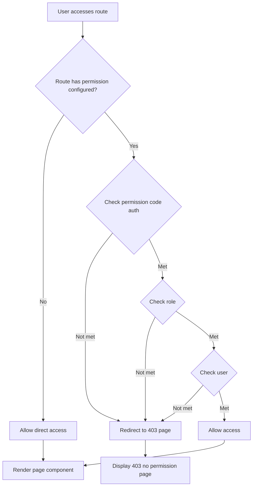
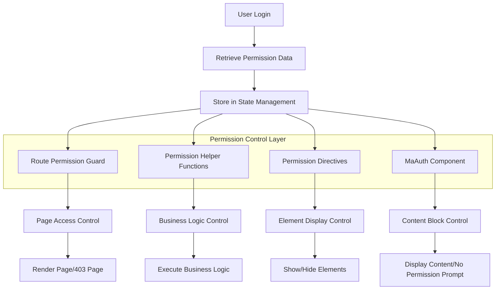

# MineAdmin Permission Control System

## Overview

MineAdmin provides a complete frontend permission control system that implements fine-grained permission management. Permission control is divided into two levels:

:::tip Permission Architecture Overview
- **Route-level permissions**: Controls page access permissions based on menu data returned from the backend
- **Content-level permissions**: Controls the display and hiding of page content through helper functions, directives, and components

The permission system is deeply integrated with the backend Hyperf framework, ensuring consistency between frontend and backend permission controls.
:::

### Permission Types

MineAdmin supports three types of fine-grained permission control:

| Permission Type | Judgment Basis | Application Scenario | Implementation Method |
|---------|---------|---------|---------|
| **Permission Code Permission** | Menu `name` field | Feature module permission control | Functions, directives, components |
| **Role Permission** | Role `code` field | Responsibility-based permission control | Functions, directives |
| **User Permission** | User `username` field | Specific user permission control | Functions, directives |

::: info Implementation Principle
The permission system is based on the permission data obtained after user login. It determines whether the user has permission to access a specific feature by comparing the current user's permission codes, role codes, and user identifiers. Permission data is stored in the frontend state management for efficient permission verification.
:::

## Permission Helper Functions

### Function Import and Basic Usage

MineAdmin provides three core permission judgment functions located in the `web/src/utils/permission/` directory:

```javascript
// Permission code check function
import hasAuth from '@/utils/permission/hasAuth'
// Role check function  
import hasRole from '@/utils/permission/hasRole'
// User check function
import hasUser from '@/utils/permission/hasUser'
```

::: tip Function Location Explanation
**Source Path**:
- GitHub: `https://github.com/mineadmin/mineadmin/tree/master/web/src/utils/permission/`
- Local Development: `/web/src/utils/permission/`

These functions are globally registered and support direct calls within components.
:::

### Usage in Business Logic

```vue
<script setup>
// Permission code verification - supports single permission or permission array
if (hasAuth('user:list') || hasAuth(['user:list', 'user:create'])) {
  // User management permission verification passed
  console.log('Has user management permission')
}

// Role verification - supports single role or role array
if (hasRole('SuperAdmin') || hasRole(['admin', 'manager'])) {
  // Admin role verification passed
  console.log('Has administrator permission')
}

// User verification - supports single username or username array
if (hasUser('admin') || hasUser(['admin', 'root'])) {
  // Specific user verification passed
  console.log('Specific user verification passed')
}

// Composite permission judgment example
const canManageUsers = hasAuth(['user:list', 'user:create']) && hasRole('admin')
if (canManageUsers) {
  // Meets both permission code and role requirements
}
</script>
```

### Usage in Templates

```vue
<script setup>
// Import permission judgment functions
import hasAuth from '@/utils/permission/hasAuth'
import hasRole from '@/utils/permission/hasRole'
import hasUser from '@/utils/permission/hasUser'
</script>

<template>
  <div>
    <!-- Permission code verification -->
    <div v-if="hasAuth('user:list') || hasAuth(['user:list', 'user:create'])">
      <el-button type="primary">User Management</el-button>
    </div>
    
    <!-- Role verification -->
    <div v-if="hasRole('SuperAdmin') || hasRole(['admin', 'manager'])">
      <el-button type="danger">System Settings</el-button>
    </div>

    <!-- User verification -->
    <div v-if="hasUser('admin') || hasUser(['root', 'administrator'])">
      <el-button type="warning">Advanced Features</el-button>
    </div>

    <!-- Composite condition verification -->
    <div v-if="hasAuth('role:manage') && hasRole('admin')">
      <el-button>Role Management</el-button>
    </div>
  </div>
</template>
```

### Function Parameter Explanation

All permission functions support the following two parameter formats:

```javascript
// String format - single permission check
hasAuth('user:list')
hasRole('admin')  
hasUser('admin')

// Array format - multiple permission check (OR logic)
hasAuth(['user:list', 'user:create', 'user:edit'])
hasRole(['admin', 'manager', 'supervisor'])
hasUser(['admin', 'root', 'system'])
```

::: warning Precautions
- Array parameters use **OR logic**, meaning `true` is returned if any condition is met
- For **AND logic**, use multiple function calls combined: `hasAuth('a') && hasAuth('b')`
- Permission codes should follow the `module:operation` naming convention, such as `user:list`, `role:create`
:::

### Route Permission Parameter

Permission functions support an optional second parameter `checkRoute` to determine whether to also check route permissions:

```javascript
// The second parameter defaults to false, only checks functional permissions
hasAuth('user:list', false)  

// When set to true, also checks route permissions
hasAuth('user:list', true)
```

## Permission Directives

MineAdmin provides three permission directives to simplify permission control in templates. The directives are located in the `web/src/directives/permission/` directory:

::: tip Directive Source Location
**GitHub Path**:
- `https://github.com/mineadmin/mineadmin/tree/master/web/src/directives/permission/auth/`
- `https://github.com/mineadmin/mineadmin/tree/master/web/src/directives/permission/role/`
- `https://github.com/mineadmin/mineadmin/tree/master/web/src/directives/permission/user/`

**Local Path**: `/web/src/directives/permission/`
:::

### Directive Usage

```vue
<template>
  <div>
    <!-- Permission code directive - supports string and array -->
    <div v-auth="'user:list'">
      Single permission code control
    </div>
    <div v-auth="['user:list', 'user:create']">
      Multiple permission code control (meets any one)
    </div>
    
    <!-- Role directive -->
    <div v-role="'admin'">
      Single role control
    </div>
    <div v-role="['admin', 'manager']">
      Multiple role control (meets any one)
    </div>

    <!-- User directive -->
    <div v-user="'admin'">
      Single user control
    </div>
    <div v-user="['admin', 'root']">
      Multiple user control (meets any one)
    </div>

    <!-- Actual business scenario example -->
    <el-button v-auth="'user:create'" type="primary">
      Add User
    </el-button>
    
    <el-button v-role="'SuperAdmin'" type="danger">
      Delete Data
    </el-button>
    
    <div v-auth="['log:operation', 'log:login']" class="log-panel">
      Log View Panel
    </div>
  </div>
</template>
```

### Directive vs Function Comparison

| Method | Advantage | Applicable Scenario | Example |
|------|------|----------|------|
| **Directive Method** | Concise and intuitive, automatically controls element display/hiding | Simple permission control, static permission check | `v-auth="'user:list'"` |
| **Function Method** | High flexibility, supports complex logic judgment | Permission judgment in business logic, dynamic permission check | `v-if="hasAuth('a') && hasRole('b')"` |

::: warning Directive Usage Precautions
- Directives use **OR logic**; the element is displayed if any condition in the array is met
- Directives directly control the display/hiding of DOM elements; elements are not rendered when there is no permission
- For complex permission logic combinations, it is recommended to use the function method instead of directives
:::

## MaAuth Permission Component

### Component Introduction

The `MaAuth` component is a permission control component provided by MineAdmin, suitable for controlling permissions over a large area of content. Compared to functions and directives, the component method is more suitable for complex permission display logic.

::: info Component Source Location
**GitHub Path**: `https://github.com/mineadmin/mineadmin/tree/master/web/src/components/ma-auth/index.vue`

**Local Path**: `/web/src/components/ma-auth/index.vue`

This component is globally registered and can be used directly in any Vue component without manual import.
:::

### Basic Usage

```vue
<template>
  <!-- Single permission control -->
  <ma-auth :value="'user:list'">
    <div class="user-management">
      <h3>User Management Panel</h3>
      <p>You have user list viewing permission</p>
    </div>
  </ma-auth>

  <!-- Multiple permission control (displayed if any permission is met) -->
  <ma-auth :value="['user:list', 'user:create', 'user:edit']">
    <div class="user-operations">
      <el-button type="primary">Add User</el-button>
      <el-button type="success">Edit User</el-button>
      <el-button type="danger">Delete User</el-button>
    </div>
  </ma-auth>
</template>
```

### No Permission Prompt

The component provides a `#notAuth` slot for customizing content displayed when there is no permission:

```vue
<template>
  <ma-auth :value="['admin:system', 'admin:config']">
    <!-- Content displayed when authorized -->
    <div class="admin-panel">
      <h2>System Management</h2>
      <el-form>
        <el-form-item label="System Configuration">
          <el-input placeholder="Configuration Item" />
        </el-form-item>
      </el-form>
    </div>
    
    <!-- Content displayed when not authorized -->
    <template #notAuth>
      <el-alert
        title="Insufficient Permissions"
        description="You do not have system management permissions. Please contact the administrator to apply for relevant permissions"
        type="warning"
        :closable="false"
        show-icon
      />
    </template>
  </ma-auth>
</template>
```

### Advanced Usage

#### Nested Permission Control

```vue
<template>
  <ma-auth :value="'module:access'">
    <!-- Module-level permissions -->
    <div class="module-container">
      <h2>Business Module</h2>
      
      <!-- Feature-level permissions -->
      <ma-auth :value="'feature:read'">
        <div class="read-section">
          <p>Read-only content area</p>
        </div>
        <template #notAuth>
          <p class="text-gray">You do not have reading permission</p>
        </template>
      </ma-auth>

      <!-- Operation-level permissions -->
      <ma-auth :value="['feature:create', 'feature:edit']">
        <div class="action-buttons">
          <el-button>Create</el-button>
          <el-button>Edit</el-button>
        </div>
        <template #notAuth>
          <p class="text-muted">You do not have operation permission</p>
        </template>
      </ma-auth>
    </div>
    
    <template #notAuth>
      <el-empty description="You do not have permission to access this module" />
    </template>
  </ma-auth>
</template>
```

#### Integration with Other Components

```vue
<template>
  <!-- Table operation permission control -->
  <el-table :data="tableData">
    <el-table-column label="Name" prop="name" />
    <el-table-column label="Operations">
      <template #default="{ row }">
        <ma-auth :value="'user:edit'">
          <el-button size="small" @click="editUser(row)">Edit</el-button>
          <template #notAuth>
            <el-button size="small" disabled>No Permission</el-button>
          </template>
        </ma-auth>
        
        <ma-auth :value="'user:delete'">
          <el-button size="small" type="danger" @click="deleteUser(row)">
            Delete
          </el-button>
        </ma-auth>
      </template>
    </el-table-column>
  </el-table>
</template>
```

### Component Props

| Prop | Type | Default Value | Description |
|------|------|--------|------|
| `value` | `string \| string[]` | `[]` | Permission codes to verify, supports string or array |

### Component Slots

| Slot Name | Description | Parameters |
|--------|------|------|
| `default` | Content displayed when authorized | - |
| `notAuth` | Content displayed when not authorized | - |

### Component vs Other Methods Comparison

| Method | Applicable Scenario | Advantage | Disadvantage |
|------|----------|------|------|
| **MaAuth Component** | Large block content permission control, needs no permission prompts | Supports slot customization, clear code structure | Slightly verbose |
| **Permission Directive** | Simple element permission control | Concise and intuitive | Does not support no permission prompts |
| **Permission Function** | Complex business logic permission judgment | Highest flexibility | Requires manual handling of display logic |

## Route Permission Control

### Static Route Permission Configuration

MineAdmin supports permission control at the route level by configuring permission parameters in the `meta` property of the route.

:::tip Route Permission Mechanism
**Scope of Control**: Only affects routes with component pages, does not include in-page elements like buttons

**Check Timing**: Automatically checks permissions during route navigation

**Permission Verification Failure**: Displays a 403 page

**Source Location**: `/web/src/router/` - Route configuration and permission guard logic
:::

### Route Permission Configuration Syntax

In the route configuration file, configure permission parameters through the `meta` object:

```javascript
// Example route configuration
const routes = [
  {
    path: '/user',
    name: 'User',
    component: () => import('@/views/user/index.vue'),
    meta: {
      // Permission code control - requires user management permission
      auth: ['user:list', 'user:manage'],
      
      // Role control - requires admin or super admin role
      role: ['admin', 'SuperAdmin'],
      
      // User control - accessible to specific users
      user: ['admin', 'root']
    }
  },
  {
    path: '/system',
    name: 'System',
    component: () => import('@/views/system/index.vue'),
    meta: {
      // Only permission code needed
      auth: ['system:config']
    }
  },
  {
    path: '/public',
    name: 'Public',
    component: () => import('@/views/public/index.vue'),
    meta: {
      // No permission parameters configured or set to empty array means no permission restrictions
      auth: []
    }
  }
]
```

### Permission Parameter Explanation

| Parameter | Type | Description | Logical Relationship |
|------|------|------|----------|
| `auth` | `string[]` | Permission code array, controlled based on menu permissions | OR (meeting any permission is sufficient) |
| `role` | `string[]` | Role code array, controlled based on user roles | OR (meeting any role is sufficient) |
| `user` | `string[]` | Username array, controlled based on specific users | OR (meeting any user is sufficient) |

::: warning Permission Configuration Precautions
- All permission parameter types must be `string[]` (string array)
- The same route can have multiple permission types configured simultaneously, the relationship is **AND logic**
- No permission parameters configured or set to empty array `[]` means no permission restrictions
- Permission verification failure automatically redirects to a 403 page
:::

### Practical Application Scenarios

#### User Management Module

```javascript
// User management related routes
const userRoutes = [
  {
    path: '/user',
    name: 'UserManagement',
    component: () => import('@/views/user/index.vue'),
    meta: {
      title: 'User Management',
      auth: ['user:list'] // Requires user list permission
    },
    children: [
      {
        path: 'create',
        name: 'UserCreate',
        component: () => import('@/views/user/create.vue'),
        meta: {
          title: 'Add User',
          auth: ['user:create'] // Requires user creation permission
        }
      },
      {
        path: 'edit/:id',
        name: 'UserEdit',
        component: () => import('@/views/user/edit.vue'),
        meta: {
          title: 'Edit User',
          auth: ['user:edit'] // Requires user editing permission
        }
      }
    ]
  }
]
```

#### System Management Module

```javascript
// System management - requires multiple permission verification
const systemRoutes = [
  {
    path: '/system',
    name: 'SystemManagement',
    component: () => import('@/views/system/index.vue'),
    meta: {
      title: 'System Management',
      auth: ['system:config'], // Requires system configuration permission
      role: ['SuperAdmin']     // And requires super admin role
    }
  },
  {
    path: '/logs',
    name: 'SystemLogs',
    component: () => import('@/views/logs/index.vue'),
    meta: {
      title: 'System Logs',
      auth: ['log:operation', 'log:login'], // Requires operation log or login log permission
      role: ['admin', 'auditor']            // And requires admin or auditor role
    }
  }
]
```

#### Special Permission Control

```javascript
// Development and debugging page - accessible only to specific users
const devRoutes = [
  {
    path: '/dev-tools',
    name: 'DevTools',
    component: () => import('@/views/dev/index.vue'),
    meta: {
      title: 'Development Tools',
      user: ['admin', 'developer'], // Only admin and developer users can access
      auth: ['dev:tools']          // And requires development tools permission
    }
  }
]
```

### Permission Verification Flow



### Permission Guard Implementation

MineAdmin's route permission guard logic is located in the route configuration, with the core implementation logic:

```javascript
// Route guard example (simplified version)
router.beforeEach((to, from, next) => {
  const { auth, role, user } = to.meta || {}
  
  // No permission restrictions, pass through directly
  if (!auth?.length && !role?.length && !user?.length) {
    return next()
  }
  
  // Check permission code
  if (auth?.length && !hasAuth(auth)) {
    return next({ name: '403' })
  }
  
  // Check role
  if (role?.length && !hasRole(role)) {
    return next({ name: '403' })
  }
  
  // Check user
  if (user?.length && !hasUser(user)) {
    return next({ name: '403' })
  }
  
  next()
})
```

## Best Practices

### Permission Granularity Suggestions

1. **Page-level permissions**: Use route meta configuration
2. **Feature-level permissions**: Use MaAuth component
3. **Element-level permissions**: Use permission directives
4. **Logic-level permissions**: Use permission functions

### Permission Naming Conventions

```javascript
// Recommended permission code naming convention - module:operation format
const permissionCodes = [
  'user:list',      // User list
  'user:create',    // User creation
  'user:edit',      // User editing  
  'user:delete',    // User deletion
  'role:manage',    // Role management
  'system:config',  // System configuration
  'log:operation',  // Operation log
  'log:login'       // Login log
]

// Role naming suggestions
const roleCodes = [
  'SuperAdmin',     // Super admin
  'admin',          // Admin
  'manager',        // Manager
  'operator',       // Operator
  'viewer'          // Viewer
]
```

### Performance Optimization Suggestions

1. **Avoid deep nesting**: Too many permission component nests can affect performance
2. **Reasonable caching**: Permission data should be properly cached to avoid frequent requests
3. **Lazy loading**: Combine with route lazy loading to only load authorized page components
4. **Permission pre-check**: Perform permission pre-checks before data requests to avoid invalid requests

### Common Issues and Solutions

#### 1. Permission Verification Failure

**Issue**: The permission function returns `false`, but should have permission

**Solutions**:
- Check if the user login status and permission data are loaded correctly
- Confirm that the permission code, role code, and username are spelled correctly
- Check the browser console for related error messages

#### 2. Frequent 403 Pages

**Issue**: Users frequently see 403 error pages when accessing pages

**Solutions**:
- Check if the route meta configuration is too strict
- Confirm that user roles and permission assignments are reasonable
- Consider adding default permissions or reducing permission requirements

#### 3. Permission Component Not Working

**Issue**: The MaAuth component is not correctly controlling content display

**Solutions**:
```vue
<!-- Ensure correct prop name -->
<ma-auth :value="['user:list']"> <!-- Correct: use :value -->
  Content
</ma-auth>

<!-- Incorrect example -->
<ma-auth :auth="['user:list']">   <!-- Incorrect: wrong prop name -->
  Content
</ma-auth>
```

## Permission System Architecture Diagram



### Core Features

- **Multi-level permission control**: Comprehensive permission management from routes to elements
- **Three permission types**: Permission code, role, and user granularity for permission verification
- **Multiple implementation methods**: Three usage methods (functions, directives, components) for different scenarios
- **Easy integration**: Deep integration with Vue 3 and Element Plus, simple to use

### Source Location Summary

| Function | GitHub Path | Local Path |
|------|-------------|----------|
| Permission Functions | `https://github.com/mineadmin/mineadmin/tree/master/web/src/utils/permission/` | `/web/src/utils/permission/` |
| Permission Directives | `https://github.com/mineadmin/mineadmin/tree/master/web/src/directives/permission/` | `/web/src/directives/permission/` |
| Permission Component | `https://github.com/mineadmin/mineadmin/tree/master/web/src/components/ma-auth/` | `/web/src/components/ma-auth/` |
| Route Configuration | `https://github.com/mineadmin/mineadmin/tree/master/web/src/router/` | `/web/src/router/` |

### Selection Suggestions

Choose the appropriate permission control method based on different application scenarios:

- **Page-level control** → Route meta configuration
- **Large block content control** → MaAuth component  
- **Simple element control** → Permission directives
- **Complex business logic** → Permission functions

By using these permission control tools appropriately, you can build a secure and maintainable frontend permission management system.