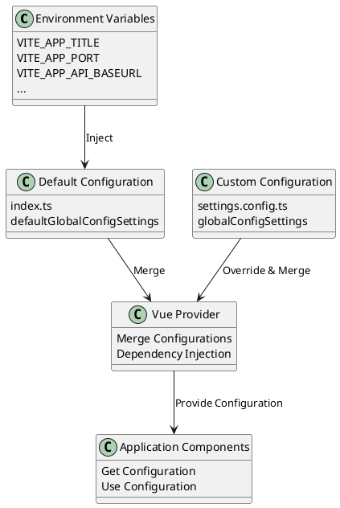
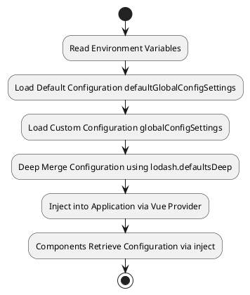

# System Parameter Configuration

MineAdmin provides a powerful and flexible system configuration mechanism, supporting multi-level configuration merging, environment variable integration, and runtime dynamic modification. This document will detail how to manage and configure system parameters.

## Configuration System Overview

::: tip Configuration Files
- **Default Configuration File**: `src/provider/settings/index.ts` - System default configuration
- **Custom Configuration File**: `src/provider/settings/settings.config.ts` - User custom configuration
- **Environment Variable Files**: `.env.development` / `.env.production` - Environment-related configuration

When modifying configurations, copy the configuration items you need to customize into the `settings.config.ts` file and modify them there. The system will automatically merge the configurations.
:::

## Configuration System Architecture



## Configuration Loading Process



## Core Configuration Details

### Application Base Configuration (app)

| Configuration Item | Type | Default Value | Description |
|--------|------|--------|------|
| `colorMode` | `'lightMode' \| 'darkMode' \| 'autoMode'` | `'autoMode'` | Color mode, supports light, dark, and auto modes |
| `useLocale` | `string` | `'zh_CN'` | System language, supports internationalization |
| `whiteRoute` | `string[]` | `['login']` | Whitelist routes, accessible without authentication |
| `layout` | `'classic' \| 'modern' \| 'minimal'` | `'classic'` | Layout mode |
| `pageAnimate` | `string` | `'ma-slide-down'` | Page transition animation effect |
| `enableWatermark` | `boolean` | `false` | Enable watermark function |
| `primaryColor` | `string` | `'#2563EB'` | Theme color |
| `asideDark` | `boolean` | `false` | Whether the sidebar uses a dark theme |
| `showBreadcrumb` | `boolean` | `true` | Show breadcrumb navigation |
| `loadUserSetting` | `boolean` | `true` | Load user personal settings |
| `watermarkText` | `string` | `import.meta.env.VITE_APP_TITLE` | Watermark text content |

**Configuration Example:**
```typescript
app: {
  colorMode: 'autoMode',              // Auto-switch theme
  useLocale: 'zh_CN',                 // Use Simplified Chinese
  whiteRoute: ['login', 'register'],  // Login and register pages bypass auth
  layout: 'classic',                  // Classic layout
  pageAnimate: 'ma-fade-in',         // Fade-in animation effect
  enableWatermark: true,             // Enable watermark
  primaryColor: '#1890ff',           // Custom theme color
  asideDark: true,                   // Dark theme sidebar
  showBreadcrumb: true,              // Show breadcrumb
  loadUserSetting: true,             // Load user settings
  watermarkText: 'My System',        // Custom watermark text
}
```

### Welcome Page Configuration (welcomePage)

| Configuration Item | Type | Default Value | Description |
|--------|------|--------|------|
| `name` | `string` | `'welcome'` | Route name |
| `path` | `string` | `'/welcome'` | Route path |
| `title` | `string` | `'Welcome'` | Page title |
| `icon` | `string` | `'icon-park-outline:jewelry'` | Icon |

### Main Sidebar Configuration (mainAside)

| Configuration Item | Type | Default Value | Description |
|--------|------|--------|------|
| `showIcon` | `boolean` | `true` | Show icon |
| `showTitle` | `boolean` | `true` | Show title |
| `enableOpenFirstRoute` | `boolean` | `false` | Automatically open the first route |

### Sub Sidebar Configuration (subAside)

| Configuration Item | Type | Default Value | Description |
|--------|------|--------|------|
| `showIcon` | `boolean` | `true` | Show icon |
| `showTitle` | `boolean` | `true` | Show title |
| `fixedAsideState` | `boolean` | `false` | Fix sidebar state |
| `showCollapseButton` | `boolean` | `true` | Show collapse button |

### Tab Bar Configuration (tabbar)

| Configuration Item | Type | Default Value | Description |
|--------|------|--------|------|
| `enable` | `boolean` | `true` | Enable tab bar |
| `mode` | `'rectangle' \| 'round' \| 'card'` | `'rectangle'` | Tab bar style |

### Copyright Information Configuration (copyright)

| Configuration Item | Type | Default Value | Description |
|--------|------|--------|------|
| `enable` | `boolean` | `true` | Show copyright information |
| `dates` | `string` | `useDayjs().format('YYYY')` | Copyright year |
| `company` | `string` | `'MineAdmin Team'` | Company name |
| `website` | `string` | `'https://www.mineadmin.com'` | Official website address |
| `putOnRecord` | `string` | `'Yu ICP Bei 00000000 Hao-1'` | Record number |

## Environment Variable Configuration

### Development Environment Configuration (.env.development)

```bash
# Page Title
VITE_APP_TITLE = MineAdmin Development

# Development Server Port
VITE_APP_PORT = 2888

# Application Root Path
VITE_APP_ROOT_BASE = /

# API Endpoint
VITE_APP_API_BASEURL = http://127.0.0.1:9501

# Route Mode: hash or history
VITE_APP_ROUTE_MODE = hash

# Local Storage Prefix
VITE_APP_STORAGE_PREFIX = mine_

# Enable Proxy
VITE_OPEN_PROXY = true

# Proxy Prefix
VITE_PROXY_PREFIX = /dev

# Enable vConsole (mobile debugging)
VITE_OPEN_vCONSOLE = false

# Enable Developer Tools
VITE_OPEN_DEVTOOLS = true
```

### Production Environment Configuration (.env.production)

```bash
# Page Title
VITE_APP_TITLE = MineAdmin

# Production Server Port
VITE_APP_PORT = 80

# Application Root Path
VITE_APP_ROOT_BASE = /admin/

# API Endpoint
VITE_APP_API_BASEURL = https://api.yourdomain.com

# Route Mode
VITE_APP_ROUTE_MODE = history

# Local Storage Prefix
VITE_APP_STORAGE_PREFIX = mine_prod_

# Disable Proxy
VITE_OPEN_PROXY = false

# Generate sourcemap
VITE_BUILD_SOURCEMAP = false

# Build Compression Method
VITE_BUILD_COMPRESS = gzip,brotli

# Generate Archive After Build
VITE_BUILD_ARCHIVE = 
```

## Custom Configuration Example

Add custom configuration in the `src/provider/settings/settings.config.ts` file:

```typescript
import type { SystemSettings } from '#/global'

const globalConfigSettings: SystemSettings.all = {
  // Application Configuration
  app: {
    colorMode: 'lightMode',           // Force light mode
    useLocale: 'en_US',               // Use English
    primaryColor: '#ff4757',          // Custom red theme
    enableWatermark: true,            // Enable watermark
    watermarkText: 'Internal System', // Custom watermark text
    pageAnimate: 'ma-fade-in',        // Fade-in animation
  },
  
  // Welcome Page Configuration
  welcomePage: {
    name: 'dashboard',
    path: '/dashboard',
    title: 'Dashboard',
    icon: 'mdi:view-dashboard',
  },
  
  // Sidebar Configuration
  mainAside: {
    showIcon: true,
    showTitle: false,                 // Hide main menu title
    enableOpenFirstRoute: true,       // Auto-open first route
  },
  
  // Tab Bar Configuration
  tabbar: {
    enable: true,
    mode: 'card',                     // Card mode
  },
  
  // Copyright Information
  copyright: {
    enable: true,
    company: 'My Company',
    website: 'https://mycompany.com',
    putOnRecord: 'Jing ICP Bei 12345678 Hao',
  },
}

export default globalConfigSettings
```

## Advanced Configuration Techniques

### Conditional Configuration

Set different configurations based on the environment or device type:

```typescript
const globalConfigSettings: SystemSettings.all = {
  app: {
    // Determine theme based on environment variable
    colorMode: import.meta.env.MODE === 'development' ? 'autoMode' : 'lightMode',
    
    // Hide breadcrumbs on mobile
    showBreadcrumb: !/Mobile|Android|iPhone/i.test(navigator.userAgent),
    
    // Disable watermark in production
    enableWatermark: import.meta.env.MODE === 'development',
    
    // Dynamically set API address
    watermarkText: import.meta.env.VITE_APP_TITLE || 'System',
  },
}
```

### Modular Configuration

Split large configurations into multiple modules:

```typescript
// config/app.config.ts
export const appConfig = {
  colorMode: 'autoMode',
  useLocale: 'zh_CN',
  primaryColor: '#2563EB',
}

// config/layout.config.ts
export const layoutConfig = {
  mainAside: {
    showIcon: true,
    showTitle: true,
  },
  subAside: {
    fixedAsideState: false,
    showCollapseButton: true,
  },
}

// settings.config.ts
import { appConfig } from './config/app.config'
import { layoutConfig } from './config/layout.config'

const globalConfigSettings: SystemSettings.all = {
  app: appConfig,
  ...layoutConfig,
}
```

### Runtime Configuration Modification

Dynamically modify configuration during application runtime:

```typescript
// In a component
import { inject, reactive } from 'vue'
import type { SystemSettings } from '#/global'

export default defineComponent({
  setup() {
    const settings = inject('defaultSetting') as SystemSettings.all
    
    // Dynamically switch theme
    const switchTheme = (mode: 'lightMode' | 'darkMode') => {
      settings.app.colorMode = mode
    }
    
    // Dynamically change theme color
    const changePrimaryColor = (color: string) => {
      settings.app.primaryColor = color
    }
    
    return {
      settings,
      switchTheme,
      changePrimaryColor,
    }
  },
})
```

## Configuration Best Practices

### 1. Version Control Management

```bash
# .gitignore file
.env.local
.env.*.local
src/provider/settings/settings.config.local.ts
```

### 2. Type Safety

Use TypeScript to ensure configuration type safety:

```typescript
import type { SystemSettings } from '#/global'

// Use type assertion to ensure correct configuration
const globalConfigSettings: SystemSettings.all = {
  app: {
    // TypeScript will provide type checking and autocompletion
    colorMode: 'lightMode', // Can only be predefined values
    primaryColor: '#ffffff', // Must be a string
  },
} satisfies SystemSettings.all
```

### 3. Configuration Validation

Add validation when loading configuration:

```typescript
import { z } from 'zod'

const configSchema = z.object({
  app: z.object({
    colorMode: z.enum(['lightMode', 'darkMode', 'autoMode']),
    primaryColor: z.string().regex(/^#[0-9A-Fa-f]{6}$/),
  }),
})

// Validate configuration
const validateConfig = (config: unknown) => {
  try {
    return configSchema.parse(config)
  } catch (error) {
    console.error('Configuration validation failed:', error)
    throw new Error('Incorrect configuration format')
  }
}
```

## Frequently Asked Questions & Troubleshooting

### Q: Configuration changes are not taking effect?

**A:** Check the following points:

1. **Check the configuration file path**
   ```bash
   # Correct configuration file path
   src/provider/settings/settings.config.ts
   ```

2. **Check the configuration syntax**
   ```typescript
   // ❌ Incorrect: Syntax error
   const config = {
     app: {
       colorMode: lightMode, // Missing quotes
     }
   }
   
   // ✅ Correct: Proper syntax
   const config = {
     app: {
       colorMode: 'lightMode',
     }
   }
   ```

3. **Check if the development server was restarted**
   ```bash
   pnpm run dev
   ```

### Q: Environment variables cannot be read?

**A:** Ensure the environment variable starts with `VITE_`:

```bash
# ❌ Incorrect: Does not start with VITE_
APP_TITLE = MineAdmin

# ✅ Correct: Starts with VITE_
VITE_APP_TITLE = MineAdmin
```

### Q: How to debug configuration issues?

**A:** Use the following debugging methods:

```typescript
// Print the current configuration in a component
const settings = inject('defaultSetting')
console.log('Current configuration:', settings)

// Check environment variables
console.log('Environment variables:', import.meta.env)

// Check configuration merge result
import { defaultsDeep } from 'lodash-es'
console.log('Merged configuration:', defaultsDeep(customConfig, defaultConfig))
```

### Q: Configuration is not working in production?

**A:** Check the build configuration:

1. **Verify the environment variable file**
   ```bash
   # Production should have a corresponding environment variable file
   .env.production
   ```

2. **Check the build command**
   ```bash
   # Ensure using the correct build command
   pnpm run build
   ```

3. **Verify the build output**
   ```bash
   # Preview the build result
   pnpm run preview
   ```

## Related References

- [Layout Configuration](./layout.md) - Layout system configuration details

::: warning Notes
- Restart the development server for configuration changes to take effect
- Production configuration changes require rebuilding and redeployment
- Do not write sensitive information directly in configuration files; use environment variables instead
:::