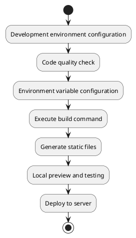

# Build and Preview

This document provides a detailed explanation of the MineAdmin frontend project's build, preview, and deployment process, including performance optimization, environment configuration, and common problem solutions.

## Build Process Overview



## Building (Packaging)

### Basic Build

After project development is complete, a production build needs to be performed for server deployment.

```bash
# Execute build command
pnpm run build
```

After a successful build, a `dist` folder will be generated under `./web` in the project root directory, containing all the packaged static files.

### Pre-build Checks

To ensure build quality, it is recommended to perform code quality checks before building:

```bash
# Complete code quality check
pnpm run lint

# Or execute separately
pnpm run lint:tsc      # TypeScript type check
pnpm run lint:eslint   # ESLint code style check
pnpm run lint:stylelint # Style code check
```

### Environment Variable Configuration

#### Base Path Configuration

::: warning Important Configuration
If the access address is not the root node of the domain, `VITE_APP_ROOT_BASE` must be correctly configured
:::

```bash
# Deploy at domain root: https://www.example.com/
VITE_APP_ROOT_BASE = /

# Deploy at subpath: https://www.example.com/app/
VITE_APP_ROOT_BASE = /app/

# Multi-level subpath: https://www.example.com/admin/system/
VITE_APP_ROOT_BASE = /admin/system/
```

#### Production Environment Variables

Configure production environment variables in the `.env.production` file:

```bash
# API service address
VITE_APP_API_BASEURL = http://hyperf:9501

# Proxy prefix
VITE_PROXY_PREFIX = /prod

# Whether to generate Source Map (recommended to disable in production)
VITE_BUILD_SOURCEMAP = false

# Compression configuration
VITE_BUILD_COMPRESS = gzip,brotli

# Package archive (optional)
VITE_BUILD_ARCHIVE = 
```

## Local Preview

### Preview Build Results

After building, use a local server to preview and ensure the project runs correctly:

```bash
# Start preview server
pnpm run serve
```

The preview server will start an HTTP service and automatically open the browser to access the built project.

### Preview Configuration Notes

The preview service uses the `http-server` tool with default configuration:
- Service directory: `./dist`
- Auto-open browser: `-o` parameter
- Access address: Typically `http://localhost:8080`

### E2E Testing

End-to-end tests can be executed during the preview phase:

```bash
# Run E2E tests
pnpm run test:e2e
```

## Build Optimization

### Compression Configuration

MineAdmin supports multiple compression algorithms to reduce file size:

```bash
# Enable only Gzip compression
VITE_BUILD_COMPRESS = gzip

# Enable only Brotli compression (higher compression ratio)
VITE_BUILD_COMPRESS = brotli

# Enable both compression types (recommended)
VITE_BUILD_COMPRESS = gzip,brotli
```

::: info Compression Algorithm Comparison
- **Gzip**: Good compatibility, compression ratio about 70-80%
- **Brotli**: Compression ratio about 75-85%, but requires newer browser support
- **Recommendation**: Enable both algorithms; the server automatically selects based on client support
:::

### Performance Optimization Suggestions

#### 1. Source Map Control

```bash
# Recommended to disable in production (improves build speed, reduces file size)
VITE_BUILD_SOURCEMAP = false

# Can be enabled during development (facilitates debugging)
VITE_BUILD_SOURCEMAP = true
```

#### 2. Code Splitting

Vite performs code splitting by default, requiring no additional configuration. After building, the following files are generated:
- `index.[hash].js` - Main entry file
- `vendor.[hash].js` - Third-party dependencies
- `[name].[hash].js` - Async modules

#### 3. Resource Optimization

The build process automatically performs:
- CSS minification and merging
- Image resource optimization
- Font file processing
- Static resource hash naming

## Deployment Configuration

### Nginx Configuration Example

For different compression configurations, Nginx requires corresponding module support:

```nginx
server {
    listen 80;
    server_name your-domain.com;
    root /path/to/dist;
    index index.html;

    # Enable Gzip compression
    gzip on;
    gzip_vary on;
    gzip_min_length 1024;
    gzip_types text/plain text/css application/json application/javascript text/xml application/xml application/xml+rss text/javascript;

    # Enable Brotli compression (requires nginx-module-brotli)
    brotli on;
    brotli_comp_level 6;
    brotli_types text/plain text/css application/json application/javascript text/xml application/xml application/xml+rss text/javascript;

    # SPA route support
    location / {
        try_files $uri $uri/ /index.html;
    }

    # Static resource caching
    location ~* \.(js|css|png|jpg|jpeg|gif|ico|svg)$ {
        expires 1y;
        add_header Cache-Control "public, immutable";
    }
}
```

### CDN Deployment

If using CDN deployment, the following configuration is needed:

```bash
# CDN domain
VITE_APP_CDN_URL = https://cdn.example.com

# Enable CDN resource paths
VITE_APP_USE_CDN = true
```

## Common Problems and Solutions

### Build Failure

#### 1. TypeScript Type Errors

```bash
# Example error message
error TS2307: Cannot find module 'xxx'

# Solution
pnpm run lint:tsc  # First check for type errors
# Fix type issues and rebuild
```

#### 2. Insufficient Memory

```bash
# Increase Node.js memory limit
NODE_OPTIONS="--max-old-space-size=4096" pnpm run build
```

#### 3. Dependency Issues

```bash
# Clean dependencies and reinstall
rm -rf node_modules
rm pnpm-lock.yaml
pnpm install
```

### Preview Issues

#### 1. API Request Failure

Check the API address configuration in `.env.production`:

```bash
# Ensure the API address is accessible
VITE_APP_API_BASEURL = http://your-api-server:port
```

#### 2. Route Access 404

Ensure the server has SPA route support configured, or check the route mode configuration:

```bash
# Hash mode (better compatibility)
VITE_APP_ROUTE_MODE = hash

# History mode (requires server support)
VITE_APP_ROUTE_MODE = history
```

#### 3. Static Resource Loading Failure

Check the base path configuration:

```bash
# Ensure it matches the deployment path
VITE_APP_ROOT_BASE = /your-app-path/
```

### Performance Issues

#### 1. Long Build Time

```bash
# Use parallel building
VITE_BUILD_PARALLEL = true

# Skip certain checks (only when necessary)
VITE_SKIP_TYPE_CHECK = true
```

#### 2. Large Package Size

Analyze the package size:

```bash
# Install the analyzer tool
pnpm add -D vite-bundle-analyzer

# Analyze build results
pnpm run build --analyze
```

## Automated Deployment

### CI/CD Configuration Example

```yaml
# .github/workflows/deploy.yml
name: Deploy

on:
  push:
    branches: [main]

jobs:
  build-and-deploy:
    runs-on: ubuntu-latest
    
    steps:
    - uses: actions/checkout@v3
    
    - name: Setup Node.js
      uses: actions/setup-node@v3
      with:
        node-version: '18'
        
    - name: Install pnpm
      uses: pnpm/action-setup@v2
      with:
        version: 8
        
    - name: Install dependencies
      run: pnpm install
      
    - name: Lint code
      run: pnpm run lint
      
    - name: Build project
      run: pnpm run build
      
    - name: Deploy to server
      run: |
        # Deployment script
        rsync -avz ./dist/ user@server:/path/to/deployment/
```