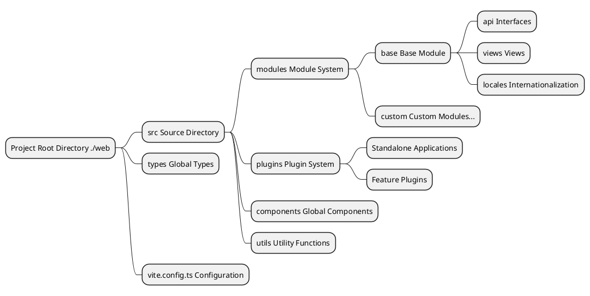
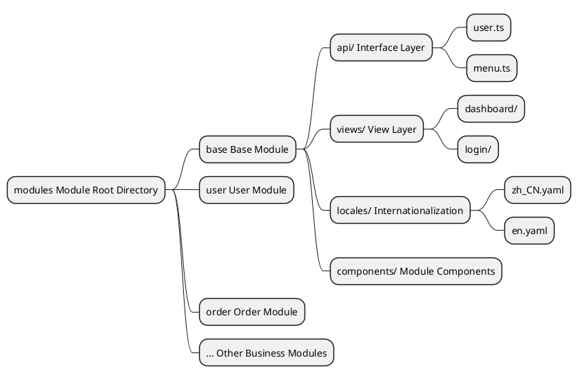
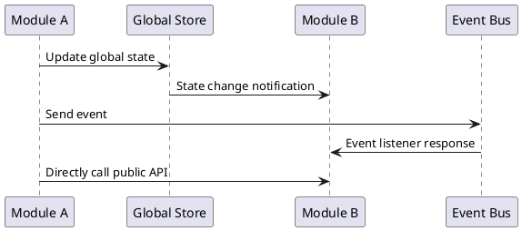
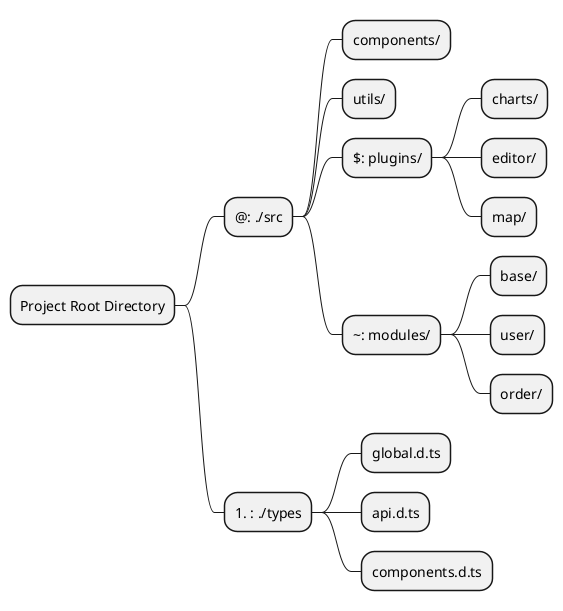
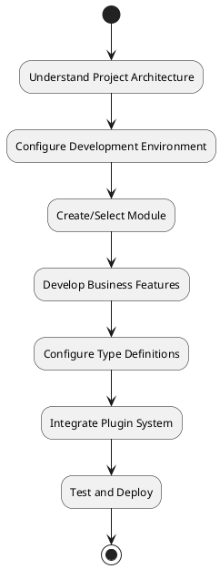

# Basic Concepts

The entire project has been restructured. Now we will introduce some basic concepts to help you better understand the entire documentation. Please be sure to read this section carefully first.

::: tip
The following content is all about the structure inside `./web` in the source root directory.
:::

## Project Overall Architecture

This project adopts a modern front-end development architecture, built on Vue 3 + TypeScript + Vite, implementing a modular and plugin-based development pattern.



## Global Type System

Since the new version is written in `TypeScript`, global type definitions are stored in the `./types` directory. You can find relevant data type structures there.

### Type File Organization Structure

```
./types/
├── api.d.ts          # API related type definitions
├── components.d.ts   # Component type definitions
├── global.d.ts       # Global type definitions
├── modules.d.ts      # Module type definitions
└── utils.d.ts        # Utility function type definitions
```

### Usage Example

Types can be quickly imported using the alias `#` in the project:

```typescript
// Import API types
import type { ApiResponse, UserInfo } from '#/api'

// Import global types
import type { MenuConfig, RouteConfig } from '#/global'

// Use in components
interface ComponentProps {
  userInfo: UserInfo
  menuConfig: MenuConfig[]
}
```

### Best Practices for Type Definitions

- **Naming Convention**: Use PascalCase for interfaces and types
- **File Organization**: Categorize type files by functional module
- **Type Export**: Use `export type` to export type definitions
- **Generic Support**: Use generics appropriately to improve type reusability

## Modular Architecture

The new version adopts a modular division, with the directory being `./src/modules`. Each module manages its own business's `api`, `types`, `locales`, and `view files`, achieving complete isolation and independent management of business logic.

### Module Structure Design



### Standard Module Directory Structure

```
./src/modules/[module_name]/
├── api/                 # API Interface Definitions
│   ├── user.ts         # User-related interfaces
│   ├── menu.ts         # Menu-related interfaces
│   └── index.ts        # Unified interface export
├── components/          # Module-specific Components
│   ├── UserForm.vue    # User form component
│   └── MenuTree.vue    # Menu tree component
├── locales/            # Module Internationalization Files
│   ├── zh_CN.yaml      # Chinese language pack
│   ├── en.yaml         # English language pack
│   └── index.ts        # Language pack export
├── views/              # View Pages
│   ├── user/           # User management pages
│   │   ├── index.vue   # User list page
│   │   └── detail.vue  # User detail page
│   └── dashboard/      # Dashboard pages
│       └── index.vue
└── index.ts           # Unified module export
```

### Module Development Workflow

1. **Create Module Directory**: Create a new module folder under `./src/modules/`
2. **Define Module Structure**: Create corresponding directories and files according to the standard structure
3. **Configure Routes**: Define route configurations within the module
4. **Develop Business Logic**: Write APIs, components, and views
5. **Add Internationalization**: Configure multi-language support
6. **Module Export**: Export module content uniformly via index.ts

### Inter-module Communication



### Module Usage Example

```typescript
// Use APIs from the base module in other modules
import { userApi, menuApi } from '~/base/api'
import type { UserInfo } from '~/base/types'

// Use module functionality in components
export default defineComponent({
  async setup() {
    // Call user API
    const userList = await userApi.getUsers()
    
    // Call menu API
    const menuTree = await menuApi.getMenuTree()
    
    return {
      userList,
      menuTree
    }
  }
})
```

## Alias System

Path alias definitions are set in the `vite.config.ts` file to simplify file import paths, improving development efficiency and code maintainability.

### Alias Configuration

```typescript
// vite.config.ts
export default defineConfig({
  resolve: {
    alias: {
      '@': path.resolve(__dirname, 'src'),
      '#': path.resolve(__dirname, 'types'),
      '$': path.resolve(__dirname, 'src/plugins'),
      '~': path.resolve(__dirname, 'src/modules'),
    },
  },
})
```

### Alias Mapping Table

| Alias | Directory Path | Purpose Description | Usage Scenario |
|-------|----------------|---------------------|----------------|
| `@` | `./src` | Source root directory | Import components, utilities, styles, etc. |
| `#` | `./types` | Global type definitions | Import TypeScript type definitions |
| `$` | `./src/plugins` | Plugin directory | Import files and components from plugins |
| `~` | `./src/modules` | Module directory | Import APIs, components, views from modules |

### Alias Usage Examples

#### 1. Base Path Alias (@)

```typescript
// ❌ Using relative paths (not recommended)
import Utils from '../../../utils/common'
import Button from '../../../components/Button.vue'

// ✅ Using aliases (recommended)
import Utils from '@/utils/common'
import Button from '@/components/Button.vue'
```

#### 2. Type Definition Alias (#)

```typescript
// Import global types
import type { 
  ApiResponse, 
  UserInfo, 
  MenuConfig 
} from '#/global'

// Import API types
import type { LoginParams } from '#/api'

// Use in interfaces
interface ComponentProps {
  userInfo: UserInfo
  menuList: MenuConfig[]
}
```

#### 3. Plugin Alias ($)

```typescript
// Import chart plugin
import ChartPlugin from '$/charts'
import { useChart } from '$/charts/hooks'

// Import editor plugin
import EditorPlugin from '$/editor'
import EditorComponent from '$/editor/components/RichEditor.vue'
```

#### 4. Module Alias (~)

```typescript
// Import base module APIs
import { userApi, menuApi } from '~/base/api'

// Import user module components
import UserForm from '~/user/components/UserForm.vue'
import UserList from '~/user/views/UserList.vue'

// Import module types
import type { UserModuleState } from '~/user/types'
```

### Alias System Architecture Diagram



### Best Practices for Alias Configuration

#### 1. IDE Support Configuration

To get better IDE intelliSense and path navigation support, configure `tsconfig.json`:

```json
{
  "compilerOptions": {
    "baseUrl": ".",
    "paths": {
      "@/*": ["src/*"],
      "#/*": ["types/*"],
      "$/*": ["src/plugins/*"],
      "~/*": ["src/modules/*"]
    }
  }
}
```

#### 2. Usage Guidelines

- **Consistency**: Use aliases uniformly within the team, avoid mixing with relative paths
- **Readability**: Aliases should be semantically clear and easy to understand
- **Hierarchy Control**: Avoid overly deep path hierarchies, use aliases appropriately to simplify paths
- **Type Safety**: Use TypeScript to ensure type safety of path references

#### 3. Common Usage Patterns

```typescript
// Comprehensive usage example in components
<script setup lang="ts">
// Global types
import type { UserInfo, ApiResponse } from '#/global'

// Global utilities
import { formatDate, validateForm } from '@/utils/common'

// Module APIs
import { userApi } from '~/base/api'

// Plugin features
import { useChart } from '$/charts/hooks'

// Global components
import MaButton from '@/components/MaButton.vue'

// Module components
import UserForm from '~/user/components/UserForm.vue'
</script>
```

### Advantages of the Alias System

1. **Simplified Paths**: Avoid complex relative path references
2. **Improved Maintainability**: No need to modify a large number of reference paths when moving files
3. **Enhanced Readability**: Quickly identify the module a file belongs to through aliases
4. **Unified Standards**: Maintain a consistent referencing style in team development
5. **IDE Friendly**: Provides a better development experience with TypeScript and IDE

## Summary

Through the introduction of the basic concepts above, we have understood the core architectural design of the project:

### Architecture Features

- **Modular Design**: Business functions are divided into modules, achieving high cohesion and low coupling
- **Plugin Architecture**: Supports hot-swapping and extension of features
- **Type Safety**: Provides complete type support based on TypeScript
- **Path Optimization**: Simplifies file references through the alias system

### Development Workflow



### Next Steps

After mastering these basic concepts, it is recommended to learn in the following order:

1. **[Getting Started](/v3/front/base/start)** - Environment setup and project startup
2. **[Configuration Guide](/v3/front/base/configure)** - Detailed configuration options
3. **[Route Menu](/v3/front/base/route-menu)** - Route and menu configuration
4. **[Module Development](/v3/front/advanced/module)** - In-depth modular development
5. **[Plugin Development](/v3/front/high/plugins)** - Detailed plugin system explanation

Through systematic learning and practice, you will be able to efficiently perform front-end development work on top of this architecture.