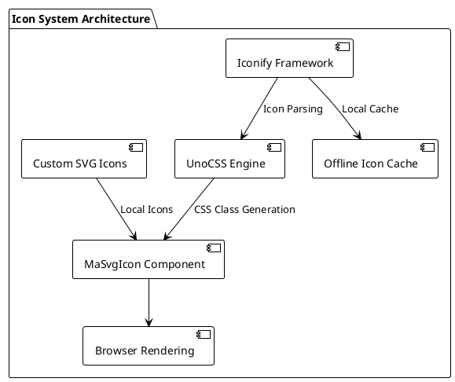
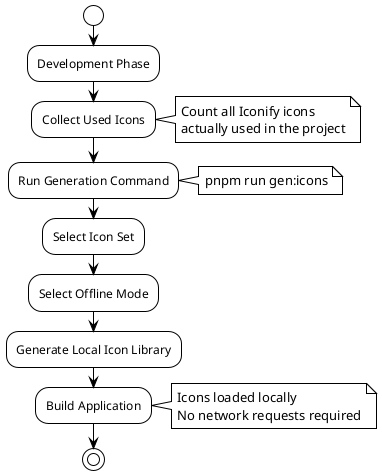

# Icon System

MineAdmin adopts a modern icon solution, providing powerful icon support based on the Iconify icon framework and UnoCSS. The system supports online icon libraries, offline mode, and custom icons.

## Icon Architecture Overview



## Icon Solution Comparison

| Solution | Advantages | Use Cases | Performance | Maintenance Cost |
|---------|------|---------|------|---------|
| **Iconify Online** | Rich icons (200k+), load on demand | Rapid development, prototyping | ⭐⭐⭐ | Low |
| **Iconify Offline** | No network dependency, fast loading | Production environments, intranet deployment | ⭐⭐⭐⭐⭐ | Medium |
| **Custom SVG** | Fully controllable, brand customization | Enterprise applications, brand consistency | ⭐⭐⭐⭐ | High |

## Using Iconify Icons

::: tip Iconify Advantages
`Iconify` is the most comprehensive icon framework, including:
- **150+ Icon Collections**: FontAwesome, Material Design, Ant Design, Tabler Icons, etc.
- **200,000+ Icons**: Covering design needs across various industries  
- **Unified API**: One syntax for all icon sets
- **On-Demand Loading**: Only loads used icons, reducing bundle size
:::

### Basic Icon Usage

<DemoPreview dir="demos/icon-basic" />

### Icon Search and Selection

Use [Icônes](https://icones.js.org/) to search for icons. It is a professional icon search tool based on Iconify:


**Search Tips:**
1. **Browse by Category**: Select well-known icon sets like Material Design, FontAwesome
2. **Keyword Search**: Supports Chinese and English searches, e.g., "用户", "user", "profile" 
3. **Tag Filtering**: Refine search by tags like solid, outline, filled
4. **Size Preview**: Preview icon effects at different sizes in real-time

::: info Icon Naming Convention
The copied icon format is: `i-{collection-name}:{icon-name}`
- Example: `i-material-symbols:person`
- Example: `i-heroicons:user-solid`
:::

### Using the MaSvgIcon Component

`MaSvgIcon` is the system's built-in icon component, providing a unified icon rendering interface:

```vue
<template>
  <!-- Basic Usage -->
  <ma-svg-icon name="i-material-symbols:person" />
  
  <!-- Setting Size -->
  <ma-svg-icon name="i-heroicons:home" size="24" />
  
  <!-- Setting Color -->
  <ma-svg-icon name="i-tabler:heart" color="red" />
  
  <!-- Combined Usage -->
  <ma-svg-icon 
    name="i-lucide:settings" 
    size="20" 
    color="#409eff" 
    class="mr-2" 
  />
</template>
```

**Component Property Description:**

| Property | Type | Default | Description |
|------|------|--------|------|
| `name` | string | - | Icon name (required) |
| `size` | string\|number | '16' | Icon size (px) |
| `color` | string | 'currentColor' | Icon color |
| `class` | string | - | Custom CSS class |

### Using CSS Classes Directly

For simple scenarios, you can use CSS class names directly:

```html
<!-- Basic Usage -->
<i class="i-material-symbols:person"></i>
<span class="i-heroicons:home"></span>

<!-- Combined with UnoCSS Utility Classes -->
<i class="i-tabler:heart text-red-500 text-2xl"></i>
<span class="i-lucide:settings w-6 h-6 text-blue-500"></span>
```

::: warning Usage Limitations
CSS class usage has the following limitations:
- **No asynchronous loading**: Icon names must be determined at build time
- **No dynamic concatenation**: `class="i-${iconName}"` is invalid
- **Recommended for static use**: Suitable for scenarios with fixed layouts
:::

### Using Icons in Route Menus

<DemoPreview dir="demos/icon-menu" />

Using icons in route configuration supports multiple icon sources:

```typescript
// Route configuration example
export const routes = [
  {
    name: 'dashboard',
    path: '/dashboard',
    meta: {
      title: 'Dashboard',
      icon: 'i-material-symbols:dashboard',  // Iconify Icon
    }
  },
  {
    name: 'users',
    path: '/users',
    meta: {
      title: 'User Management',
      icon: 'i-heroicons:users',  // Another Icon Set
    }
  },
  {
    name: 'settings',
    path: '/settings', 
    meta: {
      title: 'System Settings',
      icon: 'custom-gear',  // Custom SVG Icon
    }
  }
]
```

### Offline Mode Configuration

For production environments or intranet deployment, it is recommended to use offline mode to improve performance and stability:



**Offline Mode Setup Steps:**

1. **Collect Icon Usage**
   ```bash
   # Scan icons used in the project
   grep -r "i-[a-zA-Z-]*:" src/ --include="*.vue" --include="*.ts"
   ```

2. **Generate Offline Icon Library**
   ```bash
   # Run icon generation command
   pnpm run gen:icons
   ```

3. **Configure as Prompted**
   - Select the required icon sets (e.g., Material Symbols, Heroicons)
   - Select usage mode as "Offline Mode"  
   - Confirm generation configuration

::: tip Performance Optimization Suggestions
- **Select on demand**: Only select icon sets actually used by the project
- **Update regularly**: Remember to regenerate when adding new icons
- **Version control**: Include generated icon files in version management
:::

## Custom SVG Icons

For enterprise-specific icon needs, you can use custom SVG icons:

### Icon File Management

```
src/assets/icons/
├── brand/              # Brand-related icons
│   ├── logo.svg
│   └── logo-mini.svg
├── business/           # Business-specific icons  
│   ├── order.svg
│   └── product.svg
└── common/             # Common icons
    ├── export.svg
    └── import.svg
```

### Using Custom Icons

```vue
<template>
  <!-- Use relative path (relative to assets/icons) -->
  <ma-svg-icon name="brand/logo" />
  <ma-svg-icon name="business/order" />
  <ma-svg-icon name="common/export" />
  
  <!-- Use filename directly (must be in the icons root directory) -->
  <ma-svg-icon name="custom-icon" />
</template>
```

### SVG Icon Specification

To ensure icons display correctly in the system, follow these specifications:

```xml
<!-- Recommended SVG format -->
<svg 
  xmlns="http://www.w3.org/2000/svg" 
  viewBox="0 0 24 24" 
  fill="currentColor"
  width="24" 
  height="24"
>
  <path d="..."/>
</svg>
```

**Specification Points:**
- **Consistent size**: Use a 24x24 viewBox
- **Variable color**: Use `currentColor` to support dynamic colors
- **Simplify paths**: Remove unnecessary attributes and comments
- **Semantic naming**: File names should clearly express the icon's meaning

## Applying Icons in Components

### Table Action Buttons

```vue
<script setup lang="tsx">
import { MaProTableSchema } from '@mineadmin/pro-table'

const schema: MaProTableSchema = {
  tableColumns: [
    {
      type: 'operation',
      operationConfigure: {
        actions: [
          {
            name: 'edit',
            text: 'Edit',
            icon: 'i-heroicons:pencil-square',  // Edit icon
            onClick: (data) => editUser(data.row)
          },
          {
            name: 'delete', 
            text: 'Delete',
            icon: 'i-heroicons:trash',  // Delete icon
            onClick: (data) => deleteUser(data.row)
          }
        ]
      }
    }
  ]
}
</script>
```

### Form Component Icons

```vue
<template>
  <ma-form :items="formItems" />
</template>

<script setup>
const formItems = [
  {
    label: 'User Information',
    prop: 'user',
    render: 'input',
    icon: 'i-heroicons:user',  // Field icon
    placeholder: 'Please enter username'
  }
]
</script>
```

### Status Indicators

<DemoPreview dir="demos/icon-status" />

```vue
<template>
  <div class="status-list">
    <!-- Online status -->
    <div class="flex items-center">
      <ma-svg-icon name="i-heroicons:signal" color="green" />
      <span class="ml-2">Online</span>
    </div>
    
    <!-- Offline status -->  
    <div class="flex items-center">
      <ma-svg-icon name="i-heroicons:signal-slash" color="gray" />
      <span class="ml-2">Offline</span>
    </div>
  </div>
</template>
```

## Practical Guide

### Icon Selection Principles

1. **Consistency Principle**
   ```vue
   <!-- Recommended: Use a single icon set uniformly -->
   <ma-svg-icon name="i-heroicons:user" />
   <ma-svg-icon name="i-heroicons:cog-6-tooth" />
   <ma-svg-icon name="i-heroicons:home" />
   
   <!-- Avoid: Mixing multiple style icon sets -->
   <ma-svg-icon name="i-heroicons:user" />          <!-- outline style -->
   <ma-svg-icon name="i-material-symbols:settings" />  <!-- filled style -->  
   <ma-svg-icon name="i-ant-design:home-filled" />     <!-- Different design language -->
   ```

2. **Semantic Principle**
   ```vue
   <!-- Recommended: Icon semantics match the function -->
   <el-button @click="save">
     <ma-svg-icon name="i-heroicons:bookmark" /> Save
   </el-button>
   
   <!-- Avoid: Icon semantics are unclear -->
   <el-button @click="save">
     <ma-svg-icon name="i-heroicons:star" /> Save  
   </el-button>
   ```

### Performance Optimization Strategies

```typescript
// Icon preload configuration
const criticalIcons = [
  'i-heroicons:home',
  'i-heroicons:user', 
  'i-heroicons:cog-6-tooth',
  'i-heroicons:bell'
]

// Preload critical icons on app startup
criticalIcons.forEach(icon => {
  // Trigger icon loading
  document.createElement('i').className = icon
})
```

### Accessibility Support

```vue
<template>
  <!-- Add appropriate aria labels -->
  <button aria-label="Settings">
    <ma-svg-icon name="i-heroicons:cog-6-tooth" />
  </button>
  
  <!-- Use aria-hidden for decorative icons -->
  <h2>
    <ma-svg-icon name="i-heroicons:star" aria-hidden="true" />
    Important Notice
  </h2>
</template>
```

## Common Problem Troubleshooting

### Icon Not Displaying

**Problem Manifestation:**
- Icon position shows blank
- Console shows 404 error

**Troubleshooting Steps:**
1. **Check Icon Name**
   ```vue
   <!-- Check if the icon name is correct -->
   <ma-svg-icon name="i-heroicons:user-solid" />
   <!--           ↑ Confirm collection name and icon name -->
   ```

2. **Verify Network Connection**
   ```javascript
   // Check in browser console
   fetch('https://api.iconify.design/heroicons.json')
     .then(r => r.json())
     .then(data => console.log('Icon set data:', data))
   ```

3. **Check Offline Configuration**
   ```bash
   # Confirm if the offline icons contain the required icon
   ls dist/assets/icons/  # Check generated icon files
   ```

### Slow Icon Loading

**Optimization Solutions:**
```typescript
// 1. Enable icon preloading
const iconPreloader = {
  preload: ['i-heroicons:user', 'i-heroicons:home'],
  
  init() {
    this.preload.forEach(icon => {
      const link = document.createElement('link')
      link.rel = 'preload'
      link.href = `https://api.iconify.design/${icon.replace('i-', '').replace(':', '/')}.svg`
      link.as = 'image'
      document.head.appendChild(link)
    })
  }
}

// 2. Use offline mode
// Run pnpm run gen:icons to generate local icon library
```

### Icon Style Issues

```vue
<template>
  <!-- Problem: Inconsistent icon sizes -->
  <ma-svg-icon name="i-heroicons:user" class="text-sm" />
  <ma-svg-icon name="i-heroicons:home" class="text-lg" />
  
  <!-- Solution: Set size uniformly -->
  <ma-svg-icon name="i-heroicons:user" size="20" />
  <ma-svg-icon name="i-heroicons:home" size="20" />
  
  <!-- Or use CSS classes for unified control -->
  <ma-svg-icon name="i-heroicons:user" class="icon-standard" />
  <ma-svg-icon name="i-heroicons:home" class="icon-standard" />
</template>

<style>
.icon-standard {
  width: 20px;
  height: 20px;
}
</style>
```

## Best Practices Summary

### Development Phase
- ✅ Use [Icônes](https://icones.js.org/) to search and preview icons
- ✅ Choose a consistent icon collection (recommend Heroicons or Material Symbols)
- ✅ Add semantic names and comments to icons
- ✅ Establish project icon usage specification documentation

### Production Deployment  
- ✅ Generate offline icon library to improve loading performance
- ✅ Enable icon preloading to optimize first-screen experience
- ✅ Configure CDN to accelerate icon resource loading
- ✅ Monitor icon loading performance and error rate

### Maintenance Phase
- ✅ Regularly clean up unused icon references
- ✅ Track icon set version updates
- ✅ Establish a code review mechanism for icon changes
- ✅ Maintain custom icon design specifications