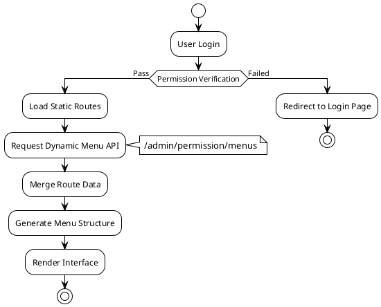
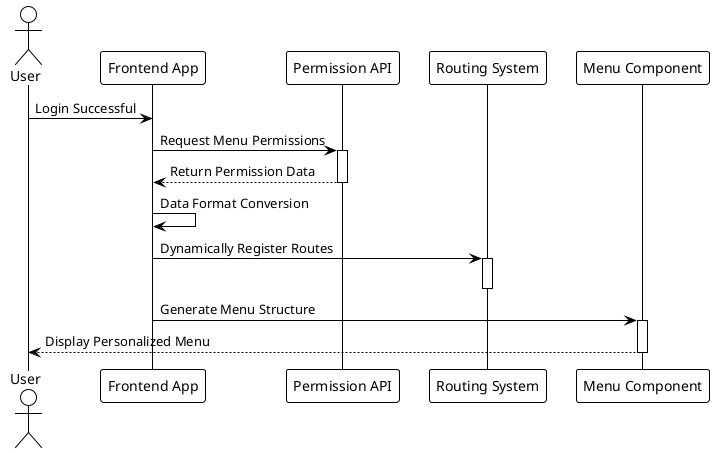

# Routes and Menu

MineAdmin provides a complete routing system based on `vue-router`, supporting both **static routing** and **dynamic routing** modes, offering powerful support for enterprise-level permission management.

## System Architecture Overview



## Route Type Selection Guide

### 📊 Selection Decision Matrix

| Scenario | Static Route | Dynamic Route | Recommendation Reason |
|------|---------|----------|---------|
| Public Pages (Login, 404) | ✅ | ❌ | No permission required, fast loading |
| Basic Management Pages | ❌ | ✅ | Permission control needed |
| Multi-tenant System | ❌ | ✅ | Different tenant menu structures |
| Development/Debug Pages | ✅ | ❌ | Dev environment only |
| Frequently Accessed Pages | ✅ | ❌ | Reduces network requests, improves performance |

## Route and Menu Detailed Explanation

### 🔹 Static Routes

Static routes are predefined in the frontend and available immediately upon application startup, suitable for pages that don't require permission control.

**Features:**
- Frontend predefined, available at startup
- No network request, fast loading
- Suitable for public pages and basic functionality

**Configuration Location:** `src/router/static-routes` directory

**Workflow:**
```plantuml
@startuml
!theme plain

[*] --> Application Startup
Application Startup --> Load Static Route Config
Load Static Route Config --> Register to vue_router : Configuration Complete
Register to vue_router --> Immediately Accessible
Immediately Accessible --> [*]

@enduml
```

::: tip 💡 Future Plans
The system is considering introducing a **file routing** mode (file-based routing), but it is not frequently used in the current MineAdmin scenario.
This feature may be added in the future based on community demand.
:::

### 🔹 Dynamic Routes

Dynamic routes are generated based on user permissions, providing fine-grained permission control.

**Generation Process:**
1. User login verification passes
2. Request `/admin/permission/menus` API
3. Server returns user permission menu data
4. Frontend converts to route configuration
5. Dynamically register to vue-router
6. Generate corresponding menu structure



### 🔹 Menu System

The menu is the visual representation of routes, converting route configurations into user interface elements.

**Menu & Route Relationship:**
- One route may correspond to one or more menu items
- Menus support multi-level nested structures
- Supports rich displays like icons, badges, internationalization

## Route Configuration Detail

### Basic Data Types

The system defines complete route types in `#/types/global.d.ts`:

::: details 📋 Route Data Type Definitions
```typescript
declare namespace MineRoute {
  interface routeRecord {
    name?: string                    // Route name, must be unique
    path?: string                   // Route path
    redirect?: string               // Redirect address
    expand?: boolean               // Expand submenu
    component?: () => Promise<any>  // Async component
    components?: () => Promise<any> // Named view component
    meta?: RouteMeta              // Route metadata
    children?: routeRecord[]       // Child route configuration
  }
  
  interface RouteMeta {
    // Basic Info
    title?: string | (() => string)     // Page title
    i18n?: string | (() => string)      // Internationalization key
    icon?: string                       // Icon (supports iconify)
    badge?: () => string | number       // Badge content
    
    // Display Control
    hidden?: boolean                    // Hide menu
    subForceShow?: boolean             // Force show submenu
    affix?: boolean                    // Pin tab
    
    // Feature Configuration
    cache?: boolean                    // Cache page
    copyright?: boolean                // Show copyright info
    breadcrumbEnable?: boolean         // Show breadcrumb
    
    // Route Type
    type?: 'M' | 'B' | 'I' | 'L' | string  // M:Menu B:Button I:iframe L:External Link
    link?: string                          // External link/iframe address
    
    // Permission Control
    auth?: string[]                    // Permission code array
    role?: string[]                   // Role array  
    user?: string[]                   // User ID array
    
    // System Internal
    activeName?: string               // Active menu name
    breadcrumb?: routeRecord[]        // Breadcrumb path (auto-generated)
  }
}
```
:::

### Complete Configuration Example

```typescript
// Standard menu page configuration
const menuRoute: MineRoute.routeRecord = {
  name: 'system',
  path: '/system',
  redirect: '/system/user',
  meta: {
    title: 'System Management',
    i18n: 'menu.system',
    icon: 'icon-park-outline:setting-two',
    type: 'M'
  },
  children: [
    {
      name: 'system-user',
      path: '/system/user',
      component: () => import('~/modules/system/views/user/index.vue'),
      meta: {
        title: 'User Management',
        i18n: 'menu.system.user',
        icon: 'icon-park-outline:user',
        cache: true,
        auth: ['system:user:list']
      }
    }
  ]
}
```

## META Configuration Detail

### 🏷️ Basic Display Configuration

#### title - Page Title
```typescript
meta: {
  title: 'User Management',           // Direct title
  // or
  title: () => `User Management(${count})` // Dynamic title
}
```
**Use Cases:** Menu display, tab title, browser title

#### icon - Icon Configuration  
```typescript
meta: {
  icon: 'icon-park-outline:user',      // Iconify icon
  icon: 'mdi:user',                   // Material Design icon
  icon: '/custom-icon.svg'            // Custom SVG icon
}
```
**Supported Icon Libraries:** Iconify, Material Design Icons, Custom SVG

#### badge - Badge Configuration
```typescript
meta: {
  badge: () => store.unreadCount,     // Dynamic badge
  badge: () => 'NEW'                  // Static badge
}
```

### 🎯 Route Type Configuration

#### type - Route Type
```typescript
type RouteType = 'M' | 'B' | 'I' | 'L'

// M: Menu type (default)
meta: { type: 'M' }  // Displayed in menu, can have child routes

// B: Button type  
meta: { type: 'B' }  // Not displayed in menu, no child routes, permission control

// I: iframe type
meta: { 
  type: 'I', 
  link: 'https://admin.example.com'
}

// L: External link type
meta: { 
  type: 'L', 
  link: 'https://docs.example.com'
}
```

### 🔐 Permission Control Configuration

#### Multi-level Permission Control
```typescript
meta: {
  // Permission code control (recommended)
  auth: ['system:user:list', 'system:user:create'],
  
  // Role control
  role: ['admin', 'manager'],
  
  // User control
  user: ['1001', '1002']
}
```

**Permission Verification Priority:** `user > role > auth`

### 🚀 Performance Configuration

#### cache - Page Cache
```typescript
// Configure in component
defineOptions({ 
  name: 'SystemUser'  // Must match route name
})

// Enable in route
meta: {
  cache: true
}
```

#### Lazy Loading Configuration
```typescript
// Basic lazy loading
component: () => import('~/views/user/index.vue')

// Group lazy loading (webpack magic comments)
component: () => import(
  /* webpackChunkName: "system" */ 
  '~/modules/system/views/user/index.vue'
)
```

## Practical Application Examples

### 📝 Example 1: Standard CRUD Module

```typescript
// Complete user management configuration
export const userManagementRoutes: MineRoute.routeRecord = {
  name: 'user-management',
  path: '/users',
  redirect: '/users/list',
  meta: {
    title: 'User Management',
    i18n: 'menu.users',
    icon: 'icon-park-outline:user',
    type: 'M'
  },
  children: [
    // List page
    {
      name: 'user-list',
      path: '/users/list',
      component: () => import('~/modules/user/views/list.vue'),
      meta: {
        title: 'User List',
        cache: true,
        auth: ['user:list']
      }
    },
    // Detail page (hidden menu)
    {
      name: 'user-detail',
      path: '/users/:id',
      component: () => import('~/modules/user/views/detail.vue'),
      meta: {
        title: 'User Detail',
        hidden: true,
        cache: true,
        activeName: 'user-list',  // Activate parent menu
        auth: ['user:view']
      }
    },
    // Permission control button
    {
      name: 'user-delete',
      path: '/users/delete',
      meta: {
        type: 'B',  // Button type, not displayed in menu
        auth: ['user:delete']
      }
    }
  ]
}
```

### 🌐 Example 2: External Integration

```typescript
// iframe and external link configuration
export const externalRoutes: MineRoute.routeRecord = {
  name: 'external',
  path: '/external',
  meta: {
    title: 'External Systems',
    icon: 'icon-park-outline:link'
  },
  children: [
    // iframe embedding
    {
      name: 'external-monitor',
      path: '/external/monitor',
      meta: {
        title: 'Monitoring Center',
        type: 'I',
        link: 'https://monitor.company.com',
        auth: ['system:monitor']
      }
    },
    // External link redirect  
    {
      name: 'external-docs',
      path: '/external/docs',
      meta: {
        title: 'API Documentation',
        type: 'L', 
        link: 'https://api-docs.company.com'
      }
    }
  ]
}
```

### 🏢 Example 3: Complex Workflow

```typescript
// Multi-level workflow configuration
export const workflowRoutes: MineRoute.routeRecord = {
  name: 'workflow',
  path: '/workflow',
  meta: {
    title: 'Workflow',
    icon: 'icon-park-outline:flow-chart',
    badge: () => store.pendingTasks
  },
  children: [
    {
      name: 'workflow-pending',
      path: '/workflow/pending',
      component: () => import('~/workflow/pending.vue'),
      meta: {
        title: 'Pending Tasks',
        affix: true,  // Pin tab
        cache: true
      }
    },
    {
      name: 'workflow-approval',
      path: '/workflow/approval',
      redirect: '/workflow/approval/my',
      meta: {
        title: 'Approval Management',
        role: ['manager', 'admin']
      },
      children: [
        {
          name: 'my-approval',
          path: '/workflow/approval/my',
          component: () => import('~/workflow/my-approval.vue'),
          meta: {
            title: 'My Approvals',
            cache: true
          }
        }
      ]
    }
  ]
}
```

## Best Practices

### 📝 Naming Conventions

**✅ Recommended Practices:**
```typescript
// Route names use kebab-case
name: 'system-user-list'

// Paths use lowercase + hyphens
path: '/system/user-management'

// Internationalization keys are hierarchical
i18n: 'menu.system.user.list'
```

**❌ Practices to Avoid:**
```typescript
// Avoid camelCase naming
name: 'SystemUserList'

// Avoid special characters
path: '/system/user_management'

// Avoid overly deep hierarchy
i18n: 'menu.system.management.user.list.page'
```

### 🏗️ Route Structure Design

**Level Control Principles:**
- Menu hierarchy should not exceed 3 levels
- Number of items per level should not exceed 8
- Related functional modules should be grouped

**Permission Granularity Design:**
```typescript
// Functional-level permissions (recommended)
auth: ['user:list', 'user:create', 'user:edit']

// Avoid overly fine granularity
auth: ['user:list:name', 'user:list:email']  // ❌

// Avoid overly coarse granularity  
auth: ['user:all']  // ❌
```

### ⚡ Performance Optimization Strategies

#### Route Lazy Loading Optimization
```typescript
// Load by module grouping
const UserRoutes = () => import(
  /* webpackChunkName: "user-module" */
  '~/modules/user/routes'
)

// Preload critical routes
const Dashboard = () => import(
  /* webpackChunkName: "dashboard" */
  /* webpackPreload: true */
  '~/views/dashboard.vue'
)
```

#### Menu Rendering Optimization
```typescript
// Use virtual scrolling for large menu sets
meta: {
  virtualScroll: true  // Enable virtual scrolling
}

// Lazy load non-critical menus
meta: {
  lazyLoad: true
}
```

## Troubleshooting Guide

### 🐛 Common Issues and Solutions

#### 1. Route Not Accessible

**Symptoms:** 404 or blank page when entering URL

**Troubleshooting Steps:**
```typescript
// 1. Check if route is correctly registered
console.log('Registered Routes:', router.getRoutes())

// 2. Verify route configuration
const route = {
  name: 'user-list',  // ✅ Ensure name is unique
  path: '/users',     // ✅ Ensure path is correct
  component: () => import('~/views/users.vue')  // ✅ Component path exists
}

// 3. Check permission configuration
const hasPermission = await checkAuth(['user:list'])
```

#### 2. Menu Not Displaying

**Possible Causes and Solutions:**
```typescript
// Cause 1: hidden set to true
meta: { hidden: false }  // Ensure not hidden

// Cause 2: Permission verification failed
meta: { auth: ['correct:permission'] }  // Check permission codes

// Cause 3: Route type is wrong
meta: { type: 'M' }  // Ensure it's a menu type
```

#### 3. Page Cache Not Working

**Solutions:**
```vue
<!-- Component must define name -->
<script setup>
defineOptions({ 
  name: 'UserList'  // Must match route name
})
</script>
```

```typescript
// Route configuration
meta: {
  cache: true,
  // Ensure component name matches route name
  name: 'UserList'  
}
```

### 🔍 Debugging Tools

#### Route Debugging Helper
```typescript
// Route debugging function
export const debugRoute = () => {
  const router = useRouter()
  const currentRoute = useRoute()
  
  console.group('Route Debug Info')
  console.log('Current Route:', currentRoute.name)
  console.log('Route Params:', currentRoute.params)
  console.log('Query Params:', currentRoute.query)
  console.log('Route Meta:', currentRoute.meta)
  console.log('All Routes:', router.getRoutes())
  console.groupEnd()
}

// Permission debugging
export const debugPermission = async (route: RouteRecord) => {
  const { auth, role, user } = route.meta
  
  console.group('Permission Debug')
  console.log('Required Permissions:', auth)
  console.log('Required Roles:', role)
  console.log('Required Users:', user)
  
  if (auth) {
    console.log('Permission Verification Result:', await checkAuth(auth))
  }
  console.groupEnd()
}
```

#### Menu Validation Tool
```typescript
// Menu structure validation
export const validateMenuStructure = (routes: MineRoute.routeRecord[]) => {
  const issues = []
  
  const checkRoute = (route: MineRoute.routeRecord, depth = 0) => {
    // Check depth
    if (depth > 3) {
      issues.push(`Route ${route.name} depth too deep (${depth})`)
    }
    
    // Check required fields
    if (!route.name) {
      issues.push(`Route missing name field: ${route.path}`)
    }
    
    // Recursively check child routes
    route.children?.forEach(child => 
      checkRoute(child, depth + 1)
    )
  }
  
  routes.forEach(route => checkRoute(route))
  return issues
}
```