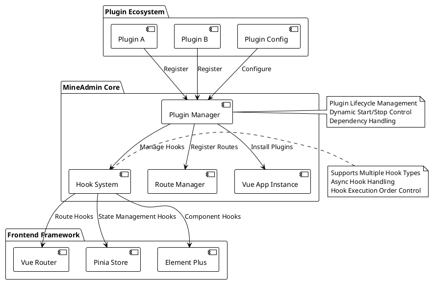
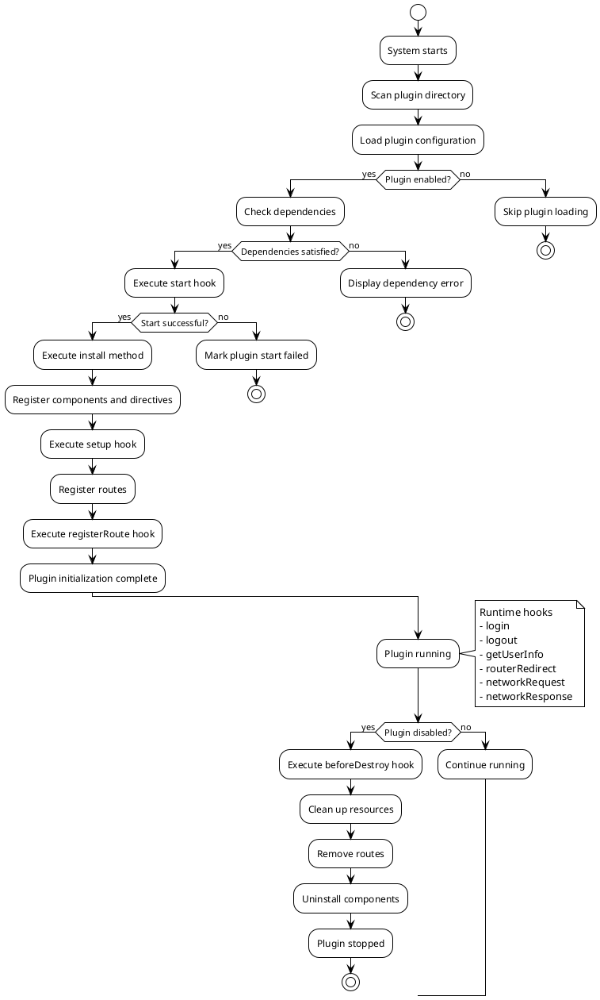

# Plugin System

::: tip Plugin System Description
`3.0` The frontend supports a plugin system at the core level. Unlike `2.0`, which did not consider plugin functionality at the design stage, modifying the system interface, behavior, or functions required changing the source code, which then made subsequent upgrades impossible and caused increasing divergence from the official code. An app store feature was later added, but even though it could forcibly support plugins, the plugins still had to modify the source code. Moreover, where initialization was needed, plugins could not extend the implementation, only modify `main.js`.

**Now all the above issues no longer exist. The frontend plugin system provides powerful support. Whether it's replacing interfaces, adding features, or integrating third-party or self-developed components, everything can be seamlessly integrated into the system. It also provides a variety of `hooks`, which can even influence and change the frontend's runtime.**
:::

## Plugin System Architecture Overview

The plugin system is designed based on modern frontend architecture, providing complete lifecycle management and extensibility:



### Core Features

- **Zero Intrusion Design**: Plugin development requires no modification of core code
- **Dynamic Loading**: Supports dynamic enable and disable of plugins
- **Lifecycle Management**: Complete plugin lifecycle hooks
- **Type Safety**: Complete TypeScript type definitions
- **Performance Optimization**: Lazy loading and on-demand loading support
- **Error Isolation**: Plugin errors do not affect the main application operation

## Plugin Data Type Introduction

::: info Type Definition File
Type definitions are inside `types/global.d.ts`
:::

:::details Click to view complete type definitions
```ts
declare namespace Plugin {
  /**
   * Plugin basic information
   */
  interface Info {
    /** Plugin name, format: author namespace/plugin name */
    name: string
    /** Plugin version, following semantic versioning */
    version: string
    /** Plugin author */
    author: string
    /** Plugin description */
    description: string
    /** Plugin start order, higher value starts first, default is 0 */
    order?: number
    /** Plugin dependency list */
    dependencies?: string[]
    /** Plugin keywords, for searching */
    keywords?: string[]
    /** Plugin homepage URL */
    homepage?: string
    /** Plugin license */
    license?: string
    /** Minimum system version requirement */
    minSystemVersion?: string
  }

  /**
   * Plugin configuration
   */
  interface Config {
    /** Plugin basic information */
    info: Info
    /** Whether the plugin is enabled */
    enable: boolean
    /** Plugin development mode, for debugging */
    devMode?: boolean
    /** Plugin custom configuration items */
    settings?: Record<string, any>
  }

  /**
   * Plugin view route definition
   */
  interface Views extends Route.RouteRecordRaw {
    /** Route meta information extension */
    meta?: {
      /** Page title */
      title?: string
      /** Internationalization key */
      i18n?: string
      /** Page icon */
      icon?: string
      /** Whether authentication is required */
      requireAuth?: boolean
      /** Required permission list */
      permissions?: string[]
      /** Whether to cache the page */
      keepAlive?: boolean
      /** Whether to hide the page */
      hidden?: boolean
      /** Menu ordering */
      order?: number
    }
  }

  /**
   * Hook function type definition
   */
  interface HookHandlers {
    /** Plugin start hook, can be used for initialization verification */
    start?: (config: Config) => Promise<boolean | void> | boolean | void
    /** System initialization complete hook, can access Vue context */
    setup?: () => Promise<void> | void
    /** Route registration hook, can modify route configuration */
    registerRoute?: (router: Router, routesRaw: Route.RouteRecordRaw[] | Views[] | MineRoute.routeRecord[]) => Promise<void> | void
    /** User login hook */
    login?: (formInfo: LoginFormData) => Promise<void> | void
    /** User logout hook */
    logout?: () => Promise<void> | void
    /** Get user info hook */
    getUserInfo?: (userInfo: UserInfo) => Promise<void> | void
    /** Route redirect hook (invalid for external links) */
    routerRedirect?: (context: { from: RouteLocationNormalized, to: RouteLocationNormalized }, router: Router) => Promise<void> | void
    /** Network request interceptor hook */
    networkRequest?: <T = any>(request: AxiosRequestConfig) => Promise<AxiosRequestConfig> | AxiosRequestConfig
    /** Network response interceptor hook */
    networkResponse?: <T = any>(response: AxiosResponse<T>) => Promise<AxiosResponse<T>> | AxiosResponse<T>
    /** Error handling hook */
    error?: (error: Error, context?: string) => Promise<void> | void
    /** Page mount complete hook */
    mounted?: () => Promise<void> | void
    /** Page destroy hook */
    beforeDestroy?: () => Promise<void> | void
  }

  /**
   * Plugin main configuration interface
   */
  interface PluginConfig {
    /** Plugin install function, registers components, directives, etc. */
    install: (app: App<Element>) => Promise<void> | void
    /** Plugin configuration information */
    config: Config
    /** Plugin route definitions */
    views?: Views[]
    /** Plugin hook functions */
    hooks?: HookHandlers
    /** Plugin custom properties */
    [key: string]: any
  }

  /**
   * Plugin store state
   */
  interface PluginStore {
    /** List of installed plugins */
    plugins: Map<string, PluginConfig>
    /** Plugin enabled state */
    enabledPlugins: Set<string>
    /** Plugin loading state */
    loadingPlugins: Set<string>
    /** Plugin error information */
    pluginErrors: Map<string, Error>
  }

  /**
   * Plugin manager interface
   */
  interface PluginManager {
    /** Register a plugin */
    register(name: string, plugin: PluginConfig): Promise<boolean>
    /** Unregister a plugin */
    unregister(name: string): Promise<boolean>
    /** Enable a plugin */
    enable(name: string): Promise<boolean>
    /** Disable a plugin */
    disable(name: string): Promise<boolean>
    /** Get plugin information */
    getPlugin(name: string): PluginConfig | null
    /** Get all plugins */
    getAllPlugins(): Map<string, PluginConfig>
    /** Check plugin dependencies */
    checkDependencies(name: string): Promise<boolean>
  }
}

/**
 * Login form data type
 */
interface LoginFormData {
  username: string
  password: string
  captcha?: string
  remember?: boolean
}

/**
 * User info type
 */
interface UserInfo {
  id: number
  username: string
  nickname: string
  email: string
  avatar: string
  roles: string[]
  permissions: string[]
  [key: string]: any
}
```
:::

## Creating a Plugin

### Directory Structure and Naming Conventions

All plugins are placed in the `src/plugins` directory, and plugins have an alias `$` pointing to this directory. The plugin structure is the same as the backend, composed of `developer author namespace/plugin name` as the plugin directory. The left side of the slash is the **author namespace**, which can be set on the [MineAdmin official website](https://www.mineadmin.com). The right side of the slash is the **plugin name**, which must be unique within this author namespace.

#### Standard Plugin Directory Structure

```bash
src/plugins/
├── mine-admin/          # Official plugin namespace
│   ├── app-store/       # App store plugin
│   ├── basic-ui/        # Basic UI library plugin
│   └── demo/            # Official demo plugin
├── author-name/         # Third-party developer namespace
│   └── plugin-name/     # Specific plugin directory
│       ├── index.ts     # Plugin entry file (required)
│       ├── config.ts    # Plugin configuration file (optional)
│       ├── package.json # Plugin package information (recommended)
│       ├── README.md    # Plugin documentation (recommended)
│       ├── views/       # Page component directory
│       │   ├── index.vue
│       │   └── components/
│       ├── components/  # Reusable components
│       ├── composables/ # Composable functions
│       ├── utils/       # Utility functions
│       ├── assets/      # Static assets
│       ├── locales/     # Internationalization files
│       │   ├── zh.json
│       │   ├── en.json
│       │   └── ja.json
│       ├── types/       # TypeScript type definitions
│       └── tests/       # Test files
```

#### Naming Convention Suggestions

- **Plugin Name**: Use lowercase letters and hyphens, e.g., `file-manager`, `data-export`
- **Author Namespace**: Use lowercase letters and hyphens, avoid special characters
- **File Naming**: Follow kebab-case convention
- **Component Names**: Use PascalCase, e.g., `FileUploader.vue`

::: tip Best Practices
- Locally developed plugins can also be recognized by the system, but cannot be uploaded to the MineAdmin app marketplace
- It is recommended to add a `package.json` for the plugin to manage dependencies and versions
- Using TypeScript for development provides better type hints and error checking
- Follow Vue 3 Composition API best practices
:::

::: warning Notes
- Plugin names must be unique within the same author namespace
- Avoid using system reserved words as plugin names
- Once the plugin directory is created, it is not recommended to change the name casually
:::

### Plugin Lifecycle



## Plugin Development Guide

### Basic Plugin Example

Let's understand the complete plugin development process through a complete file management plugin:

#### 1. Create Plugin Entry File `index.ts`

```ts
// src/plugins/zhang-san/file-manager/index.ts
import type { App } from 'vue'
import type { Router, RouteRecordRaw } from 'vue-router'
import type { Plugin } from '#/global'
import { ElMessage, ElNotification } from 'element-plus'

// Import plugin components
import FileManagerComponent from './components/FileManager.vue'
import FileUploader from './components/FileUploader.vue'

// Import utility functions
import { formatFileSize, validateFileType } from './utils/fileUtils'

// Plugin configuration
const pluginConfig: Plugin.PluginConfig = {
  // Plugin install method - register global components, directives, plugins etc. here
  async install(app: App) {
    try {
      // Register global components
      app.component('FileManager', FileManagerComponent)
      app.component('FileUploader', FileUploader)
      
      // Register global directive
      app.directive('file-drop', {
        mounted(el, binding) {
          el.addEventListener('dragover', (e: DragEvent) => {
            e.preventDefault()
            e.stopPropagation()
          })
          
          el.addEventListener('drop', async (e: DragEvent) => {
            e.preventDefault()
            e.stopPropagation()
            const files = Array.from(e.dataTransfer?.files || [])
            await binding.value(files)
          })
        }
      })
      
      // Add global property
      app.config.globalProperties.$fileUtils = {
        formatSize: formatFileSize,
        validateType: validateFileType
      }
      
      console.log('File management plugin installed successfully')
    } catch (error) {
      console.error('File management plugin installation failed:', error)
      throw error
    }
  },

  // Plugin base configuration
  config: {
    enable: import.meta.env.NODE_ENV !== 'production', // Disabled in production
    devMode: import.meta.env.DEV,
    info: {
      name: 'zhang-san/file-manager',
      version: '2.1.0',
      author: 'Zhang San',
      description: 'Enterprise-level file management plugin, supporting upload, download, preview, permission control, etc.',
      keywords: ['file management', 'file upload', 'permission control'],
      homepage: 'https://github.com/zhang-san/file-manager',
      license: 'MIT',
      minSystemVersion: '3.0.0',
      dependencies: ['mine-admin/basic-ui'],
      order: 10 // Higher priority
    },
    settings: {
      maxFileSize: 50 * 1024 * 1024, // 50MB
      allowedTypes: ['image/*', 'application/pdf', '.docx', '.xlsx'],
      uploadChunkSize: 1024 * 1024, // 1MB
      enablePreview: true,
      enableVersionControl: false
    }
  },

  // Plugin hook functions
  hooks: {
    // Plugin start validation
    async start(config) {
      console.log('File management plugin starting...', config.info.name)
      
      // Check necessary permissions
      const hasPermission = await checkFilePermissions()
      if (!hasPermission) {
        ElMessage.error('File management plugin requires file operation permissions')
        return false // Prevent plugin start
      }
      
      // Initialize plugin settings
      await initializeSettings(config.settings)
      return true
    },

    // Execute after system initialization completes
    async setup() {
      // Initialize file storage
      await initFileStorage()
      
      // Register file type mappings
      registerFileTypes()
      
      // Listen for system events
      window.addEventListener('beforeunload', handleBeforeUnload)
    },

    // Route registration hook
    async registerRoute(router: Router, routesRaw) {
      // Dynamically add file management related routes
      const adminRoutes = routesRaw.find(route => route.path === '/admin')
      if (adminRoutes && adminRoutes.children) {
        adminRoutes.children.push({
          path: 'files',
          name: 'FileManagement',
          component: () => import('./views/FileManagement.vue'),
          meta: {
            title: 'File Management',
            icon: 'FolderOpened',
            requireAuth: true,
            permissions: ['file:read'],
            keepAlive: true
          }
        })
      }
      
      console.log('File management route registration complete')
    },

    // Hook after user login
    async login(formInfo) {
      console.log('User logged in, initializing file permissions')
      await refreshFilePermissions(formInfo.username)
    },

    // User logout hook
    async logout() {
      console.log('User logged out, clearing file cache')
      await clearFileCache()
    },

    // Hook after getting user info
    async getUserInfo(userInfo) {
      // Set file permissions based on user role
      await setFilePermissions(userInfo.roles, userInfo.permissions)
    },

    // Network request interceptor
    async networkRequest(config) {
      // Add special handling for file upload requests
      if (config.url?.includes('/upload')) {
        config.timeout = 300000 // 5-minute timeout
        config.headers = {
          ...config.headers,
          'X-File-Plugin': 'zhang-san/file-manager'
        }
      }
      return config
    },

    // Network response interceptor
    async networkResponse(response) {
      // Handle file download response
      if (response.headers['content-type']?.includes('application/octet-stream')) {
        const contentDisposition = response.headers['content-disposition']
        if (contentDisposition) {
          const filename = extractFilename(contentDisposition)
          response.metadata = { filename }
        }
      }
      return response
    },

    // Error handling
    async error(error, context) {
      if (context === 'file-upload') {
        ElNotification.error({
          title: 'File upload failed',
          message: error.message,
          duration: 5000
        })
      }
    },

    // Cleanup before plugin destruction
    async beforeDestroy() {
      console.log('File management plugin about to be destroyed, cleaning up resources...')
      
      // Cancel ongoing uploads
      await cancelAllUploads()
      
      // Clean up event listeners
      window.removeEventListener('beforeunload', handleBeforeUnload)
      
      // Clean up temporary files
      await cleanupTempFiles()
    }
  },

  // Plugin route definitions
  views: [
    {
      name: 'zhangsan:filemanager:index',
      path: '/plugins/file-manager',
      component: () => import('./views/FileManagerIndex.vue'),
      meta: {
        title: 'File Manager',
        i18n: 'plugin.fileManager.title',
        icon: 'FolderOpened',
        requireAuth: true,
        permissions: ['file:read'],
        keepAlive: true,
        hidden: false
      }
    },
    {
      name: 'zhangsan:filemanager:upload',
      path: '/plugins/file-manager/upload',
      component: () => import('./views/FileUpload.vue'),
      meta: {
        title: 'File Upload',
        i18n: 'plugin.fileManager.upload',
        icon: 'Upload',
        requireAuth: true,
        permissions: ['file:create'],
        keepAlive: false
      }
    }
  ]
}

// Helper functions
async function checkFilePermissions(): Promise<boolean> {
  try {
    // Check if File API is available
    return 'File' in window && 'FileReader' in window && 'FileList' in window
  } catch {
    return false
  }
}

async function initializeSettings(settings: Record<string, any>) {
  // Initialize plugin configuration
  const userSettings = await getUserPluginSettings('zhang-san/file-manager')
  Object.assign(settings, userSettings)
}

async function initFileStorage() {
  // Initialize file storage configuration
  console.log('Initializing file storage system')
}

function registerFileTypes() {
  // Register supported file types
  console.log('Registering file type mappings')
}

function handleBeforeUnload(event: BeforeUnloadEvent) {
  // Check if there are unfinished upload tasks
  if (hasOngoingUploads()) {
    event.preventDefault()
    event.returnValue = 'You have files being uploaded. Are you sure you want to leave?'
  }
}

// Export plugin configuration
export default pluginConfig

// Export type definitions for other plugins to use
export type { FileManagerConfig } from './types/index'
```

#### 2. Plugin Configuration File `config.ts`

```ts
// src/plugins/zhang-san/file-manager/config.ts
export interface FileManagerUserConfig {
  // Upload configuration
  upload: {
    maxFileSize: number
    allowedTypes: string[]
    chunkSize: number
    concurrent: number
  }
  
  // Preview configuration
  preview: {
    enabled: boolean
    supportedTypes: string[]
    maxPreviewSize: number
  }
  
  // Storage configuration
  storage: {
    provider: 'local' | 'oss' | 's3' | 'cos'
    bucket?: string
    region?: string
    accessKey?: string
    secretKey?: string
  }
  
  // Security configuration
  security: {
    enableVirusScan: boolean
    allowExecutableFiles: boolean
    quarantineEnabled: boolean
  }
}

export const defaultConfig: FileManagerUserConfig = {
  upload: {
    maxFileSize: 50 * 1024 * 1024, // 50MB
    allowedTypes: [
      'image/jpeg', 'image/png', 'image/gif', 'image/webp',
      'application/pdf',
      'application/vnd.openxmlformats-officedocument.wordprocessingml.document',
      'application/vnd.openxmlformats-officedocument.spreadsheetml.sheet',
      'text/plain'
    ],
    chunkSize: 1024 * 1024, // 1MB
    concurrent: 3
  },
  
  preview: {
    enabled: true,
    supportedTypes: ['image/*', 'application/pdf', 'text/plain'],
    maxPreviewSize: 10 * 1024 * 1024 // 10MB
  },
  
  storage: {
    provider: 'local'
  },
  
  security: {
    enableVirusScan: false,
    allowExecutableFiles: false,
    quarantineEnabled: true
  }
}
```

::: info Development Complete
The above shows a complete enterprise-level plugin development example, including best practices for error handling, permission validation, resource cleanup, etc.
:::

### Vue Component Integration Example

#### Create Plugin Component

```vue
<!-- src/plugins/zhang-san/file-manager/components/FileManager.vue -->
<template>
  <div class="file-manager">
    <el-card class="manager-header">
      <el-row :gutter="16" justify="space-between">
        <el-col :span="12">
          <el-breadcrumb separator="/">
            <el-breadcrumb-item 
              v-for="(item, index) in breadcrumbs" 
              :key="index"
              @click="navigateToPath(item.path)"
              class="cursor-pointer"
            >
              {{ item.name }}
            </el-breadcrumb-item>
          </el-breadcrumb>
        </el-col>
        <el-col :span="12" class="text-right">
          <el-space>
            <el-button 
              type="primary" 
              :icon="Upload" 
              @click="showUploadDialog = true"
            >
              Upload File
            </el-button>
            <el-button 
              :icon="FolderAdd" 
              @click="createFolder"
            >
              New Folder
            </el-button>
          </el-space>
        </el-col>
      </el-row>
    </el-card>

    <el-card class="manager-content">
      <el-table
        v-loading="loading"
        :data="fileList"
        style="width: 100%"
        @selection-change="handleSelectionChange"
        @row-dblclick="handleRowDoubleClick"
      >
        <el-table-column type="selection" width="55" />
        
        <el-table-column prop="name" label="Name" min-width="200">
          <template #default="{ row }">
            <el-space>
              <el-icon :size="18">
                <component :is="getFileIcon(row)" />
              </el-icon>
              <span>{{ row.name }}</span>
            </el-space>
          </template>
        </el-table-column>
        
        <el-table-column prop="size" label="Size" width="120">
          <template #default="{ row }">
            {{ formatFileSize(row.size) }}
          </template>
        </el-table-column>
        
        <el-table-column prop="type" label="Type" width="120" />
        
        <el-table-column prop="modifiedAt" label="Modified" width="180">
          <template #default="{ row }">
            {{ formatDate(row.modifiedAt) }}
          </template>
        </el-table-column>
        
        <el-table-column label="Actions" width="200">
          <template #default="{ row }">
            <el-space>
              <el-button 
                size="small" 
                type="primary" 
                text 
                @click="previewFile(row)"
                :disabled="!canPreview(row)"
              >
                Preview
              </el-button>
              <el-button 
                size="small" 
                type="success" 
                text 
                @click="downloadFile(row)"
              >
                Download
              </el-button>
              <el-button 
                size="small" 
                type="danger" 
                text 
                @click="deleteFile(row)"
              >
                Delete
              </el-button>
            </el-space>
          </template>
        </el-table-column>
      </el-table>
    </el-card>

    <!-- Upload dialog -->
    <FileUploadDialog 
      v-model="showUploadDialog"
      :current-path="currentPath"
      @upload-success="refreshFileList"
    />
    
    <!-- File preview dialog -->
    <FilePreviewDialog
      v-model="showPreviewDialog"
      :file="previewFile"
    />
  </div>
</template>

<script setup lang="ts">
import { ref, computed, onMounted } from 'vue'
import { ElMessage, ElMessageBox } from 'element-plus'
import { Upload, FolderAdd, Document, Picture, VideoPlay, Folder } from '@element-plus/icons-vue'
import { useFileManagerStore } from '../composables/useFileManager'
import FileUploadDialog from './FileUploadDialog.vue'
import FilePreviewDialog from './FilePreviewDialog.vue'
import type { FileItem } from '../types/index'

// Reactive data
const fileManagerStore = useFileManagerStore()
const loading = ref(false)
const showUploadDialog = ref(false)
const showPreviewDialog = ref(false)
const selectedFiles = ref<FileItem[]>([])
const previewFile = ref<FileItem | null>(null)

// Computed properties
const fileList = computed(() => fileManagerStore.currentFiles)
const currentPath = computed(() => fileManagerStore.currentPath)
const breadcrumbs = computed(() => fileManagerStore.breadcrumbs)

// Methods
const refreshFileList = async () => {
  loading.value = true
  try {
    await fileManagerStore.loadFiles(currentPath.value)
  } catch (error) {
    ElMessage.error('Failed to load file list')
  } finally {
    loading.value = false
  }
}

const handleSelectionChange = (selection: FileItem[]) => {
  selectedFiles.value = selection
}

const handleRowDoubleClick = (row: FileItem) => {
  if (row.type === 'folder') {
    fileManagerStore.navigateToFolder(row.path)
  } else {
    previewFile(row)
  }
}

const getFileIcon = (file: FileItem) => {
  if (file.type === 'folder') return Folder
  if (file.mimeType?.startsWith('image/')) return Picture
  if (file.mimeType?.startsWith('video/')) return VideoPlay
  return Document
}

const formatFileSize = (bytes: number): string => {
  if (bytes === 0) return '0 B'
  const k = 1024
  const sizes = ['B', 'KB', 'MB', 'GB']
  const i = Math.floor(Math.log(bytes) / Math.log(k))
  return parseFloat((bytes / Math.pow(k, i)).toFixed(2)) + ' ' + sizes[i]
}

const formatDate = (dateString: string): string => {
  return new Date(dateString).toLocaleString('zh-CN')
}

const canPreview = (file: FileItem): boolean => {
  const previewTypes = ['image/', 'text/', 'application/pdf']
  return previewTypes.some(type => file.mimeType?.startsWith(type))
}

const previewFile = (file: FileItem) => {
  if (canPreview(file)) {
    previewFile.value = file
    showPreviewDialog.value = true
  } else {
    ElMessage.warning('This file type does not support preview')
  }
}

const downloadFile = async (file: FileItem) => {
  try {
    await fileManagerStore.downloadFile(file)
    ElMessage.success('File download started')
  } catch (error) {
    ElMessage.error('File download failed')
  }
}

const deleteFile = async (file: FileItem) => {
  try {
    await ElMessageBox.confirm(
      `Are you sure you want to delete the file "${file.name}"?`,
      'Confirm Deletion',
      { type: 'warning' }
    )
    
    await fileManagerStore.deleteFile(file)
    ElMessage.success('File deleted successfully')
    await refreshFileList()
  } catch (error) {
    if (error !== 'cancel') {
      ElMessage.error('File deletion failed')
    }
  }
}

const createFolder = async () => {
  try {
    const { value: folderName } = await ElMessageBox.prompt(
      'Please enter the folder name',
      'New Folder',
      { inputPattern: /^[^\\/:*?"<>|]+$/, inputErrorMessage: 'Folder name cannot contain special characters' }
    )
    
    await fileManagerStore.createFolder(currentPath.value, folderName)
    ElMessage.success('Folder created successfully')
    await refreshFileList()
  } catch (error) {
    if (error !== 'cancel') {
      ElMessage.error('Folder creation failed')
    }
  }
}

const navigateToPath = (path: string) => {
  fileManagerStore.navigateToFolder(path)
}

// Lifecycle
onMounted(() => {
  refreshFileList()
})
</script>

<style scoped lang="scss">
.file-manager {
  height: 100%;
  display: flex;
  flex-direction: column;
  
  .manager-header {
    margin-bottom: 16px;
    flex-shrink: 0;
  }
  
  .manager-content {
    flex: 1;
    overflow: hidden;
    
    :deep(.el-card__body) {
      height: 100%;
      padding: 0;
    }
    
    :deep(.el-table) {
      height: 100%;
    }
  }
  
  .cursor-pointer {
    cursor: pointer;
    
    &:hover {
      color: var(--el-color-primary);
    }
  }
}
</style>
```

## Composables

Plugins can provide reusable composable functions for other components to use:

```ts
// src/plugins/zhang-san/file-manager/composables/useFileManager.ts
import { ref, reactive, computed } from 'vue'
import { ElMessage } from 'element-plus'
import type { FileItem, FileManagerState } from '../types/index'

export function useFileManager() {
  // State management
  const state = reactive<FileManagerState>({
    currentPath: '/',
    files: [],
    selectedFiles: [],
    loading: false,
    uploadProgress: new Map()
  })

  // Computed properties
  const currentFiles = computed(() => state.files)
  const breadcrumbs = computed(() => {
    const paths = state.currentPath.split('/').filter(Boolean)
    const breadcrumbs = [{ name: 'Root', path: '/' }]
    
    let currentPath = ''
    for (const path of paths) {
      currentPath += `/${path}`
      breadcrumbs.push({ name: path, path: currentPath })
    }
    
    return breadcrumbs
  })

  // File operation methods
  const loadFiles = async (path: string = state.currentPath): Promise<void> => {
    state.loading = true
    try {
      const response = await fetch(`/api/files?path=${encodeURIComponent(path)}`)
      if (!response.ok) throw new Error('Failed to load files')
      
      const files = await response.json()
      state.files = files
      state.currentPath = path
    } catch (error) {
      ElMessage.error('Failed to load file list')
      throw error
    } finally {
      state.loading = false
    }
  }

  const uploadFile = async (file: File, path: string): Promise<void> => {
    const uploadId = `${path}/${file.name}`
    state.uploadProgress.set(uploadId, 0)

    try {
      const formData = new FormData()
      formData.append('file', file)
      formData.append('path', path)

      const response = await fetch('/api/files/upload', {
        method: 'POST',
        body: formData,
        onUploadProgress: (progressEvent) => {
          if (progressEvent.total) {
            const percent = Math.round((progressEvent.loaded * 100) / progressEvent.total)
            state.uploadProgress.set(uploadId, percent)
          }
        }
      })

      if (!response.ok) throw new Error('Upload failed')
      
      ElMessage.success(`File ${file.name} uploaded successfully`)
      await loadFiles(path)
    } catch (error) {
      ElMessage.error(`File ${file.name} upload failed`)
      throw error
    } finally {
      state.uploadProgress.delete(uploadId)
    }
  }

  const deleteFile = async (file: FileItem): Promise<void> => {
    try {
      const response = await fetch(`/api/files?path=${encodeURIComponent(file.path)}`, {
        method: 'DELETE'
      })
      
      if (!response.ok) throw new Error('Delete failed')
      ElMessage.success('File deleted successfully')
    } catch (error) {
      ElMessage.error('File deletion failed')
      throw error
    }
  }

  const createFolder = async (parentPath: string, folderName: string): Promise<void> => {
    try {
      const response = await fetch('/api/folders', {
        method: 'POST',
        headers: { 'Content-Type': 'application/json' },
        body: JSON.stringify({ parent: parentPath, name: folderName })
      })
      
      if (!response.ok) throw new Error('Create folder failed')
      ElMessage.success('Folder created successfully')
    } catch (error) {
      ElMessage.error('Folder creation failed')
      throw error
    }
  }

  const navigateToFolder = async (path: string): Promise<void> => {
    await loadFiles(path)
  }

  const downloadFile = async (file: FileItem): Promise<void> => {
    try {
      const response = await fetch(`/api/files/download?path=${encodeURIComponent(file.path)}`)
      if (!response.ok) throw new Error('Download failed')
      
      const blob = await response.blob()
      const url = window.URL.createObjectURL(blob)
      const a = document.createElement('a')
      a.href = url
      a.download = file.name
      a.click()
      window.URL.revokeObjectURL(url)
    } catch (error) {
      ElMessage.error('File download failed')
      throw error
    }
  }

  return {
    // State
    ...toRefs(state),
    
    // Computed properties
    currentFiles,
    breadcrumbs,
    
    // Methods
    loadFiles,
    uploadFile,
    deleteFile,
    createFolder,
    navigateToFolder,
    downloadFile
  }
}
```

## Advanced Plugin Patterns

### Plugin Communication

Plugins can communicate through the event system:

```ts
// Plugin A: Publish event
import { EventBus } from '@/utils/eventBus'

// In plugin hooks
hooks: {
  setup() {
    // Publish file upload complete event
    EventBus.emit('file:uploaded', {
      fileName: 'example.pdf',
      fileSize: 1024,
      uploadTime: new Date()
    })
  }
}

// Plugin B: Listen for events
hooks: {
  setup() {
    // Listen for file upload complete event
    EventBus.on('file:uploaded', (fileInfo) => {
      console.log('File upload complete:', fileInfo)
      // Execute related business logic
      updateFileStats(fileInfo)
    })
  },
  
  beforeDestroy() {
    // Clean up event listeners
    EventBus.off('file:uploaded')
  }
}
```

### Plugin Dependency Management

```ts
// Advanced plugin dependency example
const pluginConfig: Plugin.PluginConfig = {
  config: {
    info: {
      name: 'zhang-san/advanced-file-manager',
      dependencies: [
        'mine-admin/basic-ui@^2.0.0',    // Version range
        'li-si/image-processor@latest',   // Latest version
        'wang-wu/cloud-storage'           // Any version
      ]
    }
  },

  hooks: {
    async start(config) {
      // Check if dependencies are satisfied
      const dependencyChecker = usePluginDependencies()
      const unsatisfiedDeps = await dependencyChecker.check(config.info.dependencies)
      
      if (unsatisfiedDeps.length > 0) {
        console.error('Uns