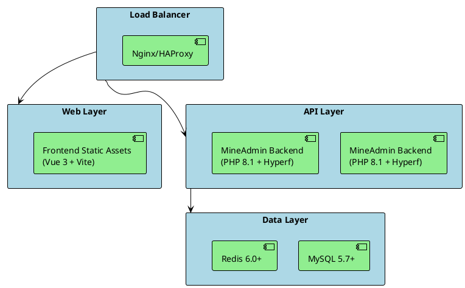

# Deployment

This article will cover how to deploy the frontend and backend applications of MineAdmin in various environments, including best practices for development, testing, and production environments.

## Deployment Architecture Overview

MineAdmin adopts a frontend/backend separation architecture, based on the following technology stack:
- **Backend**: PHP 8.1+ + Hyperf Framework + Swoole Extension
- **Frontend**: Vue 3 + TypeScript + Vite
- **Database**: MySQL 5.7+ / PostgreSQL (Optional)
- **Cache**: Redis 6.0+
- **Containerization**: Docker + Docker Compose



## Environment Preparation

### PHP Extension Requirements

Based on the configuration from [`mineadmin/Dockerfile`](https://github.com/mineadmin/MineAdmin/blob/master/Dockerfile):

**Required Extensions:**
- cURL >= 7.68
- Fileinfo
- OpenSSL >= 1.1
- PDO
- Redis >= 5.3
- JSON
- Tokenizer
- SimpleXML
- XMLWriter

**Optional Extensions:**
- PDO_MYSQL (MySQL support)
- PDO_PGSQL (PostgreSQL support)
- Swoole >= 5.1 (High performance mode)
- Swow >= 1.5
- XlsWriter (Excel file support)

**PHP Configuration Optimization:**
```ini
# /etc/php/8.1/php.ini or corresponding version path
upload_max_filesize = 128M
post_max_size = 128M
memory_limit = 1G
max_execution_time = 300
max_input_vars = 3000
date.timezone = Asia/Shanghai
```

## Backend Deployment

### 1. Environment Configuration

#### Create Environment Configuration File

Copy and configure the environment file, referencing [`mineadmin/.env.example`](https://github.com/mineadmin/MineAdmin/blob/master/.env.example):

```shell
cp .env.example .env
```

**Development Environment Configuration (.env)**:
```bash
APP_NAME=MineAdmin
APP_ENV=dev
APP_DEBUG=true
APP_URL=http://127.0.0.1:9501

# Database configuration
DB_DRIVER=mysql
DB_HOST=127.0.0.1
DB_PORT=3306
DB_DATABASE=mineadmin
DB_USERNAME=root
DB_PASSWORD=your_password
DB_CHARSET=utf8mb4
DB_COLLATION=utf8mb4_unicode_ci
DB_PREFIX=

# Redis configuration
REDIS_HOST=127.0.0.1
REDIS_AUTH=
REDIS_PORT=6379
REDIS_DB=0

# JWT Secret (Generate a new key)
JWT_SECRET=your_jwt_secret_key_here
```

**Production Environment Configuration**:
```bash
APP_NAME=MineAdmin
APP_ENV=prod
APP_DEBUG=false
APP_URL=https://your-domain.com

# Database configuration (Use internal IP)
DB_DRIVER=mysql
DB_HOST=10.0.0.10
DB_PORT=3306
DB_DATABASE=mineadmin
DB_USERNAME=mineadmin
DB_PASSWORD=strong_password_here
DB_CHARSET=utf8mb4
DB_COLLATION=utf8mb4_unicode_ci
DB_PREFIX=

# Redis configuration (Use internal IP, enable password)
REDIS_HOST=10.0.0.11
REDIS_AUTH=redis_password_here
REDIS_PORT=6379
REDIS_DB=0

# JWT Secret (64 character strong key)
JWT_SECRET=generated_64_character_jwt_secret_key_here
```

#### Generate JWT Secret

```shell
# Generate a secure JWT secret
php -r "echo base64_encode(random_bytes(64)) . PHP_EOL;"
```

### 2. Database Initialization

#### Database Migration

