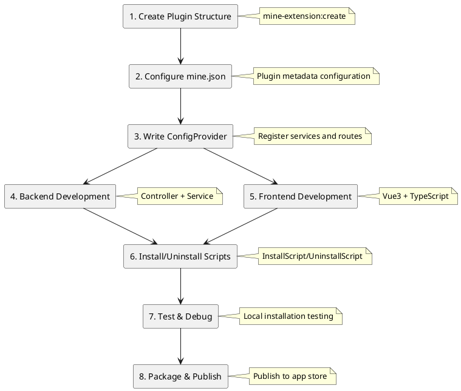

# Plugin Development Guide

This guide is based on actual MineAdmin official plugin code, detailing the complete plugin development process.

## Development Process Overview



## Plugin Structure Specification

Based on the actual code from the `app-store` and `code-generator` plugins, MineAdmin plugins have two typical structures:

### Simple Plugin Structure (Suitable for pure backend or simple functionality)

```
plugin/mine-admin/plugin-name/
├── mine.json                      # Plugin configuration file
├── install.lock                   # Installation marker (auto-generated)
└── src/
    ├── ConfigProvider.php         # Configuration provider
    ├── Controller/                # Controllers
    │   └── IndexController.php
    └── Service/                   # Service layer
        └── Service.php
```

### Complete Plugin Structure (Suitable for complex business logic)

```
plugin/mine-admin/plugin-name/
├── mine.json                      # Plugin configuration file
├── install.lock                   # Installation marker (auto-generated)
├── README.md                      # Plugin description
├── src/                          # Backend code
│   ├── ConfigProvider.php        # Configuration provider
│   ├── InstallScript.php         # Installation script
│   ├── UninstallScript.php       # Uninstallation script
│   ├── Http/
│   │   ├── Controller/           # Controllers
│   │   ├── Request/              # Request validation
│   │   └── Vo/                   # Value objects
│   ├── Model/                    # Data models
│   ├── Repository/               # Repository layer
│   └── Service/                  # Service layer
├── web/                          # Frontend code
│   ├── index.ts                  # Plugin entry point
│   ├── api/                      # API interfaces
│   ├── views/                    # Vue components
│   └── locales/                  # Language packs
├── Database/                     # Database
│   ├── Migrations/               # Migration files
│   └── Seeder/                   # Seed data
├── languages/                    # Backend language packs
│   └── zh_CN/
└── publish/                      # Published resources
    └── template/                 # Template files
```

## Backend Development

### 1. ConfigProvider

Based on the actual implementation of the app-store plugin:

```php
<?php
declare(strict_types=1);

namespace Plugin\MineAdmin\AppStore;

class ConfigProvider
{
    public function __invoke(): array
    {
        return [
            // Annotation scan configuration - REQUIRED
            'annotations' => [
                'scan' => [
                    'paths' => [
                        __DIR__,
                    ],
                ],
            ],
            // Dependency injection (optional)
            'dependencies' => [
                // Interface::class => Implementation::class
            ],
            // Commands (optional)
            'commands' => [
                // Command::class
            ],
            // Middleware (optional)
            'middlewares' => [
                'http' => [
                    // Middleware::class
                ],
            ],
            // Event listeners (optional)
            'listeners' => [
                // Listener::class
            ],
        ];
    }
}
```

### 2. Controller Development

Referencing the IndexController implementation from app-store:

```php
<?php
declare(strict_types=1);

namespace Plugin\MineAdmin\AppStore\Controller;

use Hyperf\Di\Annotation\Inject;
use Hyperf\HttpServer\Annotation\Controller;
use Hyperf\HttpServer\Annotation\GetMapping;
use Hyperf\HttpServer\Annotation\PostMapping;
use Mine\Annotation\Auth;
use Mine\Annotation\Permission;
use Mine\Annotation\RemoteState;
use Plugin\MineAdmin\AppStore\Service\Service;
use Psr\Http\Message\ResponseInterface;

#[Controller(prefix: "admin/plugin/store")]
#[Auth]
class IndexController extends AbstractController
{
    #[Inject]
    protected Service $service;

    /**
     * Remote plugin list
     */
    #[GetMapping("index")]
    #[Permission("plugin:store:index")]
    public function index(): ResponseInterface
    {
        return $this->success(
            $this->service->getAppList($this->request->all())
        );
    }

    /**
     * Download plugin
     */
    #[PostMapping("download")]
    #[Permission("plugin:store:download")]
    public function download(): ResponseInterface
    {
        $params = $this->request->all();
        $this->service->download($params);
        return $this->success();
    }

    /**
     * Install plugin
     */
    #[PostMapping("install")]
    #[Permission("plugin:store:install")]
    public function install(): ResponseInterface
    {
        $params = $this->request->all();
        $this->service->install($params);
        return $this->success();
    }

    /**
     * Uninstall plugin
     */
    #[PostMapping("unInstall")]
    #[Permission("plugin:store:uninstall")]
    public function unInstall(): ResponseInterface
    {
        $params = $this->request->all();
        $this->service->unInstall($params);
        return $this->success();
    }

    /**
     * Local plugin installation list
     */
    #[GetMapping("getInstallList")]
    #[RemoteState]
    public function getInstallList(): ResponseInterface
    {
        return $this->success(
            $this->service->getLocalAppInstallList()
        );
    }

    /**
     * Local upload installation
     */
    #[PostMapping("uploadInstall")]
    #[Permission("plugin:store:uploadInstall")]
    public function uploadInstall(): ResponseInterface
    {
        return $this->success(
            $this->service->uploadLocalApp($this->request->all())
        );
    }
}
```

**Key Annotation Explanations**:
- `#[Controller]`: Defines the controller route prefix
- `#[Auth]`: Requires login authentication
- `#[Permission]`: Permission verification
- `#[GetMapping]`/`#[PostMapping]`: Defines route methods
- `#[Inject]`: Dependency injection
- `#[RemoteState]`: Remote state management

### 3. Service Layer Development

Based on the app-store Service implementation pattern:

```php
<?php
declare(strict_types=1);

namespace Plugin\MineAdmin\AppStore\Service;

use App\Service\MineAppStoreService;
use Hyperf\Di\Annotation\Inject;
use Mine\AppStore\Plugin;
use Mine\Exception\MineException;

class Service
{
    #[Inject]
    protected MineAppStoreService $service;

    /**
     * Get application list
     */
    public function getAppList(array $params): array
    {
        return $this->service->getAppList($params);
    }

    /**
     * Download application
     */
    public function download(array $params): void
    {
        $app = $this->service->getAppInfo($params['identifier']);
        
        if (empty($app['download_url'])) {
            throw new MineException('This application cannot be downloaded', 500);
        }
        
        if (Plugin::hasLocalInstalled($params['identifier'])) {
            throw new MineException('Application already exists locally. Please delete it first before re-downloading.', 500);
        }
        
        $this->service->download($params);
    }

    /**
     * Install application
     */
    public function install(array $params): void
    {
        $pluginName = $params['name'];
        
        if (!Plugin::hasLocal($pluginName)) {
            throw new MineException('Plugin does not exist', 500);
        }
        
        if (Plugin::hasLocalInstalled($pluginName)) {
            throw new MineException('Plugin is already installed', 500);
        }
        
        Plugin::forceRefreshJsonPath($pluginName);
        Plugin::install($pluginName);
    }

    /**
     * Uninstall application
     */
    public function unInstall(array $params): void
    {
        $pluginName = $params['name'];
        
        if (!Plugin::hasLocalInstalled($pluginName)) {
            throw new MineException('Plugin is not installed', 500);
        }
        
        Plugin::uninstall($pluginName);
    }

    /**
     * Get locally installed plugin list
     */
    public function getLocalAppInstallList(): array
    {
        $list = [];
        $plugins = Plugin::getLocalPlugins();
        
        foreach ($plugins as $name => $info) {
            $app = ['identifier' => $name];
            $app['name'] = $info['name'] ?? 'Unknown';
            $app['status'] = $info['status'] ?? false;
            $app['version'] = $info['version'] ?? '0.0.0';
            $app['description'] = $info['description'] ?? 'No description';
            $app['created_at'] = $info['created_at'] ?? '';
            $list[] = $app;
        }
        
        return $list;
    }

    /**
     * Local upload installation
     */
    public function uploadLocalApp(array $params): void
    {
        if (empty($params['path'])) {
            throw new MineException('Please upload a plugin package', 500);
        }
        
        // Extract and validate the plugin package
        $zipFile = new \ZipArchive();
        $result = $zipFile->open($params['path']);
        
        if ($result !== true) {
            throw new MineException('Plugin package extraction failed', 500);
        }
        
        // Get plugin info and install
        $mineJson = $zipFile->getFromName('mine.json');
        if (!$mineJson) {
            throw new MineException('Plugin package format error, missing mine.json', 500);
        }
        
        $config = json_decode($mineJson, true);
        $pluginName = $config['name'] ?? null;
        
        if (!$pluginName) {
            throw new MineException('Plugin package configuration error', 500);
        }
        
        // Extract to plugin directory
        $targetPath = Plugin::getPluginPath($pluginName);
        $zipFile->extractTo($targetPath);
        $zipFile->close();
        
        // Refresh cache and install
        Plugin::forceRefreshJsonPath($pluginName);
        Plugin::install($pluginName);
    }
}
```

### 4. Model Layer (If database is needed)

Referencing the model implementation from the code-generator plugin:

```php
<?php
declare(strict_types=1);

namespace Plugin\MineAdmin\CodeGenerator\Model;

use Mine\MineModel;

class SettingGenerateColumns extends MineModel
{
    protected ?string $table = 'setting_generate_columns';
    
    protected array $fillable = [
        'id', 'table_id', 'column_name', 'column_comment',
        'column_type', 'default_value', 'is_nullable',
        'is_pk', 'is_list', 'is_query', 'is_required',
        'is_sort', 'is_edit', 'is_readonly', 'query_type',
        'view_type', 'dict_type', 'extra', 'sort',
        'created_by', 'updated_by', 'created_at', 'updated_at'
    ];
    
    protected array $casts = [
        'is_pk' => 'boolean',
        'is_list' => 'boolean', 
        'is_query' => 'boolean',
        'is_required' => 'boolean',
        'is_sort' => 'boolean',
        'is_edit' => 'boolean',
        'is_readonly' => 'boolean',
    ];
}
```

## Frontend Development

### 1. Plugin Entry File (index.ts)

Based on the app-store frontend implementation:

```typescript
import type { App } from 'vue'
import type { Plugin } from '#/global'

const pluginConfig: Plugin.PluginConfig = {
  install(app: App) {
    // Vue plugin installation hook
    console.log('app-store plugin install')
  },
  config: {
    enable: true,
    info: {
      name: 'app-store',
      version: '1.0.0',
      author: 'MineAdmin Team',
      description: 'MineAdmin app store visualization plugin'
    }
  },
  views: [
    {
      name: 'plugin:store',
      path: '/plugin/store',
      meta: {
        title: 'app_store.app_store',
        i18n: true,
        icon: 'material-symbols:app-shortcut',
        type: 'M',
        hidden: false,
        componentPath: '/plugin/mine-admin/app-store/views/index.vue',
        componentName: 'plugin:mine-admin:app-store:index',
      },
      component: () => import('./views/index.vue'),
    }
  ],
}

export default pluginConfig
```

### 2. API Interface Encapsulation

```typescript
// api/app-store.ts
import { request } from '@/utils/request'

// Get remote plugin list
export const getAppList = (params: any) => {
  return request.get('/admin/plugin/store/index', { params })
}

// Download plugin
export const downloadApp = (data: any) => {
  return request.post('/admin/plugin/store/download', data)
}

// Install plugin
export const installApp = (data: any) => {
  return request.post('/admin/plugin/store/install', data)
}

// Uninstall plugin
export const uninstallApp = (data: any) => {
  return request.post('/admin/plugin/store/unInstall', data)
}

// Get locally installed plugins
export const getInstalledList = () => {
  return request.get('/admin/plugin/store/getInstallList')
}

// Upload local plugin installation
export const uploadInstall = (data: any) => {
  return request.post('/admin/plugin/store/uploadInstall', data)
}
```

### 3. Vue Component Development

```vue
<!-- views/index.vue -->
<template>
  <div class="app-store-container">
    <el-tabs v-model="activeTab">
      <el-tab-pane label="App Store" name="market">
        <AppMarket />
      </el-tab-pane>
      <el-tab-pane label="Installed" name="installed">
        <InstalledApps />
      </el-tab-pane>
      <el-tab-pane label="Local Upload" name="upload">
        <LocalUpload />
      </el-tab-pane>
    </el-tabs>
  </div>
</template>

<script setup lang="ts">
import { ref } from 'vue'
import AppMarket from './components/AppMarket.vue'
import InstalledApps from './components/InstalledApps.vue'
import LocalUpload from './components/LocalUpload.vue'

const activeTab = ref('market')
</script>
```

### 4. Internationalization Support

```typescript
// locales/zh_CN.ts
export default {
  app_store: {
    app_store: 'App Store',
    app_list: 'App List',
    installed: 'Installed',
    install: 'Install',
    uninstall: 'Uninstall',
    download: 'Download',
    upload: 'Upload',
    local_upload: 'Local Upload',
    upload_tips: 'Please select a plugin package file (.zip format)',
  }
}
```

## Installation and Uninstallation Scripts

### InstallScript.php

Based on the actual implementation from the code-generator plugin:

```php
<?php
declare(strict_types=1);

namespace Plugin\MineAdmin\CodeGenerator;

use Hyperf\Command\Concerns\InteractsWithIO;
use Hyperf\Context\ApplicationContext;
use Hyperf\Contract\ApplicationInterface;
use Mine\Helper\Filesystem;
use Symfony\Component\Console\Input\ArrayInput;
use Symfony\Component\Console\Output\ConsoleOutput;
use Symfony\Component\Console\Output\NullOutput;

class InstallScript
{
    use InteractsWithIO;

    public function __invoke()
    {
        // Set output
        $this->output = new ConsoleOutput();
        
        try {
            $this->info('========================================');
            $this->info('MineAdmin Code Generator Plugin');
            $this->info('========================================');
            $this->info('Starting plugin installation...');
            
            // 1. Copy template files
            $this->copyTemplates();
            
            // 2. Copy language packs
            $this->copyLanguages();
            
            // 3. Publish vendor resources
            $this->publishVendor();
            
            // 4. Run database migrations
            $this->runMigrations();
            
            $this->info('Plugin installed successfully!');
            $this->info('========================================');
            
        } catch (\Throwable $e) {
            $this->error('Plugin installation failed: ' . $e->getMessage());
            throw $e;
        }
    }
    
    /**
     * Copy template files
     */
    protected function copyTemplates(): void
    {
        $source = dirname(__DIR__) . '/publish/template';
        $target = BASE_PATH . '/runtime/generate/template';
        
        if (!is_dir($target)) {
            mkdir($target, 0755, true);
        }
        
        Filesystem::copy($source, $target, false);
        $this->info('Template files copied successfully');
    }
    
    /**
     * Copy language packs
     */
    protected function copyLanguages(): void
    {
        $source = dirname(__DIR__) . '/languages';
        $target = BASE_PATH . '/storage/languages';
        
        Filesystem::copy($source, $target, false);
        $this->info('Language packs copied successfully');
    }
    
    /**
     * Publish vendor package resources
     */
    protected function publishVendor(): void
    {
        $app = ApplicationContext::getContainer()->get(ApplicationInterface::class);
        $app->setAutoExit(false);
        
        $input = new ArrayInput([
            'command' => 'vendor:publish',
            'package' => 'hyperf/translation',
        ]);
        
        $app->run($input, new NullOutput());
        $this->info('Vendor resources published successfully');
    }
    
    /**
     * Run database migrations
     */
    protected function runMigrations(): void
    {
        $migrationPath = dirname(__DIR__) . '/Database/Migrations';
        
        if (!is_dir($migrationPath)) {
            return;
        }
        
        $app = ApplicationContext::getContainer()->get(ApplicationInterface::class);
        $app->setAutoExit(false);
        
        $input = new ArrayInput([
            'command' => 'migrate',
            '--path' => $migrationPath,
            '--force' => true,
        ]);
        
        $app->run($input, new NullOutput());
        $this->info('Database migrations executed successfully');
    }
}
```

### UninstallScript.php

```php
<?php
declare(strict_types=1);

namespace Plugin\MineAdmin\CodeGenerator;

use Hyperf\Command\Concerns\InteractsWithIO;
use Symfony\Component\Console\Output\ConsoleOutput;

class UninstallScript
{
    use InteractsWithIO;

    public function __invoke()
    {
        $this->output = new ConsoleOutput();
        
        $this->info('========================================');
        $this->info('About to uninstall the Code Generator Plugin');
        $this->info('========================================');
        
        try {
            // Clean up template files
            $this->cleanTemplates();
            
            // Clean up language packs
            $this->cleanLanguages();
            
            // Clean up database (optional, decide based on requirements)
            if ($this->confirm('Clean up database tables?')) {
                $this->cleanDatabase();
            }
            
            $this->info('Plugin uninstalled successfully!');
            
        } catch (\Throwable $e) {
            $this->error('Plugin uninstallation failed: ' . $e->getMessage());
            throw $e;
        }
    }
    
    protected function cleanTemplates(): void
    {
        $templatePath = BASE_PATH . '/runtime/generate/template';
        if (is_dir($templatePath)) {
            // Recursively delete directory
            $this->removeDirectory($templatePath);
            $this->info('Template files cleaned up successfully');
        }
    }
    
    protected function cleanLanguages(): void
    {
        // Clean up language pack files
        $langFile = BASE_PATH . '/storage/languages/zh_CN/code-generator.php';
        if (file_exists($langFile)) {
            unlink($langFile);
            $this->info('Language packs cleaned up successfully');
        }
    }
    
    protected function cleanDatabase(): void
    {
        // Execute database cleanup
        // Note: Handle with caution to avoid accidentally deleting user data
        $this->info('Database tables cleaned up successfully');
    }
    
    private function removeDirectory(string $dir): void
    {
        if (!is_dir($dir)) {
            return;
        }
        
        $files = array_diff(scandir($dir), ['.', '..']);
        foreach ($files as $file) {
            $path = $dir . '/' . $file;
            is_dir($path) ? $this->removeDirectory($path) : unlink($path);
        }
        rmdir($dir);
    }
}
```

## Database Migrations

Based on the migration file from code-generator:

```php
<?php
use Hyperf\Database\Schema\Schema;
use Hyperf\Database\Schema\Blueprint;
use Hyperf\Database\Migrations\Migration;

return new class extends Migration
{
    /**
     * Run the migrations.
     */
    public function up(): void
    {
        Schema::create('setting_generate_tables', function (Blueprint $table) {
            $table->engine = 'InnoDB';
            $table->comment('Generate business tables');
            $table->bigIncrements('id')->comment('Primary key');
            $table->string('table_name', 200)->comment('Table name');
            $table->string('table_comment', 500)->comment('Table comment');
            $table->string('module_name', 100)->comment('Module name');
            $table->string('namespace', 255)->comment('Namespace');
            $table->string('menu_name', 100)->comment('Menu name');
            $table->bigInteger('belong_menu_id')->nullable()->comment('Belonging menu');
            $table->string('package_name', 100)->nullable()->comment('Package name');
            $table->addColumn('string', 'type', ['length' => 100])->comment('Generate type');
            $table->addColumn('string', 'generate_mode', ['length' => 30])->default('1')->comment('Generate mode');
            $table->addColumn('string', 'generate_menus', ['length' => 255])->nullable()->comment('Generate menu list');
            $table->addColumn('string', 'build_menu', ['length' => 10])->default('1')->comment('Build menu');
            $table->addColumn('string', 'component_type', ['length' => 30])->default('1')->comment('Component type');
            $table->json('options')->nullable()->comment('Other configurations');
            $table->bigInteger('created_by')->comment('Created by');
            $table->bigInteger('updated_by')->comment('Updated by');
            $table->datetimes();
            $table->unique('table_name');
            $table->index('table_name');
        });
    }

    /**
     * Reverse the migrations.
     */
    public function down(): void
    {
        Schema::dropIfExists('setting_generate_tables');
    }
};
```

## Testing and Debugging

### 1. Local Installation Testing

```bash
# Create plugin
php bin/hyperf.php mine-extension:create mine-admin/my-plugin

# Install plugin
php bin/hyperf.php mine-extension:install mine-admin/my-plugin

# View installed plugins
php bin/hyperf.php mine-extension:local-list

# Uninstall plugin
php bin/hyperf.php mine-extension:uninstall mine-admin/my-plugin
```

### 2. Debugging Techniques

```php
// Add logging in service layer
use Hyperf\Context\ApplicationContext;
use Psr\Log\LoggerInterface;

$logger = ApplicationContext::getContainer()->get(LoggerInterface::class);
$logger->info('Debug info', ['data' => $data]);

// Use dd() function for debugging
dd($variable);

// Use exception throwing for debugging
throw new \Exception('Debug info: ' . json_encode($data));
```

### 3. Frontend Debugging

```typescript
// View in browser console
console.log('Debug info', data)

// Use Vue DevTools to debug component state

// View network requests
// Use the browser's Network panel to view API requests and responses
```

## Development Best Practices ⭐

### 1. Code Conventions

- **Naming Conventions**:
  - Plugin name: `vendor/plugin-name` format
  - Namespace: `Plugin\Vendor\PluginName`
  - Class name: PascalCase
  - Method name: camelCase

- **PSR Standards**:
  - Follow PSR-4 autoloading standard
  - Follow PSR-12 coding standard

### 2. Directory Organization Principles

- Backend code goes under `src/` directory
- Frontend code goes under `web/` directory
- Database-related files go under `Database/` directory
- Static resources go under `publish/` directory
- Language packs go under `languages/` and `web/locales/` directories

### 3. Configuration Management (Important)

- **Do not rely on ConfigProvider's publish feature**
- **Handle all file copying and configuration publishing in InstallScript**
- **Execute database migrations in InstallScript**
- **Perform environment checks in InstallScript**

### 4. Security Considerations

```php
// Parameter validation
use Hyperf\Validation\Request\FormRequest;

class StoreRequest extends FormRequest
{
    public function rules(): array
    {
        return [
            'name' => 'required|string|max:100',
            'email' => 'required|email',
        ];
    }
}

// Permission control
#[Permission("plugin:module:action")]
public function action() {}

// SQL injection prevention - use parameter binding
$model->where('name', '=', $name)->get();

// XSS prevention - frontend handling
{{ data | escape }}
```

### 5. Performance Optimization

```php
// Use dependency injection to reduce coupling
#[Inject]
protected Service $service;

// Use caching
use Hyperf\Cache\Annotation\Cacheable;

#[Cacheable(prefix: "plugin", ttl: 3600)]
public function getData() {}

// Lazy loading routes
component: () => import('./views/index.vue')

// Database query optimization
$query->select(['id', 'name'])->with('relation')->limit(20);
```

### 6. Error Handling

```php
use Mine\Exception\MineException;

// Business exceptions
if (!$condition) {
    throw new MineException('Error message', 500);
}

// try-catch handling
try {
    // Business logic
} catch (\Throwable $e) {
    $this->logger->error('Operation failed', [
        'error' => $e->getMessage(),
        'trace' => $e->getTraceAsString()
    ]);
    throw new MineException('Operation failed: ' . $e->getMessage());
}
```

## Frequently Asked Questions

### Q: Plugin is inaccessible after installation?
A: 
1. Check if the annotations configuration in ConfigProvider is correct
2. Confirm the #[Controller] annotation route prefix on the controller
3. Check if the #[Permission] permission annotation has been configured in the system

### Q: Configuration files are not published?
A: The ConfigProvider publish feature is unreliable for plugins. Handle configuration publishing manually in InstallScript.

### Q: Database migration fails?
A: 
1. Check the database connection configuration
2. Confirm the migration file path is correct
3. View the error output of the migrate command

### Q: Frontend components are not displayed?
A: 
1. Check the route configuration in web/index.ts
2. Confirm the component path is correct
3. View the browser console for error messages

### Q: Dependency package conflicts?
A: 
1. Correctly configure composer dependency version constraints in mine.json
2. Use `composer update` to update dependencies
3. Check dependency compatibility with the main project

## Related Documentation

- [Plugin Structure Details](./structure.md)
- [Lifecycle Management](./lifecycle.md)
- [API Reference Documentation](./api.md)
- [Example Code](./examples.md)
- [mine.json Configuration](./mineJson.md)
- [ConfigProvider Explanation](./configProvider.md)