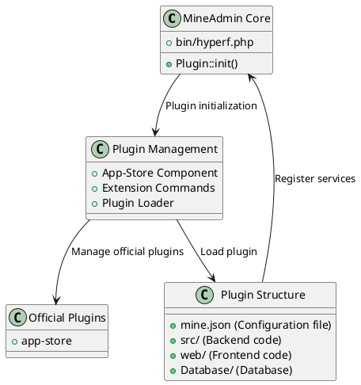

# MineAdmin Plugin System

The MineAdmin plugin system provides powerful extension capabilities, allowing developers to create reusable functional modules, achieving modularity and extensibility of the system.

## Plugin System Architecture

The MineAdmin plugin system is based on the Hyperf framework's ConfigProvider mechanism, providing complete plugin lifecycle management and automated deployment capabilities.



## Core Components

### 1. Plugin Loader
- **File**: `bin/hyperf.php` ([GitHub](https://github.com/mineadmin/mineadmin/blob/master/bin/hyperf.php))
- **Principle**: Automatically loads all installed plugins at application startup via the `Plugin::init()` method
- **Implementation**: Scans all plugins in the `plugin/` directory and registers their ConfigProvider

### 2. App-Store Component
- **Repository**: [mineadmin/appstore](https://github.com/mineadmin/appstore)
- **Functionality**: Provides management capabilities for downloading, installing, uninstalling, and updating plugins
- **Configuration**: Registers services and configurations via `ConfigProvider`

### 3. Plugin Configuration System
- **Core File**: `mine.json`
- **Principle**: Defines plugin metadata, dependencies, installation scripts, and other information
- **Loading**: Parsed and registered into the system during plugin installation

## Official Plugins

MineAdmin provides the following official plugins by default:

| Plugin Name | Function Description | Repository Address |
|---------|----------|----------|
| app-store | Application marketplace management plugin, providing plugin download, install, uninstall, update, and other management functions | [GitHub](https://github.com/mineadmin/appstore) |

> Note: Other plugins such as code generator, scheduled task management, etc., can be obtained from the application marketplace or developed independently

## Plugin Types

MineAdmin supports three types of plugins:

### Mixed
Plugins containing complete frontend and backend functionality, providing complete business modules.

### Backend
Plugins containing only backend logic, mainly providing API services and business logic.

### Frontend
Plugins containing only frontend interfaces, mainly providing user interface components.

## Quick Start

### Environment Preparation

Developing MineAdmin plugins requires:

1. **Familiarity with the tech stack**: MineAdmin and Hyperf frameworks
2. **Obtaining an AccessToken**:
   - Log in to the [MineAdmin official website](https://www.mineadmin.com/login)
   - Go to Personal Center → [Settings Page](https://www.mineadmin.com/member/setting)
   - Obtain the AccessToken

3. **Configuring Environment Variables**:
```ini
# .env file
MINE_ACCESS_TOKEN=YourAccessToken
```

::: warning Note
Please keep your AccessToken safe and avoid leaking it!
:::

### Developer Certification

- **Local Development**: No certification required, can develop and distribute freely
- **Application Marketplace Publishing**: Requires developer certification; contact the MineAdmin team to enable permissions

## Related Documentation

- [Quick Start Guide](./guide.md) - Create your first plugin
- [Development Guide](./develop.md) - Detailed development process
- [Plugin Structure](./structure.md) - Directory structure standards
- [Lifecycle Management](./lifecycle.md) - Install/uninstall process
- [API Reference](./api.md) - Interface documentation
- [Example Code](./examples.md) - Practical cases