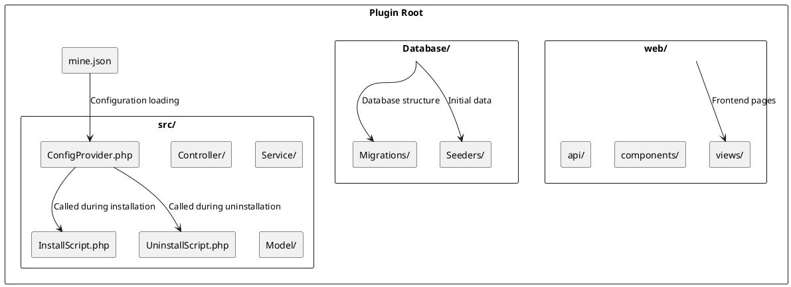

# Plugin Directory Structure

Detailed introduction to the standard directory structure, file specifications, and organization methods of MineAdmin plugins.

## Standard Directory Structure

A complete MineAdmin plugin directory structure is as follows:

```
plugin/vendor/plugin-name/           # Plugin root directory
├── mine.json                        # Plugin core configuration file ⭐
├── README.md                        # Plugin documentation
├── LICENSE                          # License file
├── composer.json                    # Composer dependency configuration (optional)
├── src/                            # Backend source directory ⭐
│   ├── ConfigProvider.php          # Configuration provider ⭐
│   ├── InstallScript.php           # Installation script ⭐
│   ├── UninstallScript.php         # Uninstallation script ⭐
│   ├── Controller/                 # Controller directory
│   │   ├── AdminController.php     # Admin controller
│   │   └── ApiController.php       # API controller
│   ├── Service/                    # Service layer directory
│   │   └── ExampleService.php      # Business service class
│   ├── Repository/                 # Repository layer directory
│   │   └── ExampleRepository.php   # Data repository class
│   ├── Model/                      # Model directory
│   │   └── Example.php             # Data model
│   ├── Request/                    # Request validation directory
│   │   ├── CreateRequest.php       # Create request validation
│   │   └── UpdateRequest.php       # Update request validation
│   ├── Resource/                   # Resource transformation directory
│   │   └── ExampleResource.php     # Resource transformation class
│   ├── Middleware/                 # Middleware directory
│   │   └── ExampleMiddleware.php   # Custom middleware
│   ├── Command/                    # Command directory
│   │   └── ExampleCommand.php      # Custom command
│   ├── Listener/                   # Event listener directory
│   │   └── ExampleListener.php     # Event listener
│   └── Exception/                  # Exception handling directory
│       └── ExampleException.php    # Custom exception
├── web/                            # Frontend source directory ⭐
│   ├── views/                      # Page component directory
│   │   ├── index.vue               # Main page
│   │   ├── list.vue                # List page
│   │   └── form.vue                # Form page
│   ├── components/                 # Common component directory
│   │   └── ExampleComponent.vue    # Generic component
│   ├── api/                        # API interface directory
│   │   └── example.js              # Interface definition
│   ├── router/                     # Route configuration directory
│   │   └── index.js                # Route configuration
│   ├── store/                      # State management directory
│   │   └── example.js              # State management
│   └── assets/                     # Static resource directory
│       ├── images/                 # Image resources
│       └── styles/                 # Style files
├── Database/                       # Database related directory ⭐
│   ├── Migrations/                 # Database migration files
│   │   └── 2024_01_01_000000_create_example_table.php
│   └── Seeders/                    # Data seeding files
│       └── ExampleSeeder.php       # Data seeder class
├── config/                         # Configuration file directory
│   └── example.php                 # Plugin configuration file
├── publish/                        # Publish file directory
│   ├── config/                     # Configuration file templates
│   │   └── example.php             # Configuration file template
│   └── assets/                     # Static resource templates
├── tests/                          # Test file directory
│   ├── Unit/                       # Unit tests
│   ├── Feature/                    # Feature tests
│   └── TestCase.php                # Test base class
├── docs/                           # Documentation directory
│   ├── installation.md             # Installation documentation
│   ├── usage.md                    # Usage documentation
│   └── api.md                      # API documentation
└── .gitignore                      # Git ignore file
```

## Core File Explanation

### 1. mine.json (Plugin Configuration File)

**File path**: `mine.json` ([Configuration Details](./mineJson.md))

The core configuration file of the plugin, defining basic information, dependencies, and loading configuration:

```json
{
  "name": "vendor/plugin-name",
  "description": "Plugin description",
  "version": "1.0.0",
  "type": "mixed",
  "author": [
    {
      "name": "Author Name",
      "email": "author@example.com",
      "role": "developer"
    }
  ],
  "keywords": ["mineadmin", "plugin"],
  "homepage": "https://github.com/vendor/plugin-name",
  "license": "MIT",
  "require": {
    "php": ">=8.1",
    "hyperf/framework": "^3.0"
  },
  "package": {
    "dependencies": {
      "vue": "^3.0",
      "element-plus": "^2.0"
    }
  },
  "composer": {
    "require": {
      "hyperf/async-queue": "^3.0"
    },
    "psr-4": {
      "Plugin\\Vendor\\PluginName\\": "src"
    },
    "config": "Plugin\\Vendor\\PluginName\\ConfigProvider"
  }
}
```

### 2. ConfigProvider.php (Configuration Provider)

**File path**: `src/ConfigProvider.php`
**Implementation principle**: Based on Hyperf ConfigProvider mechanism ([GitHub](https://github.com/hyperf/hyperf/blob/master/src/config-provider/src/ConfigProvider.php))

> ⚠️ **Note**: The `publish` function in ConfigProvider has issues in the plugin system; it is recommended to handle configuration file publishing in InstallScript.

```php
<?php

namespace Plugin\Vendor\PluginName;

class ConfigProvider
{
    public function __invoke(): array
    {
        return [
            'dependencies' => [],
            'annotations' => [
                'scan' => [
                    'paths' => [__DIR__],
                ],
            ],
            'commands' => [],
            'listeners' => [],
            // publish functionality is not recommended for plugins
            // Please handle configuration file publishing in InstallScript
        ];
    }
}
```

### 3. InstallScript.php (Installation Script) ⭐

**File path**: `src/InstallScript.php`
**Call timing**: When executing the `mine-extension:install` command
**Importance**: Recommended for handling configuration publishing, environment checks, and database migration

```php
<?php

namespace Plugin\Vendor\PluginName;

use Hyperf\Contract\ApplicationInterface;
use Hyperf\Database\Commands\Migrations\MigrateCommand;

class InstallScript
{
    public function handle(): bool
    {
        // 1. Check environment dependencies
        if (!$this->checkEnvironment()) {
            echo "Environment check failed\n";
            return false;
        }
        
        // 2. Publish configuration file
        $this->publishConfig();
        
        // 3. Run database migrations
        $this->runMigrations();
        
        // 4. Initialize data
        $this->seedData();
        
        echo "Plugin installed successfully\n";
        return true;
    }
    
    protected function checkEnvironment(): bool
    {
        // Check PHP version
        if (version_compare(PHP_VERSION, '8.1.0', '<')) {
            echo "PHP version must be >= 8.1\n";
            return false;
        }
        
        // Check required extensions
        $requiredExtensions = ['redis', 'pdo', 'json'];
        foreach ($requiredExtensions as $ext) {
            if (!extension_loaded($ext)) {
                echo "Missing PHP extension: {$ext}\n";
                return false;
            }
        }
        
        return true;
    }
    
    protected function publishConfig(): void
    {
        $source = __DIR__ . '/../publish/config/plugin.php';
        $target = BASE_PATH . '/config/autoload/plugin.php';
        
        if (!file_exists($target)) {
            copy($source, $target);
            echo "Configuration file published: {$target}\n";
        }
    }
    
    protected function runMigrations(): void
    {
        $migrationPath = __DIR__ . '/../Database/Migrations';
        
        if (is_dir($migrationPath)) {
            // Execute migration command
            $container = \Hyperf\Context\ApplicationContext::getContainer();
            $application = $container->get(ApplicationInterface::class);
            $application->setAutoExit(false);
            
            $input = new \Symfony\Component\Console\Input\ArrayInput([
                'command' => 'migrate',
                '--path' => $migrationPath,
            ]);
            
            $output = new \Symfony\Component\Console\Output\BufferedOutput();
            $application->run($input, $output);
            
            echo "Database migration completed\n";
        }
    }
    
    protected function seedData(): void
    {
        // Initialize default data
        // e.g., create default configurations, menus, etc.
    }
}
```

### 4. UninstallScript.php (Uninstallation Script) ⭐

**File path**: `src/UninstallScript.php`
**Call timing**: When executing the `mine-extension:uninstall` command
**Importance**: Cleans up configuration files, data tables, and related resources

```php
<?php

namespace Plugin\Vendor\PluginName;

use Hyperf\DbConnection\Db;

class UninstallScript
{
    public function handle(): bool
    {
        // 1. Backup important data (optional)
        $this->backupData();
        
        // 2. Drop database tables
        $this->dropTables();
        
        // 3. Clean up configuration files
        $this->removeConfig();
        
        // 4. Clear cache
        $this->clearCache();
        
        echo "Plugin uninstallation completed\n";
        return true;
    }
    
    protected function backupData(): void
    {
        // Backup important data to specified directory
        $backupPath = BASE_PATH . '/runtime/backup/plugin_' . date('YmdHis') . '.sql';
        // Implement backup logic
    }
    
    protected function dropTables(): void
    {
        // Drop data tables created by the plugin
        $tables = ['plugin_example_table', 'plugin_settings'];
        
        foreach ($tables as $table) {
            if (Db::schema()->hasTable($table)) {
                Db::schema()->drop($table);
                echo "Data table dropped: {$table}\n";
            }
        }
    }
    
    protected function removeConfig(): void
    {
        $configFile = BASE_PATH . '/config/autoload/plugin.php';
        
        if (file_exists($configFile)) {
            unlink($configFile);
            echo "Configuration file removed: {$configFile}\n";
        }
    }
    
    protected function clearCache(): void
    {
        // Clear plugin-related cache
        $redis = \Hyperf\Context\ApplicationContext::getContainer()
            ->get(\Hyperf\Redis\Redis::class);
        
        $redis->del('plugin:cache:*');
        echo "Cache cleared\n";
    }
}
```

## Directory Structure Diagram



## Structural Differences for Different Plugin Types

### Mixed (Hybrid Plugin)
Contains complete `src/` and `web/` directories, providing full frontend and backend functionality.

### Backend Plugin
Only contains the `src/` directory, focusing on providing API services and business logic:

```
plugin/vendor/backend-plugin/
├── mine.json
├── src/
│   ├── ConfigProvider.php
│   ├── Controller/
│   ├── Service/
│   └── Model/
└── Database/
```

### Frontend Plugin
Only contains the `web/` directory, focusing on frontend interface and interaction:

```
plugin/vendor/frontend-plugin/
├── mine.json
├── web/
│   ├── views/
│   ├── components/
│   └── assets/
└── src/
    └── ConfigProvider.php  # Minimal configuration
```

## Naming Conventions

### 1. Directory Naming
- Use lowercase letters and hyphens: `user-management`
- Avoid using underscores and spaces

### 2. File Naming
- PHP class files use PascalCase: `UserController.php`
- Vue components use PascalCase: `UserList.vue`
- Configuration files use lowercase: `user.php`

### 3. Namespace Conventions
Follow PSR-4 autoloading standard:

```php
// Plugin path: plugin/mineadmin/user-manager/
// Namespace: Plugin\MineAdmin\UserManager\
namespace Plugin\MineAdmin\UserManager\Controller;
```

## File Permissions and Security

### 1. File Permission Settings
```bash
# Set appropriate file permissions
find plugin/ -type f -name "*.php" -exec chmod 644 {} \;
find plugin/ -type d -exec chmod 755 {} \;
```

### 2. Security Considerations
- Use environment variables for sensitive configuration
- Avoid hardcoding keys in code
- Validate and filter user input
- Use HTTPS for transmitting sensitive data

## Best Practices

### 1. File Organization
- Organize code by functional modules
- Keep directory structure clear
- Use meaningful file names

### 2. Code Standards
- Follow PSR-12 coding standards
- Add appropriate comments
- Use type declarations

### 3. Version Control
- Use `.gitignore` to exclude unnecessary files
- Create clear commit messages
- Use semantic versioning

## Example Project Structure

View the actual structure of official plugins:

**App-Store Plugin**: MineAdmin official application marketplace plugin, demonstrating a standard hybrid plugin structure

## Frequently Asked Questions

### Q: Where should the plugin directory be placed?
A: Plugins should be placed in the `plugin/` directory at the project root, organized using the `vendor/plugin-name` format.

### Q: How to handle dependencies between plugins?
A: Declare dependencies on other plugins in the `require` field of `mine.json`.

### Q: Where are frontend files placed after installation?
A: Files in the `web/` directory are copied to the corresponding locations in the frontend project during installation.

### Q: How are database migration files executed?
A: Call the migration execution logic in `InstallScript.php`, or use Hyperf's migration command.