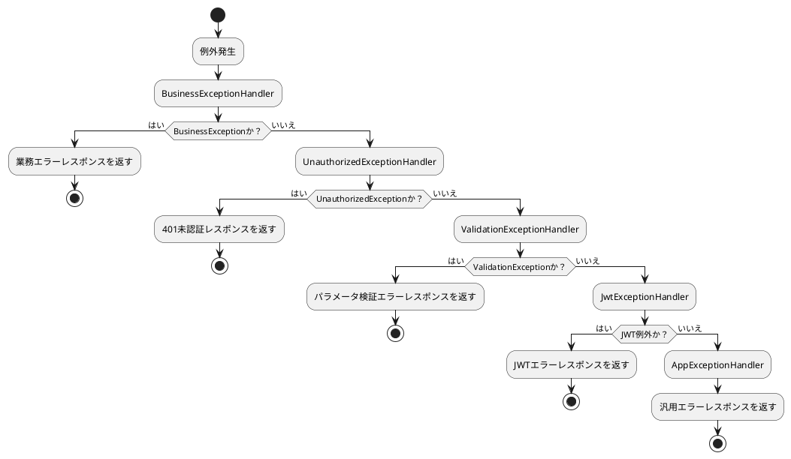

# エラー処理

## 目次

- [デフォルト例外処理機構](#デフォルト例外処理機構)
- [例外処理フロー](#例外処理フロー)
- [コア例外ハンドラ](#コア例外ハンドラ)
- [業務例外処理](#業務例外処理)
- [カスタム例外ハンドラ](#カスタム例外ハンドラ)
- [デバッグモード機能](#デバッグモード機能)
- [ベストプラクティス](#ベストプラクティス)
- [よくある質問](#よくある質問)

## デフォルト例外処理機構

::: tip 前提知識
MineAdminの例外処理を理解するには、まず[Hyperf](https://hyperf.io)のエラー処理についての基礎知識が必要です。
このドキュメントでは基礎的な説明は行いませんので、先にHyperfの例外処理基本概念を理解してください。
:::

MineAdminはHyperfフレームワークを基盤にした堅牢な例外処理機構を実装しています。`config/autoload/exceptions.php`で複数の例外ハンドラを設定し、責任連鎖パターンで異なるタイプの例外を順次処理します。

## 例外処理フロー



## コア例外ハンドラ

### 例外ハンドラ設定

::: code-group

```php [exceptions.php]
<?php

declare(strict_types=1);
/**
 * MineAdminプロジェクトファイル
 */
use App\Exception\Handler\AppExceptionHandler;
use App\Exception\Handler\BusinessExceptionHandler;
use App\Exception\Handler\JwtExceptionHandler;
use App\Exception\Handler\UnauthorizedExceptionHandler;
use App\Exception\Handler\ValidationExceptionHandler;
use Hyperf\ExceptionHandler\Listener\ErrorExceptionHandler;
use Hyperf\HttpServer\Exception\Handler\HttpExceptionHandler;

return [
    'handler' => [
        'http' => [
            // 業務例外処理 - 最優先
            BusinessExceptionHandler::class,
            // 未認証例外処理
            UnauthorizedExceptionHandler::class,
            // バリデーション例外処理
            ValidationExceptionHandler::class,
            // JWT例外処理
            JwtExceptionHandler::class,
            // アプリケーション例外処理 - 最終フォールバック
            AppExceptionHandler::class,
        ],
    ],
];
```

:::

::: warning 注意事項
- 例外ハンドラの順序は重要で、前にあるほど優先度が高い
- `AppExceptionHandler`はフォールバックハンドラとして常に最後に配置
- 影響を完全に理解していない限り、ハンドラ順序を変更しないこと
:::

### 基本例外ハンドラクラス

全ての例外ハンドラは`AbstractHandler`を継承し、統一的な処理ロジックを提供します：

::: code-group

```php [AbstractHandler.php]
<?php

declare(strict_types=1);
/**
 * MineAdminプロジェクトファイル
 */
namespace App\Exception\Handler;

use App\Http\Common\Result;
use Hyperf\Codec\Json;
use Hyperf\Context\Context;
use Hyperf\Contract\ConfigInterface;
use Hyperf\Contract\StdoutLoggerInterface;
use Hyperf\ExceptionHandler\ExceptionHandler;
use Hyperf\ExceptionHandler\Formatter\FormatterInterface;
use Hyperf\HttpMessage\Stream\SwooleStream;
use Hyperf\Logger\LoggerFactory;
use Mine\Support\Logger\UuidRequestIdProcessor;
use Mine\Support\Traits\Debugging;
use Psr\Container\ContainerInterface;
use Swow\Psr7\Message\ResponsePlusInterface;

abstract class AbstractHandler extends ExceptionHandler
{
    use Debugging;

    public function __construct(
        private readonly ConfigInterface $config,
        private readonly ContainerInterface $container,
        private readonly LoggerFactory $loggerFactory
    ) {}

    /**
     * サブクラスで実装必須：例外処理と結果返却
     */
    abstract public function handleResponse(\Throwable $throwable): Result;

    /**
     * 例外処理メインエントリ
     */
    public function handle(\Throwable $throwable, ResponsePlusInterface $response)
    {
        // 例外ログ記録
        $this->report($throwable);
        
        return value(function (ResponsePlusInterface $responsePlus) use ($throwable) {
            // デバッグモード時はCORSヘッダー追加と詳細エラー記録
            if ($this->isDebug()) {
                $responsePlus
                    ->setHeader('Access-Control-Allow-Origin', '*')
                    ->setHeader('Access-Control-Allow-Credentials', 'true')
                    ->setHeader('Access-Control-Allow-Methods', 'GET, POST, PATCH, PUT, DELETE, OPTIONS')
                    ->setHeader('Access-Control-Allow-Headers', 'DNT,Keep-Alive,User-Agent,Cache-Control,Content-Type,Authorization');
                
                // 詳細例外情報をコンテキストに保存
                Context::set(self::class . '.throwable', [
                    'message' => $throwable->getMessage(),
                    'file' => $throwable->getFile(),
                    'line' => $throwable->getLine(),
                    'trace' => $throwable->getTrace(),
                ]);
            }
            return $responsePlus;
        }, $this->handlerRequestId(
            $this->handlerResult(
                $response,
                $this->handleResponse($throwable)
            )
        ));
    }

    /**
     * 例外ログ記録（コンソール出力とファイル記録）
     */
    public function report(\Throwable $throwable)
    {
        // デバッグモード時はコンソールにフォーマット済みエラー出力
        if ($this->isDebug()) {
            $this->container->get(StdoutLoggerInterface::class)->error(
                $this->container->get(FormatterInterface::class)->format($throwable)
            );
        }
        
        // エラーログファイルに記録
        $this->loggerFactory
            ->get('error')
            ->error($throwable->getMessage(), ['exception' => $throwable]);
    }

    /**
     * 結果をレスポンスボディにラップ
     */
    protected function handlerResult(ResponsePlusInterface $responsePlus, Result $result): ResponsePlusInterface
    {
        $responsePlus->setHeader('Content-Type', 'application/json; charset=utf-8');

        // デバッグモード時は詳細例外情報を含める
        if ($this->isDebug()) {
            $result = $result->toArray();
            $result['throwable'] = Context::get(self::class . '.throwable');
            return $responsePlus
                ->setBody(new SwooleStream(Json::encode($result)));
        }

        return $responsePlus
            ->setBody(new SwooleStream(Json::encode($result)));
    }

    /**
     * レスポンスにリクエストIDヘッダー追加（問題追跡用）
     */
    private function handlerRequestId(ResponsePlusInterface $responsePlus): ResponsePlusInterface
    {
        return $responsePlus->setHeader('Request-Id', UuidRequestIdProcessor::getUuid());
    }
}
```

```php [AppExceptionHandler.php]
<?php

declare(strict_types=1);

namespace App\Exception\Handler;

use App\Http\Common\Result;
use App\Http\Common\ResultCode;

/**
 * アプリケーション最終例外ハンドラ
 * 全ての未処理例外をキャッチするフォールバックハンドラ
 */
final class AppExceptionHandler extends AbstractHandler
{
    /**
     * 例外処理と統一エラーレスポンス返却
     */
    public function handleResponse(\Throwable $throwable): Result
    {
        // 例外伝播停止
        $this->stopPropagation();
        
        return new Result(
            ResultCode::FAIL,
            $throwable->getMessage() ?: 'システムエラーが発生しました。後ほど再試行してください'
        );
    }
    
    /**
     * 全タイプの例外を処理
     */
    public function isValid(\Throwable $throwable): bool
    {
        return true;
    }
}
```

:::

## Result と ResultCode コアクラス

### Result 統一レスポンスクラス

`Result`クラスはMineAdminの全APIレスポンス標準フォーマットで、`Arrayable`インターフェースを実装しOpenAPIドキュメントアノテーションをサポート：

::: code-group

```php [Result.php]
<?php

declare(strict_types=1);

namespace App\Http\Common;

use Hyperf\Contract\Arrayable;
use Hyperf\Swagger\Annotation as OA;

/**
 * @template T
 */
#[OA\Schema(title: 'Api Response', description: 'Api Response')]
class Result implements Arrayable
{
    /**
     * @param T $data
     */
    public function __construct(
        #[OA\Property(ref: 'ResultCode', title: 'レスポンスコード')]
        public ResultCode $code = ResultCode::SUCCESS,
        #[OA\Property(title: 'レスポンスメッセージ', type: 'string')]
        public ?string $message = null,
        #[OA\Property(title: 'レスポンスデータ', type: 'array')]
        public mixed $data = []
    ) {
        // メッセージ未指定時はResultCodeからデフォルト取得
        if ($this->message === null) {
            $this->message = ResultCode::getMessage($this->code->value);
        }
    }

    public function toArray(): array
    {
        return [
            'code' => $this->code->value,
            'message' => $this->message,
            'data' => $this->data,
        ];
    }
}
```

:::

#### 使用例

::: code-group

```php [成功レスポンス]
// 成功レスポンス - デフォルト成功コード使用
$result = new Result();

// 成功レスポンス - データ付き
$result = new Result(data: ['id' => 1, 'name' => '山田太郎']);

// 成功レスポンス - カスタムメッセージ
$result = new Result(message: '操作が正常に完了しました');
```

```php [失敗レスポンス]
// 失敗レスポンス - デフォルト失敗コード使用
$result = new Result(ResultCode::FAIL, '操作に失敗しました');

// 失敗レスポンス - 特定ステータスコード使用
$result = new Result(ResultCode::UNAUTHORIZED, 'ユーザーがログインしていません');

// 失敗レスポンス - エラーデータ付き
$result = new Result(
    ResultCode::UNPROCESSABLE_ENTITY, 
    'パラメータ検証失敗',
    ['errors' => ['email' => ['メールアドレス形式が不正です']]]
);
```

:::

### ResultCode ステータスコード列挙

`ResultCode`はPHP 8.1列挙型ベースのステータスコード定義で、HyperfのConstants特性で国際化メッセージをサポート：

::: code-group

```php [ResultCode.php]
<?php

declare(strict_types=1);

namespace App\Http\Common;

use Hyperf\Constants\Annotation\Constants;
use Hyperf\Constants\Annotation\Message;
use Hyperf\Constants\ConstantsTrait;
use Hyperf\Swagger\Annotation as OA;

#[Constants]
#[OA\Schema(title: 'ResultCode', type: 'integer', default: 200)]
enum ResultCode: int
{
    use ConstantsTrait;

    #[Message('result.success')]
    case SUCCESS = 200;

    #[Message('result.fail')]
    case FAIL = 500;

    #[Message('result.unauthorized')]
    case UNAUTHORIZED = 401;

    #[Message('result.forbidden')]
    case FORBIDDEN = 403;

    #[Message('result.not_found')]
    case NOT_FOUND = 404;

    #[Message('result.method_not_allowed')]
    case METHOD_NOT_ALLOWED = 405;

    #[Message('result.not_acceptable')]
    case NOT_ACCEPTABLE = 406;

    #[Message('result.conflict')]
    case UNPROCESSABLE_ENTITY = 422;

    #[Message('result.disabled')]
    case DISABLED = 423;
}
```

:::

#### ステータスコード説明

| 定数名 | 数値 | HTTPステータス | 説明 | 使用シナリオ |
|--------|------|-------------|------|----------|
| `SUCCESS` | 200 | 200 OK | 操作成功 | 正常な業務処理成功時 |
| `FAIL` | 500 | 500 Internal Server Error | システムエラー | 一般的なシステム例外または業務処理失敗時 |
| `UNAUTHORIZED` | 401 | 401 Unauthorized | 未認証 | ユーザー未ログインまたはトークン無効時 |
| `FORBIDDEN` | 403 | 403 Forbidden | アクセス拒否 | ユーザーにリソースアクセス権限なし時 |
| `NOT_FOUND` | 404 | 404 Not Found | リソース不存在 | リクエストリソースが存在しない時 |
| `METHOD_NOT_ALLOWED` | 405 | 405 Method Not Allowed | メソッド不許可 | HTTPメソッドがサポートされていない時 |
| `NOT_ACCEPTABLE` | 406 | 406 Not Acceptable | 受理不可 | リクエスト内容特性が満たせない時 |
| `UNPROCESSABLE_ENTITY` | 422 | 422 Unprocessable Entity | 処理不可エンティティ | パラメータ検証失敗、業務ルール検証失敗時 |
| `DISABLED` | 423 | 423 Locked | リソースロック | ユーザーまたはリソースが無効化されている時 |

#### 国際化サポート

`ResultCode`はHyperfの多言語機構で対応メッセージテキストを取得可能：

::: code-group

```php [言語ファイル - lang/ja/result.php]
<?php

return [
    'success' => '操作が成功しました',
    'fail' => '操作に失敗しました',
    'unauthorized' => 'ユーザー認証がされていません',
    'forbidden' => 'アクセスが拒否されました',
    'not_found' => 'リソースが見つかりません',
    'method_not_allowed' => '許可されていないメソッドです',
    'not_acceptable' => '受理できないリクエストです',
    'conflict' => 'パラメータ検証に失敗しました',
    'disabled' => 'リソースは無効化されています',
];
```

```php [国際化メッセージ取得]
// ResultCodeからメッセージ取得
$message = ResultCode::getMessage(ResultCode::SUCCESS->value);
// 出力：'操作が成功しました'

// Result構築時自動取得
$result = new Result(ResultCode::NOT_FOUND);
// $result->message 自動で 'リソースが見つかりません'
```

:::

## 業務例外処理

### BusinessException 業務例外クラス

`throw new Exception`直接使用ではなく、`BusinessException`を使用して業務関連例外をスロー推奨：

::: code-group

```php [BusinessException.php]
<?php

declare(strict_types=1);
/**
 * MineAdminプロジェクトファイル
 */
namespace App\Exception;

use App\Http\Common\Result;
use App\Http\Common\ResultCode;

/**
 * 業務例外クラス
 * 業務ロジック関連例外スロー用
 */
class BusinessException extends \RuntimeException
{
    private Result $response;

    /**
     * @param ResultCode $code 結果ステータスコード
     * @param string|null $message エラーメッセージ
     * @param mixed $data 追加データ
     */
    public function __construct(ResultCode $code = ResultCode::FAIL, ?string $message = null, mixed $data = [])
    {
        $this->response = new Result($code, $message, $data);
        parent::__construct($message ?? ResultCode::getMessage($code->value));
    }

    /**
     * 構造化レスポンスオブジェクト取得
     */
    public function getResponse(): Result
    {
        return $this->response;
    }
}
```

```php [BusinessExceptionHandler.php]
<?php

declare(strict_types=1);

namespace App\Exception\Handler;

use App\Exception\BusinessException;
use App\Http\Common\Result;

/**
 * 業務例外ハンドラ
 * BusinessExceptionタイプ例外専用処理
 */
class BusinessExceptionHandler extends AbstractHandler
{
    /**
     * 業務例外処理、例外内包結果を直接返却
     */
    public function handleResponse(\Throwable $throwable): Result
    {
        $this->stopPropagation();
        
        if ($throwable instanceof BusinessException) {
            return $throwable->getResponse();
        }
        
        // フォールバック処理
        return new Result(
            ResultCode::FAIL,
            $throwable->getMessage()
        );
    }
    
    /**
     * BusinessExceptionタイプのみ処理
     */
    public function isValid(\