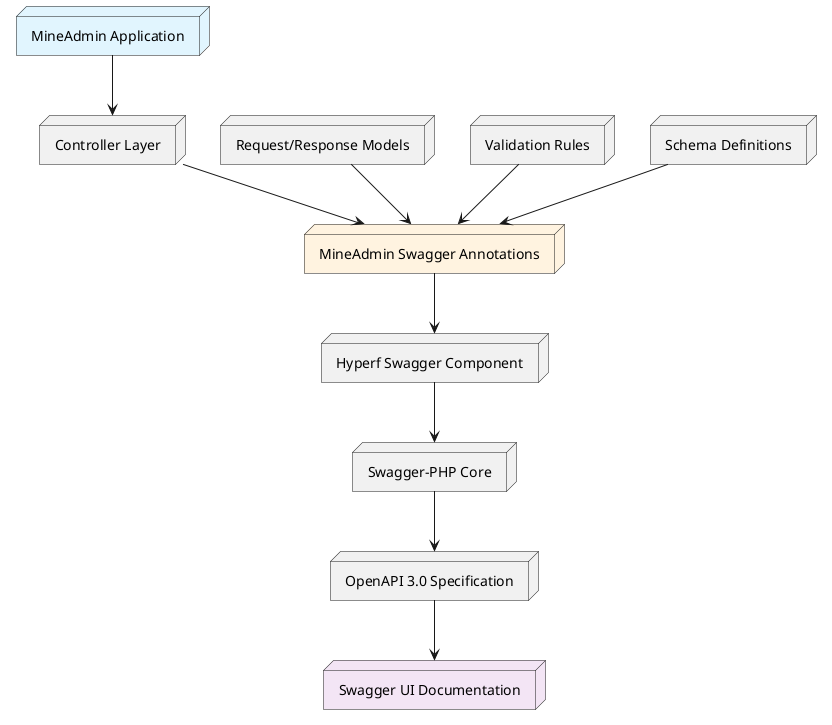
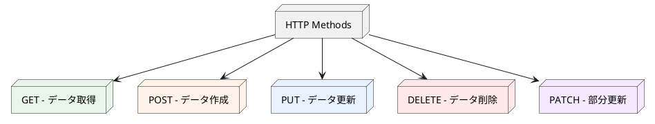
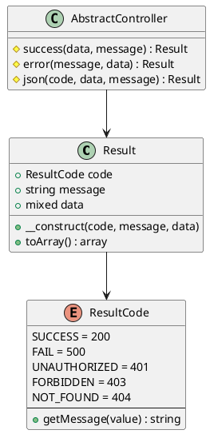

# ルーティングとAPIドキュメントシステム

## 目次

1. [概要とアーキテクチャ](#_1-概要とアーキテクチャ)
2. [クイックスタート](#_2-クイックスタート)
3. [HTTP仕様とベストプラクティス](#_3-http仕様とベストプラクティス)
4. [レスポンス構造体システム](#_4-レスポンス構造体システム)
5. [MineAdminカスタムアノテーション](#_5-mineadminカスタムアノテーション)
6. [実践例](#_6-実践例)
10. [よくある質問と解決策](#_10-よくある質問と解決策)

---

## 1. 概要とアーキテクチャ

### 1.1 システム概要

MineAdminには完全なAPIドキュメント生成システムが組み込まれており、[Swagger/OpenAPI 3.0](https://swagger.io)仕様に基づいて、開発者に強力なAPIドキュメント自動生成と管理機能を提供します。

**アクセス方法**: ローカル開発時は`http://localhost:9503/swagger`で完全なAPIドキュメントを確認できます

### 1.2 アーキテクチャレイヤー

::: tip 技術スタックアーキテクチャ

MineAdminのAPIドキュメントシステムは多層アーキテクチャ設計を採用しています：

- **[mineadmin/swagger](https://github.com/mineadmin/Swagger)** - MineAdmin専用のSwaggerアノテーションラッパーレイヤー
- **[hyperf/swagger](https://github.com/hyperf/swagger)** - HyperfフレームワークのSwagger統合コンポーネント
- **[zircote/swagger-php](https://github.com/zircote/swagger-php)** - PHP Swaggerアノテーション処理コア
- **[OpenAPI 仕様](https://github.com/OAI/OpenAPI-Specification)** - 業界標準のAPIドキュメント仕様

:::

### 1.3 システムアーキテクチャ図



### 1.4 コアメリット

- **自動ドキュメント生成**: コードアノテーションに基づいて完全なAPIドキュメントを自動生成
- **型安全性**: 強い型サポートにより、ドキュメントと実際のコードの一貫性を確保
- **リアルタイム同期**: コード変更時にドキュメントが自動更新
- **インタラクティブテスト**: 組み込みのSwagger UIで直接APIテストをサポート

---

## 2. クイックスタート

### 2.1 基本設定

プロジェクトにMineAdmin Swaggerコンポーネントが正しくインストールされていることを確認：

```bash
composer require mineadmin/swagger
```

### 2.2 最初のAPIインターフェース

簡単なAPIインターフェースを作成：

```php
<?php

namespace App\Http\Admin\Controller;

use App\Http\Common\Result;
use Mine\Swagger\Attributes\ResultResponse;
use Hyperf\Swagger\Annotation as OA;

#[OA\Tag(name: "ユーザー管理", description: "ユーザー関連のAPIインターフェース")]
class UserController extends AbstractController
{
    #[OA\Get(
        path: "/admin/user/info",
        summary: "ユーザー情報取得",
        description: "ユーザーIDに基づいて詳細なユーザー情報を取得"
    )]
    #[ResultResponse(
        instance: new Result(data: ["id" => 1, "name" => "張三"]),
        title: "取得成功",
        description: "ユーザー情報の取得に成功"
    )]
    public function getUserInfo(): Result
    {
        return $this->success([
            'id' => 1,
            'name' => '張三',
            'email' => 'zhangsan@example.com'
        ]);
    }
}
```

### 2.3 ドキュメントアクセス

サービス起動後、`http://localhost:9503/swagger`で生成されたドキュメントを確認。

---

## 3. HTTP仕様とベストプラクティス

### 3.1 RESTful API 設計原則

MineAdminはRESTfulアーキテクチャスタイルに従うことを推奨し、APIインターフェースの一貫性と予測可能性を確保します。

#### 3.1.1 HTTP メソッドマッピング



#### 3.1.2 標準ルーティング設計パターン

ユーザー管理モジュールを例に、標準的なRESTful API設計を表示：

| HTTPメソッド | ルートパス | 機能説明 | レスポンスデータ |
|---------|----------|---------|----------|
| `GET` | `/admin/user/list` | ユーザーリスト取得（ページネーション） | ユーザーリストデータ |
| `GET` | `/admin/user/{id}` | 単一ユーザー詳細取得 | 単一ユーザーデータ |
| `POST` | `/admin/user` | 新規ユーザー作成 | 作成されたユーザーデータ |
| `PUT` | `/admin/user/{id}` | ユーザー情報完全更新 | 更新後のユーザーデータ |
| `PATCH` | `/admin/user/{id}` | ユーザー情報部分更新 | 更新後のユーザーデータ |
| `DELETE` | `/admin/user/{id}` | ユーザー削除 | 削除確認情報 |

#### 3.1.3 ベストプラクティス推奨事項

::: tip 設計原則

1. **リソース命名**: 動詞ではなく名詞を使用し、複数形を採用
   ```
   ✅ /admin/users
   ❌ /admin/getUsers
   ```

2. **ネストリソース**: リソース間の階層関係を表現
   ```
   ✅ /admin/users/{id}/roles
   ❌ /admin/user-roles?user_id={id}
   ```

3. **ステータスコード意味**: HTTPステータスコードを正しく使用
   ```
   200 - リクエスト成功
   201 - リソース作成成功
   400 - リクエストパラメータエラー
   401 - 未認証アクセス
   403 - 権限不足
   404 - リソース不存在
   500 - サーバー内部エラー
   ```

4. **柔軟性優先**: 規範は基本、ビジネス要件が核心
   - RESTful原則に従うが厳格な規範に拘泥しない
   - ビジネスの持続的イテレーションを主要考慮事項とする
   - チーム内部の一貫性を維持

:::

### 3.2 URL 設計規範

#### 3.2.1 命名規則

```php
// 推奨命名方式
GET    /admin/users              // ユーザーリスト取得
GET    /admin/users/{id}         // 指定ユーザー取得
POST   /admin/users              // ユーザー作成
PUT    /admin/users/{id}         // ユーザー更新
DELETE /admin/users/{id}         // ユーザー削除

// 特殊操作の命名
POST   /admin/users/{id}/enable  // ユーザー有効化
POST   /admin/users/{id}/disable // ユーザー無効化
GET    /admin/users/search       // ユーザー検索
```

#### 3.2.2 パラメータ伝達規範

```php
// クエリパラメータ - フィルタリング、ソート、ページネーション用
GET /admin/users?page=1&page_size=20&status=active&sort=created_at,desc

// パスパラメータ - リソースの一意識別用
GET /admin/users/123

// リクエストボディパラメータ - 複雑なデータ伝達用
POST /admin/users
Content-Type: application/json
{
    "username": "zhangsan",
    "email": "zhangsan@example.com",
    "roles": [1, 2, 3]
}
```

---

## 4. レスポンス構造体システム

### 4.1 統一レスポンス形式

MineAdminは統一レスポンス構造`\App\Http\Common\Result`を採用し、全てのAPIインターフェースが一貫した形式で返すことを保証します。

### 4.2 Result クラスアーキテクチャ



### 4.3 コア実装コード

#### 4.3.1 Result レスポンスクラス

::: code-group

```php [Result.php]
<?php

declare(strict_types=1);
/**
 * This file is part of MineAdmin.
 */

namespace App\Http\Common;

use Hyperf\Contract\Arrayable;
use Hyperf\Swagger\Annotation as OA;

/**
 * 統一APIレスポンス構造
 * @template T
 */
#[OA\Schema(title: 'API レスポンス構造', description: '統一APIレスポンス形式')]
class Result implements Arrayable
{
    public function __construct(
        #[OA\Property(ref: 'ResultCode', title: 'レスポンスステータスコード', description: 'ビジネスステータスコード、HTTPステータスコードとは異なる')]
        public ResultCode $code = ResultCode::SUCCESS,
        
        #[OA\Property(title: 'レスポンスメッセージ', type: 'string', description: 'レスポンスの説明情報')]
        public ?string $message = null,
        
        #[OA\Property(title: 'レスポンスデータ', type: 'mixed', description: '実際のビジネスデータ')]
        public mixed $data = []
    ) {
        if ($this->message === null) {
            $this->message = ResultCode::getMessage($this->code->value);
        }
    }

    /**
     * 配列形式に変換
     */
    public function toArray(): array
    {
        return [
            'code' => $this->code->value,
            'message' => $this->message,
            'data' => $this->data,
        ];
    }
}
```

```php [AbstractController.php]
<?php

namespace App\Http\Common\Controller;

use App\Http\Common\Result;
use App\Http\Common\ResultCode;

/**
 * 基礎コントローラークラス
 * 統一レスポンスメソッドを提供
 */
abstract class AbstractController
{
    /**
     * 成功レスポンス
     */
    protected function success(mixed $data = [], ?string $message = null): Result
    {
        return new Result(ResultCode::SUCCESS, $message, $data);
    }

    /**
     * エラーレスポンス
     */
    protected function error(?string $message = null, mixed $data = []): Result
    {
        return new Result(ResultCode::FAIL, $message, $data);
    }

    /**
     * カスタムレスポンス
     */
    protected function json(ResultCode $code, mixed $data = [], ?string $message = null): Result
    {
        return new Result($code, $message, $data);
    }
    
    /**
     * ページネーションレスポンス
     */
    protected function paginate(array $list, int $total, int $page = 1, int $pageSize = 10): Result
    {
        return $this->success([
            'list' => $list,
            'total' => $total,
            'page' => $page,
            'page_size' => $pageSize,
            'total_pages' => ceil($total / $pageSize)
        ]);
    }
}
```

```php [AdminController.php]
<?php

namespace App\Http\Admin\Controller;

use App\Http\Common\Controller\AbstractController as Base;
use Hyperf\Context\ApplicationContext;
use Hyperf\HttpServer\Contract\RequestInterface;

/**
 * 管理バックエンドコントローラーベースクラス
 * ページネーション処理機能を拡張
 */
abstract class AbstractController extends Base
{
    /**
     * 現在のページ番号取得
     */
    protected function getCurrentPage(): int
    {
        return (int) $this->getRequest()->input('page', 1);
    }

    /**
     * ページサイズ取得
     */
    protected function getPageSize(int $default = 10, int $max = 100): int
    {
        $size = (int) $this->getRequest()->input('page_size', $default);
        return min($size, $max); // 最大ページサイズを制限
    }

    /**
     * リクエストインスタンス取得
     */
    protected function getRequest(): RequestInterface
    {
        return ApplicationContext::getContainer()->get(RequestInterface::class);
    }
    
    /**
     * ソートパラメータ取得
     */
    protected function getOrderBy(string $default = 'id'): array
    {
        $sort = $this->getRequest()->input('sort', $default);
        $order = $this->getRequest()->input('order', 'asc');
        
        return [$sort, in_array(strtolower($order), ['asc', 'desc']) ? $order : 'asc'];
    }
}
```

:::

### 4.4 ResultCode 列挙クラス

MineAdminは完全なビジネスステータスコード列挙システムを提供し、APIレスポンスの状態情報を標準化します。

#### 4.4.1 コア実装

```php
<?php

declare(strict_types=1);
/**
 * This file is part of MineAdmin.
 */

namespace App\Http\Common;

use Hyperf\Constants\Annotation\Constants;
use Hyperf\Constants\Annotation\Message;
use Hyperf\Constants\ConstantsTrait;
use Hyperf\Swagger\Annotation as OA;

/**
 * ビジネスステータスコード列挙
 * 標準化されたAPIレスポンスステータスコードを提供
 */
#[Constants]
#[OA\Schema(title: 'ResultCode', type: 'integer', default: 200, description: 'ビジネスステータスコード')]
enum ResultCode: int
{
    use ConstantsTrait;

    // 成功状態
    #[Message('操作成功')]
    case SUCCESS = 200;

    // 共通エラー状態
    #[Message('操作失敗')]
    case FAIL = 500;

    #[Message('未認証アクセス')]
    case UNAUTHORIZED = 401;

    #[Message('権限不足')]
    case FORBIDDEN = 403;

    #[Message('リソース不存在')]
    case NOT_FOUND = 404;

    #[Message('リクエストメソッド不許可')]
    case METHOD_NOT_ALLOWED = 405;

    #[Message('リクエスト形式不可受諾')]
    case NOT_ACCEPTABLE = 406;

    #[Message('リクエストエンティティ処理エラー')]
    case UNPROCESSABLE_ENTITY = 422;
    
    // ビジネス関連エラー
    #[Message('パラメータ検証失敗')]
    case VALIDATION_ERROR = 10001;
    
    #[Message('ビジネスロジックエラー')]
    case BUSINESS_ERROR = 10002;
    
    #[Message('データベース操作失敗')]
    case DATABASE_ERROR = 10003;
    
    #[Message('外部サービス呼び出し失敗')]
    case EXTERNAL_SERVICE_ERROR =