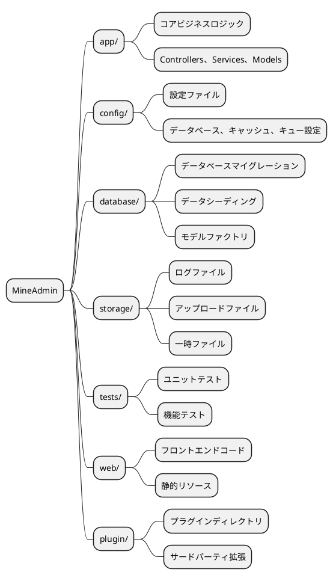
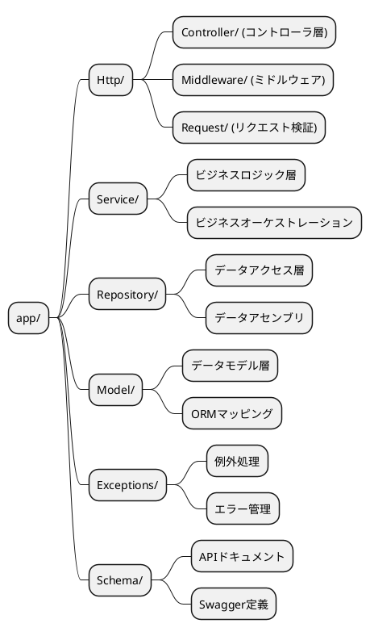
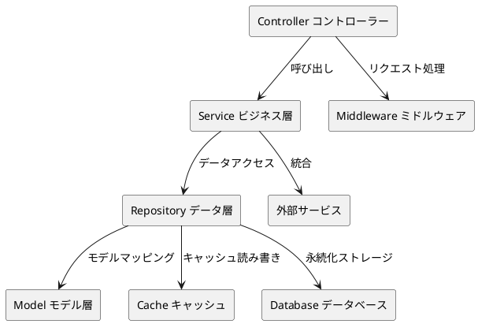

# プロジェクトディレクトリ構造

MineAdminはモダンな階層化アーキテクチャ設計を採用し、明確なコード組織構造とベストプラクティスを提供します。このドキュメントでは、プロジェクトのディレクトリ構造、設計理念、および開発規範について詳しく説明します。

## 概要

MineAdminのプロジェクト構造は[Laravel](https://laravel.com/)フレームワークの設計理念を参考にしつつ、モダンな階層化アーキテクチャパターンを組み合わせています。Laravel開発に慣れている場合、MineAdminの構造を理解するのは非常に容易です。

### アーキテクチャ理念

MineAdminは以下のコア設計原則を採用しています：

- **階層化アーキテクチャ**：Controller → Service → Repository → Modelの明確な階層化
- **責任分離**：各ディレクトリに明確な責任境界
- **拡張性**：プラグイン開発とモジュール拡張をサポート
- **標準化**：PSR規範とベストプラクティスに準拠

## プロジェクトルートディレクトリ構造



### ディレクトリ詳細説明

#### `/app` - アプリケーションコアディレクトリ

アプリケーションのコアビジネスロジックが配置される場所で、コントローラー、サービス層、データ層などのコアコンポーネントを含みます。

**主な特徴：**
- 99%のビジネスコードを含む
- MVC階層アーキテクチャに準拠
- モジュール化開発をサポート

#### `/config` - 設定ディレクトリ

すべてのアプリケーション設定ファイルを格納し、柔軟な環境設定管理を提供します。

**典型的な設定ファイル：**
- `database.php` - データベース設定
- `cache.php` - キャッシュ設定  
- `queue.php` - キュー設定

#### `/database` - データベースディレクトリ

データベース関連のすべてのファイルを管理し、構造変更とテストデータを含みます。

**ディレクトリ構造：**
```
database/
├── migrations/     # データベースマイグレーションファイル
├── seeders/        # データシーディングファイル
```

#### `/storage` - ストレージディレクトリ

アプリケーション実行時に生成されるファイルとデータを格納します。

**ディレクトリ用途：**
- `uploads/` - ユーザーアップロードファイル
- `swagger/` - APIドキュメントファイル

#### `/tests` - テストディレクトリ

自動化テストスイートを含み、コード品質と機能の正確性を確保します。

**テストタイプ：**
- **ユニットテスト** - 単一のクラスまたはメソッドをテスト
- **機能テスト** - 完全なビジネスプロセスをテスト
- **APIテスト** - APIインターフェースをテスト

#### `/web` - フロントエンドディレクトリ

フロントエンドアプリケーションコードと静的リソースファイルを格納します。

#### `/plugin` - プラグインディレクトリ

プラグインマーケットからダウンロードしたプラグインパッケージを格納し、システム機能拡張をサポートします。

## Appディレクトリ詳細解析

`app`ディレクトリはアプリケーション全体のコアであり、厳格な階層化アーキテクチャ設計を採用しています。



### Httpディレクトリ - リクエスト処理層

すべてのHTTPリクエストのエントリ層を担当し、コントローラー、ミドルウェア、リクエスト検証を含みます。

#### ディレクトリ構造
```
Http/
├── Admin/              # バックエンド管理モジュール
│   ├── Controller/     # バックエンドコントローラー
│   ├── Middleware/     # バックエンドミドルウェア
│   ├── Request/        # バックエンドリクエスト検証クラス
│   ├── Subscriber/     # イベントサブスクライバ
│   └── Vo/            # 値オブジェクトクラス
├── Api/                # APIインターフェースモジュール
│   ├── Controller/     # APIコントローラー
│   │   └── V1/        # APIバージョン管理
│   ├── Middleware/     # APIミドルウェア
│   └── Request/        # APIリクエスト検証クラス
│       └── V1/        # APIバージョンリクエストクラス
├── Common/             # 共通モジュール
│   ├── Controller/     # 共通コントローラー
│   ├── Event/         # イベントクラス
│   ├── Middleware/     # 共通ミドルウェア
│   ├── Request/        # 共通リクエストクラス
│   ├── Result.php      # レスポンス結果クラス
│   ├── ResultCode.php  # 結果ステータスコード
│   └── Swagger/        # APIドキュメント設定
└── CurrentUser.php     # 現在のユーザーコンテキスト
```

#### モジュール化アーキテクチャ説明

**Adminモジュール** - バックエンド管理機能
- 権限管理、ユーザー管理、メニュー管理などのバックエンド機能を含む
- 完全なMVC構造を採用し、イベントサブスクライバと値オブジェクトを含む

**Apiモジュール** - 外部APIインターフェース  
- バージョン管理（V1, V2など）をサポート
- 独立した認証ミドルウェアとリクエスト検証
- RESTful API設計規範

**Commonモジュール** - 共通コンポーネント
- モジュール間で共有される基本機能を提供
- 統一されたレスポンス形式とステータスコード管理
- APIドキュメント自動生成設定

### Serviceディレクトリ - ビジネスロジック層

Service層はコアビジネスロジックの実装場所であり、ビジネスルールのオーケストレーションと実行を担当します。

#### 設計原則

1. **単一責任** - 各Serviceクラスは単一のビジネスドメインを処理
2. **依存性注入** - コンストラクタを通じて依存関係を注入
3. **トランザクション管理** - ビジネス操作の原子性を確保
4. **例外処理** - 統一された例外処理メカニズム

#### Service層の責任

**コア機能：**
- ビジネスロジックのオーケストレーションと実行
- トランザクション管理とデータ一貫性
- Repository層を呼び出してデータ操作
- ビジネスルールの検証と処理

### Repositoryディレクトリ - データアクセス層

Repositoryパターンはデータアクセスの抽象層を提供し、データクエリと操作ロジックをカプセル化します。

#### 設計特徴

- **データソース抽象化** - データソース（MySQL、Redis、ESなど）の簡単な切り替え
- **クエリ再利用** - 共通クエリロジックの再利用
- **キャッシュ統合** - 透過的なキャッシュ層統合
- **パフォーマンス最適化** - クエリ最適化とバッチ操作

#### Repository層の特徴

**主な責任：**
- データアクセス抽象層  
- 複雑なクエリロジックのカプセル化
- キャッシュ戦略の実装
- データソースの切り替えと最適化

### Modelディレクトリ - データモデル層

Model層はHyperfのEloquent ORMに基づき、データベーステーブルのオブジェクトリレーショナルマッピングを提供します。

#### モデル特性

- **関連関係** - テーブル間の関連を定義
- **アクセサ/ミューテタ** - データフォーマット
- **イベントリスナー** - モデルライフサイクルイベント
- **ソフトデリート** - 論理削除サポート

#### Model層の特性

**コア機能：**
- データテーブルマッピングと関係定義
- 属性アクセサとミューテタ
- モデルイベントとオブザーバ
- データ型変換と検証

### Exceptionsディレクトリ - 例外処理

統一された例外処理メカニズムを提供し、ユーザーフレンドリーなエラーメッセージとログ記録を実現します。

### Schemaディレクトリ - APIドキュメント

Swagger/OpenAPIドキュメント定義を含み、APIドキュメント生成に使用されます。

::: danger 重要注意
Schemaクラスは厳密にビジネスロジックのスケジューリングに参加することを禁止し、APIドキュメント生成のみに使用されます。
:::

## 開発ベストプラクティス

### コード組織規範

1. **命名規範**
   - クラス名は`PascalCase`を使用
   - メソッド名は`camelCase`を使用  
   - 定数は`UPPER_SNAKE_CASE`を使用

2. **ファイル組織**
   - 1ファイル1クラス
   - ファイル名とクラス名を一致
   - 適切な名前空間の使用

3. **依存性注入**
   - コンストラクタ注入を優先
   - 静的呼び出しを避ける
   - インターフェース指向プログラミング

### アーキテクチャパターン推奨



### エラー処理戦略

1. **例外分類**
   - ビジネス例外 - 予期可能なエラー
   - システム例外 - 予期不可能なエラー
   - 検証例外 - データ形式エラー

2. **ログ記録**
   - 重要な操作記録
   - 例外情報記録
   - パフォーマンス監視記録

## 関連リソース

### 参考ドキュメント

- [Laravel 公式ドキュメント](https://laravel.com/docs/11.x)
- [Laravel 日本語ドキュメント](https://learnku.com/docs/laravel/10.x)
- [Hyperf コルーチンフレームワーク](https://hyperf.wiki/3.1/#/ja/)

::: warning ORM差異説明
MineAdminは[Hyperf](https://github.com/hyperf/hyperf)がメンテナンスするコルーチン版Eloquent ORMを使用しており、Laravel公式版とは一定の差異があります。開発時にはコルーチン環境下での特殊な使用方法に注意してください。
:::