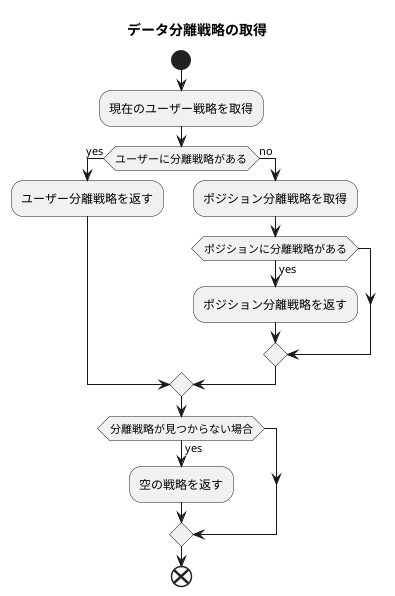

# データ権限制御の設定と使用例

このドキュメントでは、データ権限制御における各種ポリシーの設定方法と使用方法について説明します。

## データ分離方式

現在サポートされているデータ分離は行レベル分離のみですが、複数の分離戦略が利用可能です。

主に「作成者基準」と「所属部門基準」の2つの分離方式があります。

* `部門`分離はユーザーの現在の所属部門を基準とし、データ検索時に自動的に部門フィルタ条件が追加されます。
* `作成者`分離はデータの作成者を基準とし、データ検索時に自動的に作成者フィルタ条件が追加されます。

## 優先順位

現在、`特定ユーザーに対する分離戦略の設定`と`ユーザーにポジションを割り当て、ポジションに対して分離戦略を設定`の2つの方法がサポートされています。
ユーザーに両方の分離戦略が設定されている場合、ユーザーに直接設定された分離戦略が優先されます。



ロジックコードは以下の通り：

```php
// app/Model/Permission/User.php:167~186

public function getPolicy(): ?Policy
{
    /**
     * @var null|Policy $policy
     */
    $policy = $this->policy()->first();
    if (! empty($policy)) {
        return $policy;
    }

    $this->load('position');
    $positionList = $this->position;
    foreach ($positionList as $position) {
        $current = $position->policy()->first();
        if (! empty($current)) {
            return $current;
        }
    }
    return null;
}

```

## 使用例

現在の`user`テーブルを分離対象テーブルとし、以下のデータがあると仮定します：

### サンプルデータ

部門テーブル

---

| id | name | parent_id |
|----|------|-----------|
| 1  | 部門1  | 0         |
| 2  | 部門2  | 1         |
| 3  | 部門3  | 0         |

部門1はトップレベル部門で親部門なし。
部門2は部門1の子部門。
部門3はトップレベル部門で親部門なし。

---

ポジションテーブル

| id | name | dept_id |
|----|------|---------|
| 1  | ポジション1  | 1       |
| 2  | ポジション2  | 2       |
| 3  | ポジション3  | 3       |

部門1にポジション1、部門2にポジション2、部門3にポジション3が所属。

---

ユーザーテーブル

| id | name  | dept_id | created_by | post_id |
|----|-------|---------|------------|---------|
| 1  | スーパー管理者 | 0       | 0          | 0       |
| 2  | a1    | 1       | 1          | 1       |
| 3  | a2    | 2       | 1          | 1       |
| 4  | a3    | 1       | 2          | 2       |
| 5  | a4    | 2       | 2          | 0       |
| 6  | a5    | 0       | 4          | 0       |

ユーザーテーブルで、`dept_id`が0のユーザーは部門なし、`created_by`が0のユーザーは作成者なしを示します。
スーパー管理者はすべてのデータを閲覧可能。

a1、a3は部門1所属、a2、a4は部門2所属。

a1、a2の作成者はスーパー管理者、a3、a4の作成者はa1。

a1、a2のポジションはポジション1、a3のポジションはポジション2、a4はポジションなし。

以下に、異なる戦略におけるデータ検索結果の例を示します。

### PolicyType::SELF `自分のみを検索`

現在のユーザーIDが2のa1ユーザーで、「自分のみを検索」戦略が設定されている場合。

1. 分離方式が作成者のみの場合。`作成者が現在のユーザーID`という条件が追加され、ユーザーa3、a4が検索されます。

```sql
SELECT * FROM user WHERE created_by in (4,5);
```

2. 分離方式が部門のみの場合。`部門が現在のユーザーの所属部門`という条件が追加され、ユーザーa1、a3が検索されます。

```sql
SELECT * FROM user WHERE dept_id in(1);
```

3. 分離方式が作成者と部門の両方の場合。`作成者が現在のユーザーID`かつ`部門が現在のユーザーの所属部門`という条件が追加され、ユーザーa3が検索されます。

```sql
SELECT * FROM user WHERE created_by in(2) AND dept_id in(1);
```

4. 分離方式が部門または作成者の場合。`作成者が現在のユーザーID`または`部門が現在のユーザーの所属部門`という条件が追加され、ユーザーa1、a3、a4が検索されます。

```sql
SELECT * FROM user WHERE dept_id in(1) OR created_by in(2);
```

### PolicyType::DEPT_SELF `自部門のみを検索`

現在のユーザーIDが2のa1ユーザーで、「自部門のみを検索」戦略が設定されている場合。

1. 分離方式が作成者のみの場合。`作成者が現在のユーザーと同じ部門に属するすべてのユーザーID`という条件が追加され、ユーザーa3、a4、a5が検索されます。

```sql
SELECT * FROM user WHERE created_by in (2,4,5);
```

2. 分離方式が部門のみの場合。`部門が現在のユーザーの所属部門`という条件が追加され、ユーザーa1、a3が検索されます。

```sql
SELECT * FROM user WHERE dept_id in(1);
```

3. 分離方式が作成者と部門の両方の場合。`作成者が現在のユーザーと同じ部門に属するすべてのユーザーID`かつ`部門が現在のユーザーの所属部門`という条件が追加され、ユーザーa3が検索されます。

```sql
SELECT * FROM user WHERE created_by in(2,4,5) AND dept_id in(1);
```

4. 分離方式が部門または作成者の場合。`作成者が現在のユーザーと同じ部門に属するすべてのユーザーID`または`部門が現在のユーザーの所属部門`という条件が追加され、ユーザーa1、a3、a4、a5が検索されます。

```sql
SELECT * FROM user WHERE created_by in(2,4,5) OR dept_id in(1);
```

### PolicyType::DEPT_TREE `自部門と子部門を検索`

現在のユーザーIDが2のa1ユーザーで、「自部門と子部門を検索」戦略が設定されている場合。

1. 分離方式が作成者のみの場合。`作成者が現在のユーザーと同じ部門および下位部門に属するすべてのユーザーID`という条件が追加され、ユーザーa3、a4、a5が検索されます。

```sql
SELECT * FROM user WHERE created_by in (2,4,5);
```

2. 分離方式が部門のみの場合。`部門が現在のユーザーの所属部門および下位部門`という条件が追加され、ユーザーa1、a2、a3、a4が検索されます。

```sql
SELECT * FROM user WHERE dept_id in(1,2);
```

3. 分離方式が作成者と部門の両方の場合。`作成者が現在のユーザーと同じ部門および下位部門に属するすべてのユーザーID`かつ`部門が現在のユーザーの所属部門および下位部門`という条件が追加され、ユーザーa3、a4が検索されます。

```sql
SELECT * FROM user WHERE created_by in(2,4,5) AND dept_id in(1,2);
```

4. 分離方式が部門または作成者の場合。`作成者が現在のユーザーと同じ部門および下位部門に属するすべてのユーザーID`または`部門が現在のユーザーの所属部門および下位部門`という条件が追加され、ユーザーa1、a2、a3、a4、a5が検索されます。

```sql
SELECT * FROM user WHERE created_by in(2,4,5) OR dept_id in(1,2);
```

### PolicyType::ALL `すべてを検索`
現在のユーザーIDが2のa1ユーザーで、「すべてを検索」戦略が設定されている場合。すべての制限が解除されます。

### PolicyType::CUSTOM_DEPT `カスタム部門`

現在のユーザーIDが2のa1ユーザーで、部門2と3のデータのみを閲覧可能な戦略が設定されている場合。

1. 分離方式が作成者のみの場合。`作成者の所属部門が2と3のすべてのユーザーID`という条件が追加され、ユーザーa2、a4、a5が検索されます。

```sql
SELECT * FROM user WHERE created_by in (2,4,5);
```

2. 分離方式が部門のみの場合。`部門が2と3`という条件が追加され、ユーザーa2、a4が検索されます。

```sql
SELECT * FROM user WHERE dept_id in(2,3);
```

3. 分離方式が作成者と部門の両方の場合。`作成者の所属部門が2と3のすべてのユーザーID`かつ`部門が2と3`という条件が追加され、ユーザーa2、a4が検索されます。

```sql
SELECT * FROM user WHERE created_by in(2,4,5) AND dept_id in(2,3);
```

4. 分離方式が部門または作成者の場合。`作成者の所属部門が2と3のすべてのユーザーID`または`部門が2と3`という条件が追加され、ユーザーa2、a4、a5が検索されます。

```sql
SELECT * FROM user WHERE created_by in(2,4,5) OR dept_id in(2,3);
```

### PolicyType::CUSTOM_FUNC `カスタム関数`

現在のユーザーIDが2のa1ユーザーで、カスタム関数`testction`が設定されている場合。

`config/autoload/department/custom.php`にカスタム関数`testction`が定義されています：

```php
<?php

declare(strict_types=1);
/**
 * This file is part of MineAdmin.
 *
 * @link     https://www.mineadmin.com
 * @document https://doc.mineadmin.com
 * @contact  root@imoi.cn
 * @license  https://github.com/mineadmin/MineAdmin/blob/master/LICENSE
 */

use App\Library\DataPermission\Context;
use App\Library\DataPermission\ScopeType;
use App\Model\DataPermission\Policy;
use App\Model\Permission\User;
use Hyperf\Database\Query\Builder;

return [
    'testction' =>  function (Builder $builder, ScopeType $scopeType, Policy $policy, User $user) {
        // IDが2のユーザーのみに適用
        if ($user->id !== 2) {
            return;
        }
        // 現在のコンテキストから作成者フィールド名を取得
        $createdByColumn = Context::getCreatedByColumn();
        // 現在のコンテキストから部門フィールド名を取得
        $deptColumn = Context::getDeptColumn();
        switch ($scopeType){
            // 分離タイプが作成者基準の場合
            case ScopeType::CREATED_BY:
                // 作成者フィールドが現在のユーザー
                $builder->where($createdByColumn, $user->id);
                break;
            case ScopeType::DEPT:
                // 部門フィールドが現在のユーザーの部門
                $builder->whereIn($deptColumn, $user->department()->get()->pluck('id'));
                break;
            case ScopeType::DEPT_CREATED_BY:
                // 部門フィールドが現在のユーザーの部門
                $builder->whereIn($deptColumn, $user->department()->get()->pluck('id'));
                // 作成者が現在のユーザー
                $builder->where($createdByColumn, $user->id);
                break;
            case ScopeType::DEPT_OR_CREATED_BY:
                // 部門フィールドが現在のユーザーの部門
                $builder->whereIn($deptColumn, $user->department()->get()->pluck('id'));
                // 作成者が現在のユーザー
                $builder->orWhere($createdByColumn, $user->id);
                break;
        }
    }
];

```

分離が有効になると、現在のコンテキストのユーザー、分離方式、権限ポリシーがカスタム関数`testction`に渡され、処理されます。
これにより、開発者は複雑な分離ロジックをカスタマイズできます。