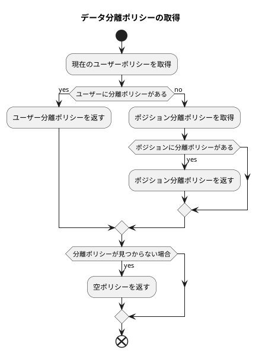

# データ権限設定と使用例

この記事では、データ権限設定における各種ポリシーの設定と使用方法について説明します。

## データ分離方法

データ分離は現在、行レベル分離のみをサポートしていますが、複数の分離ポリシーに対応しています。

主に、作成者や所属部門に基づく分離方法に分けられます。

* `部門`分離はユーザーの現在の所属部門に基づき、データクエリ時に自動的に部門フィルタ条件を追加します。
* `作成者`分離はデータの作成者を基準とし、データクエリ時に自動的に作成者フィルタ条件を追加します。

## 優先順位

現在、`特定ユーザーに対する分離ポリシー設定`と`ユーザーにポジションを割り当て、ポジションに分離ポリシーを設定`の2つの方法をサポートしています。
ユーザーに分離ポリシーとポジション分離ポリシーの両方が設定されている場合、特定ユーザーに設定された分離ポリシーが優先的に使用されます。



ロジックコードは以下の通りです:

```php
// /mineadmin/app/Model/Permission/User.php:160-179

public function getPolicy(): ?Policy
{
    /**
     * @var null|Policy $policy
     */
    $policy = $this->policy()->first();
    if (! empty($policy)) {
        return $policy;
    }

    $this->load('position');
    $positionList = $this->position;
    foreach ($positionList as $position) {
        $current = $position->policy()->first();
        if (! empty($current)) {
            return $current;
        }
    }
    return null;
}

```

## 例

現在のテーブル `user` を分離テーブルとして、以下のデータがあると仮定します:

### サンプルデータ

部門テーブル

---

| id | name | parent_id |
|----|------|-----------|
| 1  | 部門1  | 0         |
| 2  | 部門2  | 1         |
| 3  | 部門3  | 0         |

部門1はトップ部門で、親部門はありません。
部門2は部門1の子部門です。
部門3はトップ部門で、親部門はありません。

---

ポジションテーブル

| id | name | dept_id |
|----|------|---------|
| 1  | ポジション1  | 1       |
| 2  | ポジション2  | 2       |
| 3  | ポジション3  | 3       |

部門1にはポジション1、部門2にはポジション2、部門3にはポジション3があります。

---

ユーザーテーブル

| id | name  | dept_id | created_by | post_id |
|----|-------|---------|------------|---------|
| 1  | スーパー管理者 | 0       | 0          | 0       |
| 2  | a1    | 1       | 1          | 1       |
| 3  | a2    | 2       | 1          | 1       |
| 4  | a3    | 1       | 2          | 2       |
| 5  | a4    | 2       | 2          | 0       |
| 6  | a5    | 0       | 4          | 0       |

ユーザーテーブルでは、`dept_id`が0のユーザーは部門を持たず、`created_by`が0のユーザーは作成者がいないことを示します。
スーパー管理者はすべてのデータを閲覧できます。

a1、a3は部門1に所属し、a2、a4は部門2に所属します。

a1、a2の作成者はスーパー管理者で、a3、a4の作成者はa1です。

a1、a2のポジションはポジション1、a3のポジションはポジション2、a4はポジションを持ちません。

以下に、異なるポリシーにおけるデータクエリ結果を説明する例をいくつか挙げます。

### PolicyType::SELF `自分のみをクエリ`

現在のユーザーIDが2のa1ユーザーで、自分のみをクエリするポリシーが設定されているとします。

1. 分離方法が作成者のみの場合。クエリ条件として`作成者が現在のユーザーID`が追加され、ユーザーa3、a4がクエリされます。

```sql
SELECT * FROM user WHERE created_by in (4,5);
```

2. 分離方法が部門のみの場合。クエリ条件として`部門が現在のユーザーの所属部門`が追加され、ユーザーa1、a3がクエリされます。

```sql
SELECT * FROM user WHERE dept_id in(1);
```

3. 分離方法が作成者と部門の場合。クエリ条件として`作成者が現在のユーザーID`かつ`部門が現在のユーザーの所属部門`が追加され、ユーザーa3がクエリされます。

```sql
SELECT * FROM user WHERE created_by in(2) AND dept_id in(1);
```

4. 分離方法が部門または作成者フィルタの場合。クエリ条件として`作成者が現在のユーザーID`または`部門が現在のユーザーの所属部門`が追加され、ユーザーa1、a3、a4がクエリされます。

```sql
SELECT * FROM user WHERE dept_id in(1) OR created_by in(2);
```

### PolicyType::DEPT_SELF `自部門のみをクエリ`

現在のユーザーIDが2のa1ユーザーで、自部門のみをクエリするポリシーが設定されているとします。

1. 分離方法が作成者のみの場合。クエリ条件として`作成者が現在のユーザーと同じ部門のすべてのユーザーID`が追加され、ユーザーa3、a4、a5がクエリされます。

```sql
SELECT * FROM user WHERE created_by in (2,4,5);
```

2. 分離方法が部門のみの場合。クエリ条件として`部門が現在のユーザーの所属部門`が追加され、ユーザーa1、a3がクエリされます。

```sql
SELECT * FROM user WHERE dept_id in(1);
```

3. 分離方法が作成者と部門の場合。クエリ条件として`作成者が現在のユーザーと同じ部門のすべてのユーザーID`かつ`部門が現在のユーザーの所属部門`が追加され、ユーザーa3がクエリされます。

```sql
SELECT * FROM user WHERE created_by in(2,4,5) AND dept_id in(1);
```

4. 分離方法が部門または作成者フィルタの場合。クエリ条件として`作成者が現在のユーザーと同じ部門のすべてのユーザーID`または`部門が現在のユーザーの所属部門`が追加され、ユーザーa1、a3、a4、a5がクエリされます。

```sql
SELECT * FROM user WHERE created_by in(2,4,5) OR dept_id in(1);
```

### PolicyType::DEPT_TREE `自部門と子部門をクエリ`

現在のユーザーIDが2のa1ユーザーで、自部門と子部門をクエリするポリシーが設定されているとします。

1. 分離方法が作成者のみの場合。クエリ条件として`作成者が現在のユーザーと同じ部門および下位部門のすべてのユーザーID`が追加され、ユーザーa3、a4、a5がクエリされます。

```sql
SELECT * FROM user WHERE created_by in (2,4,5);
```

2. 分離方法が部門のみの場合。クエリ条件として`部門が現在のユーザーの所属部門および下位部門`が追加され、ユーザーa1、a2、a3、a4がクエリされます。

```sql
SELECT * FROM user WHERE dept_id in(1,2);
```

3. 分離方法が作成者と部門の場合。クエリ条件として`作成者が現在のユーザーと同じ部門および下位部門のすべてのユーザーID`かつ`部門が現在のユーザーの所属部門および下位部門`が追加され、ユーザーa3、a4がクエリされます。

```sql
SELECT * FROM user WHERE created_by in(2,4,5) AND dept_id in(1,2);
```

4. 分離方法が部門または作成者フィルタの場合。クエリ条件として`作成者が現在のユーザーと同じ部門および下位部門のすべてのユーザーID`または`部門が現在のユーザーの所属部門および下位部門`が追加され、ユーザーa1、a2、a3、a4、a5がクエリされます。

```sql
SELECT * FROM user WHERE created_by in(2,4,5) OR dept_id in(1,2);
```

### PolicyType::ALL `すべてをクエリ`
現在のユーザーIDが2のa1ユーザーで、すべてをクエリするポリシーが設定されている場合、すべての制限が解除されます。

### PolicyType::CUSTOM_DEPT `カスタム部門`

現在のユーザーIDが2のa1ユーザーで、部門2と3のデータのみを閲覧できるポリシーが設定されているとします。

1. 分離方法が作成者のみの場合。クエリ条件として`作成者の所属部門が2と3のすべてのユーザーID`が追加され、ユーザーa2、a4、a5がクエリされます。

```sql
SELECT * FROM user WHERE created_by in (2,4,5);
```

2. 分離方法が部門のみの場合。クエリ条件として`部門が2と3`が追加され、ユーザーa2、a4がクエリされます。

```sql
SELECT * FROM user WHERE dept_id in(2,3);
```

3. 分離方法が作成者と部門の場合。クエリ条件として`作成者の所属部門が2と3のすべてのユーザーID`かつ`部門が2と3`が追加され、ユーザーa2、a4がクエリされます。

```sql
SELECT * FROM user WHERE created_by in(2,4,5) AND dept_id in(2,3);
```

4. 分離方法が部門または作成者フィルタの場合。クエリ条件として`作成者の所属部門が2と3のすべてのユーザーID`または`部門が2と3`が追加され、ユーザーa2、a4、a5がクエリされます。

```sql
SELECT * FROM user WHERE created_by in(2,4,5) OR dept_id in(2,3);
```

### PolicyType::CUSTOM_FUNC `カスタム関数`

現在のユーザーIDが2のa1ユーザーで、カスタム関数`testction`のポリシーが設定されているとします。

`/Users/zhuzhu/project/mineadmin/config/autoload/department/custom.php` でカスタム関数 `testction` が定義されています:

```php
// /mineadmin/config/autoload/department/custom.php
return [
    'testction' =>  function (Builder $builder, ScopeType $scopeType, Policy $policy, User $user) {
        // IDが2のユーザーのみに適用
        if ($user->id !== 2) {
            return;
        }
        // 現在のコンテキストから作成者フィールド名を取得
        $createdByColumn = Context::getCreatedByColumn();
        // 現在のコンテキストから部門フィールド名を取得
        $deptColumn = Context::getDeptColumn();
        switch ($scopeType){
            // 分離タイプが作成者ベース
            case ScopeType::CREATED_BY:
                // 作成者フィールドが現在のユーザー
                $builder->where($createdByColumn, $user->id);
                break;
            case ScopeType::DEPT:
                // 部門フィールドが現在のユーザーの部門
                $builder->whereIn($deptColumn, $user->department()->get()->pluck('id'));
                break;
            case ScopeType::DEPT_CREATED_BY:
                // 部門フィールドが現在のユーザーの部門
                $builder->whereIn($deptColumn, $user->department()->get()->pluck('id'));
                // 作成者が現在のユーザー
                $builder->where($createdByColumn, $user->id);
                break;
            case ScopeType::DEPT_OR_CREATED_BY:
                // 部門フィールドが現在のユーザーの部門
                $builder->whereIn($deptColumn, $user->department()->get()->pluck('id'));
                // 作成者が現在のユーザー
                $builder->orWhere($createdByColumn, $user->id);
                break;
        }
    }
];

```

分離が有効になると、現在のコンテキストのユーザー、分離方法、権限ポリシーがカスタム関数 `testction` に渡され処理されます。
これにより、開発者は複雑な分離ロジックをカスタマイズできます。