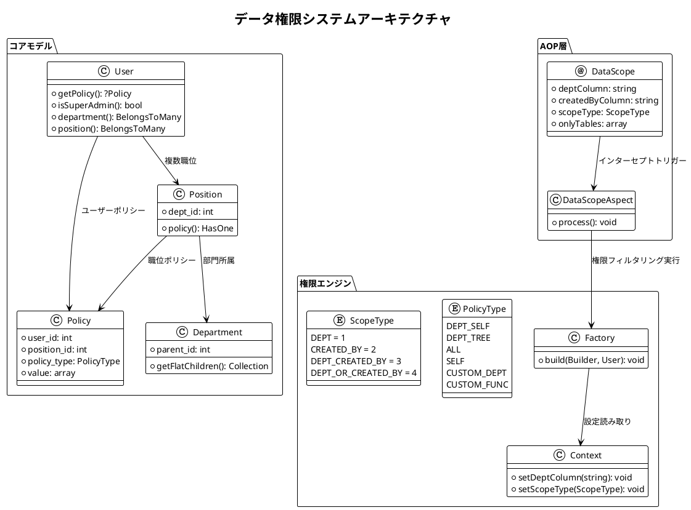
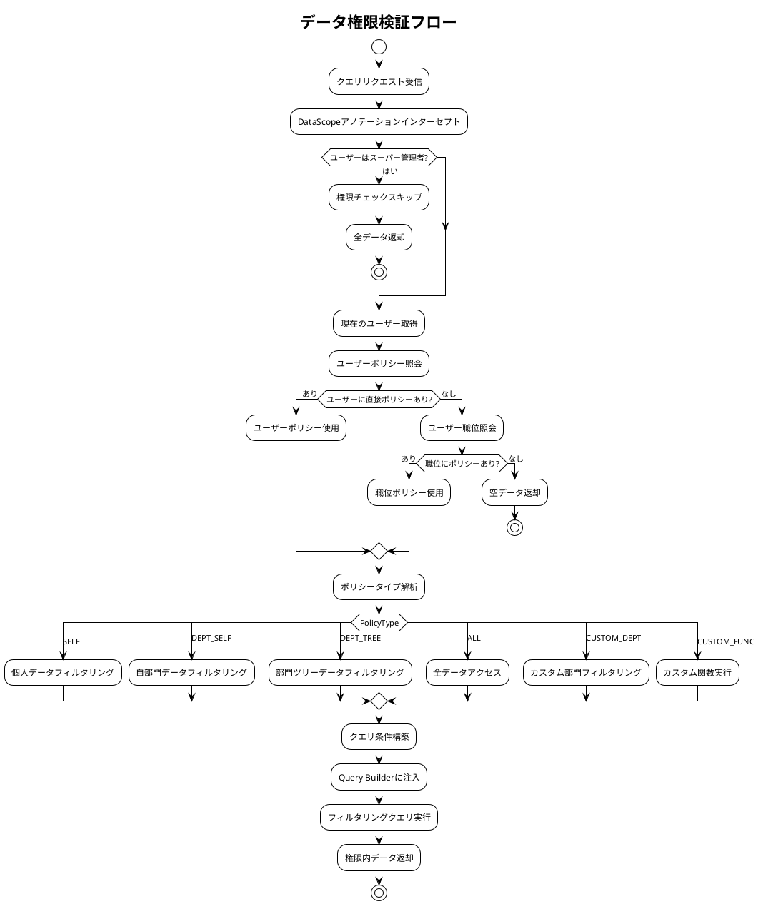
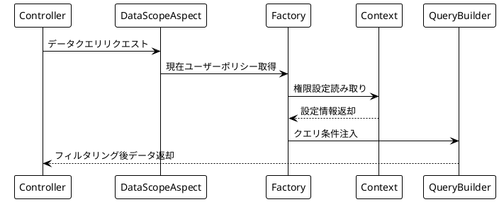

# コアコンセプト

この機能はシステム内でデータの階層管理と権限制御を実現するもので、主に部門管理、職位管理、データ権限などのモジュールを含みます。

`master`ブランチと比較すると、部門管理と職位管理の機能モジュールが追加され、複数のデータ分離方式が実装され、システムの組織構造と役割定義能力が強化されています。

## システムアーキテクチャ図



## 権限検証フロー



## コアコンポーネント

### 部門管理

#### 機能ポジショニング

組織構造の基本単位で、ツリー階層管理を実現。

#### コア特性

- 無限階層の親子部門構造をサポート
- 部門と職位・ユーザーの関連付け
- 部門責任者設定をサポート

#### データモデル

```php
// /mineadmin/app/Model/Permission/Department.php
class Department {
    int $id;
    string $name; 
    int $parent_id;
    HasMany $children; // 子部門
    BelongsToMany $users; // 部門ユーザー
    BelongsToMany $leaders; // 部門リーダー
    
    // 全子部門を再帰的に取得
    public function getFlatChildren(): Collection
    {
        $flat = collect();
        $this->load('children');
        $traverse = static function ($departments) use (&$traverse, $flat) {
            foreach ($departments as $department) {
                $flat->push($department);
                if ($department->children->isNotEmpty()) {
                    $traverse($department->children);
                }
            }
        };
        $traverse($this->children);
        return $flat->prepend($this);
    }
}
```

---

### 職位管理

#### 機能ポジショニング

部門内の役割定義

#### コア特性

- 特定部門に必ず所属
- データ権限ポリシー設定可能
- ユーザーの複数職位割り当てをサポート

#### データモデル

```php
// /mineadmin/app/Model/Permission/Position.php
class Position {
    int $id;
    string $name;
    int $dept_id;
    
    public function policy(): HasOne
    {
        return $this->hasOne(Policy::class, 'position_id', 'id');
    }
}
```

## データ権限体系

### ポリシータイプ

```php
// /mineadmin/app/Model/Enums/DataPermission/PolicyType.php
enum PolicyType: string
{
    case DeptSelf = 'DEPT_SELF';     // 自部門
    case DeptTree = 'DEPT_TREE';     // 自部門及び下位部門
    case All = 'ALL';                // 全データ
    case Self = 'SELF';              // 本人のみ
    case CustomDept = 'CUSTOM_DEPT'; // カスタム部門
    case CustomFunc = 'CUSTOM_FUNC'; // カスタム関数
}
```

| 権限識別コード | タイプ | スコープ | 備考 |
|-------|----|-----|----|
| DEPT_SELF | 部門 | 現在部門 | 現在部門データのみ |
| DEPT_TREE | 部門 | 現在部門及び子部門 | 現在部門と全子部門データを含む |
| ALL | グローバル | 全データ | 全部門・全ユーザーデータを含む |
| SELF | 個人 | 個人データ | 現在ユーザーデータのみ |
| CUSTOM_DEPT | カスタム | カスタム部門 | 特定部門選択可能 |
| CUSTOM_FUNC | カスタム | カスタム関数 | カスタム処理ロジック可能 |

### 分離方式

```php
// /mineadmin/app/Library/DataPermission/ScopeType.php
enum ScopeType: int
{
    case DEPT = 1;                    // 部門のみでフィルタリング
    case CREATED_BY = 2;              // 作成者のみでフィルタリング
    case DEPT_CREATED_BY = 3;         // 部門 AND 作成者でフィルタリング
    case DEPT_OR_CREATED_BY = 4;      // 部門 OR 作成者でフィルタリング
}
```

### 実装メカニズム

データ権限は`職位`または`ユーザー`に関連付けられた`データ権限ポリシー`で実現。各職位またはユーザーは1つ以上のデータ権限ポリシーを持つことができ、システムはこれらのポリシーに基づいてデータアクセスをフィルタリング・制御します。

#### ポリシーモデル

```php
// /mineadmin/app/Model/DataPermission/Policy.php
class Policy {
    int $user_id; // ユーザーID
    int $position_id; // 職位ID 
    PolicyType $policy_type;
    bool $is_default;
    array $value; // ポリシー値
}
```

#### ポリシー解決優先順位

```php
// /mineadmin/app/Model/Permission/User.php:160-179
public function getPolicy(): ?Policy
{
    // 1. ユーザー専用ポリシーを優先チェック
    $policy = $this->policy()->first();
    if (! empty($policy)) {
        return $policy;
    }

    // 2. ユーザーに直接ポリシーがない場合、職位ポリシーを検索
    $this->load('position');
    $positionList = $this->position;
    foreach ($positionList as $position) {
        $current = $position->policy()->first();
        if (! empty($current)) {
            return $current;
        }
    }
    return null;
}
```

#### 実行フロー



## コアAPI

### DataScope アノテーション

```php
// /mineadmin/app/Library/DataPermission/Attribute/DataScope.php
#[\Attribute(\Attribute::TARGET_CLASS | \Attribute::TARGET_METHOD)]
class DataScope extends AbstractAnnotation
{
    public function __construct(
        private readonly string $deptColumn = 'dept_id',
        private readonly string $createdByColumn = 'created_by',
        private readonly ScopeType $scopeType = ScopeType::DEPT_CREATED_BY,
        private readonly ?array $onlyTables = null
    ) {}
}
```

### Context コンテキスト管理

```php
// /mineadmin/app/Library/DataPermission/Context.php
final class Context
{
    public static function setDeptColumn(string $column = 'dept_id'): void;
    public static function setCreatedByColumn(string $column = 'created_by'): void;
    public static function setScopeType(ScopeType $scopeType): void;
    public static function setOnlyTables(?array $tables): void;
    
    public static function getDeptColumn(): string;
    public static function getCreatedByColumn(): string;
    public static function getScopeType(): ScopeType;
    public static function getOnlyTables(): array;
}
```

### Factory 権限ファクトリ

```php
// /mineadmin/app/Library/DataPermission/Factory.php
class Factory
{
    public static function make(): self;
    
    public function build(Builder $builder, User $user): void
    {
        if ($user->isSuperAdmin()) {
            return; // スーパー管理者は権限チェックをスキップ
        }
        
        if (($policy = $user->getPolicy()) === null) {
            return; // ポリシーなしの場合はスキップ
        }
        
        // ScopeTypeに基づき異なるデータ権限ロジックを処理
        $scopeType = Context::getScopeType();
        // ... 権限処理ロジック
    }
}
```

## セキュリティ特性

### スーパー管理者バイパス

スーパー管理者は全てのデータ権限チェックを自動的にスキップ:

```php
// /mineadmin/app/Library/DataPermission/Factory.php:37-39
if ($user->isSuperAdmin()) {
    return; // スーパー管理者は全データ権限チェックをスキップ
}
```

### カスタム関数サポート

システムは設定ファイルによるカスタム権限関数定義をサポート:

```php
// /mineadmin/config/autoload/department/custom.php
return [
    'testction' => function (Builder $builder, ScopeType $scopeType, Policy $policy, User $user) {
        // カスタム権限ロジック
        if ($user->id !== 2) {
            return;
        }
        
        $createdByColumn = Context::getCreatedByColumn();
        $deptColumn = Context::getDeptColumn();
        
        switch ($scopeType) {
            case ScopeType::CREATED_BY:
                $builder->where($createdByColumn, $user->id);
                break;
            case ScopeType::DEPT:
                $builder->whereIn($deptColumn, $user->department()->get()->pluck('id'));
                break;
            // ... その他ロジック
        }
    }
];
```