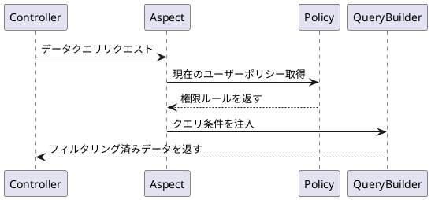

# コアコンセプト

この機能はシステム内でのデータの階層管理と権限制御を実現するもので、部門管理、職位管理、データ権限などのモジュールを含みます。

`master`ブランチと比較すると、部門管理と職位管理の機能モジュールが新たに追加され、複数のデータ分離方式が実装され、システムの組織構造とロール定義能力が強化されました。

## 新機能

### 部門管理

#### 機能の位置付け

組織構造の基本単位として、ツリー型階層管理を実現します。

#### コア機能

- 無制限の親子部門構造をサポート
- 部門と職位・ユーザーの関連付け
- 部門責任者の設定をサポート

#### データモデル

```php
 class Department {
    int $id;
    string $name; 
    int $parent_id;
    HasMany $positions; // 職位関連
    BelongsToMany $department_users; // 部門ユーザー
    BelongsToMany $leader; // 部門リーダー
  }
```

---

### 職位管理

#### 機能の位置付け

部門内の役割定義

#### コア機能

- 特定の部門に所属する必要あり
- データ権限ポリシーの設定可能
- ユーザーの複数職位割り当てをサポート

#### データモデル

```php
class Position {
    int $id;
    string $name;
    int $dept_id;
    HasOne $policy; // データ権限ポリシー
  }
```

## データ権限システム

### ポリシータイプ

| 権限コード | タイプ | スコープ | 備考 |
|-------|----|-----|----|
| DEPT_SELF | 部門 | 自部門 | 自部門データのみ |
| DEPT_TREE | 部門 | 自部門及び子部門 | 自部門と全ての子部門データを含む |
| ALL | グローバル | 全データ | 全ての部門とユーザーデータを含む |
| SELF | 個人 | 個人データ | 当該ユーザーのデータのみ |
| CUSTOM_DEPT | カスタム | カスタム部門 | 特定部門を選択可能 |
| CUSTOM_FUNC | カスタム | カスタム関数 | カスタム処理ロジックを許可 |

### 実装メカニズム

データ権限は`職位`または`ユーザー`に関連付けられた`データ権限ポリシー`によって実現されます。各職位またはユーザーは1つ以上のデータ権限ポリシーを持つことができ、システムはこれらのポリシーに基づいてデータアクセスをフィルタリング・制御します。

#### ポリシーモデル

```php
class Policy {
    int $user_id; // ユーザーID
    int $position_id; // 職位ID 
    PolicyType $policy_type;
    bool $is_default;
    array $value; // ポリシー値
  }
```

#### 実行フロー

