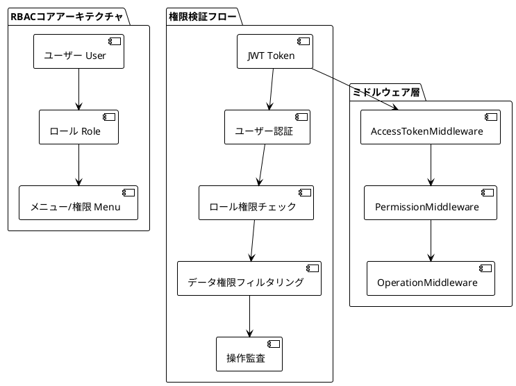
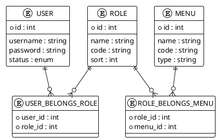

# ユーザー認可（RBAC）

## システム概要

MineAdminはロールベースのアクセス制御（RBAC）システムを採用し、JWT認証、多層権限検証、データレベル権限制御を組み合わせ、エンタープライズアプリケーションに包括的なセキュリティを提供します。

### コアアーキテクチャ



## 認証システム

### JWT認証メカニズム

セキュリティを確保するため、ダブルトークン戦略を採用：

```php
// ログイン認証フロー
public function login(string $username, string $password): array
{
    $user = $this->repository->findByUnameType($username, Type::SYSTEM);
    
    // パスワード検証
    if (!$user->verifyPassword($password)) {
        throw new BusinessException(ResultCode::UNPROCESSABLE_ENTITY, trans('auth.password_error'));
    }
    
    // ユーザーステータスチェック
    if ($user->status->isDisable()) {
        throw new BusinessException(ResultCode::DISABLED);
    }
    
    // トークン生成
    $jwt = $this->getJwt();
    return [
        'access_token' => $jwt->builderAccessToken((string) $user->id)->toString(),
        'refresh_token' => $jwt->builderRefreshToken((string) $user->id)->toString(),
        'expire_at' => (int) $jwt->getConfig('ttl', 0),
    ];
}
```

### パスワードセキュリティ

システムはPHP組み込みの安全なハッシュ関数を使用：

```php
// パスワード設定
public function setPasswordAttribute($value): void
{
    $this->attributes['password'] = password_hash((string) $value, \PASSWORD_DEFAULT);
}

// パスワード検証
public function verifyPassword(string $password): bool
{
    return password_verify($password, $this->password);
}
```

## 権限システム

### 三層権限モデル



### 権限チェック実装

```php
// Userモデルの権限チェックメソッド
public function hasPermission(string $permission): bool
{
    return $this->roles()->whereRelation('menus', 'name', $permission)->exists();
}

public function getPermissions(): Collection
{
    return $this->roles()->with('menus')->orderBy('sort')->get()->pluck('menus')->flatten();
}

public function isSuperAdmin(): bool
{
    return $this->roles()->where('code', 'SuperAdmin')->exists();
}
```

### 権限アノテーション使用

コントローラーメソッドで`@Permission`アノテーションを使用して権限制御：

```php
use Mine\Annotation\Permission;

class UserController
{
    #[Permission(code: 'permission:user:index')]
    public function pageList(): Result
    {
        // ユーザーリスト検索
    }
    
    #[Permission(code: ['permission:user:save', 'permission:user:update'], operation: Permission::OPERATION_OR)]
    public function save(): Result
    {
        // ユーザー保存または更新
    }
    
    #[Permission(code: ['permission:user:delete', 'permission:role:admin'], operation: Permission::OPERATION_AND)]
    public function delete(): Result
    {
        // 削除権限と管理者ロールの両方が必要
    }
}
```

## ミドルウェア体系

### 三層ミドルウェア保護

```php
#[Middleware(middleware: AccessTokenMiddleware::class, priority: 100)]
#[Middleware(middleware: PermissionMiddleware::class, priority: 99)]
#[Middleware(middleware: OperationMiddleware::class, priority: 98)]
class AdminController
{
    // コントローラーロジック
}
```

#### 1. AccessTokenMiddleware

アクセストークンの有効性を検証：

```php
public function process(ServerRequestInterface $request, RequestHandlerInterface $handler): ResponseInterface
{
    $token = $this->getTokenFromRequest($request);
    
    try {
        $jwt = $this->getJwt();
        $token = $jwt->parseToken($token);
        
        // ブラックリストチェック
        if ($jwt->isBlacklisted($token)) {
            throw new TokenValidException('Tokenはブラックリストに登録されています');
        }
        
        // 現在のユーザーを設定
        $this->setCurrentUser($token);
        
    } catch (\Throwable $e) {
        throw new BusinessException(ResultCode::UNAUTHORIZED, $e->getMessage());
    }
    
    return $handler->handle($request);
}
```

#### 2. PermissionMiddleware

権限検証ロジックを実行：

```php
private function handlePermission(Permission $permission): void
{
    $operation = $permission->getOperation();
    $codes = $permission->getCode();
    
    foreach ($codes as $code) {
        $hasPermission = $this->currentUser->user()->hasPermission($code);
        
        if ($operation === Permission::OPERATION_AND && !$hasPermission) {
            throw new BusinessException(code: ResultCode::FORBIDDEN);
        }
        
        if ($operation === Permission::OPERATION_OR && $hasPermission) {
            return;
        }
    }
    
    if ($operation === Permission::OPERATION_OR) {
        throw new BusinessException(code: ResultCode::FORBIDDEN);
    }
}
```

#### 3. OperationMiddleware

操作ログを記録：

```php
public function process(ServerRequestInterface $request, RequestHandlerInterface $handler): ResponseInterface
{
    $response = $handler->handle($request);
    
    // 操作ログを記録
    $this->dispatcher->dispatch(new RequestOperationEvent(
        $this->user->id(),
        $operator->summary,
        $request->getUri()->getPath(),
        $request->getClientIps(),
        $request->getMethod(),
    ));
    
    return $response;
}
```

## APIリファレンス

### CurrentUserサービス

```php
use Mine\Support\CurrentUser;

class ExampleController
{
    public function __construct(private readonly CurrentUser $currentUser) {}
    
    public function getUserInfo(): array
    {
        $user = $this->currentUser->user();
        
        return [
            'id' => $user->id,
            'username' => $user->username,
            'roles' => $user->roles,
            'permissions' => $user->getPermissions(),
            'is_super_admin' => $user->isSuperAdmin(),
        ];
    }
    
    public function checkPermission(string $permission): bool
    {
        return $this->currentUser->user()->hasPermission($permission);
    }
}
```

### 権限検証方法

```php
// AND操作：すべての権限が必要
#[Permission(code: ['user:read', 'user:write'], operation: Permission::OPERATION_AND)]

// OR操作：いずれかの権限で可
#[Permission(code: ['user:read', 'admin:all'], operation: Permission::OPERATION_OR)]

// 単一権限チェック
#[Permission(code: 'user:delete')]

// プログラムによる権限チェック
if ($this->currentUser->user()->hasPermission('user:create')) {
    // ユーザー作成を許可
}
```

## トラブルシューティング

### よくある問題

#### 権限チェック失敗

**問題**: ユーザーが権限のあるリソースにアクセスできない

**デバッグ手順**:
```php
// 1. ユーザーロールをチェック
$user = User::find($userId);
dd($user->roles);

// 2. ロール権限をチェック
foreach ($user->roles as $role) {
    dd($role->menus);
}

// 3. 権限コードをチェック
$hasPermission = $user->hasPermission('permission:user:index');
dd($hasPermission);

// 4. SuperAdminステータスをチェック
dd($user->isSuperAdmin());
```