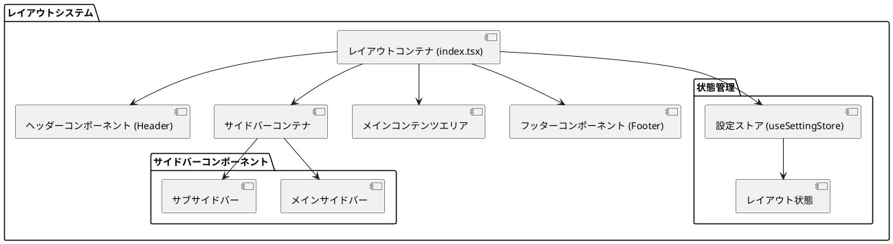

# レイアウトシステム

MineAdmin 3.0のレイアウトシステムは、柔軟で強力なフロントエンドレイアウトソリューションであり、複数のレイアウトモードと動的切り替えをサポートしています。2.0バージョンと比較して、新しいレイアウトシステムは統一されたアーキテクチャ設計を採用し、すべてのレイアウトロジックが`src/layouts/index.tsx`ファイルに集中しており、より優れた保守性と拡張性を提供します。

## レイアウトアーキテクチャ概要



## レイアウトモード

MineAdminは3つの主要なレイアウトモードをサポートしています：

### 1. クラシックレイアウト (Classic Layout)
- **特徴**: 伝統的な左サイドバー + メインコンテンツエリアレイアウト
- **適用シナリオ**: 標準的なバックエンド管理インターフェース
- **コンポーネント構造**: 固定左メニュー、右コンテンツエリア

### 2. ミックスレイアウト (Mixed Layout)
- **特徴**: トップメニュー + 左サブメニューの組み合わせレイアウト
- **適用シナリオ**: 多階層メニューナビゲーションが必要な複雑なアプリケーション
- **コンポーネント構造**: トップメインメニュー、左現在カテゴリのサブメニュー

### 3. カラムレイアウト (Columns Layout)
- **特徴**: マルチカラムメニューレイアウト
- **適用シナリオ**: メニュー分類が多い大規模アプリケーション
- **コンポーネント構造**: 左メインメニューバー、中央サブメニューバー、右コンテンツエリア

## レイアウト関連API

### useSettingStore API リファレンス

| メソッド名 | 戻り値型 | 説明 | 使用例 |
|--------|----------|------|----------|
| `isMixedLayout()` | `boolean` | 現在がミックスレイアウトモードかどうかを判定 | `store.isMixedLayout()` |
| `isColumnsLayout()` | `boolean` | 現在がカラムレイアウトモードかどうかを判定 | `store.isColumnsLayout()` |
| `isClassicLayout()` | `boolean` | 現在がクラシックレイアウトモードかどうかを判定 | `store.isClassicLayout()` |
| `getFixedAsideState()` | `boolean` | サブサイドバーが固定状態かどうかを取得 | `store.getFixedAsideState()` |
| `getMenuCollapseState()` | `boolean` | メニューが折りたたみ状態かどうかを取得 | `store.getMenuCollapseState()` |
| `getMobileState()` | `boolean` | 現在がモバイル状態かどうかを判定 | `store.getMobileState()` |

::: tip API ソース位置
- **GitHub**: [useSettingStore.ts](https://github.com/mineadmin/MineAdmin/blob/master/web/src/store/modules/useSettingStore.ts)
- **ローカルパス**: `mineadmin/web/src/store/modules/useSettingStore.ts`
:::

### 使用例

```typescript
// VueコンポーネントでレイアウトAPIを使用
import { useSettingStore } from '@/stores/modules/settingStore'

export default defineComponent({
  setup() {
    const settingStore = useSettingStore()
    
    // 現在のレイアウトモードをチェック
    const isClassic = computed(() => settingStore.isClassicLayout())
    const isMixed = computed(() => settingStore.isMixedLayout())
    const isColumns = computed(() => settingStore.isColumnsLayout())
    
    // メニュー状態を取得
    const isMenuCollapsed = computed(() => settingStore.getMenuCollapseState())
    const isAsideFixed = computed(() => settingStore.getFixedAsideState())
    
    // レスポンシブでデバイスタイプを判定
    const isMobile = computed(() => settingStore.getMobileState())
    
    return {
      isClassic,
      isMixed, 
      isColumns,
      isMenuCollapsed,
      isAsideFixed,
      isMobile
    }
  }
})
```

## レイアウト切り替え機能

### 動的レイアウト切り替え

```typescript
// レイアウトモード切り替え例
import { useSettingStore } from '@/stores/modules/settingStore'

const settingStore = useSettingStore()

// クラシックレイアウトに切り替え
const switchToClassic = () => {
  settingStore.updateSettings({
    layout: 'classic'
  })
}

// ミックスレイアウトに切り替え
const switchToMixed = () => {
  settingStore.updateSettings({
    layout: 'mixed'
  })
}

// カラムレイアウトに切り替え
const switchToColumns = () => {
  settingStore.updateSettings({
    layout: 'columns'
  })
}

// メニュー折りたたみ状態を切り替え
const toggleMenuCollapse = () => {
  settingStore.toggleMenuCollapse()
}
```

## グローバルスタイル設定

### CSS 変数定義

::: tip 設定ファイル位置
- **GitHub**: [https://github.com/mineadmin/mineadmin/blob/master/web/src/assets/styles/global.scss](https://github.com/mineadmin/mineadmin/blob/master/web/src/assets/styles/global.scss)
- **ローカルパス**: `mineadmin/web/src/assets/styles/global.scss`
:::

```scss
/* レイアウトサイズ変数 */
:root {
  /* ========== ヘッダーエリア ========== */
  --mine-g-header-height: 55px;
  --mine-g-toolbar-height: 55px;
  
  /* ========== フッターエリア ========== */
  --mine-g-footer-height: 50px;
  
  /* ========== サイドバーエリア ========== */
  --mine-g-main-aside-width: 80px;           /* メインサイドバー幅 */
  --mine-g-sub-aside-width: 200px;           /* サブサイドバー展開幅 */
  --mine-g-sub-aside-collapse-width: 65px;   /* サブサイドバー折りたたみ幅 */
  --mine-g-menu-retract-width: 15px;         /* メニューインデント幅 */
  
  /* ========== タブバー ========== */
  --mine-g-tabbar-height: 40px;
  
  /* ========== テーマカラー ========== */
  --mine-g-box-shadow-color: rgb(0 0 0 / 18%);
  --el-color-primary: --ui-primery;
  
  /* ========== レスポンシブブレークポイント ========== */
  --mine-g-mobile-breakpoint: 768px;
  --mine-g-tablet-breakpoint: 1024px;
}
```

### レスポンシブレイアウト設定

```scss
/* レスポンシブレイアウトスタイル */
@media screen and (max-width: 768px) {
  :root {
    --mine-g-main-aside-width: 0px;
    --mine-g-sub-aside-width: 100vw;
    --mine-g-header-height: 50px;
  }
}

@media screen and (min-width: 768px) and (max-width: 1024px) {
  :root {
    --mine-g-main-aside-width: 60px;
    --mine-g-sub-aside-width: 180px;
  }
}
```

## 高度な設定

### カスタムレイアウトスタイル

```scss
/* カスタムレイアウト設定例 */
.mine-layout {
  /* カスタムヘッダースタイル */
  &__header {
    background: var(--el-bg-color);
    border-bottom: 1px solid var(--el-border-color-light);
    height: var(--mine-g-header-height);
  }
  
  /* カスタムサイドバースタイル */
  &__aside {
    width: var(--mine-g-main-aside-width);
    transition: width 0.3s ease;
    
    &--collapsed {
      width: var(--mine-g-sub-aside-collapse-width);
    }
  }
  
  /* カスタムコンテンツエリアスタイル */
  &__main {
    margin-left: var(--mine-g-main-aside-width);
    transition: margin-left 0.3s ease;
    min-height: calc(100vh - var(--mine-g-header-height));
  }
}
```

### レイアウト状態永続化

```typescript
// レイアウト状態永続化設定
import { defineStore } from 'pinia'

export const useLayoutStore = defineStore('layout', {
  state: () => ({
    mode: 'classic' as 'classic' | 'mixed' | 'columns',
    isAsideCollapsed: false,
    isAsideFixed: true,
    isMobile: false
  }),
  
  persist: {
    key: 'mine-admin-layout',
    storage: localStorage,
    paths: ['mode', 'isAsideCollapsed', 'isAsideFixed']
  }
})
```

## パフォーマンス最適化

### レイアウトコンポーネントの遅延ロード

```typescript
// レイアウトコンポーネントの非同期ロード
import { defineAsyncComponent } from 'vue'

export const LayoutComponents = {
  Header: defineAsyncComponent(() => import('@/layouts/components/Header.vue')),
  Aside: defineAsyncComponent(() => import('@/layouts/components/Aside.vue')),
  Main: defineAsyncComponent(() => import('@/layouts/components/Main.vue')),
  Footer: defineAsyncComponent(() => import('@/layouts/components/Footer.vue'))
}
```

### レイアウト切り替えアニメーション最適化

```scss
/* レイアウト切り替えアニメーション最適化 */
.layout-transition {
  transition: all 0.3s cubic-bezier(0.4, 0, 0.2, 1);
  will-change: transform, width, margin;
}

/* 不必要な再描画を削減 */
.layout-aside {
  contain: layout style paint;
  transform: translateZ(0); /* ハードウェアアクセラレーションを有効化 */
}
```

## よくある問題の解決

### 1. モバイルレイアウト適応問題

```typescript
// モバイル適応ソリューション
import { useBreakpoints } from '@vueuse/core'

const breakpoints = useBreakpoints({
  mobile: 0,
  tablet: 768,
  desktop: 1024
})

const isMobile = breakpoints.smaller('tablet')
const isTablet = breakpoints.between('tablet', 'desktop')
const isDesktop = breakpoints.greater('desktop')
```

### 2. レイアウトちらつき問題

```scss
/* レイアウトちらつき防止 */
.mine-layout {
  opacity: 0;
  transition: opacity 0.2s ease;
  
  &.loaded {
    opacity: 1;
  }
}
```

### 3. サイドバースクロール問題

```scss
/* サイドバースクロール最適化 */
.layout-aside {
  overflow-y: auto;
  scrollbar-width: thin;
  scrollbar-color: var(--el-border-color) transparent;
  
  &::-webkit-scrollbar {
    width: 6px;
  }
  
  &::-webkit-scrollbar-thumb {
    background: var(--el-border-color);
    border-radius: 3px;
  }
}
```

## 関連ドキュメント

- [よく使う Store](/ja/front/high/store) - 状態管理関連ドキュメント

::: tip ソースコード参照
完全なレイアウトシステムのソースコードは以下の場所で確認できます：
- **GitHub**: [web/src/layouts](https://github.com/mineadmin/mineadmin/tree/master/web/src/layouts)
- **ローカルパス**: `mineadmin/web/src/layouts/`
:::