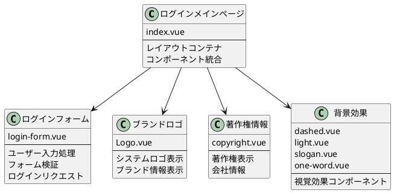
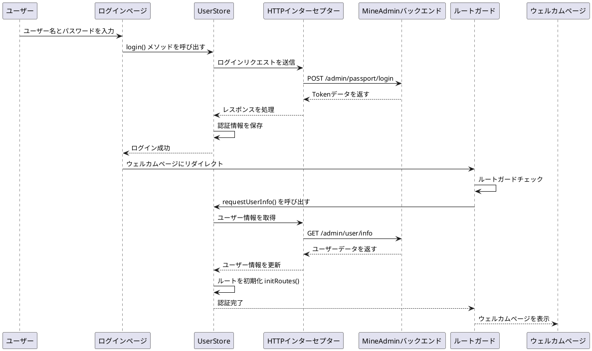
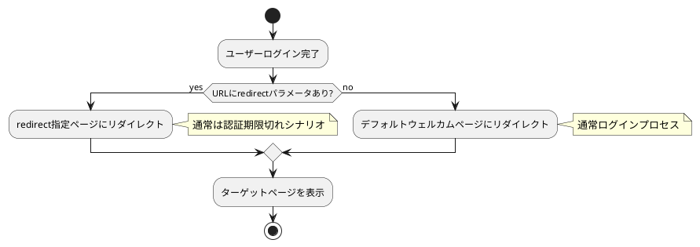

# ログインとウェルカムページ

:::tip 概要
この章では、MineAdmin 3.0のログインページのアーキテクチャ、ログインプロセスの処理、Token管理メカニズム、およびログイン成功後のウェルカムページの設定について詳しく説明します。コンポーネント構造の分析、データフローのプロセス、ルートガードメカニズム、カスタム設定方法が含まれます。

**重要なお知らせ**：このドキュメントのすべてのコード例は、MineAdminオープンソースプロジェクトの実際のコードから取得されており、ソースコードは[GitHubリポジトリ](https://github.com/mineadmin/mineadmin)にあります。
:::

## ログインページのアーキテクチャ

### ページコンポーネント構造

ログインページのメインファイルは `src/modules/base/views/login/index.vue` にあり、コンポーネント化された設計を採用し、ログイン機能を複数の独立したサブコンポーネントに分割して、コードの保守性と再利用性を向上させています。

**ソースコードの場所**：
- **GitHubアドレス**：[mineadmin/web/src/modules/base/views/login/index.vue](https://github.com/mineadmin/mineadmin/blob/master/web/src/modules/base/views/login/index.vue)
- **ローカルパス**：`src/modules/base/views/login/index.vue`



### レスポンシブレイアウト設計

ログインページはレスポンシブデザインを採用し、デスクトップとモバイルに対応しています：

```vue
<template>
  <div class="h-full min-w-[380px] w-full flex items-center justify-center overflow-hidden border-1 bg-blue-950 lg:justify-between lg:bg-white">
    <!-- デスクトップ左側装飾エリア -->
    <div class="relative hidden h-full w-10/12 md:hidden lg:flex">
      <div class="gradient-rainbow" />
      <Dashed />
      <Light />
      <Slogan />
      <OneWord />
    </div>
    
    <!-- ログインフォームエリア -->
    <div class="login-form-container">
      <Logo />
      <LoginForm />
      <CopyRight />
    </div>
    
    <!-- モバイル背景効果 -->
    <div class="min-[380px] relative left-0 top-0 z-4 h-full max-w-[1024px] w-full flex lg:hidden">
      <Dashed />
      <Light />
    </div>
  </div>
</template>
```

### コンポーネントライブラリ説明

::: warning コンポーネントライブラリの注意事項
ログインページのフォームコンポーネントは `Element Plus` コンポーネントライブラリを使用しておらず、MineAdmin自身の基本コンポーネントライブラリに基づいて構築されています。これらのコンポーネントはシステム専用に設計されており、以下の特徴があります：

- **軽量設計**：必要なログイン機能のみを含み、依存関係を減らす
- **統一されたスタイル**：システム全体のデザイン言語と一致
- **高いカスタマイズ性**：ビジネス要件に応じて柔軟に調整可能

**カスタマイズの推奨事項**：
- 後続バージョンのアップグレードに影響を与えないよう、直接ソースコードを変更しないことを推奨
- [プラグインシステム](/front/high/plugins.md)を使用してログインコンポーネントを置き換えることを推奨
- ルート設定でデフォルトの `login` ルートコンポーネントをオーバーライド可能
:::

## ログインプロセスとデータ処理

### ログインプロセスの概要

ログインプロセスはモダンなフロントエンドとバックエンドの分離アーキテクチャを採用し、JWT Tokenに基づく認証をサポートし、Tokenの自動更新と権限検証をサポートしています。



### コアデータフロー

::: info 開発ヒント
ログインページのUIのみを変更し、ログインロジックに関与しない場合は、このセクションの詳細なプロセス説明をスキップし、直接[ウェルカムページ設定](#デフォルトウェルカムページ設定)セクションを参照してください。
:::

#### 1. ユーザー認証

**ファイルの場所**：`src/store/modules/useUserStore.ts`

`login()` メソッドはユーザー認証プロセスを処理します：

```typescript
// ログインメソッドのコアロジック
async login(loginParams: LoginParams) {
  try {
    // ログインリクエストを送信
    const response = await http.post('/admin/passport/login', loginParams)
    
    // 認証情報をローカルストレージに保存
    const { access_token, refresh_token, expire_at } = response.data
    
    // Pinia Storeに保存
    this.token = access_token
    this.refreshToken = refresh_token
    this.expireAt = expire_at
    
    // ブラウザキャッシュに保存
    cache.set('token', access_token)
    cache.set('refresh_token', refresh_token)
    cache.set('expire', useDayjs().unix() + expire_at, { exp: expire_at })
    
    return Promise.resolve(response)
  } catch (error) {
    return Promise.reject(error)
  }
}
```

#### 2. ルートガードインターセプト

ログイン成功後のページリダイレクトはルートガードをトリガーし、自動的にユーザー情報を取得します：

```typescript
// ルートガードロジック（簡略版）
router.beforeEach(async (to, from, next) => {
  const userStore = useUserStore()
  
  if (to.path !== '/login' && !userStore.isLogin) {
    // 未ログイン、ログインページにリダイレクト
    next('/login')
  } else if (userStore.isLogin && !userStore.userInfo) {
    // ログイン済みだがユーザー情報未取得
    try {
      await userStore.requestUserInfo()
      next()
    } catch (error) {
      // ユーザー情報取得失敗、ログイン状態をクリア
      await userStore.logout()
      next('/login')
    }
  } else {
    next()
  }
})
```

#### 3. ユーザー情報取得

**ファイルの場所**：`src/store/modules/useUserStore.ts`

`requestUserInfo()` メソッドはユーザーの基本データと権限情報を取得します：

```typescript
async requestUserInfo() {
  try {
    // ユーザーデータ、メニュー権限、ロール情報を並列リクエスト
    const [userInfo, menuList, roleList] = await Promise.all([
      http.get('/admin/user/info'),          // ユーザー基本情報
      http.get('/admin/menu/index'),         // メニュー権限データ
      http.get('/admin/role/index')          // ロール権限データ
    ])
    
    // Store状態を更新
    this.userInfo = userInfo.data
    this.menuList = menuList.data
    this.roleList = roleList.data
    
    // ルートシステムを初期化
    const routeStore = useRouteStore()
    await routeStore.initRoutes()
    
    return Promise.resolve(userInfo)
  } catch (error) {
    return Promise.reject(error)
  }
}
```

#### 4. ダイナミックルート初期化

**ファイルの場所**：`src/store/modules/useRouteStore.ts`

`initRoutes()` メソッドはユーザー権限に基づいてダイナミックにルートを生成します：

```typescript
async initRoutes() {
  const userStore = useUserStore()
  const { menuList } = userStore
  
  // メニューデータに基づいてルート設定を生成
  const routes = this.generateRoutes(menuList)
  
  // ダイナミックにルートを追加
  routes.forEach(route => {
    router.addRoute(route)
  })
  
  // ルート状態を更新
  this.isRoutesInitialized = true
}
```

### Token管理メカニズム

システムはダブルTokenメカニズムを採用し、セキュリティとユーザーエクスペリエンスを確保します：

- **Access Token**：短期有効（デフォルト1時間）、APIリクエスト認証用
- **Refresh Token**：長期有効（デフォルト2時間）、Access Tokenのリフレッシュ用

詳細なTokenリフレッシュメカニズムについては、[リクエストとインターセプター](/front/advanced/request.md#token-リフレッシュメカニズム) ドキュメントを参照してください。

## ウェルカムページ設定とルート管理

### ログイン後リダイレクトロジック

MineAdminは複数のログイン後リダイレクト戦略をサポートし、ユーザーエクスペリエンスの連続性を確保します：



#### リダイレクトルール説明

1. **リダイレクトパラメータ付きログイン**
   ```
   /#/login?redirect=/admin/user/index
   ```
   ログイン成功後、自動的に `redirect` パラメータで指定されたページにリダイレクトされます。これは通常、以下の場合に発生します：
   - ユーザーが権限が必要なページにアクセスしたが未ログインの場合
   - Tokenの期限切れ後、自動的にログインページにリダイレクトされた場合

2. **デフォルトログインリダイレクト**
   ```
   /#/login
   ```
   `redirect` パラメータがない場合、ログイン成功後はシステム設定のデフォルトウェルカムページにリダイレクトされます。

### ウェルカムページ設定の詳細

#### デフォルト設定構造

**設定ファイルの場所**：`src/provider/settings/index.ts`

MineAdminの実際のデフォルトウェルカムページ設定：

```typescript
// MineAdmin デフォルトウェルカムページ設定
welcomePage: {
  name: 'welcome',                    // ルート名
  path: '/welcome',                   // ルートパス
  title: 'ウェルカムページ',          // ページタイトル
  icon: 'icon-park-outline:jewelry',  // メニューアイコン
},
```

注意：MineAdminではウェルカムページのコンポーネントパスはルートシステムによって自動的に解決され、`src/modules/base/views/welcome/index.vue` にあります。

#### 設定項目の詳細説明

| 設定項目 | タイプ | 必須 | デフォルト値 | 説明 |
|--------|------|------|---------|------|
| `name` | `string` | ✅ | `'welcome'` | ルート名、グローバルに一意である必要あり |
| `path` | `string` | ✅ | `'/welcome'` | アクセスパス、ダイナミックルートをサポート |
| `title` | `string` | ✅ | `'ウェルカムページ'` | ページタイトル、ブラウザタブとパンくずリストに表示 |
| `icon` | `string` | ❌ | `'icon-park-outline:jewelry'` | アイコン識別子、メニュー表示用 |
| `component` | `Function` | ❌ | ダイナミックインポートコンポーネント | ページコンポーネント、非同期ロードをサポート |

### カスタムウェルカムページ設定

::: tip ベストプラクティス
システムアップグレード時に設定が上書きされないようにするため、`index.ts` ファイルを直接変更するのではなく、`settings.config.ts` でカスタム設定を行うことを強く推奨します。
:::

#### 設定方法

**ステップ 1**：`src/provider/settings/settings.config.ts` を編集

注意：このファイルはMineAdminプロジェクトに既に存在し、作成する必要はありません。

```typescript
import type { SystemSettings } from '#/global'

const globalConfigSettings: SystemSettings.all = {
  // カスタムウェルカムページ設定
  welcomePage: {
    name: 'dashboard',                        // ダッシュボードに変更
    path: '/dashboard',                       // パスをダッシュボードパスに変更
    title: 'データ概要',                      // カスタムタイトル
    icon: 'mdi:view-dashboard-outline',       // ダッシュボードアイコンを使用
  },
  
  // その他のシステム設定...
  app: {
    // アプリ関連設定
  }
}

export default globalConfigSettings
```

**ステップ 2**：システムが自動的に設定をマージ

システム起動時に `settings.config.ts` の設定とデフォルト設定を自動的にディープマージします：

```typescript
// MineAdmin 実際の設定マージロジック
import { defaultsDeep } from 'lodash-es'
import globalConfigSettings from '@/provider/settings/settings.config.ts'

// デフォルト設定とユーザー設定をマージ
const systemSetting = defaultsDeep(globalConfigSettings, defaultGlobalConfigSettings)
```

### 高度な設定例

#### 1. 条件付きウェルカムページ

ユーザーロールや権限に基づいて異なるウェルカムページを設定：

```typescript
const globalConfigSettings: SystemSettings.all = {
  welcomePage: {
    name: 'adaptive-welcome',
    path: '/adaptive-welcome',
    title: 'パーソナライズドウェルカムページ',
    icon: 'mdi:account-star',
    // カスタムコンポーネントで条件ロジックを処理
    component: () => import('@/views/custom/AdaptiveWelcome.vue')
  }
}
```

#### 2. 多言語サポート

国際化設定と組み合わせて多言語ウェルカムページを設定：

```typescript
const globalConfigSettings: SystemSettings.all = {
  welcomePage: {
    name: 'welcome',
    path: '/welcome',
    // 国際化キーを使用
    title: 'menu.welcome', 
    icon: 'icon-park-outline:jewelry',
  }
}
```

