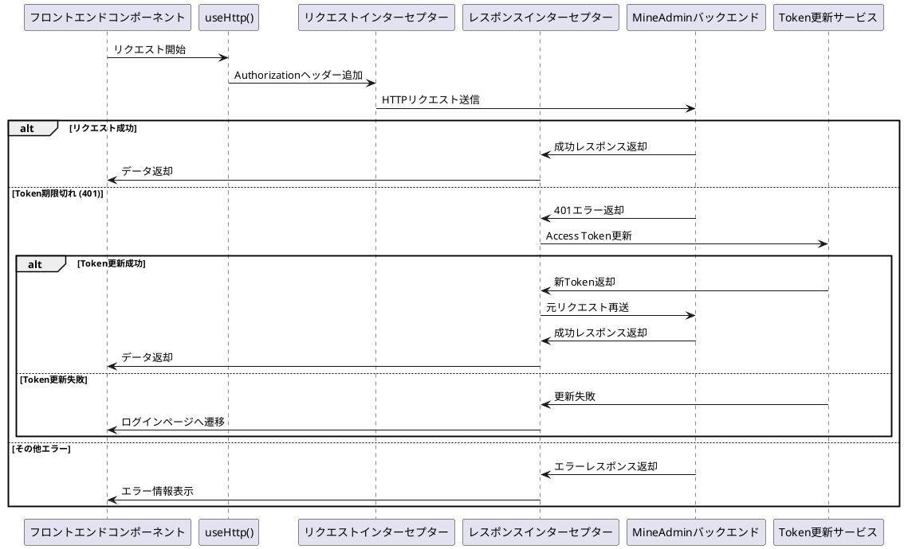
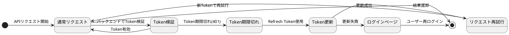

# リクエストとインターセプター

MineAdmin は [axios](https://github.com/axios/axios) をリクエストライブラリとして使用し、完全なリクエストインターセプターとレスポンス処理メカニズムを提供しています。自動的な Token 更新、エラー処理、ローディング状態管理などの機能をサポートしています。

## 概要

### 二重リクエストアーキテクチャ

システムは2種類のリクエスト処理方法を提供し、異なる使用シナリオに対応します：

1. **内部リクエスト** - MineAdmin バックエンド API 専用のリクエストラッパー
   - JWT Token 認証の自動処理
   - 組み込みのエラー処理とユーザー通知
   - Token 自動更新メカニズムのサポート
   - ローディング状態管理の統合

2. **外部リクエスト** - サードパーティ API や他のバックエンドサービスのための汎用リクエスト
   - カスタム baseURL とリクエスト設定のサポート
   - 独立したインターセプターとエラー処理の設定
   - 柔軟なパラメータ渡し方法

### リクエスト処理フロー



## 内部リクエスト (useHttp)

### 基本使用法

プロジェクトの任意の場所で `useHttp()` 関数を直接使用でき、手動インポートは不要です：

```ts
// リクエストインスタンス取得
const http = useHttp()

// GET リクエスト - ユーザーリスト取得
const getUserList = async (params?: any) => {
  return await http.get('/admin/user/index', params)
}

// POST リクエスト - 新規ユーザー作成
const createUser = async (userData: any) => {
  return await http.post('/admin/user/save', userData)
}

// PUT リクエスト - ユーザー情報更新
const updateUser = async (id: number, userData: any) => {
  return await http.put(`/admin/user/update/${id}`, userData)
}

// DELETE リクエスト - ユーザー削除
const deleteUser = async (id: number) => {
  return await http.delete(`/admin/user/destroy/${id}`)
}
```

### 高度な設定

追加の axios 設定パラメータを渡すことができます：

```ts
const http = useHttp()

// リクエストタイムアウト設定
const result = await http.get('/admin/user/index', {}, {
  timeout: 10000, // 10秒タイムアウト
  headers: {
    'X-Custom-Header': 'CustomValue'
  }
})

// ファイルアップロードリクエスト
const uploadFile = async (file: File) => {
  const formData = new FormData()
  formData.append('file', file)
  
  return await http.post('/admin/upload/image', formData, {
    headers: {
      'Content-Type': 'multipart/form-data'
    },
    timeout: 60000 // アップロードタイムアウト60秒
  })
}

// ファイルダウンロード
const downloadFile = async (fileId: string) => {
  return await http.get(`/admin/file/download/${fileId}`, {}, {
    responseType: 'blob' // バイナリデータ
  })
}
```

### 実際の使用例

コンポーネント内での完全な使用例：

```vue
<script setup lang="ts">
import { ref, onMounted } from 'vue'
import { ElMessage } from 'element-plus'

const http = useHttp()
const users = ref([])
const loading = ref(false)

// ユーザーリスト取得
const fetchUsers = async () => {
  try {
    loading.value = true
    const response = await http.get('/admin/user/index', {
      page: 1,
      size: 20
    })
    
    users.value = response.data.items
    ElMessage.success('ユーザーリスト読み込み成功')
  } catch (error) {
    ElMessage.error('ユーザーリスト読み込み失敗')
    console.error('ユーザーリスト取得エラー:', error)
  } finally {
    loading.value = false
  }
}

// ユーザー削除
const handleDeleteUser = async (userId: number) => {
  try {
    await http.delete(`/admin/user/destroy/${userId}`)
    ElMessage.success('ユーザー削除成功')
    fetchUsers() // リスト再読み込み
  } catch (error) {
    ElMessage.error('ユーザー削除失敗')
  }
}

onMounted(() => {
  fetchUsers()
})
</script>
```

## Token 更新メカニズム

### 自動更新の原理

MineAdmin は二重 Token に基づくシームレスな更新メカニズムを実装しています：

1. **Access Token** - 業務 API 認証に使用、有効期限短め（デフォルト1時間）
2. **Refresh Token** - Access Token 更新に使用、有効期限長め（デフォルト2時間）



### 並列リクエスト処理

複数の並列リクエストがある場合、システムはインテリジェントに Token 更新を処理します：

```ts
// 並列シナリオ例
const [users, roles, permissions] = await Promise.all([
  http.get('/admin/user/index'),
  http.get('/admin/role/index'), 
  http.get('/admin/permission/index')
])

// Tokenが期限切れの場合、1回だけ更新し、他のリクエストは待機
// 更新完了後、すべてのリクエストは新Tokenで再送信
```

更新メカニズムの詳細は [ユーザー認証ドキュメント](/backend/security/passport.md) を参照してください。

## 外部リクエスト

### 基本使用法

サードパーティ API や MineAdmin 以外のバックエンドサービスへのリクエスト：

```ts
import request from '@/utils/http'

const { createHttp } = request

// サードパーティAPIリクエストインスタンス作成
const thirdPartyHttp = createHttp('https://api.example.com', {
  headers: {
    'User-Agent': 'MineAdmin/1.0',
    'X-API-Key': 'your-api-key'
  },
  timeout: 15000
})

// サードパーティAPI使用
const getExternalData = async () => {
  try {
    const response = await thirdPartyHttp.get('/users')
    return response.data
  } catch (error) {
    console.error('サードパーティAPIリクエスト失敗:', error)
    throw error
  }
}
```

### 複数外部サービス

異なる外部サービスのために複数のリクエストインスタンスを作成できます：

```ts
// 地図サービスAPI
const mapHttp = createHttp('https://api.map.com', {
  headers: { 'Authorization': 'Bearer map-token' }
})

// 決済サービスAPI  
const paymentHttp = createHttp('https://api.payment.com', {
  headers: { 'Authorization': 'Bearer payment-token' }
})

// SMSサービスAPI
const smsHttp = createHttp('https://api.sms.com', {
  headers: { 'X-API-Key': 'sms-api-key' }
})

// 使用例
const sendSms = async (phone: string, message: string) => {
  return await smsHttp.post('/send', { phone, message })
}
```

## インターセプター詳細

### レスポンスインターセプターソース分析

MineAdmin のレスポンスインターセプターは `src/utils/http.ts` ファイルにあり、主に以下のシナリオを処理します：

1. **成功レスポンス処理**
2. **Token 期限切れ自動更新**  
3. **エラー状態コード処理**
4. **ファイルダウンロードレスポンス処理**
#### コアインターセプターロジック

```ts:line-numbers
http.interceptors.response.use(
  async (response: AxiosResponse): Promise<any> => {
    isLoading.value = false
    const userStore = useUserStore()
    await usePluginStore().callHooks('networkResponse', response)
    const config = response.config
    
    // ファイルダウンロードレスポンス処理
    if ((response.request.responseType === 'blob'
        || response.request.responseType === 'arraybuffer')
      && !/^application\/json/.test(response.headers['content-type'])
      && response.status === ResultCode.SUCCESS
    ) {
      return Promise.resolve(response.data)
    }

    // 成功レスポンス処理
    if (response?.data?.code === ResultCode.SUCCESS) {
      return Promise.resolve(response.data)
    }
    else {
      // 異なるエラーコードに基づく処理
      switch (response?.data?.code) {
        case ResultCode.UNAUTHORIZED: {
          // Token 期限切れ処理ロジック
          const logout = useDebounceFn(
            async () => {
              Message.error('ログイン状態が期限切れ、再ログインが必要', { zIndex: 9999 })
              await useUserStore().logout()
            },
            3000,
            { maxWait: 5000 },
          )
          
          // Token更新が必要かチェック
          if (userStore.isLogin && !isRefreshToken.value) {
            isRefreshToken.value = true
            if (!cache.get('refresh_token')) {
              await logout()
              break
            }

            try {
              // Refresh Token を使用して Access Token 更新
              const refreshTokenResponse = await createHttp(null, {
                headers: {
                  Authorization: `Bearer ${cache.get('refresh_token')}`,
                },
              }).post('/admin/passport/refresh')

              if (refreshTokenResponse.data.code !== 200) {
                await logout()
                break
              }
              else {
                // Token更新して元リクエスト再送
                const { data } = refreshTokenResponse.data
                userStore.token = data.access_token
                cache.set('token', data.access_token)
                cache.set('expire', useDayjs().unix() + data.expire_at, { exp: data.expire_at })
                cache.set('refresh_token', data.refresh_token)

                config.headers!.Authorization = `Bearer ${userStore.token}`
                requestList.value.map((cb: any) => cb())
                requestList.value = []
                return http(config) // 元リクエスト再送
              }
            }
            catch (e: any) {
              requestList.value.map((cb: any) => cb())
              await logout()
              break
            }
            finally {
              requestList.value = []
              isRefreshToken.value = false
            }
          }
          else {
            // Token更新中の場合、リクエストをキューに入れて待機
            return new Promise((resolve) => {
              requestList.value.push(() => {
                config.headers!.Authorization = `Bearer ${cache.get('token')}`
                resolve(http(config))
              })
            })
          }
        }
        case ResultCode.NOT_FOUND:
          Message.error('サーバーリソースが存在しません', { zIndex: 9999 })
          break
        case ResultCode.FORBIDDEN:
          Message.error('このインターフェースへのアクセス権限がありません', { zIndex: 9999 })
          break
        case ResultCode.METHOD_NOT_ALLOWED:
          Message.error('リクエストメソッドが許可されていません', { zIndex: 9999 })
          break
        case ResultCode.FAIL:
          Message.error('サーバー内部エラー', { zIndex: 9999 })
          break
        default:
          Message.error(response?.data?.message ?? '不明なエラー', { zIndex: 9999 })
          break
      }

      return Promise.reject(response.data ? response.data : null)
    }
  },
  // ネットワークエラー処理
  async (error: any) => {
    isLoading.value = false
    const serverError = useDebounceFn(async () => {
      if (error && error.response && error.response.status === 500) {
        Message.error(error.message ?? 'サーバー内部エラー', { zIndex: 9999 })
      }
    }, 3000, { maxWait: 5000 })
    await serverError()
    return Promise.reject(error)
  },
)
```

### 状態コード処理メカニズム

システムは異なる HTTP 状態コードと業務エラーコードを統一して処理します：

| 状態コード | 説明 | 処理方法 |
|--------|------|----------|
| `200` (SUCCESS) | リクエスト成功 | 直接データ返却 |
| `401` (UNAUTHORIZED) | Token 期限切れまたは無効 | 自動Token更新またはログイン遷移 |
| `403` (FORBIDDEN) | 権限不足 | 権限エラー通知表示 |
| `404` (NOT_FOUND) | リソース不存在 | リソース不存在通知表示 |
| `405` (METHOD_NOT_ALLOWED) | リクエストメソッド不許可 | メソッドエラー通知表示 |
| `500` (INTERNAL_ERROR) | サーバー内部エラー | サーバーエラー通知表示 |

### カスタムインターセプター

外部リクエストにカスタムインターセプターを追加する場合：

```ts
import request from '@/utils/http'

const { createHttp } = request

// カスタムインターセプター付きリクエストインスタンス作成
const customHttp = createHttp('https://api.custom.com')

// リクエストインターセプター追加
customHttp.interceptors.request.use(
  (config) => {
    // リクエスト送信前の処理
    config.headers['X-Timestamp'] = Date.now()
    console.log('リクエスト送信:', config)
    return config
  },
  (error) => {
    console.error('リクエストエラー:', error)
    return Promise.reject(error)
  }
)

// レスポンスインターセプター追加
customHttp.interceptors.response.use(
  (response) => {
    // レスポンスデータ処理
    console.log('レスポンス受信:', response)
    if (response.data.status === 'error') {
      throw new Error(response.data.message)
    }
    return response
  },
  (error) => {
    // レスポンスエラー処理
    console.error('レスポンスエラー:', error)
    return Promise.reject(error)
  }
)
```

## ベストプラクティス

### 1. エラー処理

コンポーネントでエラーを統一処理することを推奨：

```ts
// composables/useApi.ts
export const useApi = () => {
  const http = useHttp()
  
  const handleError = (error: any, defaultMessage = '操作失敗') => {
    const message = error?.message || error?.data?.message || defaultMessage
    ElMessage.error(message)
    console.error('APIエラー:', error)
  }
  
  const safeRequest = async <T>(requestFn: () => Promise<T>, errorMessage?: string): Promise<T | null> => {
    try {
      return await requestFn()
    } catch (error) {
      handleError(error, errorMessage)
      return null
    }
  }
  
  return { http, handleError, safeRequest }
}
```

### 2. 型定義

API レスポンスに明確な型を定義：

```ts