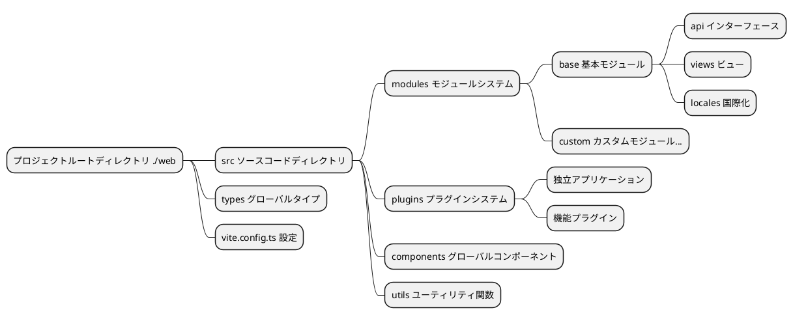
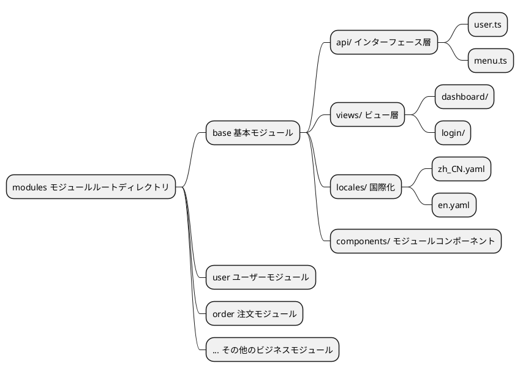
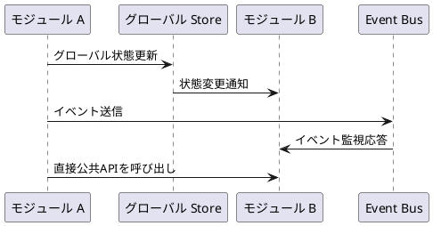
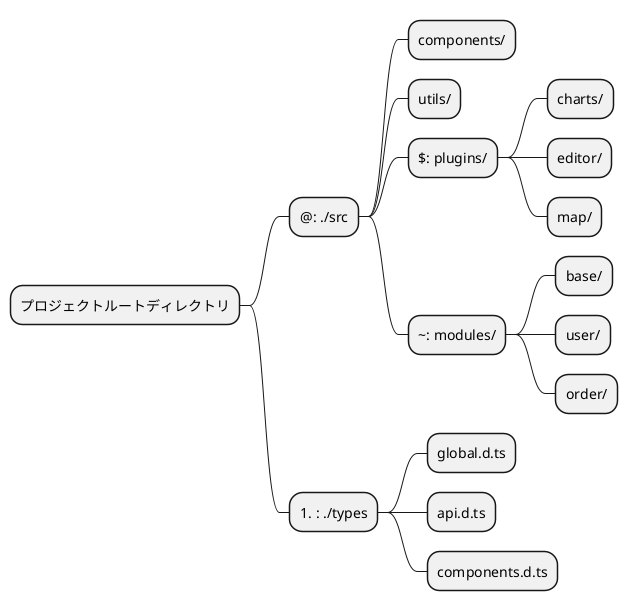
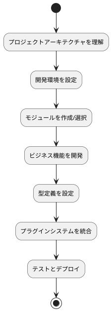

# 基本概念

プロジェクト全体がリファクタリングされました。ドキュメント全体をよりよく理解するために、いくつかの基本概念を紹介します。この部分を必ず最初に注意深く読んでください。

::: tip
以下で説明する内容はすべてソースコードのルートディレクトリにある `./web` 内の構造に関するものです
:::

## プロジェクト全体のアーキテクチャ

このプロジェクトはモダンなフロントエンド開発アーキテクチャを採用し、Vue 3 + TypeScript + Vite をベースに構築されています。モジュール化、プラグイン化された開発モデルを実現しています。



## グローバルタイプシステム

新しいバージョンは `TypeScript` で書かれているため、グローバルな型定義はすべて `./types` ディレクトリに保存されています。関連するデータ型構造はそこで見つけることができます。

### タイプファイルの組織構造

```
./types/
├── api.d.ts          # API関連の型定義
├── components.d.ts   # コンポーネント型定義
├── global.d.ts       # グローバル型定義
├── modules.d.ts      # モジュール型定義
└── utils.d.ts        # ユーティリティ関数の型定義
```

### 使用例

プロジェクトではエイリアス `#` を使用して型を簡単にインポートできます：

```typescript
// API型をインポート
import type { ApiResponse, UserInfo } from '#/api'

// グローバル型をインポート
import type { MenuConfig, RouteConfig } from '#/global'

// コンポーネントで使用
interface ComponentProps {
  userInfo: UserInfo
  menuConfig: MenuConfig[]
}
```

### 型定義のベストプラクティス

- **命名規則**：インターフェースと型にはPascalCaseを使用
- **ファイル組織**：機能モジュールごとに型ファイルを分割
- **型エクスポート**：`export type` を使用して型定義をエクスポート
- **ジェネリックサポート**：ジェネリックを適切に使用して型の再利用性を向上

## モジュール化アーキテクチャ

新しいバージョンではモジュール化が行われ、ディレクトリは `./src/modules` です。各モジュールは関連するビジネスの `api`、`types`、`locales` および `ビューファイル` を管理し、ビジネスの完全な分離と独立した管理を実現しています。

### モジュール構造設計



### 標準モジュールディレクトリ構造

```
./src/modules/[モジュール名]/
├── api/                 # APIインターフェース定義
│   ├── user.ts         # ユーザー関連インターフェース
│   ├── menu.ts         # メニュー関連インターフェース
│   └── index.ts        # インターフェース統一エクスポート
├── components/          # モジュール専用コンポーネント
│   ├── UserForm.vue    # ユーザーフォームコンポーネント
│   └── MenuTree.vue    # メニューツリーコンポーネント
├── locales/            # モジュール国際化ファイル
│   ├── zh_CN.yaml      # 中国語言語パック
│   ├── en.yaml         # 英語言語パック
│   └── index.ts        # 言語パックエクスポート
├── views/              # ビューページ
│   ├── user/           # ユーザー管理ページ
│   │   ├── index.vue   # ユーザーリストページ
│   │   └── detail.vue  # ユーザー詳細ページ
│   └── dashboard/      # ダッシュボードページ
│       └── index.vue
└── index.ts           # モジュール統一エクスポート
```

### モジュール開発フロー

1. **モジュールディレクトリ作成**：`./src/modules/` に新しいモジュールフォルダを作成
2. **モジュール構造定義**：標準構造に従って対応するディレクトリとファイルを作成
3. **ルート設定**：モジュール内でルート設定を定義
4. **ビジネスロジック開発**：API、コンポーネント、ビューを記述
5. **国際化追加**：多言語サポートを設定
6. **モジュールエクスポート**：index.ts を通じてモジュール内容を統一エクスポート

### モジュール間通信



### モジュール使用例

```typescript
// 他のモジュールでbaseモジュールのAPIを使用
import { userApi, menuApi } from '~/base/api'
import type { UserInfo } from '~/base/types'

// コンポーネントでモジュール機能を使用
export default defineComponent({
  async setup() {
    // ユーザーAPIを呼び出し
    const userList = await userApi.getUsers()
    
    // メニューAPIを呼び出し
    const menuTree = await menuApi.getMenuTree()
    
    return {
      userList,
      menuTree
    }
  }
})
```

## エイリアスシステム

`vite.config.ts` ファイルでパスエイリアスシステムが定義されており、ファイルインポートパスを簡素化し、開発効率とコードの保守性を向上させます。

### エイリアス設定

```typescript
// vite.config.ts
export default defineConfig({
  resolve: {
    alias: {
      '@': path.resolve(__dirname, 'src'),
      '#': path.resolve(__dirname, 'types'),
      '$': path.resolve(__dirname, 'src/plugins'),
      '~': path.resolve(__dirname, 'src/modules'),
    },
  },
})
```

### エイリアスマッピングテーブル

| エイリアス | ディレクトリパス | 用途説明 | 使用シナリオ |
|------|----------|----------|----------|
| `@` | `./src` | ソースコードルートディレクトリ | コンポーネント、ユーティリティ関数、スタイルなどのインポート |
| `#` | `./types` | グローバル型定義 | TypeScript型定義のインポート |
| `$` | `./src/plugins` | プラグインディレクトリ | プラグイン内のファイルとコンポーネントのインポート |
| `~` | `./src/modules` | モジュールディレクトリ | モジュール内のAPI、コンポーネント、ビューのインポート |

### エイリアス使用例

#### 1. 基本パスエイリアス (@)

```typescript
// ❌ 相対パスを使用（非推奨）
import Utils from '../../../utils/common'
import Button from '../../../components/Button.vue'

// ✅ エイリアスを使用（推奨）
import Utils from '@/utils/common'
import Button from '@/components/Button.vue'
```

#### 2. 型定義エイリアス (#)

```typescript
// グローバル型をインポート
import type { 
  ApiResponse, 
  UserInfo, 
  MenuConfig 
} from '#/global'

// API型をインポート
import type { LoginParams } from '#/api'

// インターフェースで使用
interface ComponentProps {
  userInfo: UserInfo
  menuList: MenuConfig[]
}
```

#### 3. プラグインエイリアス ($)

```typescript
// チャートプラグインをインポート
import ChartPlugin from '$/charts'
import { useChart } from '$/charts/hooks'

// エディタプラグインをインポート
import EditorPlugin from '$/editor'
import EditorComponent from '$/editor/components/RichEditor.vue'
```

#### 4. モジュールエイリアス (~)

```typescript
// baseモジュールのAPIをインポート
import { userApi, menuApi } from '~/base/api'

// ユーザーモジュールのコンポーネントをインポート
import UserForm from '~/user/components/UserForm.vue'
import UserList from '~/user/views/UserList.vue'

// モジュールの型をインポート
import type { UserModuleState } from '~/user/types'
```

### エイリアスシステムアーキテクチャ図



### エイリアス設定のベストプラクティス

#### 1. IDEサポート設定

より良いIDEのインテリセンスとパスジャンプサポートを得るためには、`tsconfig.json` を設定する必要があります：

```json
{
  "compilerOptions": {
    "baseUrl": ".",
    "paths": {
      "@/*": ["src/*"],
      "#/*": ["types/*"],
      "$/*": ["src/plugins/*"],
      "~/*": ["src/modules/*"]
    }
  }
}
```

#### 2. 使用規範

- **一貫性**：チーム内でエイリアスを統一使用し、相対パスの混在を避ける
- **可読性**：エイリアスは意味が明確で理解しやすいものにする
- **階層制御**：深すぎるパス階層を避け、エイリアスを適切に使用してパスを簡素化
- **タイプセーフティ**：TypeScriptと連携してパス参照のタイプセーフティを確保

#### 3. 一般的な使用パターン

```typescript
// コンポーネント内での総合的な使用例
<script setup lang="ts">
// グローバル型
import type { UserInfo, ApiResponse } from '#/global'

// グローバルユーティリティ
import { formatDate, validateForm } from '@/utils/common'

// モジュールAPI
import { userApi } from '~/base/api'

// プラグイン機能
import { useChart } from '$/charts/hooks'

// グローバルコンポーネント
import MaButton from '@/components/MaButton.vue'

// モジュールコンポーネント
import UserForm from '~/user/components/UserForm.vue'
</script>
```

### エイリアスシステムの利点

1. **パス簡素化**：複雑な相対パス参照を回避
2. **保守性向上**：ファイル移動時に多数の参照パスを変更する必要がない
3. **可読性向上**：エイリアスを通じてファイルの所属モジュールを迅速に識別
4. **統一規範**：チーム開発で一貫した参照スタイルを維持
5. **IDEフレンドリー**：TypeScriptとIDEと連携してより良い開発体験を提供

## まとめ

上記の基本概念の紹介を通じて、プロジェクトのコアアーキテクチャ設計を理解しました：

### アーキテクチャの特徴

- **モジュール化設計**：ビジネス機能をモジュールごとに分割し、高凝集低結合を実現
- **プラグイン化アーキテクチャ**：機能のホットプラグと拡張をサポート
- **タイプセーフティ**：TypeScriptに基づいて完全な型サポートを提供
- **パス最適化**：エイリアスシステムを通じてファイル参照を簡素化

### 開発フロー



### 次のステップ

これらの基本概念をマスターした後、以下の順序でさらに深く学ぶことをお勧めします：

1. **[開始方法](/front/base/start)** - 環境構築とプロジェクト起動
2. **[設定説明](/front/base/configure)** - 詳細な設定オプション
3. **[ルートメニュー](/front/base/route-menu)** - ルートとメニューの設定
4. **[モジュール開発](/front/advanced/module)** - モジュール化開発の詳細
5. **[プラグイン開発](/front/high/plugins)** - プラグインシステムの詳細

体系的な学習と実践を通じて、このアーキテクチャに基づいて効率的にフロントエンド開発を行うことができるようになります。