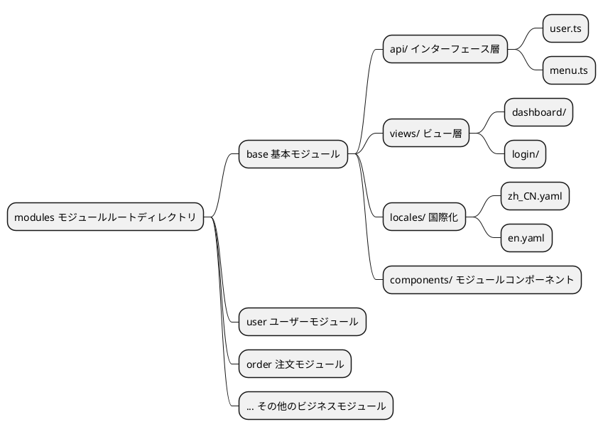
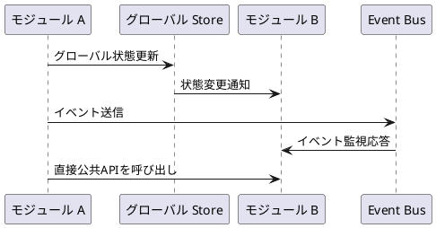
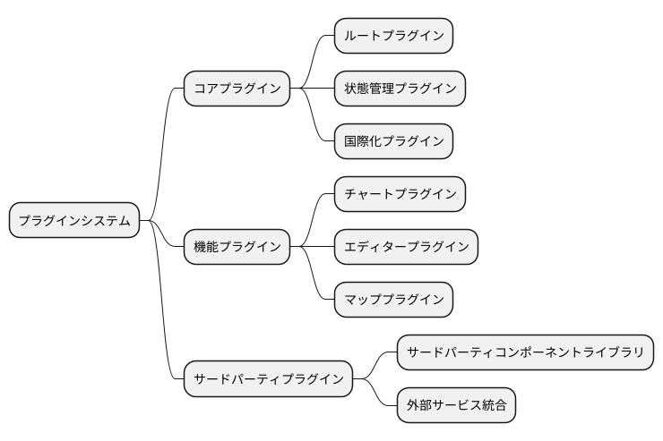
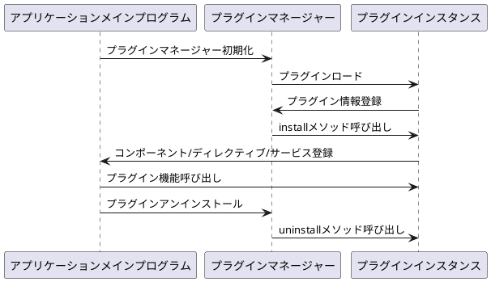
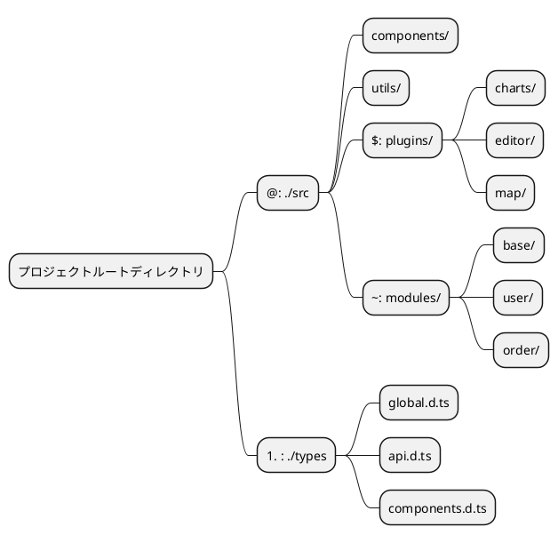

# 基本概念

プロジェクト全体がリファクタリングされました。ここでは、ドキュメント全体をよりよく理解するための基本概念を紹介します。まずこの部分を必ずよく読んでください。

::: tip
以下で説明する内容はすべてソースコードのルートディレクトリにある `./web` 内の構造を対象としています
:::

## プロジェクト全体のアーキテクチャ

このプロジェクトは現代的なフロントエンド開発アーキテクチャを採用し、Vue 3 + TypeScript + Vite を基盤として構築されています。モジュール化とプラグイン化された開発モデルを実現しています。


## グローバル型システム

新しいバージョンは `TypeScript` で書かれているため、グローバルな型定義はすべて `./types` ディレクトリに格納されており、関連するデータ型構造を見つけることができます。

### 型ファイルの組織構造

```
./types/
├── api.d.ts          # API関連の型定義
├── components.d.ts   # コンポーネント型定義
├── global.d.ts       # グローバル型定義
├── modules.d.ts      # モジュール型定義
└── utils.d.ts        # ユーティリティ関数の型定義
```

### 使用例

プロジェクト内ではエイリアス `#` を使用して型を簡単にインポートできます：

```typescript
// API型をインポート
import type { ApiResponse, UserInfo } from '#/api'

// グローバル型をインポート
import type { MenuConfig, RouteConfig } from '#/global'

// コンポーネントで使用
interface ComponentProps {
  userInfo: UserInfo
  menuConfig: MenuConfig[]
}
```

### 型定義のベストプラクティス

- **命名規則**：インターフェースと型にはPascalCaseを使用
- **ファイル組織**：機能モジュールごとに型ファイルを分割
- **型エクスポート**：`export type` を使用して型定義をエクスポート
- **ジェネリックサポート**：型の再利用性を高めるためにジェネリックを適切に使用

## モジュール化アーキテクチャ

新しいバージョンではモジュール化が行われ、ディレクトリは `./src/modules` です。各モジュールは関連するビジネスの `api`、`types`、`locales` および `ビューファイル` を管理し、ビジネスの完全な分離と独立した管理を実現しています。

### モジュール構造設計



### 標準モジュールディレクトリ構造

```
./src/modules/[モジュール名]/
├── api/                 # APIインターフェース定義
│   ├── user.ts         # ユーザー関連インターフェース
│   ├── menu.ts         # メニュー関連インターフェース
│   └── index.ts        # インターフェース統一エクスポート
├── components/          # モジュール専用コンポーネント
│   ├── UserForm.vue    # ユーザーフォームコンポーネント
│   └── MenuTree.vue    # メニューツリーコンポーネント
├── locales/            # モジュール国際化ファイル
│   ├── zh_CN.yaml      # 中国語言語パック
│   ├── en.yaml         # 英語言語パック
│   └── index.ts        # 言語パックエクスポート
├── views/              # ビューページ
│   ├── user/           # ユーザー管理ページ
│   │   ├── index.vue   # ユーザー一覧ページ
│   │   └── detail.vue  # ユーザー詳細ページ
│   └── dashboard/      # ダッシュボードページ
│       └── index.vue
└── index.ts           # モジュール統一エクスポート
```

### モジュール開発フロー

1. **モジュールディレクトリ作成**：`./src/modules/` に新しいモジュールフォルダを作成
2. **モジュール構造定義**：標準構造に従って対応するディレクトリとファイルを作成
3. **ルート設定**：モジュール内でルート設定を定義
4. **ビジネスロジック開発**：API、コンポーネント、ビューを記述
5. **国際化追加**：多言語サポートを設定
6. **モジュールエクスポート**：index.ts を通じてモジュール内容を統一エクスポート

### モジュール間通信



### モジュール使用例

```typescript
// 他のモジュールでbaseモジュールのAPIを使用
import { userApi, menuApi } from '~/base/api'
import type { UserInfo } from '~/base/types'

// コンポーネントでモジュール機能を使用
export default defineComponent({
  async setup() {
    // ユーザーAPIを呼び出し
    const userList = await userApi.getUsers()
    
    // メニューAPIを呼び出し
    const menuTree = await menuApi.getMenuTree()
    
    return {
      userList,
      menuTree
    }
  }
})
```

## プラグインシステム

新しいフロントエンドでは `./src/plugins` ディレクトリが追加され、独立アプリケーションやプラグインなどを格納しています。プラグインシステムは機能のホットプラグをサポートし、システムの拡張性と柔軟性を向上させます。

### プラグインアーキテクチャ設計



### プラグインディレクトリ構造

```
./src/plugins/
├── charts/              # チャートプラグイン
│   ├── components/      # プラグインコンポーネント
│   ├── utils/          # ユーティリティ関数
│   ├── types/          # 型定義
│   └── index.ts        # プラグインエントリ
├── editor/             # エディタープラグイン
│   ├── components/
│   ├── config/
│   └── index.ts
├── map/                # マッププラグイン
└── shared/             # プラグイン間共有リソース
    ├── utils/          # 共有ユーティリティ
    ├── components/     # 共有コンポーネント
    └── types/          # 共有型定義
```

### プラグインライフサイクル



### プラグイン開発規範

#### 1. プラグイン基本構造

```typescript
// ./src/plugins/example/index.ts
import type { App } from 'vue'
import type { PluginOptions } from './types'

export interface ExamplePlugin {
  install(app: App, options?: PluginOptions): void
  uninstall?(app: App): void
}

export const examplePlugin: ExamplePlugin = {
  install(app: App, options?: PluginOptions) {
    // グローバルコンポーネント登録
    app.component('ExampleComponent', ExampleComponent)
    
    // グローバルディレクティブ登録
    app.directive('example', exampleDirective)
    
    // グローバルメソッド提供
    app.config.globalProperties.$example = exampleMethod
    
    // プラグイン設定登録
    app.provide('exampleConfig', options)
  },
  
  uninstall(app: App) {
    // リソースクリーンアップ
    delete app.config.globalProperties.$example
  }
}

export default examplePlugin
```

#### 2. プラグイン設定ファイル

```typescript
// ./src/plugins/example/config.ts
export interface PluginConfig {
  name: string
  version: string
  description: string
  dependencies?: string[]
  permissions?: string[]
}

export const pluginConfig: PluginConfig = {
  name: 'example-plugin',
  version: '1.0.0',
  description: 'サンプルプラグイン',
  dependencies: ['vue', 'vue-router'],
  permissions: ['read:user', 'write:user']
}
```

### プラグイン使用例

#### 1. プラグイン登録

```typescript
// main.ts
import { createApp } from 'vue'
import App from './App.vue'
import examplePlugin from '$/example'

const app = createApp(App)

// プラグイン登録
app.use(examplePlugin, {
  // プラグイン設定オプション
  theme: 'dark',
  locale: 'ja-JP'
})

app.mount('#app')
```

#### 2. コンポーネントでプラグインを使用

```vue
<template>
  <div>
    <!-- プラグイン登録のグローバルコンポーネントを使用 -->
    <ExampleComponent :data="exampleData" />
    
    <!-- プラグインディレクティブを使用 -->
    <div v-example="directiveOptions">
      プラグインディレクティブサンプル
    </div>
  </div>
</template>

<script setup lang="ts">
import { getCurrentInstance } from 'vue'

const instance = getCurrentInstance()

// プラグイン提供のグローバルメソッドを使用
const result = instance?.proxy?.$example('param')

// またはinjectでプラグイン設定を取得
const exampleConfig = inject('exampleConfig')
</script>
```

### プラグイン管理ベストプラクティス

- **命名規則**：プラグインディレクトリにはkebab-caseを使用
- **バージョン管理**：プラグイン設定で明確なバージョン情報を記載
- **依存関係宣言**：プラグイン依存関係を明確に宣言
- **リソースクリーンアップ**：uninstallメソッドを実装してリソースをクリーンアップ
- **型サポート**：プラグインに完全なTypeScript型定義を提供
- **ドキュメント整備**：各プラグインに使用ドキュメントとサンプルを提供

## エイリアスシステム

`vite.config.ts` ファイルでパスエイリアスシステムが定義されており、ファイルインポートパスを簡素化し、開発効率とコードの保守性を向上させます。

### エイリアス設定

```typescript
// vite.config.ts
export default defineConfig({
  resolve: {
    alias: {
      '@': path.resolve(__dirname, 'src'),
      '#': path.resolve(__dirname, 'types'),
      '$': path.resolve(__dirname, 'src/plugins'),
      '~': path.resolve(__dirname, 'src/modules'),
    },
  },
})
```

### エイリアスマッピングテーブル

| エイリアス | ディレクトリパス | 用途説明 | 使用シナリオ |
|------|----------|----------|----------|
| `@` | `./src` | ソースコードルートディレクトリ | コンポーネント、ユーティリティ関数、スタイルなどのインポート |
| `#` | `./types` | グローバル型定義 | TypeScript型定義のインポート |
| `$` | `./src/plugins` | プラグインディレクトリ | プラグイン内のファイルとコンポーネントのインポート |
| `~` | `./src/modules` | モジュールディレクトリ | モジュール内のAPI、コンポーネント、ビューのインポート |

### エイリアス使用例

#### 1. 基本パスエイリアス (@)

```typescript
// ❌ 相対パスを使用（非推奨）
import Utils from '../../../utils/common'
import Button from '../../../components/Button.vue'

// ✅ エイリアスを使用（推奨）
import Utils from '@/utils/common'
import Button from '@/components/Button.vue'
```

#### 2. 型定義エイリアス (#)

```typescript
// グローバル型をインポート
import type { 
  ApiResponse, 
  UserInfo, 
  MenuConfig 
} from '#/global'

// API型をインポート
import type { LoginParams } from '#/api'

// インターフェースで使用
interface ComponentProps {
  userInfo: UserInfo
  menuList: MenuConfig[]
}
```

#### 3. プラグインエイリアス ($)

```typescript
// チャートプラグインをインポート
import ChartPlugin from '$/charts'
import { useChart } from '$/charts/hooks'

// エディタープラグインをインポート
import EditorPlugin from '$/editor'
import EditorComponent from '$/editor/components/RichEditor.vue'
```

#### 4. モジュールエイリアス (~)

```typescript
// baseモジュールのAPIをインポート
import { userApi, menuApi } from '~/base/api'

// ユーザーモジュールのコンポーネントをインポート
import UserForm from '~/user/components/UserForm.vue'
import UserList from '~/user/views/UserList.vue'

// モジュールの型をインポート
import type { UserModuleState } from '~/user/types'
```

### エイリアスシステムアーキテクチャ図



### エイリアス設定ベストプラクティス

#### 1. IDEサポート設定

より良いIDEのインテリセンスとパスジャンプサポートを得るために、`tsconfig.json` を設定する必要があります：

```json
{
  "compilerOptions": {
    "baseUrl": ".",
    "paths": {
      "@/*": ["src/*"],
      "#/*": ["types/*"],
      "$/*": ["src/plugins/*"],
      "~/*": ["src/modules/*"]
    }
  }
}
```

#### 2. 使用規範

- **一貫性**：チーム内でエイリアスを統一して使用し、相対パスの混在を避ける
- **可読性**：エイリアスは意味が明確で理解しやすいものにする
- **階層制御**：深すぎるパス階層を避け、