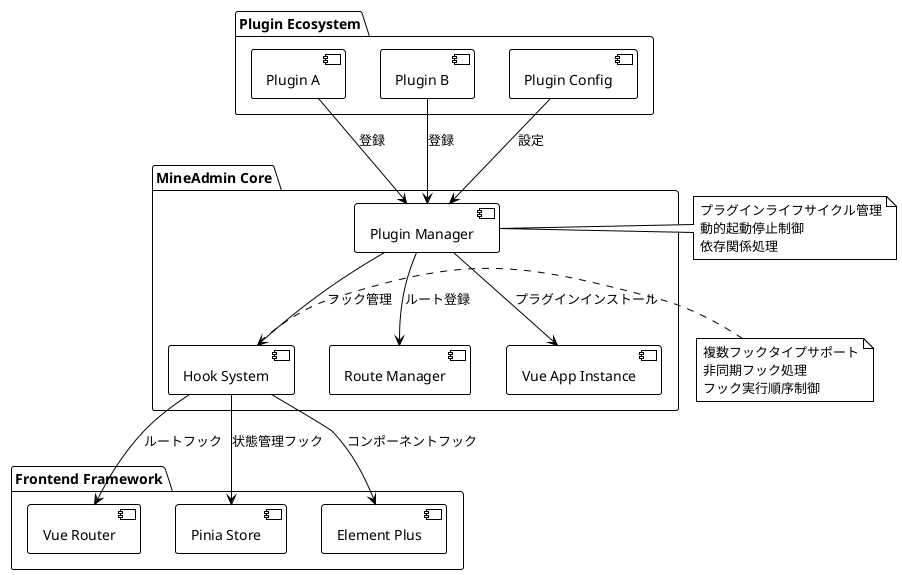
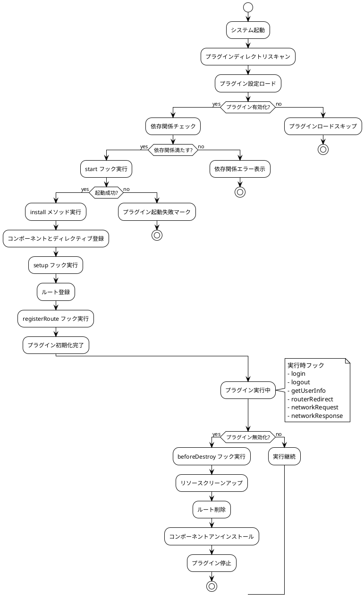

# プラグインシステム

::: tip プラグインシステム説明
`3.0` フロントエンドはコアレベルでプラグインシステムをサポートしており、`2.0` では設計当初プラグイン機能を考慮していなかったのと比較して、
システムのインターフェースや動作、機能を変更する際にはソースコードを修正する必要があり、その結果アップグレードができなくなり、公式コードとの差異が大きくなっていました。
後にアプリストア機能が追加されましたが、強制的にプラグインをサポートする形になり、プラグインもソースコードを修正する必要があり、初期化が必要な場所ではプラグインが拡張実装できず、`main.js` を修正するしかありませんでした。

**現在では上記の問題はすべて存在しません。フロントエンドプラグインシステムは強力なサポートを提供し、インターフェースの置換、機能追加、サードパーティコンポーネントや独自開発コンポーネントの導入をシステムにシームレスに統合できます。
さらに、複数の `hooks（フック）` を提供し、フロントエンドの実行に影響を与え変更することさえ可能です**
:::

## プラグインシステムアーキテクチャ概要

プラグインシステムはモダンなフロントエンドアーキテクチャに基づいて設計され、完全なライフサイクル管理と拡張機能を提供します：



### コア機能

- **非侵入型設計**: プラグイン開発にコアコードの修正は不要
- **動的ロード**: プラグインの動的な有効化と無効化をサポート
- **ライフサイクル管理**: 完全なプラグインライフサイクルフック
- **タイプセーフ**: 完全な TypeScript 型定義
- **パフォーマンス最適化**: 遅延ロードとオンデマンドロードをサポート
- **エラー分離**: プラグインエラーがメインアプリケーションに影響しない

## プラグインデータタイプ紹介

::: info 型定義ファイル
型定義は `types/global.d.ts` 内にあります
:::

:::details クリックして完全な型定義を表示
```ts
declare namespace Plugin {
  /**
   * プラグイン基本情報
   */
  interface Info {
    /** プラグイン名，形式：作者名前空間/プラグイン名 */
    name: string
    /** プラグインバージョン，セマンティックバージョニングに従う */
    version: string
    /** プラグイン作者 */
    author: string
    /** プラグイン説明 */
    description: string
    /** プラグイン起動順序，数値が大きいほど先に起動，デフォルトは 0 */
    order?: number
    /** プラグイン依存リスト */
    dependencies?: string[]
    /** プラグインキーワード，検索用 */
    keywords?: string[]
    /** プラグインホームページアドレス */
    homepage?: string
    /** プラグインライセンス */
    license?: string
    /** 最低システムバージョン要求 */
    minSystemVersion?: string
  }

  /**
   * プラグイン設定
   */
  interface Config {
    /** プラグイン基本情報 */
    info: Info
    /** プラグインが有効かどうか */
    enable: boolean
    /** プラグイン開発モード，デバッグ用 */
    devMode?: boolean
    /** プラグインカスタム設定項目 */
    settings?: Record<string, any>
  }

  /**
   * プラグインビュールート定義
   */
  interface Views extends Route.RouteRecordRaw {
    /** ルートメタ情報拡張 */
    meta?: {
      /** ページタイトル */
      title?: string
      /** 国際化キー値 */
      i18n?: string
      /** ページアイコン */
      icon?: string
      /** 権限検証が必要かどうか */
      requireAuth?: boolean
      /** 必要な権限リスト */
      permissions?: string[]
      /** ページをキャッシュするかどうか */
      keepAlive?: boolean
      /** ページが非表示かどうか */
      hidden?: boolean
      /** メニューソート */
      order?: number
    }
  }

  /**
   * フック関数型定義
   */
  interface HookHandlers {
    /** プラグイン起動フック，初期化検証に使用可能 */
    start?: (config: Config) => Promise<boolean | void> | boolean | void
    /** システム初期化完了フック，Vue コンテキストにアクセス可能 */
    setup?: () => Promise<void> | void
    /** ルート登録フック，ルート設定を変更可能 */
    registerRoute?: (router: Router, routesRaw: Route.RouteRecordRaw[] | Views[] | MineRoute.routeRecord[]) => Promise<void> | void
    /** ユーザーログインフック */
    login?: (formInfo: LoginFormData) => Promise<void> | void
    /** ユーザーログアウトフック */
    logout?: () => Promise<void> | void
    /** ユーザー情報取得フック */
    getUserInfo?: (userInfo: UserInfo) => Promise<void> | void
    /** ルートリダイレクトフック（外部リンク無効） */
    routerRedirect?: (context: { from: RouteLocationNormalized, to: RouteLocationNormalized }, router: Router) => Promise<void> | void
    /** ネットワークリクエストインターセプトフック */
    networkRequest?: <T = any>(request: AxiosRequestConfig) => Promise<AxiosRequestConfig> | AxiosRequestConfig
    /** ネットワークレスポンスインターセプトフック */
    networkResponse?: <T = any>(response: AxiosResponse<T>) => Promise<AxiosResponse<T>> | AxiosResponse<T>
    /** エラー処理フック */
    error?: (error: Error, context?: string) => Promise<void> | void
    /** ページロード完了フック */
    mounted?: () => Promise<void> | void
    /** ページ破棄前フック */
    beforeDestroy?: () => Promise<void> | void
  }

  /**
   * プラグインメイン設定インターフェース
   */
  interface PluginConfig {
    /** プラグインインストール関数，コンポーネント、ディレクティブなどを登録 */
    install: (app: App<Element>) => Promise<void> | void
    /** プラグイン設定情報 */
    config: Config
    /** プラグインルート定義 */
    views?: Views[]
    /** プラグインフック関数 */
    hooks?: HookHandlers
    /** プラグインカスタム属性 */
    [key: string]: any
  }

  /**
   * プラグインストア状態
   */
  interface PluginStore {
    /** インストール済みプラグインリスト */
    plugins: Map<string, PluginConfig>
    /** プラグイン有効状態 */
    enabledPlugins: Set<string>
    /** プラグインロード状態 */
    loadingPlugins: Set<string>
    /** プラグインエラー情報 */
    pluginErrors: Map<string, Error>
  }

  /**
   * プラグインマネージャーインターフェース
   */
  interface PluginManager {
    /** プラグイン登録 */
    register(name: string, plugin: PluginConfig): Promise<boolean>
    /** プラグインアンインストール */
    unregister(name: string): Promise<boolean>
    /** プラグイン有効化 */
    enable(name: string): Promise<boolean>
    /** プラグイン無効化 */
    disable(name: string): Promise<boolean>
    /** プラグイン情報取得 */
    getPlugin(name: string): PluginConfig | null
    /** すべてのプラグイン取得 */
    getAllPlugins(): Map<string, PluginConfig>
    /** プラグイン依存関係チェック */
    checkDependencies(name: string): Promise<boolean>
  }
}

/**
 * ログインフォームデータタイプ
 */
interface LoginFormData {
  username: string
  password: string
  captcha?: string
  remember?: boolean
}

/**
 * ユーザー情報タイプ
 */
interface UserInfo {
  id: number
  username: string
  nickname: string
  email: string
  avatar: string
  roles: string[]
  permissions: string[]
  [key: string]: any
}
```
:::

## プラグイン作成

### ディレクトリ構造と命名規則

すべてのプラグインは `src/plugins` ディレクトリに配置され、プラグインにはこのディレクトリを指す `$` というエイリアスがあります。プラグインはバックエンドと同じ構造で、
`開発者名前空間/プラグイン名` でプラグインディレクトリを構成します。スラッシュの左側は**作者名前空間**で、[MineAdmin公式サイト設定](https://www.mineadmin.com)で設定可能、
スラッシュの右側は**プラグイン名**で、この作者名前空間内で一意です。

#### 標準プラグインディレクトリ構造

```bash
src/plugins/
├── mine-admin/          # 公式プラグイン名前空間
│   ├── app-store/       # アプリストアプラグイン
│   ├── basic-ui/        # 基本UIライブラリプラグイン
│   └── demo/            # 公式デモプラグイン
├── author-name/         # サードパーティ開発者名前空間
│   └── plugin-name/     # 具体的なプラグインディレクトリ
│       ├── index.ts     # プラグインエントリファイル（必須）
│       ├── config.ts    # プラグイン設定ファイル（オプション）
│       ├── package.json # プラグインパッケージ情報（推奨）
│       ├── README.md    # プラグイン説明ドキュメント（推奨）
│       ├── views/       # ページコンポーネントディレクトリ
│       │   ├── index.vue
│       │   └── components/
│       ├── components/  # 再利用可能コンポーネント
│       ├── composables/ # コンポーザブル関数
│       ├── utils/       # ユーティリティ関数
│       ├── assets/      # 静的リソース
│       ├── locales/     # 国際化ファイル
│       │   ├── zh.json
│       │   ├── en.json
│       │   └── ja.json
│       ├── types/       # TypeScript 型定義
│       └── tests/       # テストファイル
```

#### 命名規則推奨事項

- **プラグイン名**: 小文字とハイフンを使用，例 `file-manager`、`data-export`
- **作者名前空間**: 小文字とハイフンを使用，特殊文字を避ける
- **ファイル名**: kebab-case 規約に従う
- **コンポーネント名**: PascalCase を使用，例 `FileUploader.vue`

::: tip ベストプラクティス
- ローカルで開発したプラグインもシステムで認識可能ですが、MineAdmin アプリマーケットにアップロードできません
- 依存関係とバージョン管理のために `package.json` を追加することを推奨
- より良い型ヒントとエラーチェックのために TypeScript を使用
- Vue 3 コンポジションAPIのベストプラクティスに従う
:::

::: warning 注意事項
- 同じ作者名前空間内でプラグイン名は一意である必要があります
- システム予約語をプラグイン名として使用しないでください
- プラグインディレクトリを作成後、名前を随意に変更しないことを推奨
:::

### プラグインライフサイクル



## プラグイン開発ガイド

### 基本プラグイン例

完全なファイル管理プラグインを通じてプラグイン開発の全プロセスを理解しましょう：

#### 1. プラグインエントリファイル `index.ts` 作成

```ts
// src/plugins/zhang-san/file-manager/index.ts
import type { App } from 'vue'
import type { Router, RouteRecordRaw } from 'vue-router'
import type { Plugin } from '#/global'
import { ElMessage, ElNotification } from 'element-plus'

// プラグインコンポーネントをインポート
import FileManagerComponent from './components/FileManager.vue'
import FileUploader from './components/FileUploader.vue'

// ユーティリティ関数をインポート
import { formatFileSize, validateFileType } from './utils/fileUtils'

// プラグイン設定
const pluginConfig: Plugin.PluginConfig = {
  // プラグインインストール方法 - ここでグローバルコンポーネント、ディレクティブ、プラグインなどを登録
  async install(app: App) {
    try {
      // グローバルコンポーネントを登録
      app.component('FileManager', FileManagerComponent)
      app.component('FileUploader', FileUploader)
      
      // グローバルディレクティブを登録
      app.directive('file-drop', {
        mounted(el, binding) {
          el.addEventListener('dragover', (e: DragEvent) => {
            e.preventDefault()
            e.stopPropagation()
          })
          
          el.addEventListener('drop', async (e: DragEvent) => {
            e.preventDefault()
            e.stopPropagation()
            const files = Array.from(e.dataTransfer?.files || [])
            await binding.value(files)
          })
        }
      })
      
      // グローバルプロパティを追加
      app.config.globalProperties.$fileUtils = {
        formatSize: formatFileSize,
        validateType: validateFileType
      }
      
      console.log('ファイル管理プラグインインストール成功')
    } catch (error) {
      console.error('ファイル管理プラグインインストール失敗:', error)
      throw error
    }
  },

  // プラグイン基本設定
  config: {
    enable: import.meta.env.NODE_ENV !== 'production', // 本番環境では無効
    devMode: import.meta.env.DEV,
    info: {
      name: 'zhang-san/file-manager',
      version: '2.1.0',
      author: '張三',
      description: '企業級ファイル管理プラグイン，アップロード、ダウンロード、プレビュー、権限制御などの機能をサポート',
      keywords: ['ファイル管理', 'ファイルアップロード', '権限制御'],
      homepage: 'https://github.com/zhang-san/file-manager',
      license: 'MIT',
      minSystemVersion: '3.0.0',
      dependencies: ['mine-admin/basic-ui'],
      order: 10 // 高い優先度
