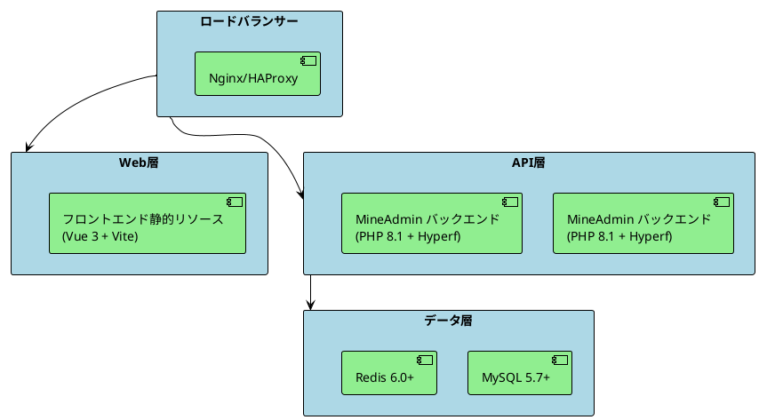

# デプロイ

このドキュメントでは、MineAdminのフロントエンドとバックエンドアプリケーションを様々な環境（開発、テスト、本番環境）にデプロイする方法とベストプラクティスについて説明します。

## デプロイアーキテクチャ概要

MineAdminはフロントエンドとバックエンドが分離されたアーキテクチャを採用しており、以下の技術スタックを使用しています：
- **バックエンド**: PHP 8.1+ + Hyperfフレームワーク + Swoole拡張
- **フロントエンド**: Vue 3 + TypeScript + Vite
- **データベース**: MySQL 5.7+ / PostgreSQL (オプション)
- **キャッシュ**: Redis 6.0+
- **コンテナ化**: Docker + Docker Compose



## 環境準備

### PHP拡張要件

[`mineadmin/Dockerfile`](https://github.com/mineadmin/MineAdmin/blob/master/Dockerfile) の設定に基づく：

**必須拡張:**
- cURL >= 7.68
- Fileinfo 
- OpenSSL >= 1.1
- PDO
- Redis >= 5.3
- JSON
- Tokenizer
- SimpleXML
- XMLWriter

**オプション拡張:**
- PDO_MYSQL (MySQLサポート)
- PDO_PGSQL (PostgreSQLサポート)  
- Swoole >= 5.1 (高性能モード)
- Swow >= 1.5 
- XlsWriter (Excelファイルサポート)

**PHP設定最適化:**
```ini
# /etc/php/8.1/php.ini または対応するバージョンのパス
upload_max_filesize = 128M
post_max_size = 128M
memory_limit = 1G
max_execution_time = 300
max_input_vars = 3000
date.timezone = Asia/Tokyo
```

## バックエンドデプロイ

### 1. 環境設定

#### 環境設定ファイルの作成

環境ファイルをコピーして設定します。[`mineadmin/.env.example`](https://github.com/mineadmin/MineAdmin/blob/master/.env.example) を参照：

```shell
cp .env.example .env
```

**開発環境設定 (.env)**:
```bash
APP_NAME=MineAdmin
APP_ENV=dev
APP_DEBUG=true
APP_URL=http://127.0.0.1:9501

# データベース設定
DB_DRIVER=mysql
DB_HOST=127.0.0.1
DB_PORT=3306
DB_DATABASE=mineadmin
DB_USERNAME=root
DB_PASSWORD=your_password
DB_CHARSET=utf8mb4
DB_COLLATION=utf8mb4_unicode_ci
DB_PREFIX=

# Redis設定
REDIS_HOST=127.0.0.1
REDIS_AUTH=
REDIS_PORT=6379
REDIS_DB=0

# JWT秘密鍵 (新しい鍵を生成してください)
JWT_SECRET=your_jwt_secret_key_here
```

**本番環境設定**:
```bash
APP_NAME=MineAdmin
APP_ENV=prod
APP_DEBUG=false
APP_URL=https://your-domain.com

# データベース設定 (内部IPを使用)
DB_DRIVER=mysql
DB_HOST=10.0.0.10
DB_PORT=3306
DB_DATABASE=mineadmin
DB_USERNAME=mineadmin
DB_PASSWORD=strong_password_here
DB_CHARSET=utf8mb4
DB_COLLATION=utf8mb4_unicode_ci
DB_PREFIX=

# Redis設定 (内部IPを使用、パスワード有効化)
REDIS_HOST=10.0.0.11
REDIS_AUTH=redis_password_here
REDIS_PORT=6379
REDIS_DB=0

# JWT秘密鍵 (64文字の強力な鍵)
JWT_SECRET=generated_64_character_jwt_secret_key_here
```

#### JWT秘密鍵の生成

```shell
# 安全なJWT秘密鍵を生成
php -r "echo base64_encode(random_bytes(64)) . PHP_EOL;"
```

### 2. データベース初期化

#### データベースマイグレーション

[`mineadmin/databases/migrations/`](https://github.com/mineadmin/MineAdmin/tree/master/databases/migrations) ディレクトリ内のマイグレーションファイルに基づいてデータベースマイグレーションを実行：

```shell
# データベースマイグレーションを実行
php bin/hyperf.php migrate

# マイグレーション状態を確認
php bin/hyperf.php migrate:status
```

**主なデータテーブル**:
- `user` - ユーザーテーブル
- `menu` - メニューテーブル  
- `role` - ロールテーブル
- `rules` - 権限ルールテーブル
- `attachment` - 添付ファイルテーブル
- `user_login_log` - ユーザーログインログ
- `user_operation_log` - ユーザー操作ログ

#### データシーディング（オプション）

```shell
# データシーディングを実行
php bin/hyperf.php db:seed
```

### 3. 直接サーバーデプロイ

#### Supervisordプロセス管理の使用

Supervisor設定ファイル `/etc/supervisor/conf.d/mineadmin.conf` を作成:

```ini
[program:mineadmin]
command=php /var/www/mineadmin/bin/hyperf.php start
directory=/var/www/mineadmin
autostart=true
autorestart=true
startretries=3
user=www-data
redirect_stderr=true
stdout_logfile=/var/log/mineadmin.log
stdout_logfile_maxbytes=50MB
stdout_logfile_backups=10
```

サービスを起動:
```shell
# 設定をリロード
sudo supervisorctl reread
sudo supervisorctl update

# MineAdminを起動
sudo supervisorctl start mineadmin

# 状態を確認
sudo supervisorctl status mineadmin
```

#### Systemdサービス管理の使用

システムサービスファイル `/etc/systemd/system/mineadmin.service` を作成:

```ini
[Unit]
Description=MineAdmin Hyperf Service
After=network.target mysql.service redis.service

[Service]
Type=forking
User=www-data
Group=www-data
WorkingDirectory=/var/www/mineadmin
ExecStart=/usr/bin/php /var/www/mineadmin/bin/hyperf.php start -d
ExecStop=/bin/kill -TERM $MAINPID
ExecReload=/bin/kill -USR1 $MAINPID
Restart=always
RestartSec=5
StandardOutput=journal
StandardError=journal
SyslogIdentifier=mineadmin

[Install]
WantedBy=multi-user.target
```

サービス管理:
```shell
# サービスを有効化して起動
sudo systemctl enable mineadmin
sudo systemctl start mineadmin

# サービス状態を確認
sudo systemctl status mineadmin

# ログを確認
sudo journalctl -u mineadmin -f
```

### 4. コンテナ化デプロイ (推奨)

#### シングルコンテナデプロイ

プロジェクトルートディレクトリの [`Dockerfile`](https://github.com/mineadmin/MineAdmin/blob/master/Dockerfile) に基づく:

```shell
# イメージをビルド
docker build -t mineadmin:latest .

# コンテナを実行 (開発環境)
docker run -d \
  --name mineadmin \
  -p 9501:9501 \
  -p 9503:9503 \
  -v $(pwd)/.env:/opt/www/.env \
  -v $(pwd)/storage:/opt/www/storage \
  mineadmin:latest

# コンテナ状態を確認
docker ps -a
docker logs mineadmin
```

#### Docker Composeデプロイ（完全環境）

プロジェクト提供の [`docker-compose.yml`](https://github.com/mineadmin/MineAdmin/blob/master/docker-compose.yml) 設定を使用：

**開発環境 docker-compose.yml**:
```yaml
name: mineadmin-dev

volumes:
  mine_redis_data:
  mine_mysql_data:
  mine_uploads:

networks:
  mineadmin:
    driver: bridge

services:
  redis:
    image: redis:7.2-alpine
    container_name: mineadmin-redis
    ports:
      - "6379:6379"
    volumes:
      - mine_redis_data:/data
    command: redis-server --appendonly yes --requirepass ${REDIS_PASSWORD:-}
    environment:
      - TZ=Asia/Tokyo
    networks:
      - mineadmin
    healthcheck:
      test: ["CMD", "redis-cli", "ping"]
      interval: 10s
      timeout: 5s
      retries: 3
    deploy:
      resources:
        limits:
          memory: 512M

  mysql:
    image: mysql:8.0
    container_name: mineadmin-mysql
    volumes:
      - mine_mysql_data:/var/lib/mysql
      - ./docker/mysql/conf.d:/etc/mysql/conf.d
    ports:
      - "3306:3306"
    environment:
      MYSQL_ROOT_PASSWORD: ${DB_PASSWORD:-root}
      MYSQL_DATABASE: ${DB_DATABASE:-mineadmin}
      MYSQL_USER: ${DB_USERNAME:-mineadmin}
      MYSQL_PASSWORD: ${DB_PASSWORD:-root}
      MYSQL_CHARACTER_SET_SERVER: utf8mb4
      MYSQL_COLLATION_SERVER: utf8mb4_unicode_ci
      TZ: Asia/Tokyo
    networks:
      - mineadmin
    healthcheck:
      test: ["CMD", "mysqladmin", "ping", "-h", "localhost"]
      interval: 10s
      timeout: 5s
      retries: 5
    deploy:
      resources:
        limits:
          memory: 1G

  app:
    build:
      context: .
      dockerfile: Dockerfile
      args:
        - timezone=Asia/Tokyo
    container_name: mineadmin-app
    volumes:
      - ./:/opt/www
      - mine_uploads:/opt/www/storage/uploads
    ports:
      - "9501:9501"
      - "9503:9503"
    environment:
      - TZ=Asia/Tokyo
      - APP_ENV=dev
    depends_on:
      mysql:
        condition: service_healthy
      redis:
        condition: service_healthy
    networks:
      - mineadmin
    healthcheck:
      test: ["CMD", "curl", "-f", "http://localhost:9501/"]
      interval: 30s
      timeout: 10s
      retries: 3
```

**本番環境デプロイ**:
```shell
# 本番環境設定を作成
cp .env.example .env.prod

# サービスを起動
docker-compose --env-file .env.prod up -d

# サービス状態を確認
docker-compose ps

# ログを確認
docker-compose logs -f app
```

#### Kubernetesデプロイ

**ConfigMap設定**:
```yaml
apiVersion: v1
kind: ConfigMap
metadata:
  name: mineadmin-config
  namespace: mineadmin
data:
  .env: |
    APP_NAME=MineAdmin
    APP_ENV=prod
    APP_DEBUG=false
    APP_URL=https://admin.yourdomain.com
    
    DB_DRIVER=mysql
    DB_HOST=mysql-service
    DB_PORT=3306
    DB_DATABASE=mineadmin
    DB_USERNAME=mineadmin
    DB_PASSWORD=your_secure_password
    DB_CHARSET=utf8mb4
    DB_COLLATION=utf8mb4_unicode_ci
    DB_PREFIX=
    
    REDIS_HOST=redis-service
    REDIS_AUTH=your_redis_password
    REDIS_PORT=6379
    REDIS_DB=0
    
    JWT_SECRET=your_64_character_jwt_secret
```

**Deployment設定**:
```yaml
apiVersion: apps/v1
kind: Deployment
metadata:
  name: mineadmin-deployment
  namespace: mineadmin
spec:
  replicas: 3
  selector:
    matchLabels:
      app: mineadmin
  template:
    metadata:
      labels:
        app: mineadmin
    spec:
      containers:
      - name: mineadmin
        image: mineadmin:latest
        ports:
        - containerPort: 9501
        - containerPort: 9503
        env:
        - name: APP_ENV
          value: "prod"
        - name: TZ
          value: "Asia/Tokyo"
        volumeMounts:
        - name: config-volume
          mountPath: /opt/www/.env
          subPath: .env
        - name: storage-volume
          mountPath: /opt/www/storage
        resources:
          requests:
            memory: "256Mi"
            cpu: "250m"
          limits:
            memory: "1Gi"
            cpu: "500m"
        livenessProbe:
          httpGet:
            path: /
            port: 9501
          initialDelaySeconds: 30
          periodSeconds: 10
        readinessProbe:
          httpGet:
            path: /
            port: 9501
          initialDelaySeconds: 10
          periodSeconds: 5
      volumes:
      - name: config-volume
        configMap:
          name: mineadmin-config
      - name: storage-volume
        persistentVolumeClaim:
          claimName: mineadmin-storage-pvc
```

**Service設定**:
```yaml
apiVersion: v1
kind: Service
metadata:
  name: mineadmin-service
  namespace: mineadmin
spec:
  selector:
    app: mineadmin
  ports:
    - name: http
      protocol: TCP
      port: 80
      targetPort: 9501
  type: ClusterIP
```

**Ingress設定**:
```yaml
apiVersion: networking.k8s.io/v1
kind: Ingress
metadata:
  name: mineadmin-ingress
  namespace: mineadmin
  annotations:
    nginx.ingress.kubernetes.io/rewrite-target: /
    nginx.ingress.kubernetes.io/ssl-redirect: "true"
    nginx.ingress.kubernetes.io/proxy-body-size: "128m"
    cert-manager.io/cluster-issuer: "letsencrypt-prod"
spec:
  tls:
  - hosts:
    - admin.yourdomain.com
    secretName: mineadmin-tls
  rules:
  - host: admin.yourdomain.com
    http:
      paths:
      - path: /
        pathType: Prefix
        backend:
          service:
            name: mineadmin-service
            port:
              number: 80
```

### 5. リバースプロキシとロードバランシング

<el-alert type="warning">アプリケーションを直接公開ネットワークに公開することは決して推奨されません。リバースプロキシを介してトラフィックを転送するのが最善です</el-alert>

[`mineadmin/config/autoload/server.php`](https://github.com/mineadmin/MineAdmin/blob/master/config/autoload/server.php) のサーバー設定に基づき、アプリケーションはデフォルトで9501ポートをリッスンします。

#### Nginxリバースプロキシ

**本番環境Nginx設定** (`/etc/nginx/sites-available/mineadmin`):

```nginx
# アップストリームサーバー設定 (ロードバランシング)
upstream mineadmin_backend {
    # 重み付きラウンドロビン
    server 127.0.0.1:9501 weight=1 max_fails=3 fail_timeout=30s;
    server 127.0.0.1:9502 weight=1 max_fails=3 fail_timeout=30s backup;
    
    # セッション持続性
    ip_hash;
    
    # ヘルスチェック (nginx_upstream_check_moduleが必要)
    # check interval=3000 rise=2 fall=5 timeout=1000 type=http;
}

# HTTPSリダイレクト
server {
    listen 80;
    server_name admin.yourdomain.com;
    return 301 https://$server_name$request_uri;
}

# メイン設定
server {
    listen 443 ssl http2;
    server_name admin.yourdomain.com;
    
    # SSL設定
    ssl_certificate /etc/ssl/certs/mineadmin.crt;
    ssl_certificate_key /etc/ssl/private/mineadmin.key;
    ssl_protocols TLSv1.2 TLSv1.3;
    ssl_ciphers HIGH:!aNULL:!MD5;
    ssl_prefer_server